<h1 align="center">TIL - Today I Learned</h1>

  
  <h4><a href="https://www.amazon.jobs/en/principles">Learn and Be Curious</a>: Leaders are never done learning and always seek to improve themselves. They are curious about new possibilities and act to explore them.</h4>

    
    
    
    

> [!IMPORTANT] > **AI is amazing, you can find [even better TIL with Deepwiki](https://deepwiki.com/ntk148v/til/)**.

A collection of concise write-ups on small things I learn day to day across a variety of things: technologies (mostly), my hobbies, tips... There are things that don't really warrant a full article. TILs are short Markdown notes, and they might be incomplete (mostly) :bow: :bow:

The repository is designed to be searched rather than browsed sequentially.

```mermaid
flowchart TD
    A[Start: Come to this page] --> B[Press S to search the repository]
    B --> C{Did you find anything useful?}
    C -- Yes --> E[Done!]
    C -- No --> D[Press T to fuzzy search files, type <keyword>]
    D --> F{Still nothing useful?}
    F -- Yes --> G[Maybe there's no info on <keyword>. Search elsewhere. Good luck 🙇]
    F -- No --> E
```

