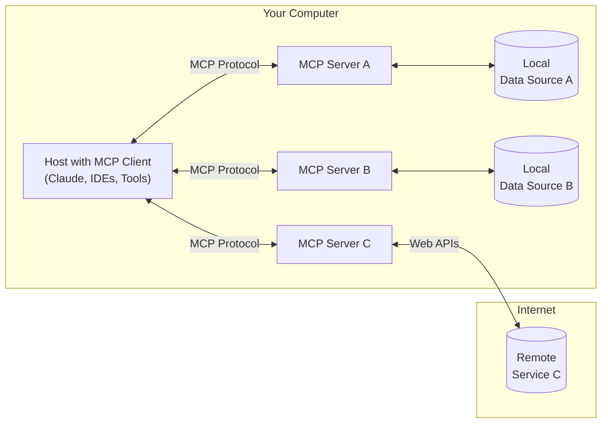

# Model Context Protocol (MCP)

Source:

- <https://modelcontextprotocol.io/introduction>
- <https://www.philschmid.de/mcp-introduction>

## 1. Introduction

MCP is an open protocol that standardizes how applications provide context to LLMs. Think of MCP like a USB-C port for AI applications. Just as USB-C provides a standardized way to connect your devices to various peripherals and accessories, MCP provides a standardized way to connect AI models to different data sources and tools.

MCP helps you build agents and complex workflows on top of LLMs. LLMs frequently need to integrate with data and tools, and MCP provides:
- A growing list of pre-built integrations that your LLM can directly plug into.
- The flexibility to switch between LLM providers and vendors.
- Best practices for securing your data within your infrastructure.

## 2. General architecture

- **MCP Hosts**: Programs like Claude Desktop, IDEs, or AI tools that want to access data through MCP
- **MCP Clients**: Protocol clients that maintain 1:1 connections with servers
- **MCP Servers**: Lightweight programs that each expose specific capabilities through the standardized Model Context Protocol. The current components of MCP servers include:
  - Tool (Model-controlled): These are functions (tools) that LLMs can call to perform specific actins, e.g. weather API, basically function calling.
  - Resources (Application-controlled): There are data sources that LLMs can access, similar to GET endpoints in a REST API. Resources provide data without performing significant computation, no side effects. Part of the context/request.
  - Prompts (User-controlled): These are pre-defined templates to use tools or resources in the most optimal way. Selected before running inference.
- **Local Data Sources**: Your computer's files, databases, and services that MCP servers can securely access
- **Remote Services**: External systems available over the internet (e.g., through APIs) that MCP servers can connect to

## 3. How does MCP work?

1. **Initialization**: When a Host application starts it creates N MCP clients, which exchange information about capabilities and protocol versions via a handshake.
2. **Discovery**: Clients requests what capabilities (Tools, Resources, Prompts) the server offers. The Server responds with a list and descriptions.
3. **Context provision**: The Host application can now make resources and prompts available to the user or parses the tools into a LLM compatible format, e.g. JSON Function calling.
4. **Invocation**: If the LLM determines it needs to use a Tool (e.g., based on the user's request like "What are the open issues in the X repo?"), the Host directs the Client to send an invocation request to the appropriate Server.
5. **Execution**: The Server receives the request (e.g., `fetch_github_issues` with repo X) , executes the underlying logic (calls the Github API), and gets the result.
6. **Response**: The Server sends the result back to the Client.
7. **Completion**: The Client relays the result to the Host, which incorporates it into the LLM's context, allowing the LLM to generate a final response for the user based on the fresh, external information.

### 3.1. MCP servers

- MCP servers are the bridge/API between the MCp world and the specific functionality of an external system (an API, a database, local files, etc.).
- Servers communicate with clients primarily via two methods:
  - **stdio (standard input/output)**: used when Client and Server run on the same machines.
  - **HTTP via SSE (server-sent events)**: the Client connects to the Server via HTTP. After an initial setup, the Server can push messages (events) to the Client over a persistent connection using the SSE standard.

### 3.2. MCP clients

- MCP clients are part of Host applications (the IDE, chatbot, etc.) that manage the communication with a specific MCP server.
  - **Role**: handle connection management, capability discovery, request forwarding, and response handling according to the MCP spec.
