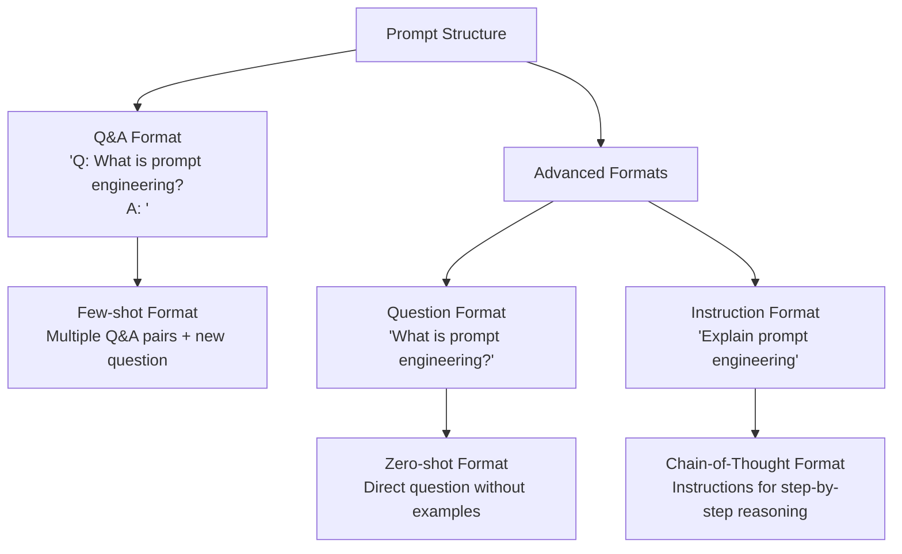

# Prompt Engineering Guide

Source:

- <https://learnprompting.org/docs/introduction>
- <https://drive.google.com/file/d/1AbaBYbEa_EbPelsT40-vj64L-2IwUJHy/view>
- <https://www.promptingguide.ai/techniques/zeroshot>
- <https://deepwiki.com/dair-ai/Prompt-Engineering>

## 1. Introduction

- Prompt engineering is a discipline focused on developing and optimizing prompts to efficiently use language models (LMs) for a wide variety of applications and research topics.
- A prompt is the input provided to a language model to elicit a desired response. It can be as simple as a question or as complex as a set of instructions with examples and context. The quality of your prompt significantly influences the quality of the model's output.
- **Basic prompting**:
  - At its simplest, a prompt can be a partial sentence that the model completes:

  ```text
  Prompt:
    The sky is

  Output:
     blue
  ```

  - However, simple prompts like this often yield unpredictable results. Adding instructions makes prompts more effective:

  ```text
  Prompt:
    Complete the sentence:
    The sky is

  Ouput:
    blue during the day and dark at night.
  ```

- **Prompt formats**: The standard format for a prompt typically follows one of thehse patterns: `<Question>?` or `<Instruction>`. The basic formatting servers as the foundation for more advanced prompting techiques.


