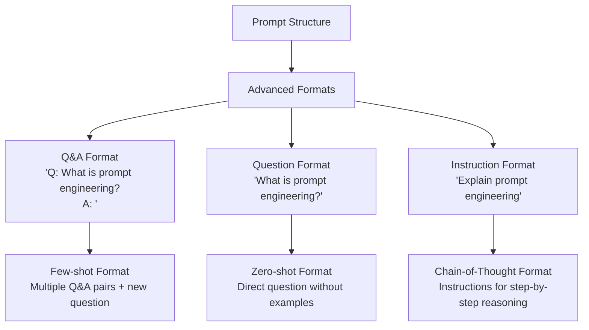
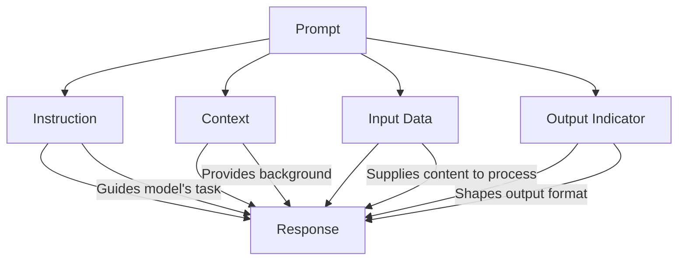

# 1. Prompt engineering basics

Table of contents:

- [1. Prompt engineering basics](#1-prompt-engineering-basics)
  - [1.1. What is a prompt?](#11-what-is-a-prompt)
  - [1.2. Basic prompting](#12-basic-prompting)
  - [1.3. Prompt formats](#13-prompt-formats)
  - [1.4. Elements of prompts](#14-elements-of-prompts)
  - [1.5. Zero-shot vs. Few-shot prompting](#15-zero-shot-vs-few-shot-prompting)
  - [1.7. General tips for designing prompts](#17-general-tips-for-designing-prompts)
  - [1.8. LLM settings](#18-llm-settings)
    - [1.8.1. Settings impact on response types](#181-settings-impact-on-response-types)
    - [1.8.2. Best practices](#182-best-practices)
    - [1.8.3. Settings and prompt engineering techniques](#183-settings-and-prompt-engineering-techniques)

## 1.1. What is a prompt?

Prompt engineering is a discipline focused on developing and optimizing prompts to efficiently use language models (LMs) for a wide variety of applications and research topics.

A prompt is the input provided to a language model to elicit a desired response. It can be as simple as a question or as complex as a set of instructions with examples and context. The quality of your prompt significantly influences the quality of the model's output.

## 1.2. Basic prompting

At its simplest, a prompt can be a partial sentence that the model completes:

**Prompt**

```text
The sky is
```

**Output**

```text
blue
```

However, simple prompts like this often yield unpredictable results. Adding instructions makes prompts more effective:

**Prompt**

```text
Complete the sentence:
The sky is
```

**Output**

```text
blue during the day and dark at night.
```

## 1.3. Prompt formats

- The standard format for a prompt typically follows one of thehse patterns: `<Question>?` or `<Instruction>`. The basic formatting servers as the foundation for more advanced prompting techiques.



## 1.4. Elements of prompts

A well-designed prompt may contain any combination of these elements:

1. **Instruction** - A specific task or instruction you want the model to perform.
   - Examples: "classify the text into neutral, negative, or postive", "translate the following text to Vietnamese", ...
   - Effective instruction use clear action verbs and should typically be placed at the beginning of the prompt to set the initial direction for the model's response.
2. **Context** - External information or additional context to guide the response.
   - Examples: background information on a topic, specific constraints, tone or style guidelines, ...
   - Context helps ground the model response in revelant informatio and can significantly improve the quality and relevance of outputs.
3. **Input data** - The input or question for which you want a response.
   - Examples: a question to be answered, a text to be summarized or translated, a statement to be fact-checked, ...
   - The input data is often the central component that instruction acts upon.
4. **Output indicator** - The type or format of the output you expect.
   - Examples: "respond with Yes or No only", "format the response as a bullet-point list", ...
   - Output indicators help control the form of the model's response, making it more predictable and usable for specific applications.



Prompt structure patterns:

```mermaid
flowchart TD
    subgraph Chain-of-Thought Prompting
        A1[Instruction] --> B1[Context (Reasoning Examples)]
        B1 --> C1[Input Data]
        C1 --> D1[Output Indicator]
    end

    subgraph Few-Shot Prompting
        A2[Instruction] --> B2[Context (Examples)]
        B2 --> C2[Input Data]
        C2 --> D2[Output Indicator]
    end

    subgraph Zero-Shot Prompting
        A3[Instruction] --> C3[Input Data]
        C3 --> D3[Output Indicator]
    end
```

## 1.5. Zero-shot vs. Few-shot prompting

- **Zero-shot prompting** means asking the model to perform a task without providing examples. The model relies solely on its pre-training to understand and complete the task.

**Prompt**

```text
Instruction: Classify the sentiment as positive, negative, or neutral
Input Data: I think the food was okay.
Output Indicator: Sentiment:
```

**Output**

```
Sentiment: Neutral
```

- **Few-shot prompting** provides the model with examples (demonstrations) of the task before asking it to perform the actual task. This helps the model understand the expected pattern.

**Prompt**

```text
This is awesome! // Positive
This is bad! // Negative
Wow that movie was rad! // Positive
What a horrible show! //
```

**Output**

```
Negative
```

## 1.7. General tips for designing prompts

1. **Start simple** - begin with simple prompts and iteratively add elements as needed. Breaking down complex tasks into simpler subtasks can make prompt design more manageable.
2. **Be specific** - the more specific and detailed your prompt is, the better the results will be. Provide relevant context and clear instructions about what you want to achieve.
3. **Use clear instructions** - place instructions at the beginning of the prompt and use clear separators (like "####") between instructions and context.

```text
### Instruction ###
Translate the text below to Spanish:

Text: "hello!"
```

4. **Avoid imperciseness** - be direct and specific rather than vauge.

```text
Instead of:

Explain the concept prompt engineering. Keep the explanation short, only a few sentences, and don't be too descriptive.

Better:
Use 2-3 sentences to explain the concept of prompt engineering to a high school student.
```

5. **Focus on what to do** - tell the model what to do rather than what not to do. This encourages specificity and focuses on the details that lead to good responses.

## 1.8. LLM settings

When using LLMs, various parameters affect the input:

1. **Temperature**: controls randomness. Lower value (near 0) make responses more deterministric, while higher values allow more creativity.
   - Low temperature (0.0 - 0.3): more deterministic, highest probable tokens are constistently selected. -> fact-based Q&A.
   - Medium temperature (0.4 - 0.7): balanced randomness, good for most general purposes.
   - High temperature (0.8 - 1.0+): more random/diverse outputs, encourages creativity -> creative tasks, poetry, or idea generation.
2. **Top P**: a sample technique that determines how deterministic the model is.
   - Low top P (0.1 - 0.5): considers fewer tokens, more focused responses.
   - High top P (0.6 - 1.0): considers more tokens, potentially more diverse response.
   - General recommendation: Adjust either Temperature or Top P, but not both simultaneously.
3. **Max length**: control the number of tokens the model generates. This parameter helps prevent overly verbose responses and control API usage costs.
4. **Stop sequences**: strings that stop the model from generating more tokens. They provide fine-grained control over response structure and formatting.
5. **Frequency penalty**; reduces repetition by penalizing tokens that have already appreared. Higher frequency penalty values reduce the likelihood of the model repeating the same words or phrases.
   - Low penalty (0.0 - 0.3): minimal repetition reduction.
   - Medium penalty (0.4 - 1.0): moderate repetition reduction.
   - High penalty (1.1 - 2.0): strong repention reduction.
6. **Presense penalty**: applies a flat penalty to all repeated tokens, regardless of frequency. This setting helps prevent the model from repeating topics or themese more broadly.
   - Low penalty (0.0-0.3): Minimal topic repetition reduction
   - Medium penalty (0.4-1.0): Moderate topic repetition reduction
   - High penalty (1.1-2.0): Strong topic repetition reduction

### 1.8.1. Settings impact on response types

Different tasks benefit from different settings configurations:

| Task Type        | Temperature | Top P   | Max Tokens | Frequency Penalty | Presence Penalty |
| ---------------- | ----------- | ------- | ---------- | ----------------- | ---------------- |
| Factual Q&A      | 0.0–0.3     | 1.0     | Moderate   | 0.0               | 0.0              |
| Creative Writing | 0.7–1.0     | 0.9–1.0 | High       | 0.0–0.3           | 0.0–0.3          |
| Code Generation  | 0.2–0.5     | 1.0     | High       | 0.0–0.2           | 0.0              |
| Conversational   | 0.5–0.7     | 0.9–1.0 | Moderate   | 0.3–0.6           | 0.3–0.6          |
| Summarization    | 0.3–0.5     | 1.0     | Varies     | 0.0–0.3           | 0.0–0.3          |

### 1.8.2. Best practices

1. Start with defaults: Begin with temperature=0.7, top_p=1.0, and zero penalties
2. Test systematically: Change one parameter at a time to observe effects
3. Match settings to tasks: Use lower temperature for factual tasks; higher for creative ones
4. Consider token economics: Balance max_tokens with your cost constraints
5. Use paired settings properly: Adjust either temperature or top_p; either frequency or presence penalty
6. Document effective configurations: Save settings that work well for specific task types

### 1.8.3. Settings and prompt engineering techniques

| Technique           | Recommended Settings Adjustments                          |
| ------------------- | --------------------------------------------------------- |
| Zero-shot Prompting | Moderate to low temperature (0.3–0.7)                     |
| Few-shot Prompting  | Lower temperature (0.1–0.5) for consistency with examples |
| Chain-of-Thought    | Low temperature (0.0–0.3) for logical consistency         |
| ReAct Prompting     | Low temperature for reasoning, higher for exploration     |
| Prompt Chaining     | Vary by chain step requirements                           |
