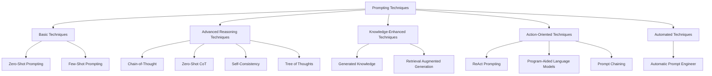
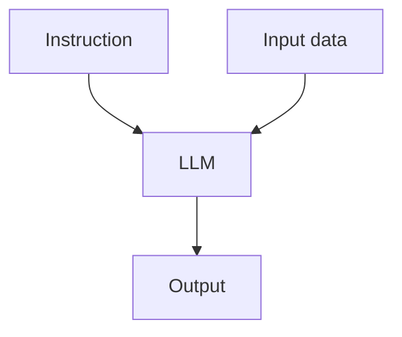
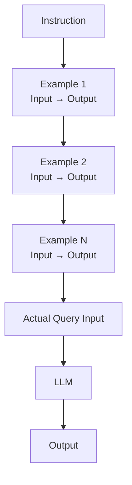
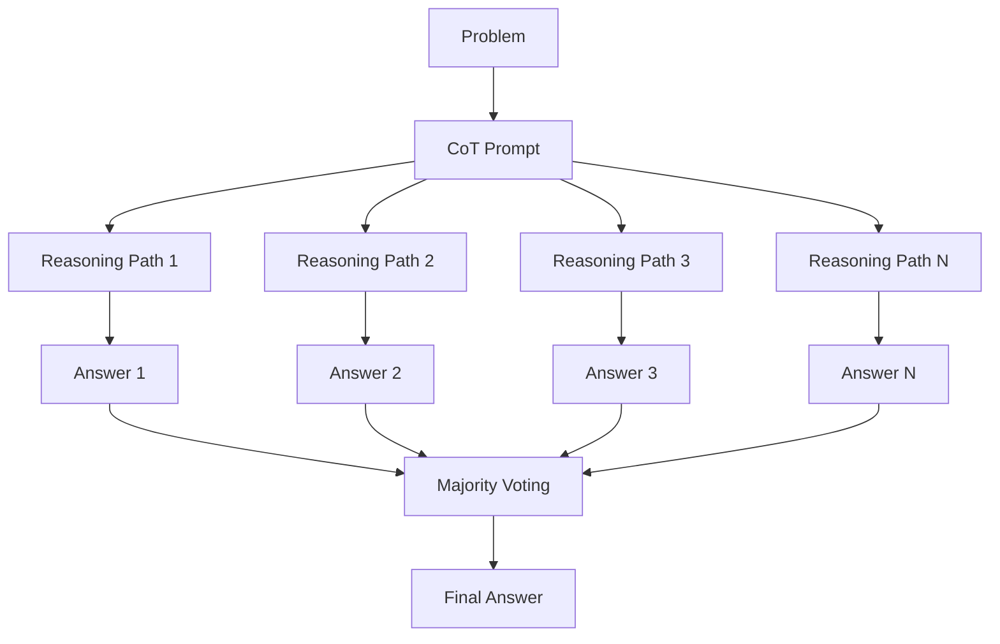
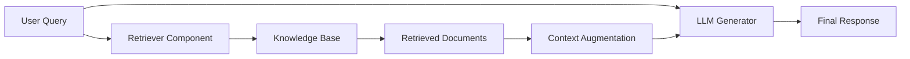

# 2. Prompting techniques

Table of contents:
- [2. Prompting techniques](#2-prompting-techniques)
  - [2.1. Basic techniques](#21-basic-techniques)
    - [2.1.1. Zero-shot prompting](#211-zero-shot-prompting)
    - [2.1.2. Few-shot prompting](#212-few-shot-prompting)
  - [2.2. Advanced reasoning techniques](#22-advanced-reasoning-techniques)
    - [2.2.1. Chain-of-thought (CoT) prompting](#221-chain-of-thought-cot-prompting)
    - [2.2.2. Zero-shot CoT](#222-zero-shot-cot)
    - [2.2.3. Automatic CoT (Auto-CoT)](#223-automatic-cot-auto-cot)
    - [2.2.4. Self-Consistency](#224-self-consistency)
  - [2.3. Knowledge-enhanced techniques](#23-knowledge-enhanced-techniques)
    - [2.3.1. Generated knowledge prompting](#231-generated-knowledge-prompting)
    - [2.3.2. Retrieval augmented generation (RAG)](#232-retrieval-augmented-generation-rag)




## 2.1. Basic techniques

Basic prompting techniques form the foundation of prompt engineering. These methods don't require complex reasoning chains or external tools but can still be highly effective for many tasks.

### 2.1.1. Zero-shot prompting

Zero-shot prompting involves directly instructing a language model to perform a task without providing examples. This approach relies on the model's pre-existing knowledge and abilities.



**Key characteristics:**
- No examples or demonstrations provided
- Simple, direct instructions
- Relies on model's inherent capabilities
- Works best for common tasks within model's training distribution
- Limitations: complex reasoning, domain-specificed tasks, tasks requiring precision.

### 2.1.2. Few-shot prompting

Few-shot prompting improves model performance by providing examples (demonstrations) that show the model exactly what you want. This technique helps the model understand the specific pattern or format you're looking for.



**Key characteristics:**

- Contains demonstrations in the prompt
- Examples guide the model's understanding of the task
- Enables in-context learning
- More effective than zero-shot for complex or specific tasks
- Distribution and order of examples can impact performance
- Limitations: multi-step reasoning, limited by context window, example selection sensitivity.

## 2.2. Advanced reasoning techniques

Advanced reasoning techniques encourage language models to break down complex problems into manageable steps, producing more accurate and reliable outputs for tasks requiring multi-step reasoning.

### 2.2.1. Chain-of-thought (CoT) prompting


Chain-of-thought (CoT) prompting enables complex reasoning capabilities through intermediate reasoning steps. By instructing the model to think step-by-step, it can solve more difficult problems that require multistep reasoning.

**Prompt**

```text
The odd numbers in this group add up to an even number: 4, 8, 9, 15, 12, 2, 1.
A: Adding all the odd numbers (9, 15, 1) gives 25. The answer is False.
The odd numbers in this group add up to an even number: 17,  10, 19, 4, 8, 12, 24.
A: Adding all the odd numbers (17, 19) gives 36. The answer is True.
The odd numbers in this group add up to an even number: 16,  11, 14, 4, 8, 13, 24.
A: Adding all the odd numbers (11, 13) gives 24. The answer is True.
The odd numbers in this group add up to an even number: 17,  9, 10, 12, 13, 4, 2.
A: Adding all the odd numbers (17, 9, 13) gives 39. The answer is False.
The odd numbers in this group add up to an even number: 15, 32, 5, 13, 82, 7, 1.
A:
```

**Output**

```text
Adding all the odd numbers (15, 5, 13, 7, 1) gives 41. The answer is False.
```

**Key characteristics:**

- Provides reasoning steps as examples
- Encourages the model to break down complex tasks
- Significantly improves performance on arithmetic, commonsense, and symbolic reasoning tasks
- Works best with sufficiently large language models

### 2.2.2. Zero-shot CoT


Zero-Shot Chain-of-Thought is a simplified version of CoT that doesn't require examples. By adding simple phrases like "Let's think step by step" to a prompt, the model is encouraged to generate its own reasoning steps.

**Prompt**

```text
I went to the market and bought 10 apples. I gave 2 apples to the neighbor and 2 to the repairman. I then went and bought 5 more apples and ate 1. How many apples did I remain with?

Let's think step by step.
```

**Output**

```text
First, you started with 10 apples.
You gave away 2 apples to the neighbor and 2 to the repairman, so you had 6 apples left.
Then you bought 5 more apples, so now you had 11 apples.
Finally, you ate 1 apple, so you would remain with 10 apples.
```

**Key characteristics:**

- No examples needed
- Simple addition of reasoning triggers like "Let's think step by step"
- Effective for complex reasoning tasks
- Easier to implement than standard CoT

### 2.2.3. Automatic CoT (Auto-CoT)

Auto-CoT addresses the challenge of creating effective demonstrations by automatically generating them instead of manually crafting them. This technique involves:

1. **Question clustering**: Dividing questions from a dataset into different clusters
2. **Demonstration sampling**: Selecting representative questions from each cluster and generating reasoning chains using Zero-Shot CoT


### 2.2.4. Self-Consistency

Self-consistency improves Chain-of-Thought prompting by generating multiple reasoning paths and selecting the most consistent answer.

1. Generating multiple reasoning paths through few-shot CoT
2. Sampling diverse solutions to the same problem
3. Aggregating results to find the most consistent answer



**Key characteristics:**

- Samples multiple CoT reasoning paths
- Uses majority voting for the final answer
- Reduces the impact of errors in any single reasoning path
- Improves performance on arithmetic and commonsense reasoning tasks

**Prompt**

```text
Hello,
I have discovered a major security vulnerability in your system. Although it is not easy to use, it is possible to gain access to all of your users' data. I have attached a proof of concept. Please fix this issue as soon as possible.
Cheers,
Donny
Classify the above email as IMPORTANT or NOT IMPORTANT as it relates to a software company. Let's think step by step.
```

## 2.3. Knowledge-enhanced techniques

Knowledge-enhanced techniques augment the model's reasoning with additional information, either generated by the model itself or retrieved from external sources.

### 2.3.1. Generated knowledge prompting

Generated knowledge prompting involves having the model generate relevant knowledge or information before answering a question. This technique helps the model access its own knowledge in a structured way before attempting to solve a problem.


**Key characteristics:**

- Generates relevant facts before answering
- Helps overcome knowledge gaps
- Improves factual accuracy
- Creates traceable reasoning

The first approach asks the LLM to generate knowledge and then write the post, all with a **single prompt**.

```text
Generate 4 facts about the Kermode bear, then use these facts to write a short blog post using the information:
```

We try different approach - dual prompt:
- First prompt the LLM to generate facts about the bear:

```text
Generate 4 facts about the Kermode bear:
```

- Then, we feed that information into another prompt to write the blog post:

```text
<the 1st output>

Then, we feed that information into another prompt to write the blog post:
```

### 2.3.2. Retrieval augmented generation (RAG)

Retrieval Augmented Generation enhances language models by incorporating information from external knowledge sources. This technique retrieves relevant documents or data from a knowledge base and provides them as context for the model to generate a response.



**Key characteristics:**

- Combines retrieval systems with text generation
- Provides external knowledge as context
- Improves factual accuracy and reduces hallucination
- Allows access to more up-to-date information
- Especially useful for knowledge-intensive tasks

> [!WARNING]
> WIP
