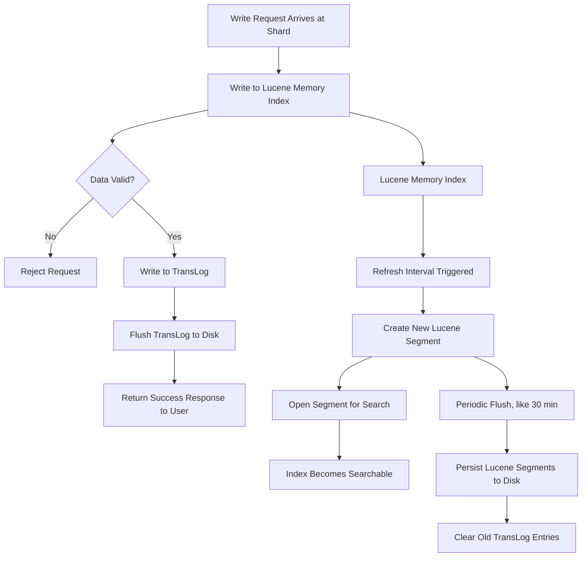
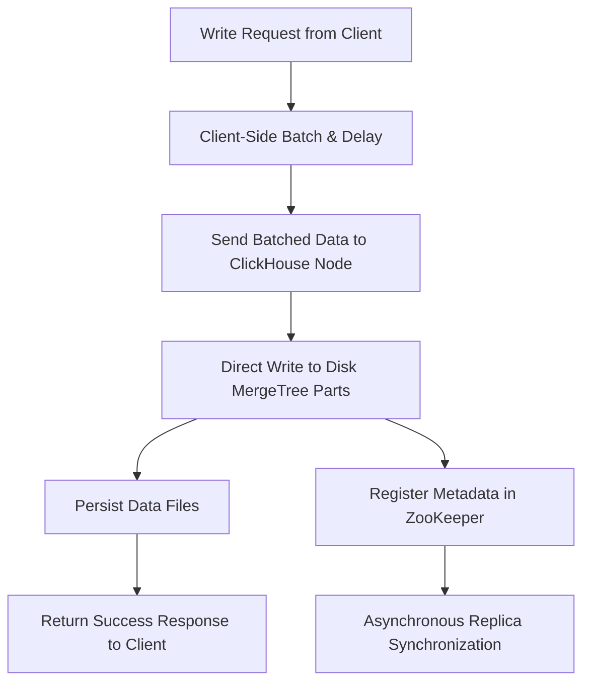

# ClickHouse vs. Elasticsearch

Source: <https://www.alibabacloud.com/blog/clickhouse-vs--elasticsearch_597898>

Table of contents:
- [ClickHouse vs. Elasticsearch](#clickhouse-vs-elasticsearch)
  - [1. Distributed architecture](#1-distributed-architecture)
  - [2. Storage architecture](#2-storage-architecture)
    - [2.1. Write procedure design](#21-write-procedure-design)
    - [2.2. Segment vs. DataPart](#22-segment-vs-datapart)
    - [2.3. Schemaless](#23-schemaless)
  - [3. Query architecture](#3-query-architecture)
    - [3.1. Compute engine](#31-compute-engine)
    - [3.2. Data scan](#32-data-scan)
  - [4. Summary](#4-summary)

> ClickHouse is an analytic database based on column-storage computing, developed by the Russian company Yandex
> Elasticsearch is an engine tailored for near-real-time distributed search analysis, and its underlying storage is entirely based on Lucene. The standalone search capability of Lucene is extended by Elasticsearch to provide distributed search analysis capabilities.

## 1. Distributed architecture

- The distributed architecture design has a significant impact on the ease of use and scalability of the products. The core issues to be solved for the distributed architecture include node discovery, Meta synchronization, and replica data synchronization.
- Elasticsearch:
  - Native node discovery and the Meta synchronization protocol ensure an easy-to-use user experience.
  - Based on the Meta synchronization protocol, Elasticsearch provides multi-role distinguishing and auto schema inference features.
  - It is worth mentioning that Elasticsearch does not reuse the Meta synchronization protocol for multi-replica data synchronization. Instead, Elasticsearch uses the traditional primary-standby synchronization mechanism where the primary node synchronizes data to standby nodes. This method is simpler and more efficient.. Instead, Elasticsearch uses the traditional primary-standby synchronization mechanism where the primary node synchronizes data to standby nodes. This method is simpler and more efficient.
- ClickHouse:
  - Its distributed architecture is still in iteration, and the ease of use feature is constantly improving.
  - ClickHouse introduces an external ZooKeeper cluster to issue distributed DDL tasks (node Meta changes) and primary/standby synchronization tasks. The data synchronization tasks between multiple replicas are also issued by the ZooKeeper cluster.
    - ClickHouse already developes their own ZooKeeper-alternative - ClickHouse Keeper.
  - The data transmission between multiple replicas is ultimately point-to-point data replication through the HTTP protocol. All replicas are writable, and data synchronization is completely multi-directional.
  - As for node discovery, ClickHouse does not have this capability currently. Users need to configure the cluster node address manually to realize node discovery.
  - ClickHouse does not have a front-end or back-end node.

## 2. Storage architecture

### 2.1. Write procedure design

- The write throughput is a core metric in big data scenarios. Big data products require fast writes and enough storage space.
- Elasticsearch:
  - In each shard of Elasticsearch, the write process is divided into two parts.
  - First, data is written to Lucene and then to TransLog. After the write request reaches the shard, the Lucene memory index is written first while the data is still in the memory. Then, TransLog is written.
  - After the TransLog is written, the TransLog data is flushed to the disk. Then, the request is returned to the user.
  - There are some keypoints.
    - First, data is written to Lucene first to prevent "invalid" data in the write request from users.
    - Second, a Lucene index is not searchable after being written. It must be flushed and converted to a complete segment and then reopened. The refresh inverval can be set by the user. Lucene indexes cannot be viewed in real-time after writing, so Elasticsearch is a near-real-time system.
    - Third, at regular intervals (for example, 30 minutes), Lucene flushes new segment generated in the memory to the disk. After this process, the index files are persistent. The old TransLog data is cleared only when it will not be used anymore.

- ClickHouse:
  - Elasticsearch is a near-real-time system, so the newly written data in the memory storage engine needs to be flushed for search regularly. ClickHouse abandons the memory storage engine and writes all data to the disk directly for persistence. At the same time, the traditional stage of writing redo logs is omitted.
  - In scenarios requiring extremely high write throughput, Elasticsearch and ClickHouse need to sacrifice real-time visibility of data writes to improve throughput. However, ClickHouse realizes high write throughput by implementing delayed data batch write on the client side.
  - In terms of multi-replica synchronization, Elasticsearch requires real-time synchronization. Write requests are processed in multiple replicas before they are returned. ClickHouse relies on ZooKeeper for asynchronous disk file synchronization. In practice, the write throughput of a ClickHouse node is much higher than an Elasticsearch node of the same specification.

### 2.2. Segment vs. DataPart

- Elasticsearch:
  - The storage designs of Elasticsearch and ClickHouse look similar, but their capabilities are quite different. Elasticsearch disk files are composed of individual segments, and a segment is the smallest unit of the Lucene index. Segments are merged asynchronously in the background, which solves two problems:
    - It makes the secondary indexes more orderly.
    - It modifies the primary key data.
  - A secondary index is a globally ordered index since one index for all data is better for query acceleration than multiple indexes.
  - Elasticsearch supports the primary key deletion and update operations that rely on the deletion feature of Lucene indexes. The update operation is converted into the deletion and write operations. If there are multiple deletion records in segments in the Lucene index, the system needs to merge segments to remove these records. When multiple segments are merged, the stored data in the Lucene index are merged in append-only mode. In this situation, "reordering" of secondary indexes is not required after the merging.
- ClickHouse:
  - The smallest unit in ClickHouse storage is DataPart. Data written in a batch a a time is written into a DataPart. The data stored in DataPart is completely ordered by the ORDER BY statement defined in the table. This ordered storage is a default clustered index that can be used to accelerate data scanning.
  - ClickHouse also asynchronously merges DataParts, which also solves two issues:
    - It stores the data in a more orderly manner.
    - It modifies the primary key data.
  - DataParts are merged in merge-sorted mode, and the merged DataParts are still in a completely ordered state.
  - Depending on the setting of completely ordered DataPart storage, ClickHouse updates primary key data in a completely different way. When changing the primary key, Elasticsearch uses a method with this procedure: `checking the original record > generating a new record > deleting the original record > writing data to the new record`.

- To sum up, the file storage capability differences between segment and DataPart are listed below:
  - Segment is the storage format of Lucene indexes. The performance of Lucene indexes for the storage of inverted files is great, and it supports original data storage in different formats, such as row storage and column storage. By default, Elasticsearch stores the original data in two copies, one in row storage mode and the other in column storage mode. Elasticsearch will select stored objects to be scanned by query patterns.
  - The DataPart in native ClickHouse has no secondary index files, and the data is stored completely in column storage mode. The compression ratio and scan throughput of column storage in ClickHouse are the best. Elasticsearch is relatively weaker in storage and incurs a lot more costs.

### 2.3. Schemaless

- Elasticsearch can infer the json-schema of written data automatically and then adjust the Meta structure of the storage table. This feature saves users from creating tables and adding columns.
  - auto schema inference is a more appropriate name.
  - The storage of Elasticsearch requires schema and is strongly bound to schema because the core of Elasticsearch storage is secondary indexes. An index cannot be created for a field without type. The real schemaless requires the field types to be flexibly and efficiently changed while the query performance does not decline significantly. Currently, if a user wants to change a field type in the Elasticsearch index, only one method is available: re-index the entire data.
- The storage of ClickHouse is not strongly bound to schema because the analysis capability of ClickHouse is centered on storage scanning.
  - The data types can be converted dynamically during data scanning, and field types can also be slowly and asynchronously adjusted when merging DataParts.
  - The cost of changing field types during query is that the overhead of the cast operator is increased. However, users will not experience a sharp performance decline.

## 3. Query architecture

### 3.1. Compute engine

- Elasticsearch:
  - The compute engine of Elasticsearch is a general-purpose search engine. The query complexity that a search engine can deal with is limited
  - The search engine of Elasticsearch supports three different search modes:
  - `query_and_fetch`: each distributed node searches independently and then returns the results to the client.
    - `query_then_fetch`: each distributed storage node searches for the IDs and corresponding scores of TopN records. Then, IDs and scores are sent to the node with a query to obtain the final TopN result. Next, the storage node is requested to obtain the detailed data.
    - `dfs_query_then_fetch`: count the global Term Frequency (TF) and Document Frequency (DF) first and then perform `query_then_fetch` to balance the scoring criteria of each storage node
  - When the amount of data to be returned is large, the query will fail easily or triggers garbage collection (GC). Generally, the upper capability limit of the search engine in Elasticsearch is a two-phase query. So, Elasticsearch cannot process some queries, such as multi-table associated queries.

- ClickHouse: The computing engine of ClickHouse is vectorized. It uses vectorization functions and aggregator operators based on C++ templates to achieve excellent processing performance on aggregate queries. In combination with the excellent parallel scanning capability of storage, resources can be fully utilized. The computing engine of ClickHouse covers the capabilities of the search engine of Elasticsearch in terms of analysis query support. A computing engine with full SQL capabilities allows users to analyze data more flexibly.

### 3.2. Data scan

- ClickHouse is a computing engine based on column storage, and it takes ordered storage as the core. In the process of querying and scanning data, information, such as storage orderliness, column-storage block statistics, and partition keys, infers the column-storage blocks to be scanned. Then, data scanning is performed in parallel. Expression computing and aggregate computing are processed in a normal computing engine. From the computing engine to data scanning, data is transferred in column-storage blocks, which is highly vectorized
- Elasticsearch mainly scans data in the query and fetch phases. In the query phase, Elasticsearch scans the Lucene index files to obtain the queried DocIds and scans the column-storage files for aggregate computing. In the fetch phase, point queries are performed on row-storage files in Lucene indexes to read detailed data. Both expression computing and aggregate computing can occur in both phases, and the computing is completed by rows.

## 4. Summary

- Elasticsearch is excellent in search scenarios where only a few records are filtered out by the WHERE clause. In a running environment with sufficient memory resources, Elasticsearch has excellent concurrent query capabilities. However, in analysis scenarios of large-scale data where a large number of records are filtered out by the WHERE clause, ClickHouse will have better concurrency performance due to its excellent column-storage mode and vectorized computing. In addition, ClickHouse supports more types of queries. The concurrent processing capabilities of ClickHouse are based on the disk throughput, while those of Elasticsearch are based on the memory cache. Therefore, their costs are different.
- ClickHouse is suitable for low-cost analysis scenarios with large data volumes because it can fully utilize the disk bandwidth. In terms of data import and storage costs, ClickHouse has an advantage.
