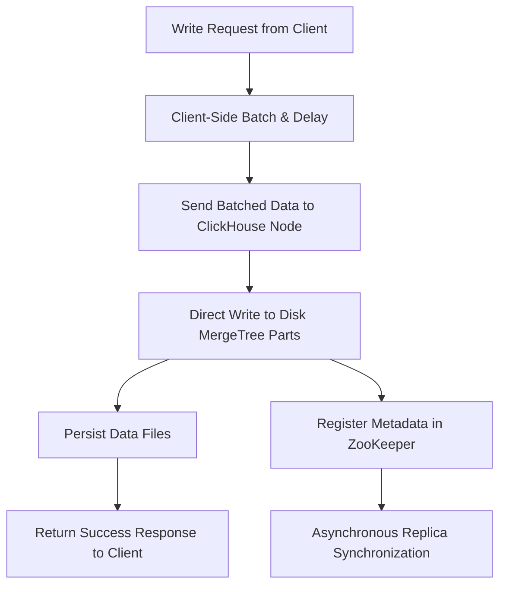

# ClickHouse vs. Elasticsearch

Sources:

- <https://clickhouse.com/docs/use-cases/observability/clickstack/migration/elastic/concepts#elasticsearch-vs-clickhouse>
- <https://www.alibabacloud.com/blog/clickhouse-vs--elasticsearch_597898>

Table of contents:

- [ClickHouse vs. Elasticsearch](#clickhouse-vs-elasticsearch)
  - [1. Overview](#1-overview)
  - [2. Distributed architecture](#2-distributed-architecture)
  - [3. Core structural concepts](#3-core-structural-concepts)
  - [4. Storage architecture](#4-storage-architecture)
    - [4.1. Write procedure design](#41-write-procedure-design)
    - [4.2. Segment vs. DataPart](#42-segment-vs-datapart)
    - [4.3. Schema flexibility](#43-schema-flexibility)
  - [5. Query architecture](#5-query-architecture)
    - [5.1. Compute engine](#51-compute-engine)
    - [5.2. Data scan](#52-data-scan)
  - [6. Distribution and replication](#6-distribution-and-replication)
  - [7. Data management](#7-data-management)
  - [8. Summary](#8-summary)

## 1. Overview

ClickHouse is an analytic database based on column-storage computing, developed by Yandex. Elasticsearch is an engine tailored for near-real-time distributed search analysis, built on Lucene.

ClickHouse is engineered to process data in a massive, consolidated place. Unlike Elasticsearch, ClickHouse's optimizations don't happen through distributing data, but by efficiently pre-processing it in anticipation of queries.

There are three major components that enable ClickHouse to return aggregations (averages, sums, standard deviations) in milliseconds over petabytes of data:

1. **Columnar layout** - ClickHouse stores data column-wise, making aggregations efficient by scanning only relevant columns
2. **Materialized views** - Dynamic materialized views that are incrementally updated
3. **Specialized engines** - Engines like `SummingMergeTree` and `ReplacingMergeTree` enable parallel processing

## 2. Distributed architecture

The distributed architecture design significantly impacts ease of use and scalability. Core issues include node discovery, meta synchronization, and replica data synchronization.

**Elasticsearch:**

- Native node discovery and meta synchronization protocol ensure easy-to-use experience
- Provides multi-role distinguishing and auto schema inference features
- Uses traditional primary-standby synchronization where the primary node synchronizes data to standby nodes
- Shards are physical Lucene structures tied to JVM memory
- Over-sharding introduces performance penalties
- Replication is synchronous and coordinated by a master node

**ClickHouse:**

- Distributed architecture is still in iteration with improving ease of use
- Uses external ZooKeeper cluster or ClickHouse Keeper for distributed DDL tasks and primary/standby synchronization
- Data transmission between replicas is point-to-point via HTTP protocol
- All replicas are writable with multi-directional data synchronization
- Shards are logical and vertically scalable with efficient local execution
- Replication is asynchronous (can be sequential), coordination is lightweight
- No automatic node discovery - users configure cluster node addresses manually

## 3. Core structural concepts

| Elasticsearch | ClickHouse       | Description                                                                                                                                                                                                                                                            |
| ------------- | ---------------- | ---------------------------------------------------------------------------------------------------------------------------------------------------------------------------------------------------------------------------------------------------------------------- |
| Field         | Column           | The basic unit of data, holding one or more values of a specific type. Elasticsearch fields can store primitives as well as arrays and objects. ClickHouse also supports arrays and objects (Tuples, Maps, Nested), as well as dynamic types like Variant and Dynamic. |
| Document      | Row              | A collection of fields (columns). Elasticsearch documents are more flexible by default, with new fields added dynamically. ClickHouse rows are schema-bound by default. The JSON type in ClickHouse supports equivalent semi-structured dynamic column creation.       |
| Index         | Table            | The unit of query execution and storage. In both systems, queries run against indices or tables.                                                                                                                                                                       |
| Implicit      | Schema (SQL)     | SQL schemas group tables into namespaces, often used for access control. Both support row-and table-level security via roles and RBAC.                                                                                                                                 |
| Cluster       | Cluster/Database | Elasticsearch clusters are runtime instances managing one or more indices. In ClickHouse, databases organize tables within a logical namespace. A ClickHouse cluster is a distributed set of nodes, decoupled from the data itself.                                    |

## 4. Storage architecture

### 4.1. Write procedure design

Write throughput is a core metric in big data scenarios. Both systems require fast writes and sufficient storage space.

**Elasticsearch:**

In each shard, the write process is divided into two parts:

1. Data is written to Lucene memory index first
2. Then written to TransLog
3. After TransLog is flushed to disk, the request returns to the user

Key points:

- Data is written to Lucene first to prevent invalid data
- Lucene index is not searchable until flushed and converted to a complete segment
- At regular intervals (~30 minutes), Lucene flushes new segments to disk
- Old TransLog data is cleared only when no longer needed

Elasticsearch is a near-real-time system - newly written data needs to be flushed for search regularly.

**ClickHouse:**

ClickHouse abandons the memory storage engine and writes all data directly to disk for persistence, omitting the traditional redo log stage.

- Writes data directly to disk (MergeTree parts)
- Realizes high write throughput through client-side delayed batch writes
- Relies on ZooKeeper for asynchronous disk file synchronization between replicas
- Write throughput of a ClickHouse node is much higher than an Elasticsearch node of the same specification

### 4.2. Segment vs. DataPart

**Elasticsearch (Segment):**

- Disk files are composed of individual segments (smallest unit of Lucene index)
- Segments are merged asynchronously in the background
- Solves two problems: makes secondary indexes more orderly, and modifies primary key data
- Supports primary key deletion and update operations via Lucene's deletion feature
- By default, stores original data in two copies: row storage and column storage
- Elasticsearch selects storage objects based on query patterns

**ClickHouse (DataPart):**

- Smallest storage unit is DataPart
- Data written in a batch is written into a DataPart
- Data is completely ordered by the ORDER BY statement (default clustered index)
- DataParts are merged in merge-sorted mode, remaining ordered
- No secondary index files; data stored completely in column storage mode
- Better compression ratio and scan throughput than Elasticsearch

### 4.3. Schema flexibility

**Elasticsearch:**

- Can infer JSON-schema of written data automatically (auto schema inference)
- Storage requires schema and is strongly bound to it (secondary indexes require field types)
- Changing field type requires re-indexing the entire data

**ClickHouse:**

- Storage is not strongly bound to schema
- Data types can be converted dynamically during scanning
- Field types can be adjusted asynchronously during DataPart merges
- Offers flexibility through `Dynamic`, `Variant`, and `JSON` types

## 5. Query architecture

### 5.1. Compute engine

**Elasticsearch:**

- General-purpose search engine with limited query complexity
- Three search modes:
  - `query_and_fetch`: each node searches independently
  - `query_then_fetch`: searches for IDs and scores of TopN records first
  - `dfs_query_then_fetch`: counts global Term/Document Frequency first
- Cannot process complex queries like multi-table associated queries
- When returning large amounts of data, queries easily fail or trigger GC

**ClickHouse:**

- Vectorized computing engine using C++ templates
- Excellent processing performance on aggregate queries
- Full SQL capabilities allow flexible data analysis
- Covers the capabilities of Elasticsearch's search engine

### 5.2. Data scan

**ClickHouse:**

- Column-storage based with ordered storage as core
- Uses storage orderliness, column-storage block statistics, and partition keys to infer which blocks to scan
- Data scanning is parallel
- Expression and aggregate computing processed in vectorized column-storage blocks

**Elasticsearch:**

- Mainly scans data in query and fetch phases
- Query phase: scans Lucene index files for DocIds, scans column-storage for aggregates
- Fetch phase: point queries on row-storage files for detailed data
- Computing completed by rows

## 6. Distribution and replication

**Elasticsearch:**

- Primary-secondary model for replication
- Writes synchronously copied to replicas
- Acknowledges writes only after all required replicas confirm
- Master node coordinates the cluster, managing shard allocation and health
- Sequential consistency (dirty reads possible before full sync)

**ClickHouse:**

- Eventual consistency by default, coordinated by Keeper
- Writes can be sent to any replica directly or via distributed table
- Replication is asynchronous after write acknowledgement
- Supports sequential consistency for stricter guarantees (rarely used due to performance impact)

## 7. Data management

**Index Lifecycle Management vs Native TTL:**

- **Elasticsearch**: Uses Index Lifecycle Management (ILM) and Data Streams
  - Define policies for rollover, storage tier movement, and deletion
  - Requires creating new indices periodically for efficient deletion
- **ClickHouse**: Uses TTL expressions at column or partition level
  - Data can be partitioned by date for efficient deletion
  - No need for index rollovers

**Storage Tiers:**

- **Elasticsearch**: Hot-warm-cold-frozen architectures via ILM, tied to node roles
- **ClickHouse**: Tiered storage through native tables like `MergeTree`, automatically moving data between volumes

## 8. Summary

| Aspect      | Elasticsearch                              | ClickHouse                                               |
| ----------- | ------------------------------------------ | -------------------------------------------------------- |
| Best for    | Search scenarios with few filtered records | Analytics on large-scale data with many filtered records |
| Concurrency | Based on memory cache                      | Based on disk throughput                                 |
| Cost        | Higher storage costs                       | Lower storage costs, better compression                  |
| Query types | Limited to search patterns                 | Full SQL, including JOINs                                |
| Write model | Near-real-time with TransLog               | Direct disk writes with async replication                |
| Scaling     | Horizontal (sharding required)             | Vertical-first, then horizontal                          |

**When to choose ClickHouse:**

- Low-cost analysis scenarios with large data volumes
- Can fully utilize disk bandwidth
- Need full SQL capabilities including JOINs
- Better data import and storage cost efficiency

**When to choose Elasticsearch:**

- Search-centric workloads
- Need near-real-time search on newly ingested data
- Complex text search requirements
- Existing investment in ELK ecosystem
