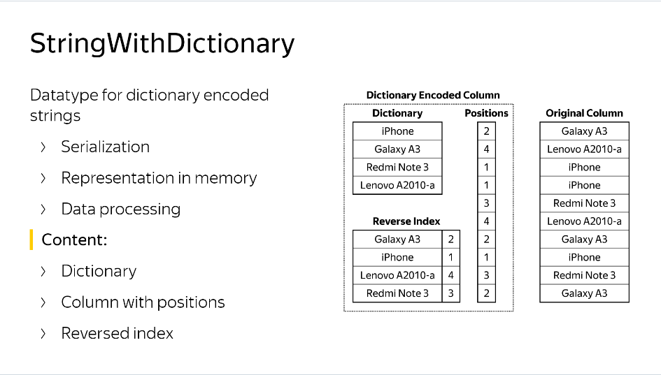

# LowCardinality

Source:
- <https://altinity.com/blog/2019-3-27-low-cardinality>
- <https://clickhouse.com/docs/sql-reference/data-types/lowcardinality>

## 1. Description

- `LowCardinality` is a superstructure that changes a data storage method and rules of data processing. ClickHouse applies dictionary coding to `LowCardinality`-columns. Operating with dictionary encoded data significantly increases performance of SELECT queries of many applications.
- Depends on data diversity.
  - < 10,000 distinct values -> ok
  - > 10,000 distinct values -> perform worse

## 2. Under the hood

<https://github.com/ClickHouse/clickhouse-presentations/blob/master/2018-meetup19/string_optimization.pdf>

- We already mentioned before, ClickHouse uses _dictionary encoded_ for `LowCardinality`, where strings are encoded as 'positions', referencing dictionary with position-to-string mapping.

- Internally, ClickHouse creates separate file or several files in order to store `LowCardinality` dictionaries. It can be a single common file per table, if all `LowCardinality` columns fit into 8192 distinct values, or one file per `LowCardinality` column if the number of distinct values is higher. The common dictionary is the most efficient, since ClickHouse can cache it, pre-calculate hashes for group by, and do other optimizations.
- If we insert a lot of different strings > `low_cardinalty_max_dictionary_size`, fall back to ordinary column.

## 3. LowCardinality vs. Enum

- From the storage prospective, Enum values are stored on the table definition rather than a separate data file.
- Enum works fine for static dictionaries. However, if a value outside the originally enumeration is inserted, ClickHouse will throw an exception.
- Every change in the set of Enum values requires ALTER TABLE, which may bring a lot of pain. LowCardinality is much more flexible in this regard.
