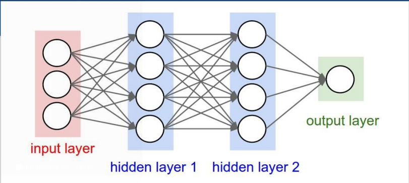
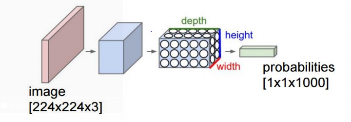

# Deep learning for Dummies

## 1. What is Deep learning?

- `Part of the machine learning` field of learning representation of data.
  Exceptional effective at learning patterns.
- Utilizes learning algorithms that derive meaning out of data by using a
  `hierachy` of multiple layers that `mimic the neural networks of our brain`
- If you provide the system tons of information, it begins to understand it
  and respoing in useful ways

## 2. Basics

- No more feature engineering!

```
+--------------+           +----------------+        +-----------------+
|              |           |   Feature      |        |   Traditional   |
|  Input Data  +----------->   Engineering  +-------->   Learning      |
|              |           |                |        |   Algorithms    |
+--------------+           +----------------+        +-----------------+

+---------------+                                   +------------------+
|               |                                   |  Deep Learning   |
|   Input Data  +----------------------------------->  Algorithms      |
|               |                                   |                  |
+---------------+                                   +------------------+
```

### Archicture

- A deep neural network consists of a `hierachy of layers` whereby each layer
  `transforms the input data` into more abstract representations (e.g edge ->
  nose -> face). The output layer combines those features to make predictions.

### Artifical Neural Networks



- Consists of one input, one output and multiple fully-connected hidden layers
  between. Each layer is represented as a series of neurons and `progessively
  extracts higher and higher-level features` of the inout until the final layer
  essentially makes a decision about what input shows. The more layers the
  network has, the higher level features it will learn.

### Neuron


- An artificial neuron contains a `nonlinear activation function` and has
  several incoming and outgoing `weighted connections`
- Neurons are `trained to filter and detect specific features` or patterns
  (e.g. edge, nose) by receiving weighted input, transforming it with the
  activation function and passing it to the outgoing connections.

### Nonlinear Activation Function

- Most deep networks use `ReLU` - max(0,x) - nowadays for hidden layers, since
  it trains much faster, is more expressive than logistic function and
  prevents the gradient vanishing problem.

### Training Process

```
                                     +----------------------+
+------------------+                 |  Forward it through  |
|  Sample labeled  +----------------->  the network to get  |
|  Data            |                 |  the predictions     |
+--------^---------+                 +-----------+----------+
         |                                       |
         |                                       |
+--------+------------+               +----------v----------+
|  Update the         |               |                     |
|  connection weights <---------------+    Backpropagate    |
+---------------------+               |    the errors       |
                                      |                     |
                                      +---------------------+

```

- Learns by generating an error signal that measures the difference between
  the predictions of the network and the desired values and then `using this
  error signal to change the weights` or (parameters) so that predictions get
  more accurate.

### Gradient Descent

- Gradient Descent `finds the (local) the minimum of the cost function` (used
  to calculate the output error) and is used to adjust the weights.

### Data transformation in other dimensions

- A neuiral networks is transforming the data into other dimensions to solve
  the specified problem.

### Deep Autoencoders

- Composed of two symmetrical deep-belief networks. `The encoding network
  learns to compresses the input to a condensed vector` (dimensionality
  reduction). The decoding network can be used to reconstruct the data.


### Convolutional Neural Nets (CNN)

- CNN learn a complex representation of visual data using vast amount of data.
  They are `inspired by the human visual system` and learn `multiple layers of
  transformations`, which are applied on top of each other to extract a
  progessively more `sophisticated representation of the input`.



