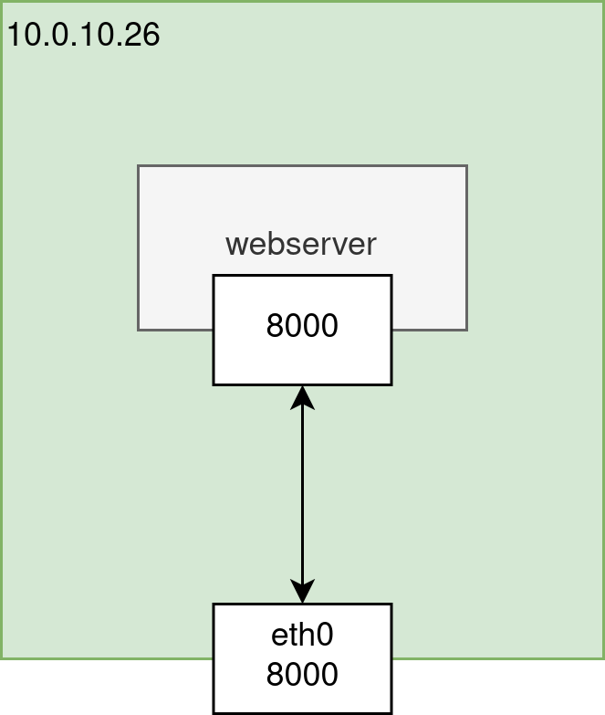
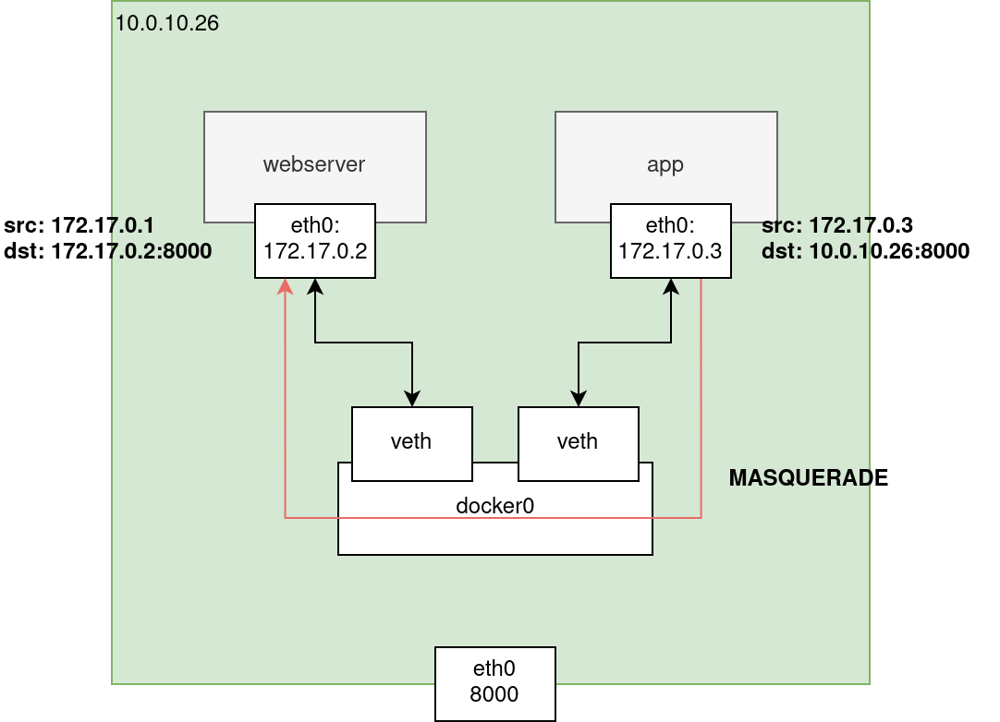
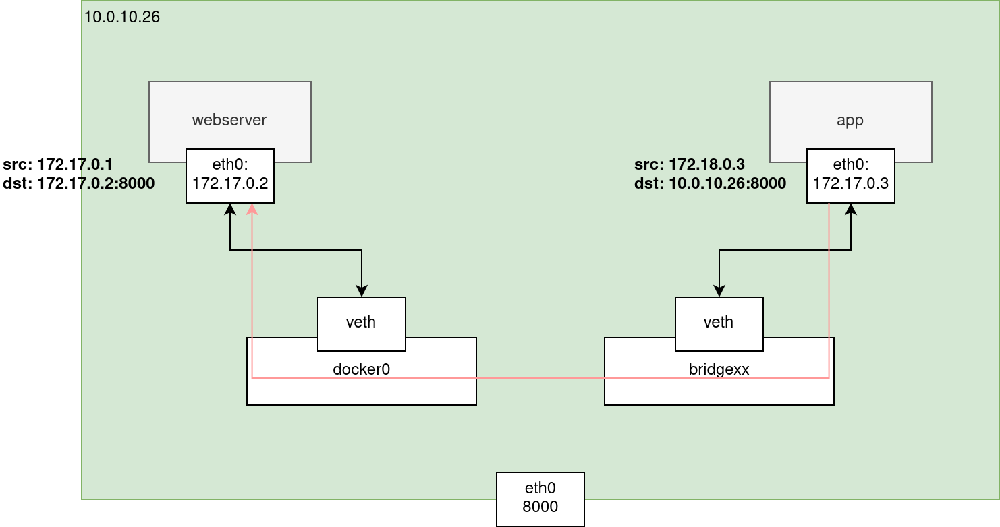

# Hardening iptables trong môi trường Docker

- [Hardening iptables trong môi trường Docker](#hardening-iptables-trong-môi-trường-docker)
  - [1. Phân tích và diễn giải](#1-phân-tích-và-diễn-giải)
    - [1.1. Docker network bridge và iptables](#11-docker-network-bridge-và-iptables)
      - [1.1.1. Luồng packet với kết nối từ bên ngoài vào trong container](#111-luồng-packet-với-kết-nối-từ-bên-ngoài-vào-trong-container)
      - [1.1.2. Luồng packet với kết nối giữa các container trong cùng network bridge](#112-luồng-packet-với-kết-nối-giữa-các-container-trong-cùng-network-bridge)
      - [1.1.3. Luồng packet với kết nối giữa container sử dụng network bridge khác nhau](#113-luồng-packet-với-kết-nối-giữa-container-sử-dụng-network-bridge-khác-nhau)
  - [2. Chuẩn hóa và hướng dẫn hardening](#2-chuẩn-hóa-và-hướng-dẫn-hardening)

## 1. Phân tích và diễn giải

> Trên thực tê có nhiều Docker network mode, tuy nhiên, trong tài liệu này, sẽ chỉ tập trung vào mode **Network bridge**: Docker sử dụng iptables để kiểm soát, điều hướng kết nối ra/vào các container chạy network bridge. Đối với Network host: Container chạy network mode host, thực hiện siết kết nối như service/application chạy trực tiếp trên host.

### 1.1. Docker network bridge và iptables

Đầu tiên, cần hiểu được bản chất của Docker network bridge. Trong phạm vi của tài liệu này, chúng ta sẽ chỉ nói đến bridge mặc định của Docker: `docker0`, không tính đến các user-defined bridge network. Như đã nói ở trên, Docker daemon sử dụng iptables để kiểm soát, điều hướng kết nối ra/vào các containers.

Để dễ hình dung, lấy một ví dụ như sau, chúng ta có một webserver chạy container:

- Network bridge và expose port 8000 trên host server.
- Host server có ip 10.0.10.26, docker0 sub-network 172.17.0.0/16.



#### 1.1.1. Luồng packet với kết nối từ bên ngoài vào trong container

Các chain `DOCKER`, `DOCKER-USER` và `DOCKER-ISOLATION-STAGE-*` đều do Docker daemon khởi tạo, có thể kiểm tra bằng các lệnh sau:

```shell
iptables -t nat -S
iptables -S
```

Sau đây là flow di chuyển:

- Gửi request từ host bên ngoài đến endpoint 10.0.10.26:8000
- (1) `-t nat -A PREROUTING -m addrtype --dst-type LOCAL -j DOCKER`
  - Packet chuyển đến chain DOCKER (nat)
- (2) -`t nat -A DOCKER ! -i docker0 -p tcp -m tcp --dport 8000 -j DNAT --to-destination 172.17.0.2:8000`
  - DNAT, chuyển destination ip thành ip dải bridge 172.17.0.2
- (3) `-t filter -A FORWARD -j DOCKER-USER`
  - Packet đến chain FOWARD (filter), được chuyển đến chain DOCKER-USER (filter). Tại đây, packet đi qua các rules được người dùng định nghĩa, nếu không có rule DROP/REJECT nào thì sẽ trả về chain FOWARD (filter) (4) để thực hiện rule tiếp theo của chain FORWARD.
- (5) `-t filter -A FORWARD -j DOCKER-ISOLATION-STAGE-1`
  - Tương tự như chain DOCKER-USER (filter), không có rule nào thì trả về chain FOWARD (filter) (6). Nếu có rule match thì chuyển sang DOCKER-ISOLATION-STAGE-2.
- (7) `-t filter -A FORWARD -o docker0 -j DOCKER`
  - Packet chuyển đến chain DOCKER (filter), output docker0. Docker daemon tạo các rule dựa theo expose ports config của container, và tự động thêm vào chain DOCKER (filter).
- (8) `-t filter -A DOCKER -d 172.17.0.2/32 ! -i docker0 -o docker0 -p tcp -m tcp --dport 8000 -j ACCEPT`
  - Tại chain DOCKEr (filter), packet match rule, được accept.
- (9)  Packet đi đến container để xử lý.
- (10) Ở chiều ra, packet đi ra chain OUTPUT -> chain POSTROUTING (nat) để thực hiện SNAT.


#### 1.1.2. Luồng packet với kết nối giữa các container trong cùng network bridge

Khởi tạo thêm một container  nữa, cùng bridge default docker0 với container webserver hiện có. Từ container mới, thực hiện gửi request đến endpoint 10.0.10.26:8000 (dĩ nhiên trong cùng một network, container mới có thể gọi trực tiếp đến 172.17.0.2:8000 của container webserver, tuy nhiên chúng ta không bàn tới trường hợp đó). Luồng packet như sau:

- Packet đi theo default route về gateway docker0.
- Dựa theo rule iptables MASQUERADE, source host và destination port của packet thành 172.17.0.1 và 8000 (do tại ví dụ, chúng ta để exposed port giống port trong container, đều là 8000. Trong trường hợp port trong container là 80, destination port của container đổi thành 80):

```shell
iptables -t nat -A POSTROUTING -s 172.17.0.0/16 ! -o docker0 -j MASQUERADE
```

- Packet đi đến container webserver.



#### 1.1.3. Luồng packet với kết nối giữa container sử dụng network bridge khác nhau

Đối với trường hợp giao tiếp giữa các container thuộc các dải bridge network khác nhau, request đến endpoint 10.0.10.26:8000 khi đến container webserver sẽ có source 172.17.0.1. Đường đi của packet như sau:



## 2. Chuẩn hóa và hướng dẫn hardening

- Thống nhất sử dụng iptables, không sử dụng firewalld và ufw. Hiện tại, các distro thường sử dụng firewalld và ufw (mặc định), để chuẩn hóa toàn bộ luồng hardening, tắt toàn bộ các dịch vụ không liên quan.

```shell
# Kiểm tra các service sau có hoạt động không, nếu có, stop & disable
systemctl stop ufw
systemctl disable ufw
systemctl stop firewalld
systemctl disable firewalld
# Kiểm tra xem dịch vụ iptables có hoạt động không
# stop/disable nếu có
# Chúng ta sẽ quản lý iptables bằng systemd iptables theo mẫu bên dưới.
systemctl stop iptables
systemctl disable iptables
systecmtl stop ip6tables
systemctl disable ip6tables
```

- Chiến lược siết kết nối - **Whitelist** (block all, allow some):
  - Giới hạn địa chỉ quản trị được phép truy cập vào máy chủ.
  - Mở vừa đủ kết nối vào/ra hệ thống.
  - Ghi log các bản không ghi hợp lệ.
  - Chặn tất cả các bản ghi vào/ra không hợp lệ
  - Không flush all iptables rules, chỉ flush một số chains. Việc chỉnh sửa cũng chỉ giới hạn trong các chains này.
  - Thống nhất sử dụng systemd để quản lý iptables.
- Danh sách các file cần copy:
  - `/etc/iptables/base.rules` (có  2 phiên bản tùy thuộc môi trường có/không sử dụng Docker): File chứa các rules siết kết nối.
  - `/etc/iptables/base.rules.empty` (có  2 phiên bản tùy thuộc môi trường có/không sử dụng Docker): Rule empty để flush iptables.
  - `/etc/systemd/system/iptables.service`: định nghĩa systemd iptables.
  - `/etc/systemd/system/iptables@.service`: định nghĩa systemd iptables.
- Copy các file sau vào đúng đường dẫn, lưu ý đối với file `/etc/iptables/base.rules` tùy thuộc vào môi trường có/không sử dụng Docker, copy file tương ứng:
  - `/etc/iptables/base.rules` (**trong môi trường sử dụng Docker**):

    ```shell
    *filter
    # Reset counters
    :INPUT ACCEPT [0:0]
    :FORWARD DROP [0:0]
    :OUTPUT ACCEPT [0:0]
    :DOCKER-USER - [0:0]
     
    # Flush
    -F INPUT
    -F OUTPUT
    -F DOCKER-USER
     
    #########
    # INPUT #
    #########
    # Accept on localhost
    -A INPUT -i lo -m comment --comment "Default: Accept loopback" -j ACCEPT
    # Accept on Docker bridge
    -A INPUT -i br+ -m comment --comment "Default: Accept bridge networks" -j ACCEPT
    -A INPUT -i docker0 -m comment --comment "Default: Accept docker0" -j ACCEPT
    # Allow established sessions to receive traffic
    -A INPUT -m state --state RELATED,ESTABLISHED -m comment --comment "Default: Accept RELATED, ESTABLISHED connections" -j ACCEPT
    -A INPUT -p icmp -m comment --comment "Default: Accept ICMP" -j ACCEPT
     
    # Insert your INPUT ACCEPT rules here
    # For example:
    # Open https port only for 1 ip:
    # -A INPUT -s 10.1.1.1/32 -p tcp -m tcp --dport 443 -j ACCEPT
     
    # By default reject all packets and leave a logging
    -A INPUT -m comment --comment "Default: Log INPUT dropped packets" -j LOG --log-prefix "iptables INPUT DROP " --log-level 7
    -A INPUT -j REJECT --reject-with icmp-host-prohibited
     
    ##########
    # OUTPUT #
    ##########
    # Accept on localhost
    -A OUTPUT -o lo -j ACCEPT
    # Accept Docker networks
    -A OUTPUT -o br+ -m comment --comment "Default: Accept bridge networks" -j ACCEPT
    -A OUTPUT -o docker0 -m comment --comment "Default: Accept docker0" -j ACCEPT
    # Allow established sessions to receive traffic
    -A OUTPUT -m state --state RELATED,ESTABLISHED -m comment --comment "Default: Accept RELATED, ESTABLISHED connections" -j ACCEPT
     
    # Insert your OUTPUT ACCEPT rules here
     
    # By default reject all packets and leave a logging
    -A OUTPUT -m comment --comment "Default: Log OUTPUT dropped packets" -j LOG --log-prefix "iptables OUTPUT DROP " --log-level 7
    -A OUTPUT -j REJECT --reject-with icmp-host-prohibited
     
    ###############
    # DOCKER-USER #
    ###############
    # Change your external interface here!
    # Allow established sessions to receive traffic
    -A DOCKER-USER -i extinf -m state --state established,related -m comment --comment "Default: Accept RELATED, ESTABLISHED connections" -j ACCEPT
    -A DOCKER-USER -i extinf -m conntrack --ctstate RELATED,ESTABLISHED -m comment --comment "Default: Accept RELATED, ESTABLISHED connections" -j ACCEPT
    -A DOCKER-USER -o extinf -m state --state established,related -m comment --comment "Default: Accept RELATED, ESTABLISHED connections" -j ACCEPT
    -A DOCKER-USER -o extinf -m conntrack --ctstate RELATED,ESTABLISHED -m comment --comment "Default: Accept RELATED, ESTABLISHED connections" -j ACCEPT
     
    # Insert your DOCKER-USER ACCEPT rules here
    # Note that you have to use conntrack and ctorigdstport due to NAT.
    # For example:
    # Allow all on http
    # -A DOCKER-USER -i ens192 -p tcp -m tcp -m conntrack --ctorigdstport 80 -j ACCEPT
    # Allow connection to other host
    # -A DOCKER-USER -o ens192 -d 10.0.10.2 -p tcp -m tcp -m conntrack --ctorigdstport 80 -j RETURN
     
    # By default reject all packets
    -A DOCKER-USER -i extinf -m comment --comment "Default: Log DROP-USER input dropped packets in external inteface" -j LOG --log-prefix "iptables DOCKER-USER INPUT DROP in external interface" --log-level 7
    -A DOCKER-USER -i extinf -j REJECT
    -A DOCKER-USER -o extinf -m comment --comment "Default: Log DROP-USER output dropped packets in external inteface" -j LOG --log-prefix "iptables DOCKER-USER OUTPUT DROP in external interface" --log-level 7
    -A DOCKER-USER -o extinf -j REJECT
     
    -A DOCKER-USER -j RETURN
     
    ## Commit
    COMMIT
    ```

    - `/etc/iptables/base.rules` (**trong môi trường không sử dụng Docker**):

    ```shell
    *filter
    # Reset counters
    :INPUT ACCEPT [0:0]
    :FORWARD DROP [0:0]
    :OUTPUT ACCEPT [0:0]
     
    # Flush
    -F INPUT
    -F OUTPUT
     
    #########
    # INPUT #
    #########
    # Accept on localhost
    -A INPUT -i lo -m comment --comment "Default: Accept loopback" -j ACCEPT
    # Accept on Docker bridge
    -A INPUT -i br+ -m comment --comment "Default: Accept bridge networks" -j ACCEPT
    -A INPUT -i docker0 -m comment --comment "Default: Accept docker0" -j ACCEPT
    # Allow established sessions to receive traffic
    -A INPUT -m state --state RELATED,ESTABLISHED -m comment --comment "Default: Accept RELATED, ESTABLISHED connections" -j ACCEPT
    -A INPUT -p icmp -m comment --comment "Default: Accept ICMP" -j ACCEPT
     
    # Insert your INPUT ACCEPT rules here
    # For example:
    # Open https port only for 1 ip:
    # -A INPUT -s 10.1.1.1/32 -p tcp -m tcp --dport 443 -j ACCEPT
     
    # By default reject all packets and leave a logging
    -A INPUT -m comment --comment "Default: Log INPUT dropped packets" -j LOG --log-prefix "iptables INPUT DROP " --log-level 7
    -A INPUT -j REJECT --reject-with icmp-host-prohibited
     
    ##########
    # OUTPUT #
    ##########
    # Accept on localhost
    -A OUTPUT -o lo -j ACCEPT
    # Accept Docker networks
    -A OUTPUT -o br+ -m comment --comment "Default: Accept bridge networks" -j ACCEPT
    -A OUTPUT -o docker0 -m comment --comment "Default: Accept docker0" -j ACCEPT
    # Allow established sessions to receive traffic
    -A OUTPUT -m state --state RELATED,ESTABLISHED -m comment --comment "Default: Accept RELATED, ESTABLISHED connections" -j ACCEPT
     
    # Insert your OUTPUT ACCEPT rules here
     
    # By default reject all packets and leave a logging
    -A OUTPUT -m comment --comment "Default: Log OUTPUT dropped packets" -j LOG --log-prefix "iptables OUTPUT DROP " --log-level 7
    -A OUTPUT -j REJECT --reject-with icmp-host-prohibited
     
    ## Commit
    COMMIT
    ```

    - `/etc/iptables/base.rules.empty` (**trong môi trường sử dụng Docker**)

    ```shell
    *filter
     
    # Reset counters
    :INPUT ACCEPT [0:0]
    :FORWARD DROP [0:0]
    :OUTPUT ACCEPT [0:0]
    :DOCKER-USER - [0:0]
     
    # Flush
    -F INPUT
    -F OUTPUT
    -F DOCKER-USER
     
    COMMIT
    ```

    - `/etc/iptables/base.rules.empty` (t**rong môi trường không sử dụng Docker**)

    ```shell
    *filter
     
    # Reset counters
    :INPUT ACCEPT [0:0]
    :FORWARD DROP [0:0]
    :OUTPUT ACCEPT [0:0]
     
    # Flush
    -F INPUT
    -F OUTPUT
     
    COMMIT
    ```

    - `/etc/systemd/system/iptables.service`:

    ```shell
    [Unit]
    Documentation=man:iptables man:iptables-restore
     
    [Service]
    Type=oneshot
    ExecStart=/bin/true
    RemainAfterExit=on
     
    [Install]
    WantedBy=multi-user.target
    ```

    - `/etc/systemd/system/iptables@.service`:

    ```shell
    [Unit]
    DefaultDependencies=no
    Wants=network-pre.target
    Wants=systemd-modules-load.service
    Wants=local-fs.target
    Before=network-pre.target
    Before=shutdown.target
    After=systemd-modules-load.service
    After=local-fs.target
    After=dbus.service
    After=polkit.service
    PartOf=iptables.service
    Conflicts=shutdown.target
    ConditionPathExists=/etc/iptables/
    Documentation=man:iptables man:iptables-restore
     
    [Service]
    Environment=IPTABLES_RULES=/etc/iptables/%i.rules
    Environment=IPTABLES_RULES_FLUSH=/etc/iptables/%i.rules.empty
     
    Type=oneshot
    # Start iptables-restore with no-flush option with %i.rules
    # NoFlush option (-n) is used to not flush other tables than %I.
    ExecStart=/sbin/iptables-restore -v -n $IPTABLES_RULES
    # Reload the rules
    ExecReload=/sbin/iptables-restore -v -n $IPTABLES_RULES
    # Stop and clean with empty rules
    ExecStop=/sbin/iptables-restore -v -n $IPTABLES_RULES_FLUSH
    RemainAfterExit=yes
     
    [Install]
    WantedBy=multi-user.target
    # Need /etc/iptables/base.rules to exist.
    DefaultInstance=base
    ```

- Sau khi copy nội dung các file trên, thực hiện thay đổi file rule book `/etc/iptables/base.rules`. Cấu trúc rule book chia làm các phần sau, chúng ta chỉ làm việc với 3 chains INTPUT, OUTPUT & DOCKER-USER.
  - Reset counters.
  - Flush các chains.
  - INPUT chain:
    - Mặc định chấp nhận các gói tin của established session, gói tin đến localhost.
    - Người dùng thực hiện thêm các rules ACCEPT inbound connection đến các service/application (không bao gồm service nằm trong Docker container network bridge) theo yêu cầu thực tế. Rules ACCEPT có thể có các điều kiện protocol, source host, source port,...
    - Mặc định block all connections và có ghi logging.
  - OUTPUT chain:
    - Mặc định chấp nhận các gói tin của established session, gói tin ra localhost.
    - Người dùng thực hiện thêm các rules ACCEPT outbound connection từ host (không bao gồm connection xuất phát từ Docker containers network bridge) theo yêu cầu thực tế. Rules ACCEPT có thể có các điều kiện protocol, source host, source port,...
    - Mặc định block all connections và có ghi logging.
  - DOCKER-USER chain:
    - Mặc định chấp nhận các gói tin của established session.
    - Người dùng thực hiện thêm các rules ACCEPT để accept các inbound/outbound connection đến/từ các containers network bridge theo yêu cầu thực tế. Chi tiết xem phần giải thích tiếp theo.
    - Rules RETURN theo module conntrack, filter theo ctorigdstport và có chỉ định external interface. Ví dụ, allow packets đến http port (80): -A DOCKER-USER -i ens192 -p tcp -m tcp -m conntrack --ctorigdstport 80 -j RETURN
    - Mặc định block all connections và có ghi logging.
    - Thay đổi external interfaces "extinf" trong DOCKER-USER chain bằng interface thực tế của host (ví dụ eth0).
  - Commit.

- Tóm tắt:

|                                                                         | Inbound     | Outbound    |
| ----------------------------------------------------------------------- | ----------- | ----------- |
| Ứng dụng chạy trực tiếp trên host và Docker container chạy network host | INPUT       | OUPUT       |
| Ứng dụng chạy trong Docker container chạy network bridge                | DOCKER-USER | DOCKER-USER |

- Kiểm tra lại các iptables rules bằng lệnh:

```shell
iptables-restore --test < /etc/iptables/base.rules
```

- Sau khi thực hiện thay đổi, kiểm tra và apply thay đổi như sau:

```shell
systemctl daemon-reload
systemctl enable iptables.service
systemctl enable iptables@base.service
systemctl start iptables@base.service
# Check status
systemctl status iptables@base.service
```

- Nếu có bất kỳ thay đổi nào khác, thay đổi trong file rule book `/etc/iptables/base.rules` và thực hiện restart service.

```shell
systemctl restart iptables@base.service
```

- Một số lưu ý khi thực hiện siết kết nối:
  - Hiểu rõ về kết nối: Kết nối như nào, cần chặn vào ra những port nào, port nào cần kết nối internal,...
  - Thêm rules đúng chain và thứ tự đã chỉ định: File template đã phân chia theo block riêng biệt, chỉ định vị trí đặt rules.
  - Thêm rules đúng interface.
  - Luôn kiểm tra lại sau khi thực hiện hardening.
  - Không thêm rule ACCEPT all.
  - Không sử dụng iptables-save đi ghi đè `/etc/iptables/base.rules`: Một lỗi cơ bản thường mắc phải, người thực hiện iptables-save để lấy tất cả các rules hiện tại và ghi vào file `/etc/iptables/base.rules` (dump rules).

- Ví dụ một số trường hợp thường gặp:
  - Cho phép kết nối từ host thuộc dải 10.0.10.0/24 đến port 80 do service nginx expose. Nginx được triển khai dạng systemd.

    ```shell
    -A INPUT -s 10.0.10.0/24 -p tcp -m tcp --dport 80 -j ACCEPT
    ```

  - Cho phép kết nối từ host thuộc dải 10.0.10.0/24 đến port 80 do container nginx expose (network bridge).

    ```shell
    -A DOCKER-USER -i ens3 -s 10.0.10.0/24 -p tcp -m tcp -m conntrack --ctorigdstport 80 -j ACCEPT
    ```

  - Cho phép kết nối từ container đến host 10.0.10.0/24 port 80.

    ```shell
    -A DOCKER-USER -o ens3 -d 10.0.10.0/24 -p tcp -m tcp -m conntrack --ctorigdstport 80 -j ACCEPT
    ```
