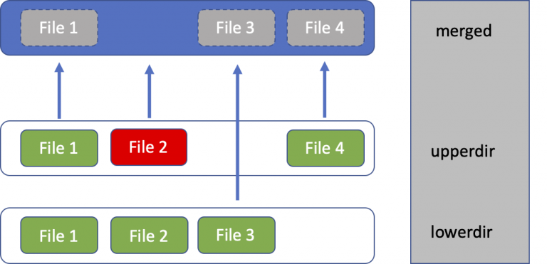

# Docker and OverlayFS

Source:

- <https://www.kernel.org/doc/Documentation/filesystems/overlayfs.txt>

Trong bài post này, chúng ta sẽ nghiên cứu về OverlayFS và cách Docker ứng dụng OverlayFS để làm việc với các layers. Trước tiên, hãy cùng tìm hiểu về OverlayFS

## 1. OverlayFS

OverlayFS, một dạng "union filesystem" cho phép nhiều filesystem có thể nằm chồng lên nhau (overlaid). Thay đổi được ghi nhận ở `upper` filesystem, trong khi `lower` filesystem giữ nguyên, giúp giảm dung lượng lưu trữ.

Như vậy, hiểu đơn giản, OverlayFS bao gồm:

- `lower`: read-only, filesystem gốc, không thay đổi.
- `upper`: read-write, filesystem lưu trữ các thay đổi (thay đổi/xóa/tạo mới).
- `merged`: filesystem kết hợp dữ liệu của `upper` và `lower`.



Để hiện thực hóa ý tưởng trên, cùng khởi tạo một overylay filesystem. Đầu tiên, khởi tạo các thư mục sau: `upper`, `lower`, `merged`. Bên cạnh đó, OverlayFS cần thêm một thư mục `work`. Đây là một thư mục tạm thời mà OverlayFS sử dụng để lưu trữ các thay đổi trong quá trình ghi vào filesystem. Khi bạn thực hiện thay đổi đối với tập tin trong `upper`, OverlayFS không ghi trực tiếp vào layer này mà thay vào đó lưu trữ các thay đổi vào `work` và sử dụng các thao tác kỹ thuật để "gộp" các thay đổi này lại.

```shell
% mkdir /tmp/testoverlayfs
$ cd /tmp/testpverlayfs
$ mkdir upper lower merged work
$ echo "lower file" > lower/in_lower.txt
$ echo "upper file" > upper/in_upper.txt
# in_both is in both directories
$ echo "lower file" > lower/in_both.txt
$ echo "upper file" > upper/in_both.txt
```

Gộp thư mục `upper` và `lower` bằng lệnh `mount`:

```shell
$ sudo mount -t overlay overlay -o lowerdir=/tmp/testoverlayfs/lower,upperdir=/tmp/testoverlayfs/upper,workdir=/tmp/testoverlayfs/work /tmp/testoverlayfs/merge
```

Dùng `tree` để xem danh sách tệp tin trong các thư mục.

```shell
$ tree
.
├── lower
│   ├── in_both.txt
│   └── in_lower.txt
├── merged
│   ├── in_both.txt
│   ├── in_lower.txt
│   └── in_upper.txt
├── upper
│   ├── in_both.txt
│   └── in_upper.txt
└── work
    └── work  [error opening dir]

5 directories, 7 files
```

Tệp tin `in_both.txt` có mặt trong cả `lower` và `upper`, vậy theo lý thuyết, nội dung tệp tin phải được đọc từ `upper`.

```shell
$ cat merged/in_both.txt
upper file
```
Tạo một tệp tin mới trong `merged`, tệp tin đồng thời cũng được khởi tạo trong `upper`.

```shell
$ echo "new_file" > merged/new_file
$ ls */new_file
merged/new_file  upper/new_file
```

Sẽ ra sao nếu chúng ta xóa một tệp tin tại `merged`?

```shell
$ rm merged/in_both.txt
$ ls -la */in_both.txt
-rw-rw-r-- 1 kiennt kiennt   11 Thg 12  3 12:33 lower/in_both.txt
c--------- 2 root   root   0, 0 Thg 12  3 13:09 upper/in_both.txt
```

- `in_both.txt` vẫn còn ở thư mục `lower`, tệp tin không hề bị thay đổi.
- Tệp tin đã bị xóa ở merged.
- Ở `upper`, vẫn còn tồn tại tệp tin `in_both.txt`? Thực ra, tệp tin này là một character device với device number 0/0. Kỹ thuật này được gọi là **whiteout**, đây là cách OverlayFS đánh dấu một tệp tin đã bị xóa tại `upper`.

