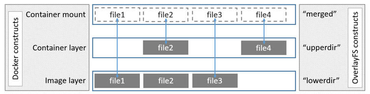
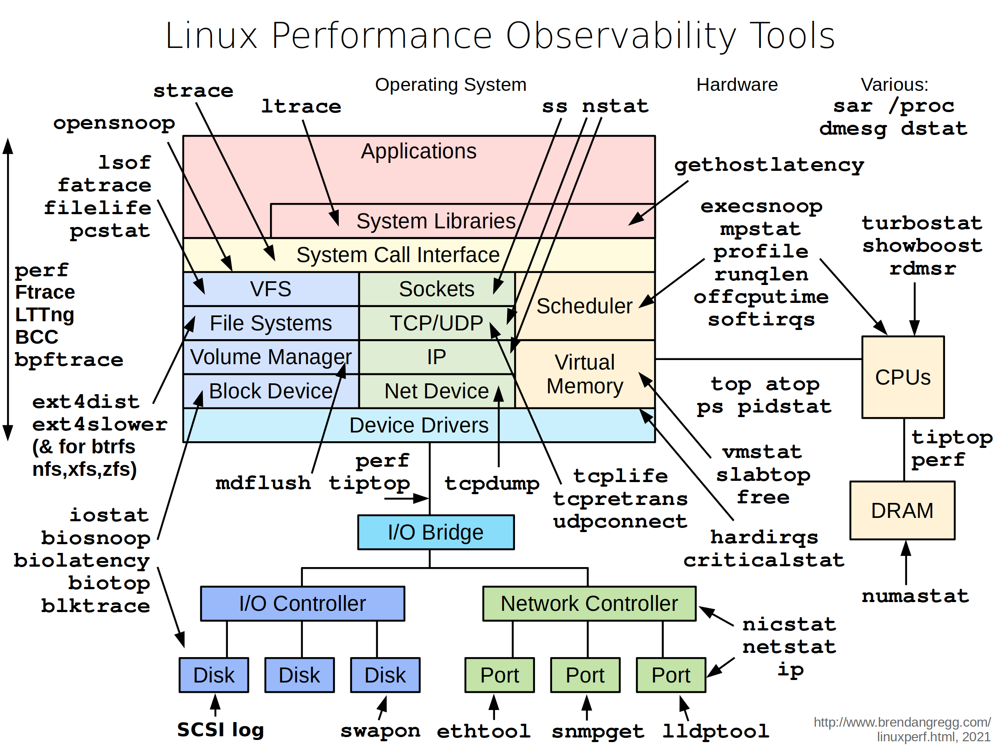

Docker troubleshooting
======================

-  `Kiến thức về Docker`_

   -  `Namespaces`_

   -  `OverlayFS`_

-  `Docker network troubleshooting`_

-  `Docker source code troubleshooting`_

   -  `Sử dụng Docker Copy command`_

   -  `Sửa đổi file trong mounted volume`_

   -  `Sửa đổi file trong container filesystem`_

Theo các quy chuẩn khi viết Dockerfile, chúng ta cần loại bỏ tất cả các file, package, tool không cần thiết trong quá trình xây dựng image. Tuy nhiên, trên thực tế, phần lớn mọi người vẫn cài đặt các tool, package trong Docker image để có thể dễ dàng troubleshoot, debug và chỉnh sửa source code khi xảy ra sự cố. Do vậy, tôi đã nghiên cứu và đưa ra hướng dẫn Docker troubleshooting.

Kiến thức về Docker
===================

Để hiểu về cách thức  troubleshoot hoạt động, trước tiên cần nắm được một số các khái niệm về Docker.

Namespaces
----------

Linux namespaces là một tính năng của Linux Kernel để phân chia các tài nguyên hệ thống như một tập hợp tiến trình(process) chỉ thấy một tập hợp các tài nguyên tương ứng. Ví dụ như, PID namespace cô lập(isolate) vùng số cấp cho ID của tiến trình, có nghĩa là 2 tiến trình trên cùng một máy chủ(host), nhưng ở khác namespace có thể có cùng ID tiến trình. Docker sử dụng tính năng này để tạo ra cô lập giữa các container.

Mức độ cô lập(isolation) này rõ ràng rất hữu ích với container. Nếu không có namespaces, tiến trình chạy ở container A có thể nhìn thấy toàn bộ tiến trình của container B, hoặc nghiêm trọng hơn container A có quyền umount một số filesystem quan trọng ở những container khác trên cùng một máy chủ. Với namespaces, các tiến trình ở container A sẽ nhận thức sự tồn tại tiến trình ở các container khác.

Nói cách khác, bạn không thể giao tiếp với những gì mà bạn không nhìn thấy và đó là những gì thực sự tính năng Namespaces trên hệ điều hành Linux cung cấp - một cách để hạn chế những gì một tiến trình có thể nhìn thấy, để làm cho nó xuất hiện như thể nó là tiến trình duy nhất đang chạy trên máy chủ.

Hiện tại, có các loại namespaces sau:

-  Mount - cô lập các filesystem mount point

-  UTS - cô lập hostname và domainname

-  IPC - cô lập tài nguyên giao tiếp liên tiến trình(IPC)

-  PID - cô lập vùng số cấp cho ID của tiến trình

-  Network - cô lập network

-  User - cô lập về UID/GID

-  Cgroup - cô lập về thư mục root của tính năng cgroups, chỉ mới xuất hiện từ Linux Kernel phiên bản 4.6 trở đi

**Lưu ý**: Namespaces không giới hạn truy cập vào các tài nguyên vật lý như CPU, bộ nhớ, đĩa cứng. Các truy cập này được đo đạc và giới hạn bởi một tính năng khác của Linux Kernel gọi là "*cgroups*".

**Ví dụ**

Để cho dễ hình dung, chúng ta start 1 container *test* mode network bridge, expose port 8000:

+-------------------------------------------------------------------------+
|    ❯ docker run -it -p 8000:8000 --rm --name test python:3.10-alpine sh |
+-------------------------------------------------------------------------+

Ở một session khác, chạy lệnh sau để lấy được process id:

+---------------------------------------------------+
|    ❯ docker top test                              |
|                                                   |
|    UID PID PPID C STIME TTY TIME CMD              |
|                                                   |
|    root 1029819 1029796 0 14:20 pts/0 00:00:00 sh |
+---------------------------------------------------+

Như vậy, container *test* có tiến trình chính với PID: 1029819. chúng ta dùng PID này để lấy các namespace của container *test*.

+----------------------------------------+
|    ❯ sudo lsns \| grep 1029819         |
|                                        |
|    NS TYPE NPROCS PID USER COMMAND     |
|                                        |
|    4026532224 mnt 1 1029819 root sh    |
|                                        |
|    4026532225 uts 1 1029819 root sh    |
|                                        |
|    4026532227 ipc 1 1029819 root sh    |
|                                        |
|    4026532228 pid 1 1029819 root sh    |
|                                        |
|    4026532229 net 1 1029819 root sh    |
|                                        |
|    4026532568 cgroup 1 1029819 root sh |
+----------------------------------------+

Chúng ta có thể cho một tiến trình mới tham gia (join) vào namespace đang có dùng công cụ nsenter, ví dụ sau chạy lệnh /bin/sh để tạo một shell mới ở namespace của tiến trình của ví dụ về PID Namespace, ngoài ra chúng ta đã join container test network namespace, do vậy khi chạy ip a, kết quả trả về là network của container:

+--------------------------------------------------------------------------------------------+
|    ❯ sudo nsenter -t 1029819 --mount --uts --ipc --net --pid sh                            |
|                                                                                            |
|    / # ip a                                                                                |
|                                                                                            |
|    1: lo: <LOOPBACK,UP,LOWER_UP> mtu 65536 qdisc noqueue state UNKNOWN qlen 1000           |
|                                                                                            |
|    link/loopback 00:00:00:00:00:00 brd 00:00:00:00:00:00                                   |
|                                                                                            |
|    inet 127.0.0.1/8 scope host lo                                                          |
|                                                                                            |
|    valid_lft forever preferred_lft forever                                                 |
|                                                                                            |
|    14: eth0@if15: <BROADCAST,MULTICAST,UP,LOWER_UP,M-DOWN> mtu 1500 qdisc noqueue state UP |
|                                                                                            |
|    link/ether 02:42:ac:11:00:02 brd ff:ff:ff:ff:ff:ff                                      |
|                                                                                            |
|    inet 172.17.0.2/16 brd 172.17.255.255 scope global eth0                                 |
|                                                                                            |
|    valid_lft forever preferred_lft forever                                                 |
|                                                                                            |
|    / # ps aux                                                                              |
|                                                                                            |
|    PID USER TIME COMMAND                                                                   |
|                                                                                            |
|    1 root 0:00 sh                                                                          |
|                                                                                            |
|    11 root 0:00 sh                                                                         |
|                                                                                            |
|    13 root 0:00 ps aux                                                                     |
|                                                                                            |
|    / #                                                                                     |
+--------------------------------------------------------------------------------------------+

Như chúng ta thấy tiến trình /bin/sh mới có thể truy cập vào một namespace sẵn có và nhìn thấy các tiến trình đang chạy ở namespace này, nó hoạt động bằng cách dùng syscall `setns`_ ở Linux Kernel.

OverlayFS
---------

Khi cài đặt docker thì chúng ta sẽ thấy cấu trúc thưc mục trong  */var/lib/docker *\ như sau:

-  overlay2

-  containers

-  image

-  volumes

Các image được pull về hoặc mới tạo sẽ được lưu trữ trong thư mục *image/*, tương tự các thông tin liên quan tới container runing sẽ được lưu trữ trong thư mục *containers/*, Tất cả các volumes mới được tạo đều nằm trong thư mục volumes/.

Khi tạo một image bằng docker thì nó phải thực hiện nhiều bước và việc tạo image sẽ diễn ra theo từng layer, và tất cả thông tin, dữ liệu của các layer sẽ được lưu trữ bên trong thư mục overlay2.

Overlay2 chính là *OverlayFS*, một dạng *union filesystem*. Union filesystem co phép nhiều file system có thể nằm chồng lên (hay gọi là overlaid), trong khi nhìn dưới góc nhìn user chỉ thấy một hệ thống file thống nhất.

Trong OverlayFS Docker, có các loại thư mục sau:

-  lowerdir: chứa các read-only layers từ image.

-  upperdir: chứa các read-write layers, bất kỳ thay đổi của filesystem trong container đều được ghi vào upperdir.

-  merged: hệ thống file thống nhất, kết hợp upperdir và lowerdir.

Hình sau biểu diễn cách thức OverlayFS hoạt động.

Chi tiết tham khảo thêm tại `Docker docs`_.

Docker network troubleshooting
==============================

Trong quá trình vận hành, không ít lần phải troubleshoot network connection bằng các công cụ netstat, iptables, tcpdump,... Thông thường các base image, không cài đặt các tool này và chúng ta lại không muốn cài đặt thêm. Để giải quyết vấn đề này mà không cần cài đặt thêm trong Docker image, chúng ta sẽ ứng dụng **network namespace. **\ Như đã giới thiệu phía trên, network namespace là tính năng của Linux kernel cho phép cô lập network: interfaces, route, ip,...

Như ví dụ ở trên, có thể sử dụng nsenter để chạy chương trình trong container namespace. Cách làm này vẫn bị giới hạn bởi các công cụ có trong container, ví dụ bạn không thể chạy lệnh /bin/bash trong container *test* namespace, nhưng đây vẫn là tiền đề để chúng ta chạy **sidecar **\ để truy cập vào namespace của container. Docker cli có hỗ trợ cho phép chạy container sidecar trong namespace của một container đã có sẵn.

Chúng ta sẽ tạo một sidecar có đầy đủ các công cụ troubleshoot networking với image `netshoot`_, chạy trong network namespace của container test.

+-------------------------------------------------------------------------------------------------------+
|    ❯ docker run -it --network container:test --rm --name sidecar nicolaka/netshoot bash               |
|                                                                                                       |
|    bash-5.1# ip a                                                                                     |
|                                                                                                       |
|    1: lo: <LOOPBACK,UP,LOWER_UP> mtu 65536 qdisc noqueue state UNKNOWN group **default** qlen 1000    |
|                                                                                                       |
|    link/loopback 00:00:00:00:00:00 brd 00:00:00:00:00:00                                              |
|                                                                                                       |
|    inet 127.0.0.1/8 scope host lo                                                                     |
|                                                                                                       |
|    valid_lft forever preferred_lft forever                                                            |
|                                                                                                       |
|    14: eth0@if15: <BROADCAST,MULTICAST,UP,LOWER_UP> mtu 1500 qdisc noqueue state UP group **default** |
|                                                                                                       |
|    link/ether 02:42:ac:11:00:02 brd ff:ff:ff:ff:ff:ff link-netnsid 0                                  |
|                                                                                                       |
|    inet 172.17.0.2/16 brd 172.17.255.255 scope global eth0                                            |
|                                                                                                       |
|    valid_lft forever preferred_lft forever                                                            |
|                                                                                                       |
|    bash-5.1#                                                                                          |
+-------------------------------------------------------------------------------------------------------+

Chúng ta đã ở trong network namespace của container test. Bây giờ lấy ví dụ đơn giản chúng ta cần bắt tcpdump đến container *test*, nhưng trong container *test* không có tcpdump. Bên container *test* bật http server port 8000.

+-----------------------------------------------------------------+
|    # trong container test                                       |
|                                                                 |
|    / # tcpdump                                                  |
|                                                                 |
|    sh: tcpdump: not found                                       |
|                                                                 |
|    / # python3 -m http.server                                   |
|                                                                 |
|    Serving HTTP on 0.0.0.0 port 8000 (http://0.0.0.0:8000/) ... |
+-----------------------------------------------------------------+

Thực hiện bắt tcpdump ở trong container *sidecar*:

+-------------------------------------------------------------------------------------------+
|    bash-5.1# tcpdump -nni any port 8000                                                   |
|                                                                                           |
|    tcpdump: data link type LINUX_SLL2                                                     |
|                                                                                           |
|    tcpdump: verbose output suppressed, use -v[v]... **for** full protocol decode          |
|                                                                                           |
|    listening on any, link-type LINUX_SLL2 (Linux cooked v2), snapshot length 262144 bytes |
+-------------------------------------------------------------------------------------------+

Từ bên ngoài host chúng ta thực hiện gọi request vào.

+-----------------------------------------------------------------------------------------------+
|    # ở host                                                                                   |
|                                                                                               |
|    ❯ http http://localhost:8000                                                               |
|                                                                                               |
|    HTTP/1.0 200 OK                                                                            |
|                                                                                               |
|    Content-Length: 915                                                                        |
|                                                                                               |
|    Content-type: text/html; charset=utf-8                                                     |
|                                                                                               |
|    Date: Thu, 03 Nov 2022 08:01:47 GMT                                                        |
|                                                                                               |
|    Server: SimpleHTTP/0.6 Python/3.10.8                                                       |
|                                                                                               |
|                                                                                               |
|                                                                                               |
|    <!DOCTYPE HTML PUBLIC "-//W3C//DTD HTML 4.01//EN" "http://www.w3.org/TR/html4/strict.dtd"> |
|                                                                                               |
|    <html>                                                                                     |
|                                                                                               |
|    <head>                                                                                     |
|                                                                                               |
|    <meta http-equiv="Content-Type" content="text/html; charset=utf-8">                        |
|                                                                                               |
|    <title>Directory listing **for** /</title>                                                 |
|                                                                                               |
|    </head>                                                                                    |
|                                                                                               |
|    <body>                                                                                     |
|                                                                                               |
|    <h1>Directory listing **for** /</h1>                                                       |
|                                                                                               |
|    
                                                                                       |
|                                                                                               |
|    <ul>                                                                                       |
|                                                                                               |
|    <li><a href=".dockerenv">.dockerenv</a></li>                                               |
|                                                                                               |
|    <li><a href="bin/">bin/</a></li>                                                           |
|                                                                                               |
|    <li><a href="dev/">dev/</a></li>                                                           |
|                                                                                               |
|    <li><a href="etc/">etc/</a></li>                                                           |
|                                                                                               |
|    <li><a href="home/">home/</a></li>                                                         |
|                                                                                               |
|    <li><a href="lib/">lib/</a></li>                                                           |
|                                                                                               |
|    <li><a href="media/">media/</a></li>                                                       |
|                                                                                               |
|    <li><a href="mnt/">mnt/</a></li>                                                           |
|                                                                                               |
|    <li><a href="opt/">opt/</a></li>                                                           |
|                                                                                               |
|    <li><a href="proc/">proc/</a></li>                                                         |
|                                                                                               |
|    <li><a href="root/">root/</a></li>                                                         |
|                                                                                               |
|    <li><a href="run/">run/</a></li>                                                           |
|                                                                                               |
|    <li><a href="sbin/">sbin/</a></li>                                                         |
|                                                                                               |
|    <li><a href="srv/">srv/</a></li>                                                           |
|                                                                                               |
|    <li><a href="sys/">sys/</a></li>                                                           |
|                                                                                               |
|    <li><a href="tmp/">tmp/</a></li>                                                           |
|                                                                                               |
|    <li><a href="usr/">usr/</a></li>                                                           |
|                                                                                               |
|    <li><a href="var/">var/</a></li>                                                           |
|                                                                                               |
|    </ul>                                                                                      |
|                                                                                               |
|    
                                                                                       |
|                                                                                               |
|    </body>                                                                                    |
|                                                                                               |
|    </html>                                                                                    |
+-----------------------------------------------------------------------------------------------+

Đồng thời, kiểm tra bên container *sidecar*, có thể thấy được kết quả trace (Do thực hiện request từ localhost nên source ip là ip của docker0 gateway):

+----------------------------------------------------------------------------------------------------------------------------------------------------------------------------------------------------------+
|    bash-5.1# tcpdump -nni any port 8000                                                                                                                                                                  |
|                                                                                                                                                                                                          |
|    tcpdump: data link type LINUX_SLL2                                                                                                                                                                    |
|                                                                                                                                                                                                          |
|    tcpdump: verbose output suppressed, use -v[v]... **for** full protocol decode                                                                                                                         |
|                                                                                                                                                                                                          |
|    listening on any, link-type LINUX_SLL2 (Linux cooked v2), snapshot length 262144 bytes                                                                                                                |
|                                                                                                                                                                                                          |
|    08:04:19.184541 eth0 In IP 172.17.0.1.27896 > 172.17.0.2.8000: Flags [S], seq 3822957900, win 7300, options [mss 1460,sackOK,TS val 1081503425 ecr 0,nop,wscale 3], length 0                          |
|                                                                                                                                                                                                          |
|    08:04:19.184549 eth0 Out IP 172.17.0.2.8000 > 172.17.0.1.27896: Flags [S.], seq 298388418, ack 3822957901, win 7240, options [mss 1460,sackOK,TS val 624328329 ecr 1081503425,nop,wscale 3], length 0 |
|                                                                                                                                                                                                          |
|    08:04:19.184560 eth0 In IP 172.17.0.1.27896 > 172.17.0.2.8000: Flags [.], ack 1, win 913, options [nop,nop,TS val 1081503425 ecr 624328329], length 0                                                 |
|                                                                                                                                                                                                          |
|    08:04:19.184682 eth0 In IP 172.17.0.1.27896 > 172.17.0.2.8000: Flags [P.], seq 1:136, ack 1, win 913, options [nop,nop,TS val 1081503425 ecr 624328329], length 135                                   |
|                                                                                                                                                                                                          |
|    08:04:19.184686 eth0 Out IP 172.17.0.2.8000 > 172.17.0.1.27896: Flags [.], ack 136, win 889, options [nop,nop,TS val 624328329 ecr 1081503425], length 0                                              |
|                                                                                                                                                                                                          |
|    08:04:19.185478 eth0 Out IP 172.17.0.2.8000 > 172.17.0.1.27896: Flags [P.], seq 1:156, ack 136, win 889, options [nop,nop,TS val 624328330 ecr 1081503425], length 155                                |
|                                                                                                                                                                                                          |
|    08:04:19.185494 eth0 In IP 172.17.0.1.27896 > 172.17.0.2.8000: Flags [.], ack 156, win 894, options [nop,nop,TS val 1081503426 ecr 624328330], length 0                                               |
|                                                                                                                                                                                                          |
|    08:04:19.185512 eth0 Out IP 172.17.0.2.8000 > 172.17.0.1.27896: Flags [P.], seq 156:1071, ack 136, win 889, options [nop,nop,TS val 624328330 ecr 1081503426], length 915                             |
|                                                                                                                                                                                                          |
|    08:04:19.185518 eth0 In IP 172.17.0.1.27896 > 172.17.0.2.8000: Flags [.], ack 1071, win 823, options [nop,nop,TS val 1081503426 ecr 624328330], length 0                                              |
|                                                                                                                                                                                                          |
|    08:04:19.185544 eth0 Out IP 172.17.0.2.8000 > 172.17.0.1.27896: Flags [F.], seq 1071, ack 136, win 889, options [nop,nop,TS val 624328330 ecr 1081503426], length 0                                   |
|                                                                                                                                                                                                          |
|    08:04:19.189009 eth0 In IP 172.17.0.1.27896 > 172.17.0.2.8000: Flags [F.], seq 136, ack 1072, win 823, options [nop,nop,TS val 1081503429 ecr 624328330], length 0                                    |
|                                                                                                                                                                                                          |
|    08:04:19.189026 eth0 Out IP 172.17.0.2.8000 > 172.17.0.1.27896: Flags [.], ack 137, win 889, options [nop,nop,TS val 624328333 ecr 1081503429], length 0                                              |
+----------------------------------------------------------------------------------------------------------------------------------------------------------------------------------------------------------+

Nhiều sự cố mạng có thể dẫn đến giảm hiệu suất ứng dụng. Một số vấn đề đó có thể liên quan đến cơ sở hạ tầng mạng. Những người khác có thể liên quan đến định cấu hình sai ở cấp host hoặc Docker. Chúng ta hãy xem xét các vấn đề mạng phổ biến:

-  latency

-  routing

-  DNS resolution

-  firewall

-  incomplete ARPs

**netshoot** **sidecar** cung cấp đầy đủ các công cụ troubleshoot từng vấn đề.

Bên cạnh đó, netshoot còn có zsh shell thân thiện với người dùng và cả text editor trong trường hợp cần sửa đổi cấu hình.

Docker source code troubleshooting
==================================

Trên thực tế, bên cạnh các vấn đề network, chúng ta vẫn gặp những trường hợp cần thực hiện sửa đổi trực tiếp mã nguồn (debug, troubleshoot) do không thể reproduce tại môi trường local; hoặc giả dụ cần thay đổi một cấu hình. Giống như network troubleshooting, thay vì cài đặt trực tiếp bộ công cụ trong Docker image, chúng ta có một số cách như sau.

+-----------------------------------------------------------------------------------------------------------------------------------------------------------------------------------------------------------------------------------------------------------------------------------------+
|    Không khuyến khích việc sửa đổi trực tiếp source code trong container. Các trick thay đổi sau chỉ nên được sử dụng khi không thể reproduce tại môi trường local, hot fix và thay đổi cấu hình để thử nghiệm. Khi đã thực hiện xong, cần cập nhật mã nguồn và build lại Docker image. |
+-----------------------------------------------------------------------------------------------------------------------------------------------------------------------------------------------------------------------------------------------------------------------------------------+

Sử dụng Docker Copy command
---------------------------

Chúng ta có thể sử dụng `docker cp`_ command để chuyển file qua lại giữa host và container.

+-------------------------------------------------------+
|    docker cp [OPTIONS] CONTAINER:SRC_PATH DEST_PATH|- |
+-------------------------------------------------------+

-  Lấy file cần sửa  đổi trong container và copy ra ngoài host.

-  Thực hiện thay đổi.

-  Copy file đã sửa đổi vào trong container.

-  Thực hiện restart container (nếu chương trình không có tính năng live reload).

Đây là cách thức đơn giản nhất để thực hiện thay đổi.

Sửa đổi file trong mounted volume
---------------------------------

Khởi tạo lại một container test có volume datavol như sau:

+---------------------------------------------------------------------------------+
|    ❯ docker run -it --rm --name test -v datavol:/mnt/data python:3.10-alpine sh |
|                                                                                 |
|    / # ls -la /mnt/data                                                         |
|                                                                                 |
|    total 8                                                                      |
|                                                                                 |
|    drwxr-xr-x 2 root root 4096 Nov 3 08:28 .                                    |
|                                                                                 |
|    drwxr-xr-x 1 root root 4096 Nov 3 08:30 ..                                   |
|                                                                                 |
|    / #                                                                          |
+---------------------------------------------------------------------------------+

Chúng ta  có thể trực tiếp chỉnh sửa file ở trong thư mục */var/lib/docker/volumes/datavol/_data.*

Trong trường hợp host không có sẵn các công cụ cần thiết để thực hiện thay đổi, chúng ta có thể dùng container sidecar:

+---------------------------------------------------------------------------------------------------------------------------------+
|    ❯ docker run -it --network container:test --pid container:test --volumes-from test --rm --name sidecar nicolaka/netshoot zsh |
|                                                                                                                                 |
|    dP dP dP                                                                                                                     |
|                                                                                                                                 |
|    88 88 88                                                                                                                     |
|                                                                                                                                 |
|    88d888b. .d8888b. d8888P .d8888b. 88d888b. .d8888b. .d8888b. d8888P                                                          |
|                                                                                                                                 |
|    88' \`88 88ooood8 88 Y8ooooo. 88' \`88 88' \`88 88' \`88 88                                                                  |
|                                                                                                                                 |
|    88 88 88. ... 88 88 88 88 88. .88 88. .88 88                                                                                 |
|                                                                                                                                 |
|    dP dP \`88888P' dP \`88888P' dP dP \`88888P' \`88888P' dP                                                                    |
|                                                                                                                                 |
|                                                                                                                                 |
|                                                                                                                                 |
|    Welcome to Netshoot! (github.com/nicolaka/netshoot)                                                                          |
|                                                                                                                                 |
|                                                                                                                                 |
|                                                                                                                                 |
|                                                                                                                                 |
|                                                                                                                                 |
|                                                                                                                                 |
|                                                                                                                                 |
|    dc1d03ac6ede  ~  ls -la /mnt/data                                                                                          |
|                                                                                                                                 |
|    total 8                                                                                                                      |
|                                                                                                                                 |
|    drwxr-xr-x 2 root root 4096 Nov 3 08:28 .                                                                                    |
|                                                                                                                                 |
|    drwxr-xr-x 1 root root 4096 Nov 3 08:32 ..                                                                                   |
|                                                                                                                                 |
|                                                                                                                                 |
|                                                                                                                                 |
|    dc1d03ac6ede  ~  echo "test" > /mnt/data/example                                                                           |
|                                                                                                                                 |
|                                                                                                                                 |
|                                                                                                                                 |
|    dc1d03ac6ede  ~                                                                                                            |
+---------------------------------------------------------------------------------------------------------------------------------+

Bên container test, kiểm tra kết quả:

+------------------------------+
|    / # cat /mnt/data/example |
|                              |
|    test                      |
|                              |
|    / #                       |
+------------------------------+

Sửa đổi file trong container filesystem
---------------------------------------

Chúng ta lại start một container khác, không có phân vùng mount:

+-------------------------------------------------------+
|    ❯ docker run -it --name test python:3.10-alpine sh |
|                                                       |
|    / # cat /etc/crontabs/root                         |
|                                                       |
|    # **do** daily/weekly/monthly maintenance          |
|                                                       |
|    # min hour day month weekday command               |
|                                                       |
|    \*/15 \* \* \* \* run-parts /etc/periodic/15min    |
|                                                       |
|    0 \* \* \* \* run-parts /etc/periodic/hourly       |
|                                                       |
|    0 2 \* \* \* run-parts /etc/periodic/daily         |
|                                                       |
|    0 3 \* \* 6 run-parts /etc/periodic/weekly         |
|                                                       |
|    0 5 1 \* \* run-parts /etc/periodic/monthly        |
+-------------------------------------------------------+

Giả dụ, cần thực hiện thay đổi ở file */etc/crontabs/root* mà không có text editor trong container. Làm thế nào để thực hiện điều đó?

Docker sử dụng OverlayFS, như vậy nếu cần thay đổi gì chúng ta có thể tìm filesystem của container *test* trên host, sau đó thực hiện thay đổi trên mergeddir. Đầu tiên cần tìm hệ thống filesystem overlay2 của container:

+---------------------------------------------------------------------------------------------------------------------+
|    ❯ docker inspect test \| grep -i merged                                                                          |
|                                                                                                                     |
|    "MergedDir": "/var/lib/docker/overlay2/8cdb0f686abf1ca41f883f976a087d65ededb3901f44558ab0c49a3fc667257a/merged", |
+---------------------------------------------------------------------------------------------------------------------+

Sau khi có đường dẫn, thực hiện thay đổi và restart container:

+----------------------------------------------------------------------------------------------------------------------------------+
|    ❯ sudo vim /var/lib/docker/overlay2/8cdb0f686abf1ca41f883f976a087d65ededb3901f44558ab0c49a3fc667257a/merged/etc/crontabs/root |
|                                                                                                                                  |
|    # Thêm dòng "# edit from host"                                                                                                |
|                                                                                                                                  |
|    ❯ docker restart test                                                                                                         |
|                                                                                                                                  |
|    test                                                                                                                          |
|                                                                                                                                  |
|    ❯ docker exec -it test sh                                                                                                     |
|                                                                                                                                  |
|    / # cat /etc/crontabs/root                                                                                                    |
|                                                                                                                                  |
|    # edit from host <--- Thay đổi đã thêm                                                                                        |
|                                                                                                                                  |
|    # **do** daily/weekly/monthly maintenance                                                                                     |
|                                                                                                                                  |
|    # min hour day month weekday command                                                                                          |
|                                                                                                                                  |
|    \*/15 \* \* \* \* run-parts /etc/periodic/15min                                                                               |
|                                                                                                                                  |
|    0 \* \* \* \* run-parts /etc/periodic/hourly                                                                                  |
|                                                                                                                                  |
|    0 2 \* \* \* run-parts /etc/periodic/daily                                                                                    |
|                                                                                                                                  |
|    0 3 \* \* 6 run-parts /etc/periodic/weekly                                                                                    |
|                                                                                                                                  |
|    0 5 1 \* \* run-parts /etc/periodic/monthly                                                                                   |
+----------------------------------------------------------------------------------------------------------------------------------+

.. _Kiến thức về Docker: #kiến-thức-về-docker
.. _Namespaces: #namespaces
.. _OverlayFS: #overlayfs
.. _Docker network troubleshooting: #docker-network-troubleshooting
.. _Docker source code troubleshooting: #docker-source-code-troubleshooting
.. _Sử dụng Docker Copy command: #sử-dụng-docker-copy-command
.. _Sửa đổi file trong mounted volume: #sửa-đổi-file-trong-mounted-volume
.. _Sửa đổi file trong container filesystem: #sửa-đổi-file-trong-container-filesystem
.. _setns: http://man7.org/linux/man-pages/man2/setns.2.html
.. _Docker docs: https://docs.docker.com/storage/storagedriver/overlayfs-driver/
.. _netshoot: https://github.com/nicolaka/netshoot
.. _docker cp: https://docs.docker.com/engine/reference/commandline/cp/

.. |\_scroll_external/attachments/image2022-11-3_17-6-48-ffaf6c9fdb494bc2711c753dbf3db8499262987ee90610b95bb10c11565f06fe.png| image:: docker/media/image1.png
   :width: 5.90069in
   :height: 1.51042in
.. |\_scroll_external/attachments/image2022-11-3_15-10-51-c2714efaf4e7c453bef181e8d571af78535ed15417b993c87d3422c35b66da54.png| image:: docker/media/image2.png
   :width: 5.55556in
   :height: 4.16667in
