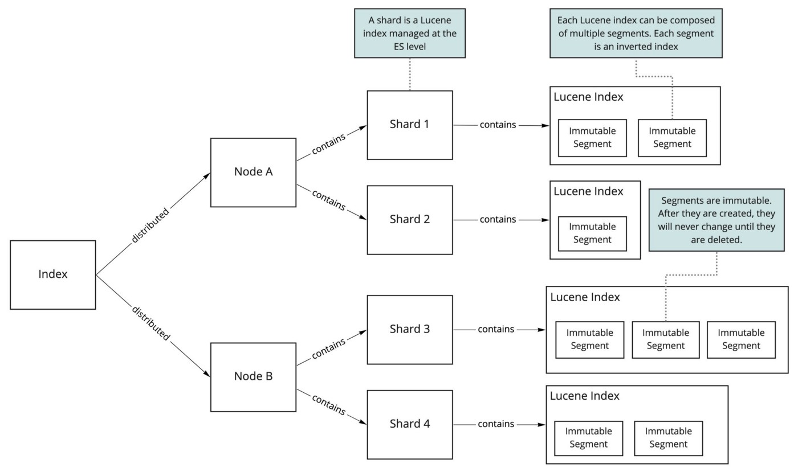
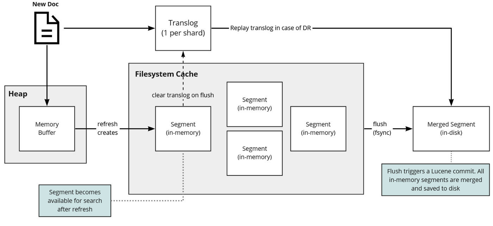

# Increase Elasticsearch write throughput and speed

Source: <https://luis-sena.medium.com/the-complete-guide-to-increase-your-elasticsearch-write-throughput-e3da4c1f9e92>

## 1. Overview ES

- Elasticsearch is powered by Lucene. Lucene powers the "search part", while Elasticsearch gives you scalability, availability, a REST API, specialized data structured...

- Each shard is a Lucene index, each one of those indexes can have multiple segment, each segment is an inverted index.
- Segment is created during document ingestion and is immutable -> edit/delete -> a new segment is created -> ES doesn't support updates or even partial updates.

- New document path during indexing:
  - New document is comitted to a transaction log called "translog" and to a in-memory buffer.
  - All the documents in the in-memory buffer will generate a single in-memory Lucene segment when "refresh" operation happens (make new document available for search).
  - All of those segments are merged into a single segment and saved to disk and the translog is cleared.

## 2. Tuning

### 2.1. Client strategies

- Bulk indexing: benchmark to determine the right batch size for your data.
- Parallelization:
  - Distribute the data across multiple workers that can run in parellel.
  - Error `TOO_MANY_REQUESTS (429)` - Elasticsearch thread pool queues are full.
  - Retry mechanism - [Exponential backoff](https://en.wikipedia.org/wiki/Exponential_backoff).
- Response filtering:
  - `filter_path` parameter: reduce the response.
- Aggregate before saving:
  - Buffer the changes using Redis/Kafka, any other means and then aggregate those multiple document edits into a single on before saving to Elasticsearch.
  - Group by "key" for a window of time and then use bulk operations.

### 2.2. Index strategies

- Refresh interval:
  - The refresh operation makes new data available for search. When a refresh happens, the recently indexed data that only exists in memory is transferred to a new Lucene segment.
  - This operation does not flush/commit those segments to disk but the data is safe thanks to the translog.
  - By default, ES will execute a refresh every second if the index received one search request or more in the last 30 seconds.
  - Set a bigger `refresh_interval` for index during the batch ingest job and then set it back again to standard value after the job finishes.
  - Find more [here](https://sematext.com/blog/elasticsearch-refresh-interval-vs-indexing-performance/).
- Auto-generated IDs:
  - Allow ES to generate ids -> ES won't need to check for uniqueness -> increase document creation speed.
  - You check this [article](https://blog.mikemccandless.com/2014/05/choosing-fast-unique-identifier-uuid.html) to choose fast unique identifier (UUID) for Lucene.
- Disable replicas:
  - Index a document -> it will be indexed by each replica, effectively mutiplying the work by the number of replicas you have.
  - Disable them before the bulk job -> enable them afterward.

### 2.3. Node strategies

- Indexing buffer size:
  - [indices.memory.index_buffer_size](https://www.elastic.co/guide/en/elasticsearch/reference/master/indexing-buffer.html): control how much memory Elasticsearch will reserve for indexing.
  - Default: 10% of the heap.
  - Be shared among all active shards.
  - At most **512 MB indexing buffer per shard** doing heavy indexing (beyond that indexing performance does not typically improve).
- Cross-cluster replication:
  - Direct all your reads to the "follow" index and write only to the "leader" index -> prevent searching from stealing resources from indexing.
  - Config [cross-cluster replication](https://www.elastic.co/guide/en/elasticsearch/reference/master/xpack-ccr.html).

### 2.4. Operating system and server strategies

- Disable swapping: Swapping will kill performance. ES uses a lot of memory so if you're not careful -> it might start swapping -> [disable swapping](https://www.elastic.co/guide/en/elasticsearch/reference/master/setup-configuration-memory.html).
- Filsystem cache:
  - Linux automatically uses free ram to cache files.
  - Elastic recommends having at least half the memory of the machine running Elasticsearch available for the filesystem cache.
  - Make sure you don't set ES_HEAP_SIZE to be more than 50% of your machine memory.
- Faster hardware:
  - SSD (of course).

## 3. References

- <https://tech.ebayinc.com/engineering/elasticsearch-performance-tuning-practice-at-ebay>
- <https://www.elastic.co/guide/en/elasticsearch/reference/master/tune-for-indexing-speed.html>
- <https://logz.io/blog/elasticsearch-performance-tuning/>
