# PDF Standard and Digital Signature

Source:

- <https://www.adobe.com/devnet-docs/acrobatetk/tools/DigSig/Acrobat_DigitalSignatures_in_PDF.pdf>
- <https://www.slideshare.net/blowagie/digital-signatures-in-pdf-how-its-done>
- <https://itextpdf.com/sites/default/files/2018-12/digitalsignatures20130304.pdf>
- <https://docbox.etsi.org/workshop/2012/201211_TSP/5_pdf_signatures.pdf>

Table of contents:

- [PDF Standard and Digital Signature](#pdf-standard-and-digital-signature)
  - [1. Why do we need digital signatures?](#1-why-do-we-need-digital-signatures)
  - [2. Basic concepts](#2-basic-concepts)
  - [3. Apply Digital signature to PDF](#3-apply-digital-signature-to-pdf)
    - [3.1. Intro](#31-intro)
    - [3.2. Public key infrastructure](#32-public-key-infrastructure)
      - [3.2.1. PKI, PDF, and signing](#321-pki-pdf-and-signing)
      - [3.2.2. PKI, PDF, and signature validation](#322-pki-pdf-and-signature-validation)
    - [3.3. PDF language signature features](#33-pdf-language-signature-features)
      - [3.3.1. Standards support](#331-standards-support)
      - [3.3.2. Support for alternate signature methodogies](#332-support-for-alternate-signature-methodogies)
      - [3.3.3. Support for two signature types](#333-support-for-two-signature-types)
      - [3.3.4. Signature interoperability](#334-signature-interoperability)
      - [3.3.5. Robust algorithm support](#335-robust-algorithm-support)
      - [3.3.6. Multiple signatures and incremetal updates](#336-multiple-signatures-and-incremetal-updates)
      - [3.3.7. Locking form fields](#337-locking-form-fields)
      - [3.3.8. Controlling post-signing changes](#338-controlling-post-signing-changes)
      - [3.3.9. Enabling features via document-based permissions](#339-enabling-features-via-document-based-permissions)
      - [3.3.10. Rich certificate processing](#3310-rich-certificate-processing)
      - [3.3.11. Controlling signature workflows via seed values](#3311-controlling-signature-workflows-via-seed-values)
    - [3.4. Signature creation workflow](#34-signature-creation-workflow)
    - [3.5. Architectures: Server-side vs. client-side signing](#35-architectures-server-side-vs-client-side-signing)
    - [3.6. Long-term validation (LTV)](#36-long-term-validation-ltv)

## 1. Why do we need digital signatures?

- **Integrity**: we want assurance that the document hasn't been changed somewhere in the workflow.
- **Authenticity**: we want assurance that the author of the document is who we think it is (and not somebody else).
- **Non-repudiation**: we want assurance that the author can't deny his authorship.

## 2. Basic concepts

- **Hashing**:

  - Hashing algorithm: A crytographic hash function to turn an arbitrary block of data into a fixed-size bit string.
  - Available algorithms:
    - MD5: Ron Rivest
    - SHA:
      - SHA-1: NSA (Being phased out!)
      - SHA-2: NSA/NIST
      - NEW: SHA-3 contest winner "Keccak"
    - RIPEMD: KULeuven
  - Integrity check using hash:

  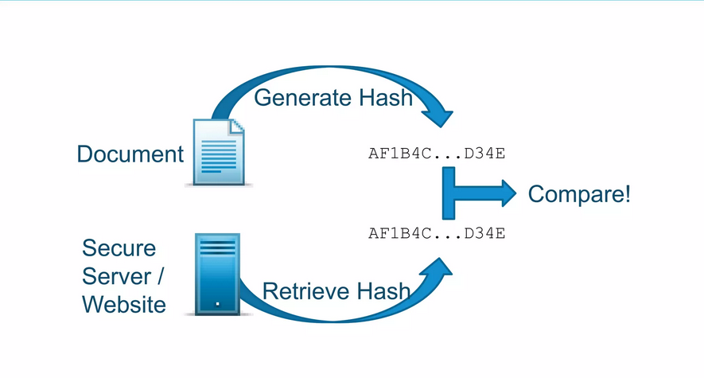

- **Encryption**:
  - Assymetric key algorithms:
    - Public Key Cryptography Standards
      - PKCS#1: RSA Cryptography Standards
      - PKCS#7: Cryptographic Message Standard (CMS)
      - PKCS#11: Cryptographic Token Interface
      - PKCS#12: Personal Information Exchange Syntax Standard
      - PKCS#13: Elliptic Curve Cryptography Standard (ECDSA)
    - Federal Information Processing Standards (FIPS)
      - DS: Digital Signature Algorithm (DSA)
    - European Telecommunications Standard Institute (ETSI)
      - CMS Advanced Electronic Signatures (CAdES)
- **Combine**:
  - Producer:
    - Provide data as-is
    - Provide hash encrypted using private key
    - Provide public key
  - Consumer:
    - Create hash from data: hash1
    - Decrypt hash using public key: hash2
    - If (hash1 == hash2) document OK!
- Goal met?
  - Integrity: hashes are identical
  - Authenticity: identity found along with public key
  - Non-repudiation: if hash can be decrypted with public key, the document was signed with the corresponding private key-

## 3. Apply Digital signature to PDF

### 3.1. Intro

This section describes how digital signatures are represented in a PDF document and what signature-related features the PDF language support.

In a PDF, signature information is contained in a signature dictionary. Objects in the dictionary are defined by the PDF reference. The signature dictionary can reference, or be referenced by, other dictionaries, and it usually is. The entries in these dictionaries determine the nature and features of the signature, and by extension, what data can be available to any PDF viewer designed to process the signature data.


At a high level, the PDF language features can be grouped into these categories:

- Adding a digital signature to a document.
- Checking that signature for validity.
- Permissions and restrictions that control the signature workflow.

### 3.2. Public key infrastructure

- PDF's digital signature capabilties are designed for compatibility with all standards associcated with mainstream **public key infrastructure (PKI)** deployed in enterprise and goverment settings.
  - A PKI is the set of people, policies, procedures, hardware, and software used in creating, distributing, managing, and revoking, and using the digital IDs, that contain the public/private key paris used when signing a PDF.
- When signing an document, a person usually signs it in front of a notary public or other trusted authority after providing them satisfactory evidence of their identify.
  - **Certificate authority (CA)**: An ultimate trust authority that sells or issues digital IDs (such as Verisign or Geotrust). The CA signs it's own certificate (self-signs) and its certificate is typically the 'root' certificate at the top of the certificate chain.
  - **Intermediate certificates (ICAs)**: A type of CA whose certificte resides in the certificate chain between the end entity and root certificates.
  - **End entity certificate (EE)**: The signer's certificate and the last element of signing chain.
  - **Digital ID**: An electronic representation of data based on the ITU-T X509 v3 standard, associated with a person or entity. It is stored in a password-protected file on a computer or network, a USB token, a smart card, etc. A digital ID contains a public key certificate, private key, and other data.
  - **Public key certificate**: A file that contains the numeric public key portionof a public/private key pair along with the associated extensions and attributes used to define the certificates owner, validity period, and usage.
  - **Private key**: The secret key in a PKI system, used to validate incoming messages and sign outgoing ones.

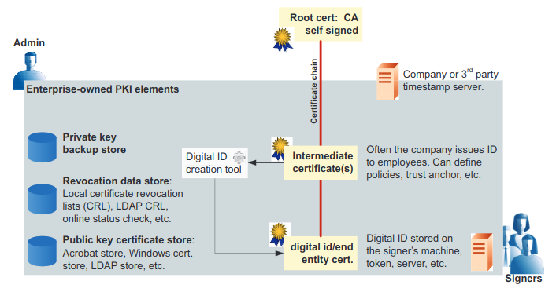

#### 3.2.1. PKI, PDF, and signing

- Each digital signature in a PDF document is associated with a _signature handler_. The signature is placed in a PDF signature dictionary which contains the name of the signature handler which will be used to process that signature.
- When a PDF is signed, the signer's certificate is embeded in the PDF file.

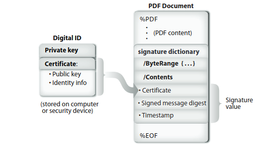

- The high-level sigining process:

  - A document to be signed is turned into a stream of bytes.
  - The entire PDF files is written to disk with a suitably-sized space left for the signature value as well as with worst-case valus in the `ByteRange` array.

  ```unknown
  /ByteRange - an array of 4 numbers
  [0, 840, 960, 240]

  - The first number: the offset in the file (from the beginning, starting from 0) of the beginning of a stream of bytes to be included in the hash.
  - The second number: the length of that stream.
  - The two pairs define two sequences of bytes that define what is to be hashed.
  ```

  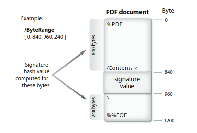

  - Once the location of the signature value is known in terms of offsets in the file, the `ByteRange` array is overwritten using the correct value.
  - The hash of the entire file is computed, using the bytes specified by the `ByteRange` value using a hash algorithm such as SHA-256.
  - The hash value is encrypted with the signer's private key and a hex-encoded PKCS#7 object signature object is generated.
  - The signature object is placed in the file on disk, overrwriting the place holder `/Contents` value.

#### 3.2.2. PKI, PDF, and signature validation

- Since private and public keys are merely numbers, anyone can generate this pair using any number of tools. And anyone can also generate a self-signed certificate.
- To solve this type of trust problem, organizations use a PKI that includes an independent authority that issues, records, and tracks digital IDs. Because PDF supports embedding the signer’s public key as part of the signature, document recipient always have it for signature validation. To validate a signature, the validator simply retrieves the signer’s certificate and compares it to their own list of trusted certificates:
  - The recipient’s application generates a one-way hash of the document using the same algorithm the signer used, excluding the signature value.
  - The encrypted hash value in the document is decrypted using the signer’s public key.
  - The decrypted hash value is compared to the locally generated hash value.
  - If the are identical, the signature is reported as known.

### 3.3. PDF language signature features

#### 3.3.1. Standards support

PDF is itself an open ISO standard. Digital signature support in PDF is fully described in [ISO 32000-2](https://www.iso.org/standard/75839.html).

#### 3.3.2. Support for alternate signature methodogies

Beside mathematical signatures, they may also be a biometric frm of identification, such as a handwritten signature, fingerprint, or retinal scan. Signature handler process the data and controls the form of authetication according to the rules defined in the PDF ISO standard.

#### 3.3.3. Support for two signature types

PDF defins two types of signatures:

- **Approval**: There can be any number of approval signatures in a document. The field may optionally be associated with FieldMDP permissions.
  - Workflow with subsequent signers.
  - New in PDF 2.0: modification detection permissions.
- **Certification**: There can be only once certification signature and it must be the first one in a document.
  - Only possible for the first revision.
  - Involves modification detection permissions:
    - No changes allowed
    - Form filling and signing allowed
    - Form filling, signing, and commentin allowed

#### 3.3.4. Signature interoperability

PDF is designed to allow interoperability between signature handlers and conforming readers; that is, a
PDF signed with handler ABC should be able to be validated with handler XYZ from a different vendor.

#### 3.3.5. Robust algorithm support

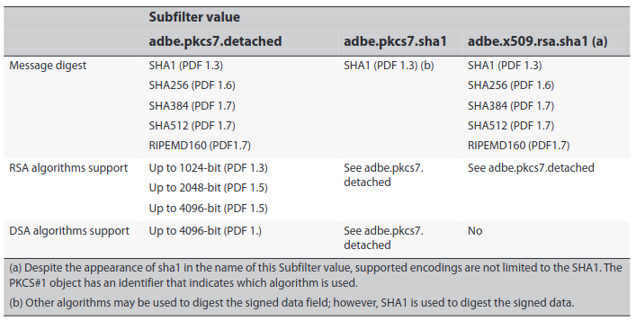

#### 3.3.6. Multiple signatures and incremetal updates

Some documents may require more than one signature. With PDF, any attempt to alter the document by modifying the file (such as signing it again) will invalidate the exisiting digital signature. This is so because the hash value calculated at verification time will not match the encrypted hash created at signing time.

PDF solves this problem by supporting the availability to do **incremental updates**.

- Incremental updates are transparent to the person viewing the document, but allow the detection and audit of modifications to the file.
- This feature allows any PDF file to be modified by adding the modification information (additional signatures in our case) to the end of the file in an incremental update section.
- Each additional signature will cover the entire PDF file, from byte 0 to the last byte, excluding only the signature value for the current signature value.

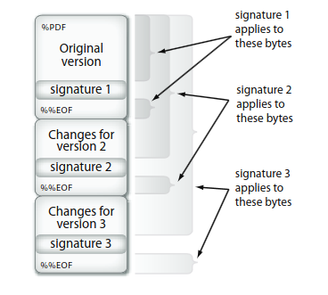

The Incremental updates facility of the PDF language allows PDF viewers to effectively retain all signed revisions of any PDF file. This makes it possible for users to actually see the version of the PDF file that was signed (View signed version and Compare siged version to the current version).

#### 3.3.7. Locking form fields

Form fields include both signature and non-signature fields, and forms often contain many form fields. When creating a document, an author can specify the following:

- Whether form fields can be filled in without invalidating the approval or certification signature.
- That after a specific recipient has signed the document, any modifications to specific form fields shall in invalidate that recipient'signature.

#### 3.3.8. Controlling post-signing changes

PDF provide a mechanism for limiting post-signing. That mechanism is the DocMDP transform method. The P entry in the DocMDP transform
parameters dictionary indicates which of the following changes to the document will invalidate the signature:

- No changes
- Form fill-in and digital signatures
- Annotations (commenting), form fill-in, digital signatures

#### 3.3.9. Enabling features via document-based permissions

PDF enables a fully featured client with rich PDF interaction to grant document-specific permissions to less capable clients so that they can also use some of those features. Using this mechanism, a client that does not have digital signature capability may be granted that ability. When the permission is granted at the language level for a particular document, any associated signature related user interface elements would become enabled.

#### 3.3.10. Rich certificate processing

PDF enables feature rich certificate processing and handling because it certificate data is embedded in the signature.

For example, when PKCS#7 signature are used, the signature object can contain some or all of the following:

- Timestamp information
- Embedded revocation information
- Revocation checking details for both CRLs and OCSP
- Certificate policies and attribute certificates

#### 3.3.11. Controlling signature workflows via seed values

PDF's support for seed values provides authors with field-level control over document behavior once it has been routed to the signer. A seed value specifies an attribute and attribute value, and the author can contol whether the specified parameter is optional or required for any particular field.

### 3.4. Signature creation workflow

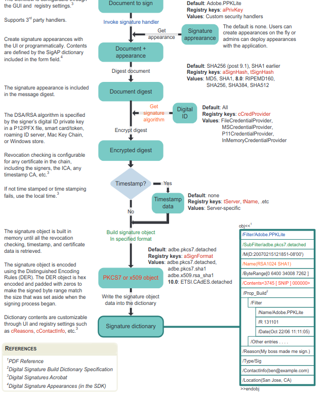

### 3.5. Architectures: Server-side vs. client-side signing

- Server-side signing:
  - Use cases:
    - Company signature:
      - Invoices
      - Contracts
    - Signing services in the Cloud
      - Docusign
      - Echosign
      - ...
    - Security management responbilities.

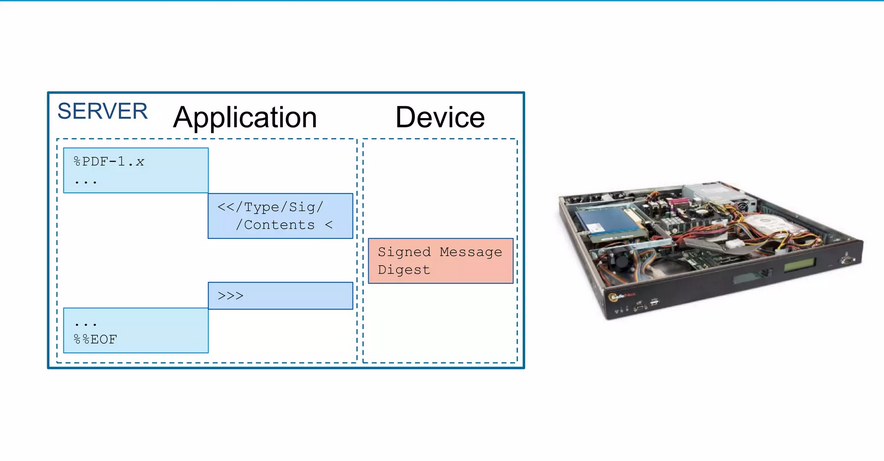

- Client-side signing:
  - Use cases:
    - Desktop applications
    - In a web context.
    - Access to the token or smart card through:
      - MSCAPI
      - PKCS#11
      - Custom smart card library
    - Security: User has smart card and PIn or USB token and passphrase

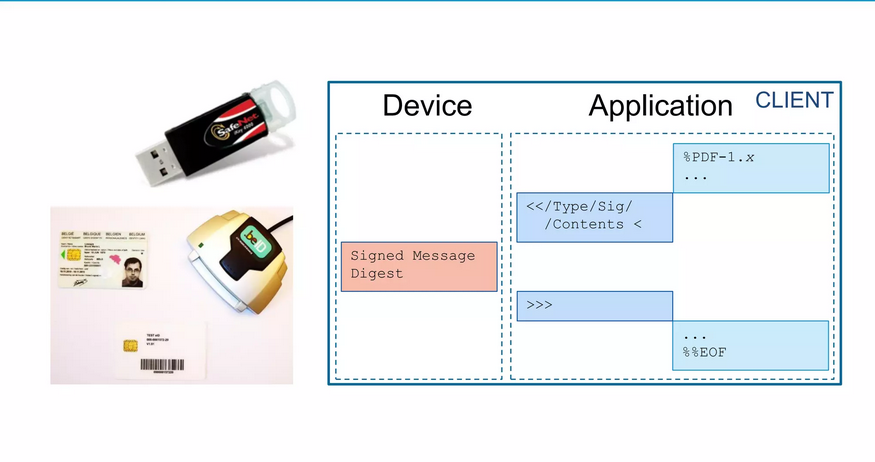

- Deferred signing:
  - Use cases:
    - Signing on a tablet/mobile:
      - App on the device has low footprint
      - Easy to link to integrate into a document management system
      - Example: eaZySign (Zetes)
    - Disadvantage:
      - At most 1 signature/second.
      - You need to trust the server that hash you receive is actually the hash of the document you want to sign.

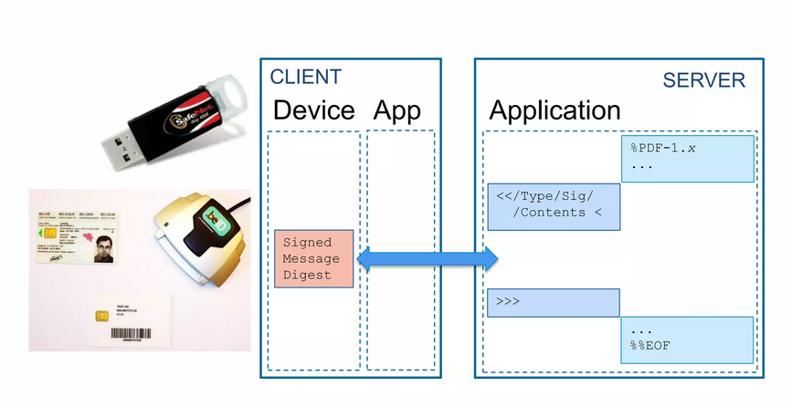

### 3.6. Long-term validation (LTV)

- Certificate expire:

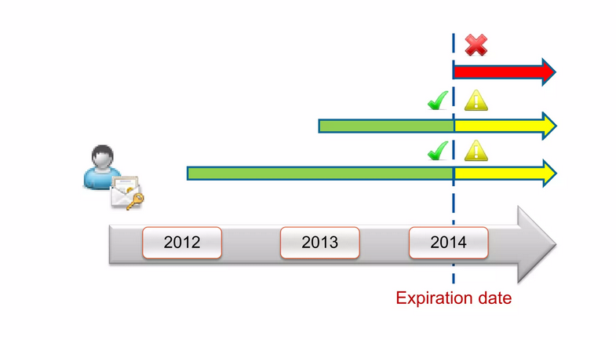

- Certificaes get revoked:

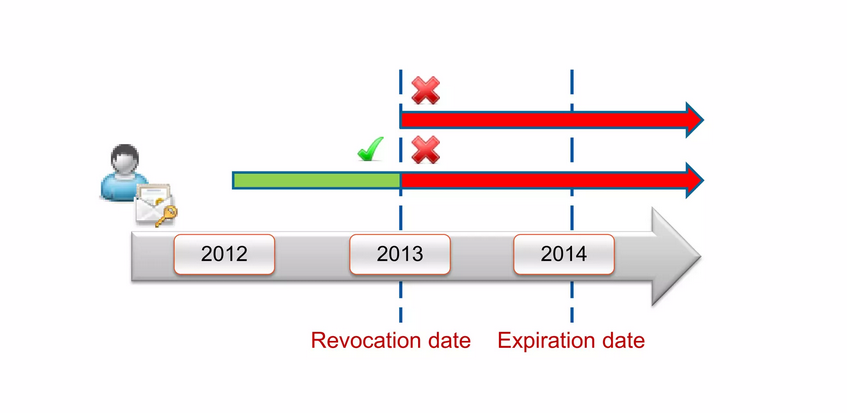

> WIP: Timestamp, CRL, OCS, ...
