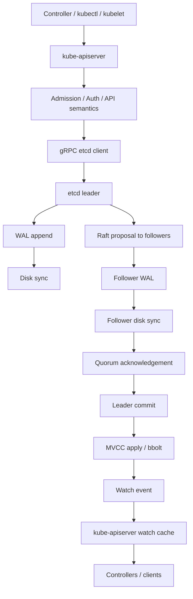

# etcd: From First Principles to Production and Kubernetes Internals

A comprehensive learning and operations guide for **etcd v3.x**, synthesized from the LearnKube deep dives, Datadog's etcd monitoring guide, and the official etcd v3.7 documentation.

The goal is to build one continuous mental model:

> **Kubernetes state → kube-apiserver → gRPC → etcd request → Raft consensus → WAL/disk → MVCC/B+Tree → watch history → kube-apiserver cache/controllers**

Once that path is understood, most etcd incidents stop looking mysterious. High `fsync` latency, leader churn, stalled proposals, watch lag, database growth, quota alarms, and slow Kubernetes API calls become different symptoms of a smaller set of underlying constraints.

---

Sources

This document aggregates content from:

- **LearnKube deep dives**: <https://learnkube.com/etcd-breaks-at-scale>, <https://learnkube.com/etcd-kubernetes>
- **Datadog monitoring guide**: <https://www.datadoghq.com/blog/etcd-key-metrics/>
- **Official etcd v3.7 docs**: <https://etcd.io/docs/v3.7/>
- **Etcd V3 data model**: <https://etcd.io/docs/v3.4.0/learning/data_model/>
- **Operate etcd cluster**: <https://ntk148v.github.io/blog/posts/operate-etcd-cluster/>

---

Table of contents

- [etcd: From First Principles to Production and Kubernetes Internals](#etcd-from-first-principles-to-production-and-kubernetes-internals)
  - [1. What etcd is](#1-what-etcd-is)
    - [1.1. Why Kubernetes needs something like etcd](#11-why-kubernetes-needs-something-like-etcd)
    - [1.2. What etcd is _not_](#12-what-etcd-is-not)
  - [2. The mental model](#2-the-mental-model)
  - [3. etcd in Kubernetes](#3-etcd-in-kubernetes)
    - [3.1. Only kube-apiserver normally talks directly to etcd](#31-only-kube-apiserver-normally-talks-directly-to-etcd)
    - [3.2. The `/registry` keyspace](#32-the-registry-keyspace)
    - [3.3. Watch cache changes the read path](#33-watch-cache-changes-the-read-path)
  - [4. The key/value data model](#4-the-keyvalue-data-model)
    - [4.1. Range operations](#41-range-operations)
    - [4.2. Deletes are revisions, not magical erasure](#42-deletes-are-revisions-not-magical-erasure)
  - [5. MVCC and revisions](#5-mvcc-and-revisions)
    - [5.1. Global revision vs per-key version](#51-global-revision-vs-per-key-version)
    - [5.2. Time-travel queries](#52-time-travel-queries)
    - [5.3. Why every write has a storage cost](#53-why-every-write-has-a-storage-cost)
  - [6. Raft consensus](#6-raft-consensus)
    - [6.1. Member states](#61-member-states)
    - [6.1. Source visual sequence: Raft election](#61-source-visual-sequence-raft-election)
    - [6.2. Leader election](#62-leader-election)
    - [6.3. Quorum](#63-quorum)
    - [6.4. Write replication](#64-write-replication)
    - [6.5. Why adding members does not linearly scale writes](#65-why-adding-members-does-not-linearly-scale-writes)
  - [7. The complete write path](#7-the-complete-write-path)
    - [7.1. Kubernetes write path](#71-kubernetes-write-path)
    - [7.2. Why latency compounds](#72-why-latency-compounds)
    - [7.3. The key performance equation](#73-the-key-performance-equation)
  - [8. The read path and consistency modes](#8-the-read-path-and-consistency-modes)
    - [8.1. Linearizable read](#81-linearizable-read)
    - [8.2. Serializable read](#82-serializable-read)
    - [8.3. Reads can still be expensive](#83-reads-can-still-be-expensive)
  - [9. Storage internals: WAL, bbolt, snapshots](#9-storage-internals-wal-bbolt-snapshots)
    - [9.1. Logical layers](#91-logical-layers)
    - [9.2. WAL: write-ahead log](#92-wal-write-ahead-log)
    - [9.3. bbolt / B+Tree](#93-bbolt--btree)
    - [9.1. Physical storage characteristics](#91-physical-storage-characteristics)
    - [9.4. Snapshots](#94-snapshots)
    - [9.5. Persistent storage files](#95-persistent-storage-files)
  - [10. Why disk latency matters so much](#10-why-disk-latency-matters-so-much)
    - [10.1. etcd is latency-sensitive, not just IOPS-sensitive](#101-etcd-is-latency-sensitive-not-just-iops-sensitive)
    - [10.2. Why a “normal IOPS” graph does not exonerate storage](#102-why-a-normal-iops-graph-does-not-exonerate-storage)
    - [10.3. The control-plane failure chain](#103-the-control-plane-failure-chain)
    - [10.4. Why a 40-second Kubernetes timeout does not protect you](#104-why-a-40-second-kubernetes-timeout-does-not-protect-you)
    - [10.5. `fsync` / `fdatasync` vs a generic `fio` test](#105-fsync--fdatasync-vs-a-generic-fio-test)
  - [11. Compaction, defragmentation, and quota](#11-compaction-defragmentation-and-quota)
    - [11.1. Compaction](#111-compaction)
    - [11.2. Defragmentation](#112-defragmentation)
    - [11.3. Quota alarms](#113-quota-alarms)
    - [11.4. What to monitor](#114-what-to-monitor)
  - [12. Watch, event streaming, and Kubernetes controllers](#12-watch-event-streaming-and-kubernetes-controllers)
    - [12.1. Polling vs watching](#121-polling-vs-watching)
    - [12.2. Watches are revision-based](#122-watches-are-revision-based)
    - [12.3. Kubernetes API server watch fan-out](#123-kubernetes-api-server-watch-fan-out)
    - [12.4. Slow watchers](#124-slow-watchers)
  - [13. Transactions, leases, locks, and elections](#13-transactions-leases-locks-and-elections)
    - [13.1. Transactions](#131-transactions)
    - [13.2. Leases](#132-leases)
    - [13.3. Locks](#133-locks)
    - [13.4. Leader election as an application feature](#134-leader-election-as-an-application-feature)
  - [14. Cluster sizing and failure tolerance](#14-cluster-sizing-and-failure-tolerance)
    - [14.1. Typical sizes](#141-typical-sizes)
    - [14.2. Failure domains](#142-failure-domains)
    - [14.3. Majority is more important than “number of healthy processes”](#143-majority-is-more-important-than-number-of-healthy-processes)
  - [15. Networking and timeouts](#15-networking-and-timeouts)
    - [15.1. Why peer RTT matters](#151-why-peer-rtt-matters)
    - [15.2. Leader heartbeat and election timing](#152-leader-heartbeat-and-election-timing)
  - [16. Hardware and performance](#16-hardware-and-performance)
    - [16.1. CPU](#161-cpu)
    - [16.2. Memory](#162-memory)
    - [16.3. Disk](#163-disk)
    - [16.4. Network](#164-network)
    - [16.5. Tuning parameters](#165-tuning-parameters)
    - [16.1. Time parameters](#161-time-parameters)
    - [16.2. Disk priority](#162-disk-priority)
    - [16.3. Snapshot frequency](#163-snapshot-frequency)
  - [17. How etcd breaks at scale](#17-how-etcd-breaks-at-scale)
    - [17.1. Scale dimensions that matter](#171-scale-dimensions-that-matter)
    - [17.2. Large objects](#172-large-objects)
    - [17.3. High mutation rate](#173-high-mutation-rate)
    - [17.4. Large list operations](#174-large-list-operations)
    - [17.5. MVCC history pressure](#175-mvcc-history-pressure)
    - [17.6. Snapshot pressure](#176-snapshot-pressure)
  - [18. Scaling Kubernetes control planes with etcd](#18-scaling-kubernetes-control-planes-with-etcd)
    - [18.1. Do not immediately blame etcd](#181-do-not-immediately-blame-etcd)
    - [18.2. Separate noisy resource classes when appropriate](#182-separate-noisy-resource-classes-when-appropriate)
    - [18.3. Many controllers do not imply many etcd watches](#183-many-controllers-do-not-imply-many-etcd-watches)
  - [19. Observability: the metrics that matter](#19-observability-the-metrics-that-matter)
    - [19.1. Resource metrics](#191-resource-metrics)
    - [19.2. Disk metrics](#192-disk-metrics)
    - [19.1. Why the two disk latency metrics are different](#191-why-the-two-disk-latency-metrics-are-different)
    - [19.3. Network metrics](#193-network-metrics)
    - [19.4. Watch metrics](#194-watch-metrics)
    - [19.5. Raft metrics](#195-raft-metrics)
    - [19.2. Leader changes](#192-leader-changes)
    - [19.3. Commit vs apply](#193-commit-vs-apply)
    - [19.6. Kubernetes API latency metrics](#196-kubernetes-api-latency-metrics)
  - [20. Prometheus queries worth keeping](#20-prometheus-queries-worth-keeping)
    - [20.1. WAL fsync p99](#201-wal-fsync-p99)
    - [20.2. WAL fsync p95](#202-wal-fsync-p95)
    - [20.3. Backend commit p99](#203-backend-commit-p99)
    - [20.4. Database size](#204-database-size)
    - [20.5. Leader changes over one hour](#205-leader-changes-over-one-hour)
    - [20.6. Failed proposals](#206-failed-proposals)
    - [20.7. Commit/apply gap](#207-commitapply-gap)
    - [20.8. Slow watchers](#208-slow-watchers)
    - [20.9. Peer RTT p99](#209-peer-rtt-p99)
    - [20.10. Resident memory](#2010-resident-memory)
    - [20.11. File descriptor utilization](#2011-file-descriptor-utilization)
    - [20.12. A useful correlation panel](#2012-a-useful-correlation-panel)
  - [21. A practical troubleshooting methodology](#21-a-practical-troubleshooting-methodology)
    - [21.1. Step 1: — establish whether the problem is real and current](#211-step-1--establish-whether-the-problem-is-real-and-current)
    - [21.2. Step 2: — classify the symptom](#212-step-2--classify-the-symptom)
    - [21.3. Step 3: — correlate etcd with the host](#213-step-3--correlate-etcd-with-the-host)
    - [21.4. Step 4: — identify whether one member is pathological](#214-step-4--identify-whether-one-member-is-pathological)
    - [21.5. Step 5: — check Raft health](#215-step-5--check-raft-health)
    - [21.6. Step 6: — check data size and churn](#216-step-6--check-data-size-and-churn)
    - [21.7. Step 7: — inspect Kubernetes behavior](#217-step-7--inspect-kubernetes-behavior)
    - [21.8. Step 8: — only then choose remediation](#218-step-8--only-then-choose-remediation)
  - [22. Incident playbooks](#22-incident-playbooks)
    - [22.1. High WAL fsync latency](#221-high-wal-fsync-latency)
    - [22.1. Symptoms](#221-symptoms)
    - [22.2. Investigation](#222-investigation)
    - [22.3. Important question](#223-important-question)
    - [22.2. Frequent leader changes](#222-frequent-leader-changes)
    - [22.4. Check](#224-check)
    - [22.5. Causal tree](#225-causal-tree)
    - [22.3. Database quota exhausted](#223-database-quota-exhausted)
    - [22.6. Symptoms](#226-symptoms)
    - [22.7. First response](#227-first-response)
    - [22.4. Slow watchers](#224-slow-watchers)
    - [22.8. Symptoms](#228-symptoms)
    - [22.9. Investigate](#229-investigate)
    - [22.5. `kubelet NotReady` while etcd is slow](#225-kubelet-notready-while-etcd-is-slow)
  - [23. Maintenance](#23-maintenance)
    - [23.1. Raft log retention / snapshots](#231-raft-log-retention--snapshots)
    - [23.2. History compaction](#232-history-compaction)
    - [23.3. Defragmentation](#233-defragmentation)
    - [23.4. Space quota](#234-space-quota)
    - [23.5. Maintenance checklist](#235-maintenance-checklist)
  - [24. Backup and disaster recovery](#24-backup-and-disaster-recovery)
    - [24.1. Why HA is not a backup](#241-why-ha-is-not-a-backup)
    - [24.2. Save a snapshot](#242-save-a-snapshot)
    - [24.3. Check snapshot status](#243-check-snapshot-status)
    - [24.4. Restore](#244-restore)
    - [24.5. Revision bump for Kubernetes restores](#245-revision-bump-for-kubernetes-restores)
  - [25. Cluster membership changes](#25-cluster-membership-changes)
    - [25.1. Safe replacement pattern](#251-safe-replacement-pattern)
    - [25.2. Learners](#252-learners)
  - [26. Security and transport](#26-security-and-transport)
    - [26.1. Authentication and RBAC](#261-authentication-and-rbac)
  - [27. Running etcd on VMs and cloud block storage](#27-running-etcd-on-vms-and-cloud-block-storage)
    - [27.1. Why host-level disk metrics can mislead](#271-why-host-level-disk-metrics-can-mislead)
    - [27.2. OpenStack + Cinder + distributed storage](#272-openstack--cinder--distributed-storage)
    - [27.3. Dedicated storage](#273-dedicated-storage)
  - [28. Benchmarking correctly](#28-benchmarking-correctly)
    - [28.1. Benchmark questions](#281-benchmark-questions)
    - [28.2. Use etcd's benchmark tooling for etcd questions](#282-use-etcds-benchmark-tooling-for-etcd-questions)
    - [28.3. Use `fio` for storage questions](#283-use-fio-for-storage-questions)
    - [28.4. Measure tails](#284-measure-tails)
  - [29. A learning lab](#29-a-learning-lab)
    - [29.1. Lab 1: — single-node KV](#291-lab-1--single-node-kv)
    - [29.2. Lab 2: — watch](#292-lab-2--watch)
    - [29.3. Lab 3: — time travel](#293-lab-3--time-travel)
    - [29.4. Lab 4: — three-node Raft](#294-lab-4--three-node-raft)
    - [29.5. Lab 5: — intentionally slow storage](#295-lab-5--intentionally-slow-storage)
    - [29.6. Lab 6: — force compaction/defrag pressure](#296-lab-6--force-compactiondefrag-pressure)
    - [29.7. Lab 7: — Kubernetes integration](#297-lab-7--kubernetes-integration)
    - [29.8. Lab 8: — restore](#298-lab-8--restore)
  - [30. Advanced questions you should be able to answer](#30-advanced-questions-you-should-be-able-to-answer)
    - [30.1. Architecture](#301-architecture)
    - [30.1. Raft](#301-raft)
    - [30.1. Storage](#301-storage)
    - [30.1. MVCC](#301-mvcc)
    - [30.1. Kubernetes](#301-kubernetes)
    - [30.1. Operations](#301-operations)
  - [31. Glossary](#31-glossary)
  - [32. Visual references from the source material](#32-visual-references-from-the-source-material)
    - [32.1. LearnKube — Kubernetes ↔ etcd architecture](#321-learnkube--kubernetes--etcd-architecture)
    - [32.2. LearnKube — Raft write replication sequence](#322-learnkube--raft-write-replication-sequence)
    - [32.3. LearnKube — MVCC / scaling visuals](#323-learnkube--mvcc--scaling-visuals)
    - [32.4. Datadog — monitoring visuals](#324-datadog--monitoring-visuals)
- [Final mental model](#final-mental-model)

---

## 1. What etcd is

etcd is a **strongly consistent, distributed key-value store** designed for systems that need a small amount of highly reliable coordination state.

The important word is not merely _key-value_; it is the combination of:

- **distributed** — multiple members maintain replicated state;
- **consistent** — the cluster uses Raft to agree on writes;
- **durable** — committed state is persisted;
- **watchable** — clients can subscribe to changes instead of continuously polling;
- **ordered** — the keyspace has a global revision history;
- **small-state oriented** — it is intentionally not a general-purpose analytics database.

Kubernetes is a particularly natural consumer because Kubernetes stores **control-plane metadata** rather than application payloads: Pods, Deployments, Services, Secrets, ConfigMaps, Leases, CRDs, and similar objects.

A useful way to think about etcd is:

> **etcd is the durable, strongly consistent source of truth beneath the Kubernetes API server.**

The API server is the public control-plane API. etcd is the private persistence layer behind it.

### 1.1. Why Kubernetes needs something like etcd

A production Kubernetes control plane has multiple API servers. They must expose one coherent view of cluster state.

Imagine two API servers independently reading and updating the same PersistentVolume. If they used independent local databases, both could believe the volume is available and grant it simultaneously. That is a consistency failure.

A shared system is therefore needed that can:

1. accept writes through multiple API servers;
2. replicate state between failure domains;
3. preserve a single ordered history of changes;
4. remain available as long as a quorum is available;
5. notify consumers when state changes.

Raft + MVCC + watch are the important etcd mechanisms that make this work.

### 1.2. What etcd is _not_

etcd is not intended to be:

- a document database;
- a large-object store;
- an analytics engine;
- a high-throughput event log such as Kafka;
- a horizontally sharded transactional SQL database;
- a place to store terabytes of application data.

The design optimizes for **correct coordination state**, not enormous data volume.

---

## 2. The mental model

Start with this five-layer model.

```text
┌─────────────────────────────────────────────────────────────┐
│ Kubernetes clients                                          │
│ kubectl / controllers / scheduler / operators / kubelets    │
└───────────────────────────────┬─────────────────────────────┘
                                │ HTTPS / Kubernetes API
                                ▼
┌─────────────────────────────────────────────────────────────┐
│ kube-apiserver                                               │
│ auth • admission • API semantics • watch cache • codecs     │
└───────────────────────────────┬─────────────────────────────┘
                                │ gRPC / etcd v3 API
                                ▼
┌─────────────────────────────────────────────────────────────┐
│ etcd client/API layer                                        │
│ Range • Put • Delete • Txn • Watch • Lease                  │
└───────────────────────────────┬─────────────────────────────┘
                                │ proposals / reads
                                ▼
┌─────────────────────────────────────────────────────────────┐
│ Raft consensus                                               │
│ leader • followers • quorum • term • log replication         │
└───────────────────────────────┬─────────────────────────────┘
                                │ persisted state
                                ▼
┌─────────────────────────────────────────────────────────────┐
│ Local storage                                                │
│ WAL → fdatasync → bbolt/B+Tree → snapshots/compaction        │
└─────────────────────────────────────────────────────────────┘
```

The same system can be examined from several perspectives:

| Perspective | Question it answers                  |
| ----------- | ------------------------------------ |
| Kubernetes  | What state is the cluster in?        |
| API server  | How is state exposed and cached?     |
| gRPC API    | What operations are being requested? |
| Raft        | Have the replicas agreed?            |
| WAL         | Is the proposal durably recorded?    |
| bbolt/MVCC  | What key/value revision is visible?  |
| Watch       | Who needs to hear about changes?     |
| Metrics     | Which layer is actually slow?        |

A major operational skill is learning **not to jump directly from “Kubernetes is slow” to “etcd is slow.”** Trace the path and identify which layer first deviates from the normal behavior.

---

## 3. etcd in Kubernetes

### 3.1. Only kube-apiserver normally talks directly to etcd

The usual control-plane relationship is:

```text
scheduler ───────┐
controller-manager┤
kubectl ──────────┤
operators ────────┤──► kube-apiserver ───► etcd
kubelets ─────────┤
other clients ────┘
```

This distinction is crucial.

A common mistake is to imagine:

```text
controller ─► etcd
scheduler  ─► etcd
kubectl    ─► etcd
```

Instead, these components normally depend on the API server. The API server is responsible for translating Kubernetes API semantics into etcd operations and for providing higher-level features such as admission, authorization, versioning, caching, and object serialization.

### 3.2. The `/registry` keyspace

Kubernetes commonly stores API objects below an etcd key prefix beginning with `/registry`.

Conceptually:

```text
/registry/
├── pods/
│   ├── namespace-a/pod-1
│   └── namespace-a/pod-2
├── deployments/
│   └── namespace-a/deploy-1
├── secrets/
├── configmaps/
├── services/
├── events/
└── ...
```

The precise layout and serialization are implementation details of Kubernetes, not a general-purpose contract for clients to depend on.

For debugging, however, the structure is very useful because prefix ranges naturally map to common Kubernetes resource collections.

Kubernetes objects are generally stored in binary serialization such as Protocol Buffers rather than as readable JSON. To inspect an object semantically, prefer the Kubernetes API rather than treating the raw etcd value as a stable public object format.

### 3.3. Watch cache changes the read path

Modern Kubernetes does not necessarily hit etcd for every API read.

A simplified path is:

```text
                    ┌──────────────────────────────┐
                    │ kube-apiserver watch cache   │
                    │ in-memory representation     │
                    └──────────────┬───────────────┘
                                   │
API client ──► kube-apiserver ──────┤ cache hit / consistent cache read
                                   │
                                   ▼
                                  etcd
```

This matters when diagnosing incidents: an API request can be slow even when a direct etcd `Range` benchmark looks healthy, and a healthy etcd cluster can serve relatively little read traffic if the API server's cache absorbs it.

Conversely, large list operations, cache relists, watch replay, serialization, and object conversion can put substantial pressure on the API server even when etcd itself is not the root bottleneck.

---

## 4. The key/value data model

At the API level the model is intentionally small:

```text
key   = arbitrary bytes
value = arbitrary bytes
```

There is no built-in SQL schema, join operator, or application-level string type.

The principal APIs are:

- `Range` — read one or more keys;
- `Put` — create or update a key;
- `Delete` — remove a key logically;
- `Txn` — conditionally apply several operations atomically;
- `Watch` — receive changes from a revision onward;
- `Lease` — associate a TTL/lifetime with keys.

### 4.1. Range operations

A single key lookup is only one special case of a range request.

Conceptually:

```text
start key ───────────────────────────────► end key
           key2   key3   key4   key5
```

Prefix reads are commonly expressed by choosing a range covering that prefix.

This is one reason Kubernetes' key naming convention works well with etcd: a resource collection can be represented as a contiguous key range.

### 4.2. Deletes are revisions, not magical erasure

A delete creates a new revision containing a tombstone-like event. Historical versions remain available until compaction removes old history.

That distinction is fundamental to understanding why “I deleted objects” does **not** necessarily mean “my database file got smaller.”

---

## 5. MVCC and revisions

MVCC — **multi-version concurrency control** — is one of the most important etcd concepts.

Every mutation advances a **global revision** of the keyspace.

For a key, etcd exposes metadata such as:

- `create_revision` — revision at which the key was created;
- `mod_revision` — revision at which the key was most recently changed;
- `version` — number of successful value updates for that key;
- `revision` in the response header — current global keyspace revision.

Example:

```text
Revision 100: foo = "bar"
Revision 101: foo = "baz"
Revision 102: foo DELETE
```

The same key therefore has a history:

```text
foo
 │
 ├─ rev 100 → "bar"
 ├─ rev 101 → "baz"
 └─ rev 102 → tombstone
```

### 5.1. Global revision vs per-key version

These are easy to confuse.

```text
Key: foo

create_revision = 100
mod_revision    = 103
version         = 3

Global revision:
... 100 ... 101 ... 102 ... 103 ...
```

`version=3` means the key has been updated three times in the key's lifetime under the current generation rules; it does **not** mean the cluster is at revision 3.

### 5.2. Time-travel queries

As long as history has not been compacted away, clients can ask for a previous revision.

This is powerful for debugging because it lets you reason about “what was true before the incident?” rather than only looking at the current value.

### 5.3. Why every write has a storage cost

Suppose a cluster has a very noisy object:

```text
same key
  │
  ├─ status update → new revision
  ├─ status update → new revision
  ├─ status update → new revision
  ├─ status update → new revision
  └─ ...
```

Even if the number of distinct keys barely changes, the revision history can grow quickly.

This is why **write churn** can matter as much as object count.

---

## 6. Raft consensus

Raft is the mechanism that turns several etcd members into one logical, strongly consistent cluster.

### 6.1. Member states

A member is normally one of:

```text
Follower ──(election timeout)──► Candidate
   ▲                               │
   │                               │ majority votes
   │                               ▼
   └──────────── heartbeat ───── Leader
```

The leader is responsible for ordering writes. Followers replicate the leader's log.

### 6.1. Source visual sequence: Raft election

The LearnKube article presents this as an interactive sequence. The README preserves the original source frames in order:


### 6.2. Leader election

A follower expects to receive heartbeats from the leader. If the follower stops hearing those heartbeats for long enough, it starts an election.

The exact timing is configuration-dependent, but the important causal relationship is:

```text
heartbeat processing delayed
        │
        ▼
followers suspect leader
        │
        ▼
election
        │
        ├── brief write interruption
        └── new leader (if quorum exists)
```

This explains why a slow system can cause **leadership instability even when the process itself has not crashed**.

### 6.3. Quorum

For `N` voting members, quorum is:

```text
quorum = floor(N / 2) + 1
```

Failure tolerance is therefore:

```text
N = 1  → tolerate 0 failures
N = 3  → tolerate 1 failure
N = 5  → tolerate 2 failures
N = 7  → tolerate 3 failures
```

A useful rule is that adding a member to an odd-sized cluster does not immediately add another failure of tolerance:

```text
3 members → quorum 2 → tolerate 1
4 members → quorum 3 → tolerate 1
5 members → quorum 3 → tolerate 2
6 members → quorum 4 → tolerate 2
```

This is why 3 and 5 members are common production sizes.

### 6.4. Write replication

The basic write sequence is:

```text
Client
  │
  │ Put / Txn
  ▼
Leader
  │
  ├── persist proposal to WAL
  │
  ├── replicate to followers
  │             │
  │             ├── WAL
  │             └── fsync/fdatasync
  │
  ├── wait for quorum acknowledgement
  │
  ├── commit
  │
  └── apply to state machine / KV backend
  │
  ▼
Client acknowledgement
```

The exact internal implementation has more stages, but this is the correct performance model.

### 6.5. Why adding members does not linearly scale writes

Every committed write must still be ordered by one leader and replicated to enough peers to reach quorum.

Therefore:

```text
more members
    │
    ├── more redundancy
    └── more replication/fan-out
                 │
                 ▼
           not more leaders
```

Raft replication is fundamentally different from sharding a workload across independent partitions.

---

## 7. The complete write path

This section is intentionally detailed because it explains many real-world etcd incidents.

### 7.1. Kubernetes write path



### 7.2. Why latency compounds

For a write to become safely committed, several independent delays can matter:

```text
client → API server
       + API server processing
       + network to etcd
       + proposal processing
       + WAL persistence
       + peer network RTT
       + follower WAL persistence
       + quorum decision
       + apply/backend work
       + API response path
```

The slowest relevant part of the quorum path can dominate the end-to-end latency.

### 7.3. The key performance equation

The official performance guide describes a useful lower-bound mental model:

```text
minimum write completion time
    ≈ network RTT needed for consensus
      + persistent-storage sync time
      + local processing overhead
```

This is not a complete benchmark formula, but it is an excellent diagnostic model.

If disk latency grows from 1 ms to 20 ms, etcd does not somehow keep a 1 ms write latency because the CPU is idle. Consensus still needs the durable-storage step.

---

## 8. The read path and consistency modes

Reads are more subtle than writes because etcd supports different consistency behaviors.

### 8.1. Linearizable read

A linearizable read returns the most current value according to the cluster's ordering guarantees.

Conceptually:

```text
client → member
          │
          ├─ if necessary, coordinate with leader/quorum
          └─ return current state
```

This is the correctness-oriented default for many API-level operations.

### 8.2. Serializable read

A serializable read can be served from a local member without requiring the strongest synchronization for every read. The response may be slightly stale.

This trades consistency freshness for lower latency and more read scalability.

The critical distinction is:

| Read mode    | Freshness    | Potential latency | Typical use                     |
| ------------ | ------------ | ----------------- | ------------------------------- |
| Linearizable | Current      | Higher            | correctness-sensitive reads     |
| Serializable | May be stale | Lower             | workloads tolerant of staleness |

### 8.3. Reads can still be expensive

A large range query can be expensive even when every individual key lookup is fast.

For example:

```text
GET /registry/pods
      │
      ▼
large range
      │
      ├─ read many objects
      ├─ allocate memory
      ├─ serialize response
      └─ send large payload
```

The API server may then decode, convert, re-encode, and send those objects again.

This creates **memory amplification** across the API server and etcd path.

---

## 9. Storage internals: WAL, bbolt, snapshots

Understanding the on-disk structure is essential for advanced troubleshooting.

### 9.1. Logical layers

```text
                     etcd
                       │
            ┌──────────┴──────────┐
            │                     │
          Raft                  MVCC
            │                     │
           WAL               KV backend
                                  │
                                bbolt
```

The WAL is responsible for durable Raft log records. The backend represents the persisted key/value state and revision history.

### 9.2. WAL: write-ahead log

A write-ahead log means the system records the durable intent before applying it to the backend state.

This provides a recovery foundation:

```text
WAL
 │
 ├─ proposal
 ├─ term / index metadata
 ├─ data
 └─ checksum / framing
```

During restart or recovery, the WAL is replayed as necessary to reconstruct the committed state beyond the last stable snapshot.

### 9.3. bbolt / B+Tree

etcd's persisted KV state is built on bbolt, a B+Tree-backed storage engine.

A useful simplified model is:

```text
logical key
    │
    ▼
in-memory index ─────► revision metadata
    │
    ▼
persistent B+Tree
    │
    └── key/revision/value pages
```

The data model is revision-oriented rather than a plain mutable dictionary.

The official data-model documentation describes the physical representation as revision deltas in a persistent B+Tree, with an in-memory B-tree index that points into the persistent structure.

### 9.1. Physical storage characteristics

etcd stores all its data in bbolt, a B+ tree key-value store **backed by a single file on disk**. Internally, each new revision means writing the changes to the backend's B+ tree, keyed by the incremented revision.

Key characteristics of the physical layout:

- **Infrequently updated, multi-version, persistent** data.
- Each revision of the store's state only contains the **delta** from its previous revision, not a full copy.
- A key's life spans a **generation**, from creation to deletion. Each key may have one or multiple generations.
- The composite key of a key-value pair is a 3-tuple `(major, sub, type)`:

```
key = major + sub + type
        |      |      |
        |      |      |
        v      |      |
store revision holding the key
               |      |
               |      |
               v      |
differentiates among keys within the same revision
                      |
                      |
                      v
optional suffix for special value
```

### 9.4. Snapshots

There are several meanings of “snapshot” in etcd discussions:

1. Raft snapshots used for replication/recovery of a lagging member;
2. internal storage snapshots/checkpoints;
3. administrator-created `etcdctl snapshot save` backups.

Keep those concepts separate.

A new or badly lagging follower may need a snapshot because the leader no longer retains enough old log entries to catch it up incrementally.

That makes database size operationally important: the larger the state, the more expensive recovery from a snapshot can become.

### 9.5. Persistent storage files

A typical data directory contains structures corresponding to:

```text
member/
├── snap/
│   └── db
└── wal/
    ├── 000000....wal
    ├── 000001....wal
    └── ...
```

Do not casually edit or delete these files on a live member. Storage internals are not a manual cleanup surface.

---

## 10. Why disk latency matters so much

This deserves its own chapter because etcd incidents are frequently misdiagnosed using only IOPS or throughput.

### 10.1. etcd is latency-sensitive, not just IOPS-sensitive

Consider two storage systems:

```text
Storage A
  average fsync = 1 ms
  p99 fsync     = 3 ms

Storage B
  average fsync = 1 ms
  p99 fsync     = 80 ms
```

A workload can show similar average IOPS while behaving very differently for a latency-sensitive consensus system.

For etcd, **tail latency matters** because an individual slow durability operation can delay a proposal, delay replication, or interfere with heartbeat/election timing.

### 10.2. Why a “normal IOPS” graph does not exonerate storage

IOPS answers:

> How many operations completed per second?

etcd also needs:

> How long did each durable operation take, especially at the tail?

A system can have:

```text
same IOPS
same bandwidth
same CPU

but

higher fsync latency
higher queueing delay
higher p99 request latency
```

and therefore produce a very different etcd behavior.

### 10.3. The control-plane failure chain

A typical failure chain looks like:

```text
Storage latency spike
        │
        ▼
WAL fsync / backend commit slows
        │
        ▼
Raft proposals take longer to commit
        │
        ├──────────────► write API latency rises
        │
        └──────────────► member processing / heartbeats become less timely
                                  │
                                  ▼
                           election / leader churn
                                  │
                                  ▼
                           temporary write stalls
                                  │
                                  ▼
                           kube-apiserver latency
                                  │
                     ┌────────────┴─────────────┐
                     ▼                          ▼
               controller lag              kubelet/API impact
```

This does **not** mean every slow disk automatically causes a leader election. The point is causal vulnerability: persistent I/O stalls consume the same timing budget that consensus and request processing depend on.

### 10.4. Why a 40-second Kubernetes timeout does not protect you

A common reasoning error is:

> “If the API timeout is 40 seconds, an etcd 100 ms or 1 s delay cannot possibly matter.”

The system is not one monolithic timeout.

There are multiple nested timing domains:

```text
milliseconds ─ fsync / backend commit / RPC handling
      │
      ├── hundreds of ms / Raft heartbeats + processing
      │
      ├── ~seconds / client retries / leader election effects
      │
      └── tens of seconds / kubelet or API request deadlines
```

A lower-level stall can trigger **secondary failures** before the upper-level timeout expires.

For example:

1. individual writes become slow;
2. Raft heartbeats are delayed or missed;
3. a leader election starts;
4. writes briefly stop while leadership changes;
5. kube-apiserver requests queue and retry;
6. controller work falls behind;
7. higher-level requests eventually exceed their own timeout.

The larger timeout is not a guarantee that the lower layers remain healthy.

### 10.5. `fsync` / `fdatasync` vs a generic `fio` test

A synthetic `fio` test can be useful but must match the semantic workload before being treated as a direct proxy for etcd.

For example, a command such as:

```bash
fio --rw=write --ioengine=sync --fdatasync=1 \
    --directory=/path-directory-test \
    --size=220m --bs=2300 --name=mytest
```

measures a specific workload: sequential/ordered write characteristics, a particular block size, a particular file pattern, and explicit `fdatasync` behavior.

It does **not** automatically reproduce:

- etcd's WAL record sizes and batching;
- concurrent fsync scheduling;
- bbolt backend write behavior;
- Raft quorum waits;
- request contention;
- Go runtime scheduling;
- network RTT between members;
- follower behavior;
- periodic snapshots;
- compaction/defragmentation pressure.

So it is completely possible to see:

```text
fio fsync latency       ≈ 10 ms
etcd WAL fsync p99      ≈ 10–200 ms
```

without contradiction. The tests are observing different workload paths and different measurement scopes.

---

## 11. Compaction, defragmentation, and quota

Three terms are often mixed together:

- **compaction** removes old logical history;
- **defragmentation** reclaims/repacks physical free space in a member's backend file;
- **quota** limits the total backend database size.

### 11.1. Compaction

Suppose the keyspace evolves like this:

```text
rev 100  A=1
rev 101  A=2
rev 102  A=3
rev 103  B=9
rev 104  A=4
```

After compaction at revision 103, history older than the chosen point can no longer be served.

Compaction protects the history window from growing without bound.

### 11.2. Defragmentation

Compaction does not necessarily shrink the physical database file immediately.

Think of the distinction as:

```text
Compaction:
"These old pages/versions are no longer logically needed."

Defragmentation:
"Rebuild/reclaim physical storage so free space becomes usable compactly."
```

This is why:

```text
revision history ↓
```

does not imply:

```text
filesystem file size ↓ immediately
```

### 11.3. Quota alarms

The configured backend quota is a safety boundary.

The common sequence is:

```text
high write churn
    │
    ▼
history grows
    │
    ▼
compaction/defrag cannot keep enough headroom
    │
    ▼
backend approaches quota
    │
    ▼
etcd raises quota-related alarm
    │
    ▼
writes are refused
```

The impact at the Kubernetes layer can be severe because state-changing API operations stop working.

Typical symptoms include:

- deployments cannot update;
- scaling operations fail;
- new objects cannot be created;
- controllers enter retry loops;
- API errors reference insufficient storage or a backend quota.

### 11.4. What to monitor

The database size metric is more useful than a filesystem `df` number for this problem:

```promql
etcd_mvcc_db_total_size_in_bytes
```

Compare it to the configured backend quota.

A practical operating policy is to alert before the cluster gets close to the hard limit; the exact threshold should be selected from observed growth rate and remediation time rather than copied blindly.

---

## 12. Watch, event streaming, and Kubernetes controllers

Watch is one of etcd's defining features.

### 12.1. Polling vs watching

Polling:

```text
client ── GET ──► server
   ▲               │
   └── GET ────────┘
```

Watching:

```text
client ── WATCH ─────────────► server
              ◄── event ─────┤
              ◄── event ─────┤
              ◄── event ─────┤
```

The second model is much more efficient for coordination workloads because clients do not have to repeatedly ask whether something changed.

### 12.2. Watches are revision-based

A watch can start at the latest state or from a specified revision.

This is what makes the pattern robust across temporary disconnects:

```text
client was at rev 500
       │
       ├─ network outage
       │
       ▼
client reconnects
       │
       └─ watch from rev 501 onward
```

If the requested history has already been compacted, the client must recover by relisting/synchronizing from a newer point.

### 12.3. Kubernetes API server watch fan-out

An important scaling optimization is that the API server can multiplex/fan out watch state rather than creating a distinct etcd watch for every downstream client.

Simplified:

```text
                         etcd
                           │
                    one logical stream
                           │
                    kube-apiserver
                  ┌────────┼─────────┐
                  │        │         │
                ctrl-A   ctrl-B    ctrl-C
```

This means thousands of Kubernetes clients do not necessarily imply thousands of independent etcd-side watches.

However, the fan-out cost shifts toward the API server, which must serialize and deliver events to many clients.

### 12.4. Slow watchers

If a consumer cannot process events as fast as etcd produces them, the watcher can fall behind.

Important metrics include:

```text
etcd_debugging_store_watchers
etcd_debugging_mvcc_slow_watcher_total
```

A growing slow-watcher counter should trigger investigation of:

- API server CPU/memory pressure;
- network latency;
- client-side backpressure;
- excessive event volume;
- control-plane resource contention.

---

## 13. Transactions, leases, locks, and elections

etcd is more than `put/get`.

### 13.1. Transactions

A transaction can express conditional logic such as:

```text
IF version(key) == 0
THEN put(key, value)
ELSE do nothing / return alternate branch
```

This allows an application to build atomic compare-and-swap workflows without a separate distributed lock service.

A useful mental model is:

```text
Compare predicates
      │
      ▼
atomic decision
   ┌──┴──┐
   │     │
 success failure
   │     │
 ops   alternate ops
```

### 13.2. Leases

A lease provides a lifetime that can be attached to keys.

Conceptually:

```text
lease TTL = 30s
     │
     ├── keepalive → renew
     │
     └── no keepalive → expire
                              │
                              ▼
                         leased keys disappear
```

This primitive is useful for ephemeral registration and coordination.

### 13.3. Locks

A lock can be implemented using transactions, leases, and ordered keys. The key insight is that the lock's correctness comes from the same linearizable coordination guarantees used elsewhere in etcd.

### 13.4. Leader election as an application feature

etcd can also be used to implement application-level leader election, allowing exactly one participant to act as the active leader while others remain standby.

Do not confuse:

- **Raft's internal etcd leader** — required for cluster consensus;
- **an application leader elected using etcd** — an application-level coordination pattern.

---

## 14. Cluster sizing and failure tolerance

### 14.1. Typical sizes

Common production configurations are **3** or **5** voting members.

| Cluster | Quorum | Failure tolerance |
| ------: | -----: | ----------------: |
|       1 |      1 |                 0 |
|       3 |      2 |                 1 |
|       5 |      3 |                 2 |
|       7 |      4 |                 3 |

Larger clusters are possible, but replication and coordination costs increase. The etcd documentation recommends keeping the cluster size small; the official guidance commonly references seven as a practical upper bound.

### 14.2. Failure domains

The members should not all depend on the same:

- VM host;
- rack;
- power domain;
- storage failure domain;
- network switch;
- availability domain.

Three members on three VMs can still provide poor resilience if all three VMs share one physical failure domain.

### 14.3. Majority is more important than “number of healthy processes”

A cluster with three members and one dead member still has quorum:

```text
A  B  C
✓  ✓  ✗   → quorum = 2 → available
```

A cluster with two healthy members out of five does not:

```text
A  B  C  D  E
✓  ✓  ✗  ✗  ✗   → quorum = 3 → unavailable
```

---

## 15. Networking and timeouts

etcd has two major network classes:

1. **client traffic** — API server and other clients to the etcd client endpoint;
2. **peer traffic** — Raft replication and member-to-member control traffic.

Typical ports are:

```text
2379/TCP → client traffic
2380/TCP → peer traffic
```

Exact ports are configurable.

### 15.1. Why peer RTT matters

For a write:

```text
leader
  │
  ├──── proposal ───► follower
  │
  ◄──── ack ───────── follower
  │
  ▼
quorum
```

Higher peer RTT increases commit latency.

A sustained increase in:

```text
etcd_network_peer_round_trip_time_seconds
```

should therefore be investigated alongside:

- switch/network errors;
- packet loss;
- retransmissions;
- host CPU pressure;
- storage latency;
- TLS overhead;
- noisy neighbors.

### 15.2. Leader heartbeat and election timing

By default, etcd's Raft timing is on the order of milliseconds to seconds rather than tens of seconds. The exact values are configuration-dependent.

The operational lesson is more important than a single number:

> **A control-plane timeout of tens of seconds does not mean etcd is allowed to stall for tens of seconds.**

Consensus operates on a much tighter timing budget.

---

## 16. Hardware and performance

Official etcd guidance emphasizes that **storage latency is one of the most critical production characteristics**.

### 16.1. CPU

Typical workloads can run comfortably on a few dedicated cores. Very busy installations may become CPU-bound, especially with large request rates and many watches.

### 16.2. Memory

Memory is used for:

- backend/index caching;
- watcher state;
- request processing;
- Raft buffers and in-memory state;
- Go runtime overhead.

Larger key counts and watcher populations require more memory.

### 16.3. Disk

Fast storage is the most important hardware characteristic for etcd stability and latency.

The official hardware guide gives rough starting points around tens to hundreds of sequential IOPS and explicitly emphasizes low write latency; the exact requirement must be validated with the actual environment and workload.

The important idea is not the literal IOPS target. It is:

```text
high IOPS + high tail latency = still bad for etcd
```

### 16.4. Network

A fast, reliable datacenter-local network is strongly preferred. A network that is merely "high bandwidth" but has unpredictable latency or loss is a poor fit for consensus.

### 16.5. Tuning parameters

### 16.1. Time parameters

The heartbeat interval and election timeout values must be **the same for all members** in one cluster.

- **Heartbeat interval** — the frequency with which the leader notifies followers it is still the leader. Default: **100ms**. Best practice: around **0.5–1.5 × round-trip time (RTT)** between members (measure with `ping`). Trade-off: too low → excess messages / higher CPU and network usage; too high → leads to high election timeout.
- **Election timeout** — how long a follower goes without a heartbeat before attempting to become leader. Default: **1000ms**. Best practice: **≥ 10 × RTT and < 50s**.

```bash
# Command line arguments:
$ etcd --heartbeat-interval=100 --election-timeout=500

# Environment variables:
$ ETCD_HEARTBEAT_INTERVAL=100 ETCD_ELECTION_TIMEOUT=500 etcd
```

### 16.2. Disk priority

An etcd server can sometimes run stably alongside other disk-heavy processes when given a high disk priority with [ionice](https://linux.die.net/man/1/ionice):

```bash
# best effort, highest priority
$ sudo ionice -c2 -n0 -p `pgrep etcd`
```

### 16.3. Snapshot frequency

etcd appends all key changes to a log file — a log that grows forever. The fix is periodic **snapshots** (save the current state and remove old logs). Default: snapshot after every **10,000 changes**. If etcd's memory and disk usage are too high, lower the threshold:

```bash
$ etcd --snapshot-count=5000
# or
$ ETCD_SNAPSHOT_COUNT=5000 etcd
```

---

## 17. How etcd breaks at scale

The important lesson from large Kubernetes clusters is that “number of nodes” is only one dimension of scale.

### 17.1. Scale dimensions that matter

Think in terms of a workload vector:

```text
S = {
  node_count,
  object_count,
  object_size,
  mutation_rate,
  watch_count,
  list_size,
  request_rate,
  CRD count,
  controller behavior,
  API-server fan-out
}
```

Two 1,000-node clusters can have radically different control-plane behavior if one contains much larger objects and much more status churn.

### 17.2. Large objects

A 4 KiB object and a 100 KiB object are not equivalent from the control plane's perspective.

Larger objects increase:

- etcd storage;
- WAL bytes;
- network transfer;
- API server decoding/encoding cost;
- cache memory;
- watch event payload size.

This is why **resource size can matter more than resource count**.

### 17.3. High mutation rate

A cluster with relatively few keys but extremely chatty updates can generate more work than a larger, mostly-static cluster.

Examples include:

- high-frequency status writes;
- event storms;
- controllers repeatedly rewriting the same object;
- operators doing periodic full-state updates;
- large-scale reconcile loops.

### 17.4. Large list operations

One giant list is dangerous because of memory amplification.

Simplified:

```text
etcd range result
    ↓
protobuf bytes
    ↓
kube-apiserver decode
    ↓
Go object graph
    ↓
API serialization
    ↓
client
```

The same logical data can exist in several representations at once.

### 17.5. MVCC history pressure

More mutations create more revisions. More revisions require more compaction work. More stored history increases the backend footprint and can increase maintenance pressure.

### 17.6. Snapshot pressure

If a follower falls behind far enough, the leader may need to send it a snapshot rather than replaying every old log entry individually.

A larger state therefore means a more expensive recovery path.

---

## 18. Scaling Kubernetes control planes with etcd

### 18.1. Do not immediately blame etcd

Large-scale Kubernetes studies have shown that control-plane bottlenecks can also come from:

- API server request handling;
- scheduler behavior;
- controller behavior;
- admission webhooks;
- client retry storms;
- large object serialization;
- watch/list patterns.

A healthy etcd cluster does not imply a healthy control plane, and vice versa.

### 18.2. Separate noisy resource classes when appropriate

Kubernetes exposes `--etcd-servers-overrides` so selected built-in resource types can use separate etcd endpoints.

Conceptually:

```text
main etcd cluster
├── pods
├── services
├── deployments
├── secrets
└── CRITICAL STATE

separate etcd cluster
└── events
```

The most common sharding idea is to isolate particularly noisy resources, especially Events.

Trade-offs include:

- more backup/restore complexity;
- more operational surfaces;
- separate revision domains;
- resource-type limitations.

Do not treat sharding as a free performance knob. It is an architectural trade-off.

### 18.3. Many controllers do not imply many etcd watches

Because the API server can multiplex/fan out watch streams, the raw number of Kubernetes controller processes is not a one-to-one mapping to etcd watcher count.

Instead ask:

```text
How many logical watch streams reach etcd?
How many events are produced?
How many clients must the API server fan out to?
How large are those events?
```

---

## 19. Observability: the metrics that matter

A good etcd dashboard should be organized by failure mechanism rather than by arbitrary metric names.

### 19.1. Resource metrics

Important process-level signals:

| Metric                          | What it tells you                 |
| ------------------------------- | --------------------------------- |
| `process_open_fds`              | file descriptors currently in use |
| `process_max_fds`               | descriptor ceiling                |
| `process_resident_memory_bytes` | etcd process RSS                  |

Watch for file-descriptor exhaustion and correlated memory growth.

### 19.2. Disk metrics

These are among the highest-value metrics for production incidents:

| Metric                                      | Interpretation                |
| ------------------------------------------- | ----------------------------- |
| `etcd_disk_backend_commit_duration_seconds` | backend commit latency        |
| `etcd_disk_wal_fsync_duration_seconds`      | WAL persistence/fsync latency |
| `etcd_mvcc_db_total_size_in_bytes`          | logical backend database size |

### 19.1. Why the two disk latency metrics are different

```text
client proposal
   │
   ├── WAL persistence ──► fsync metric
   │
   └── backend/apply/persist ──► backend commit metric
```

They answer different questions.

A spike in both suggests broad storage pressure.

A spike in WAL fsync alone can point more specifically toward durability-path latency.

A backend-commit spike can also include work beyond the WAL sync itself.

### 19.3. Network metrics

Important metrics include:

```text
etcd_network_peer_round_trip_time_seconds
grpc_server_handled_total
grpc_server_started_total
```

Useful dimensions include:

- member;
- service;
- method;
- status code.

For example, an increase in `DeadlineExceeded` responses can reveal an RPC-level symptom even before users report API errors.

### 19.4. Watch metrics

```text
etcd_debugging_store_watchers
etcd_debugging_mvcc_slow_watcher_total
```

The first gives scale; the second provides a stronger signal of consumer lag.

### 19.5. Raft metrics

Key metrics:

```text
etcd_server_leader_changes_seen_total
etcd_server_proposals_failed_total
etcd_server_proposals_committed_total
etcd_server_proposals_applied_total
```

### 19.2. Leader changes

A healthy cluster does not continuously elect leaders.

Sustained leader churn strongly suggests one or more of:

- peer network instability;
- CPU starvation;
- storage stalls;
- overloaded leader;
- timing parameters incompatible with the environment.

### 19.3. Commit vs apply

The relationship between committed and applied proposals is especially useful.

```text
committed_total  → proposal has reached the committed state
applied_total    → proposal has been applied locally
```

A growing gap can indicate that a member is struggling to apply changes, commonly due to CPU or storage pressure.

### 19.6. Kubernetes API latency metrics

Kubernetes exposes etcd-related request duration metrics from the API server. These are useful because they observe the **client-facing consequence**, not merely an internal etcd component.

A strong dashboard correlates:

```text
API latency
   ↕
etcd request latency
   ↕
WAL fsync latency
   ↕
backend commit latency
   ↕
peer RTT
   ↕
CPU / memory / disk queue
```

This correlation is far more informative than any single chart.

---

## 20. Prometheus queries worth keeping

These examples assume a Prometheus-compatible etcd exporter endpoint and may require label adjustments for your deployment.

### 20.1. WAL fsync p99

```promql
histogram_quantile(
  0.99,
  sum by (instance, le) (
    rate(etcd_disk_wal_fsync_duration_seconds_bucket[5m])
  )
)
```

### 20.2. WAL fsync p95

```promql
histogram_quantile(
  0.95,
  sum by (instance, le) (
    rate(etcd_disk_wal_fsync_duration_seconds_bucket[5m])
  )
)
```

### 20.3. Backend commit p99

```promql
histogram_quantile(
  0.99,
  sum by (instance, le) (
    rate(etcd_disk_backend_commit_duration_seconds_bucket[5m])
  )
)
```

### 20.4. Database size

```promql
etcd_mvcc_db_total_size_in_bytes
```

### 20.5. Leader changes over one hour

```promql
increase(etcd_server_leader_changes_seen_total[1h])
```

### 20.6. Failed proposals

```promql
increase(etcd_server_proposals_failed_total[15m])
```

### 20.7. Commit/apply gap

```promql
etcd_server_proposals_committed_total
-
etcd_server_proposals_applied_total
```

Interpret the gap together with workload and timing. A single instantaneous difference is less useful than a persistent trend.

### 20.8. Slow watchers

```promql
increase(etcd_debugging_mvcc_slow_watcher_total[15m])
```

### 20.9. Peer RTT p99

```promql
histogram_quantile(
  0.99,
  sum by (instance, le) (
    rate(etcd_network_peer_round_trip_time_seconds_bucket[5m])
  )
)
```

### 20.10. Resident memory

```promql
process_resident_memory_bytes
```

### 20.11. File descriptor utilization

```promql
100 * process_open_fds / process_max_fds
```

### 20.12. A useful correlation panel

Put these on the same time axis:

```text
1. etcd_disk_wal_fsync_duration_seconds p99
2. etcd_disk_backend_commit_duration_seconds p99
3. etcd_network_peer_round_trip_time_seconds p99
4. etcd_server_leader_changes_seen_total
5. etcd_server_proposals_failed_total
6. etcd_server_proposals_committed_total
7. etcd_server_proposals_applied_total
8. grpc_server_handled_total
9. process_resident_memory_bytes
10. node disk latency / await / queue depth
11. kube-apiserver request latency
```

That panel often tells a causal story much faster than staring at a single metric.

---

## 21. A practical troubleshooting methodology

When the Kubernetes control plane reports etcd-related latency, use this sequence.

### 21.1. Step 1: — establish whether the problem is real and current

Check:

```bash
etcdctl endpoint status --cluster -w table
etcdctl endpoint health --cluster
etcdctl member list -w table
```

Look for:

- endpoint failures;
- unexpected leader changes;
- revision movement;
- inconsistent endpoint health;
- high latency on one member.

### 21.2. Step 2: — classify the symptom

Is the primary symptom:

```text
A. write latency
B. read latency
C. watch lag
D. leader churn
E. quorum loss
F. quota exhaustion
G. memory growth
H. CPU saturation
I. file descriptor exhaustion
J. recovery/snapshot slowness
```

Classification immediately narrows the next layer.

### 21.3. Step 3: — correlate etcd with the host

For each member inspect:

```text
CPU
memory
run queue
IOPS
bandwidth
await
queue depth
fsync latency
network RTT
packet loss
filesystem free space
```

Do not stop at “IOPS is normal.” Look at latency distributions and queueing.

### 21.4. Step 4: — identify whether one member is pathological

Consensus can be healthy while one member is unhealthy until the workload or failure pattern makes that member operationally relevant.

Compare members individually:

```text
member A: fsync p99 2 ms
member B: fsync p99 4 ms
member C: fsync p99 150 ms
```

Member C deserves attention even if the cluster-wide average looks fine.

### 21.5. Step 5: — check Raft health

Inspect:

```text
leader change rate
failed proposals
peer RTT
commit/apply gap
```

A storage problem frequently becomes visible here before Kubernetes turns it into an obvious API error.

### 21.6. Step 6: — check data size and churn

Look at:

```text
DB size
revision growth
object size
write rate
watch count
slow watcher rate
```

A large database with high churn is a fundamentally different workload from a small, mostly-static database.

### 21.7. Step 7: — inspect Kubernetes behavior

Then move up the stack:

```text
API request rate
API request latency
watch/list volume
large CRDs
large Secrets/ConfigMaps
controller retry loops
events/sec
admission webhook latency
```

### 21.8. Step 8: — only then choose remediation

Examples:

| Root cause class     | Typical remediation direction            |
| -------------------- | ---------------------------------------- |
| storage latency      | move to faster/dedicated storage         |
| network RTT/loss     | fix network path / placement             |
| high object churn    | reduce unnecessary writes                |
| oversized objects    | redesign object payloads                 |
| event storm          | reduce source churn / consider isolation |
| quota pressure       | compact + defrag + fix growth driver     |
| slow watcher         | fix API/client/resource pressure         |
| memory pressure      | reduce working set / right-size node     |
| excessive membership | use a smaller, appropriate cluster       |

---

## 22. Incident playbooks

### 22.1. High WAL fsync latency

### 22.1. Symptoms

- `etcd_disk_wal_fsync_duration_seconds` p99 rises;
- write latency rises;
- backend commit latency may correlate;
- API server request latency follows;
- possibly leader churn if stalls are severe enough.

### 22.2. Investigation

```bash
# Host level
iostat -x 1
pidstat -d 1
vmstat 1

# etcd level
etcdctl endpoint status --cluster -w table
```

Also inspect cloud/block-storage telemetry if etcd lives on a VM-backed volume.

### 22.3. Important question

Is the problem:

```text
high device latency?
```

or:

```text
high queueing because something else is saturating the device?
```

or:

```text
virtualization / hypervisor / distributed-storage tail latency?
```

Do not assume the guest's `fio` benchmark completely characterizes the production path.

---

### 22.2. Frequent leader changes

### 22.4. Check

```text
etcd_server_leader_changes_seen_total
etcd_network_peer_round_trip_time_seconds
etcd_disk_wal_fsync_duration_seconds
etcd_disk_backend_commit_duration_seconds
CPU saturation
```

### 22.5. Causal tree

```text
Leader churn
  ├─ network?
  │    ├─ packet loss
  │    └─ RTT spikes
  │
  ├─ storage?
  │    ├─ WAL fsync spikes
  │    └─ backend commit spikes
  │
  └─ CPU?
       ├─ starvation
       └─ scheduler delays
```

Never “fix” leader churn by simply making election timeouts enormous without understanding the cause. That may hide a symptom while increasing failure-detection latency.

---

### 22.3. Database quota exhausted

### 22.6. Symptoms

- write operations fail;
- quota-related alarm is active;
- Kubernetes stops accepting state mutations.

### 22.7. First response

1. stop generating unnecessary writes if possible;
2. inspect database size and growth rate;
3. determine whether old history can be compacted;
4. compact to a safe revision;
5. defragment affected members as appropriate;
6. verify alarm state;
7. investigate why growth outpaced maintenance.

Do not treat quota exhaustion as only a “disk full” problem. It is a **logical backend quota** problem, often triggered by MVCC history growth.

---

### 22.4. Slow watchers

### 22.8. Symptoms

- slow watcher counter increases;
- controller work lags;
- API server may show increased CPU/memory;
- network or serialization pressure may be present.

### 22.9. Investigate

```text
number of watchers
watch event rate
watch payload size
API server CPU/memory
API server network throughput
large or noisy resources
```

---

### 22.5. `kubelet NotReady` while etcd is slow

A simplified chain is:

```text
etcd storage latency
      │
      ▼
write / read latency at API server
      │
      ▼
control-plane state updates delayed
      │
      ├── node Lease updates / node status processing delayed
      ├── controller reconciliation delayed
      └── API requests time out/retry
      │
      ▼
node health evaluation becomes stale
      │
      ▼
Node may become NotReady
```

The exact Kubernetes failure path depends on the cluster version, node lease behavior, API-server health, controller timing, and the nature of the etcd outage.

The key operational principle is:

> **Do not reason from the final 40-second or 60-second symptom back to a single lower-level timeout. Trace the request chain.**

---

## 23. Maintenance

### 23.1. Raft log retention / snapshots

`--snapshot-count` controls when applied Raft entries are checkpointed and old log entries can be truncated.

There is a trade-off:

```text
higher snapshot count
    ├─ more retained entries / memory
    └─ more time for slow followers to catch up

lower snapshot count
    ├─ less retained state
    └─ more frequent snapshot/truncation activity
```

The correct value depends on the workload and hardware.

### 23.2. History compaction

Automate compaction unless the application has a deliberate retention requirement for historical revisions.

For Kubernetes, the relevant retention policy is usually driven by the ability of informers and clients to recover from watch interruptions rather than by long-term data archival.

### 23.3. Defragmentation

Defrag is not the same as compaction.

Do it carefully and understand member-level impact. Production procedures commonly rotate through members rather than defragmenting all members simultaneously.

### 23.4. Space quota

Set a quota appropriate to the cluster's workload, but avoid simply increasing it indefinitely. A larger quota provides more runway but also permits a larger recovery/defrag problem.

The official etcd guidance recommends keeping the maximum backend size in the single-digit GiB range for normal use; Kubernetes distributions may impose their own limits.

### 23.5. Maintenance checklist

```text
[ ] automatic compaction configured
[ ] database size monitored
[ ] free disk space monitored
[ ] defrag procedure tested
[ ] snapshots taken regularly
[ ] restore tested regularly
[ ] membership changes documented
[ ] alerting on leader churn
[ ] alerting on fsync/commit latency
[ ] alerting on slow watchers
```

---

## 24. Backup and disaster recovery

### 24.1. Why HA is not a backup

Three healthy replicas do not protect against:

- accidental deletion;
- bad automation;
- logical corruption;
- operator mistakes;
- incompatible restore procedures.

Replication protects availability. Backup protects recoverability.

### 24.2. Save a snapshot

Typical command:

```bash
ETCDCTL_API=3 etcdctl \
  --endpoints="https://etcd-0:2379" \
  --cacert=/path/ca.crt \
  --cert=/path/client.crt \
  --key=/path/client.key \
  snapshot save snapshot.db
```

### 24.3. Check snapshot status

For current etcd tooling, `etcdutl` is used for offline snapshot inspection/restore operations:

```bash
etcdutl snapshot status snapshot.db -w table
```

Useful fields include:

```text
HASH
REVISION
TOTAL KEYS
TOTAL SIZE
```

### 24.4. Restore

Basic restore:

```bash
etcdutl snapshot restore snapshot.db \
  --data-dir /var/lib/etcd-restored
```

A restored cluster receives new member/cluster identity metadata so it does not accidentally join the old cluster.

### 24.5. Revision bump for Kubernetes restores

A Kubernetes-aware restore may need a **revision bump** and `--mark-compacted`.

Why?

Suppose the live cluster was at revision 10,000,000 and the snapshot is only at 9,000,000. If restored history appears to move backward, Kubernetes clients with cached revisions can behave incorrectly.

A revision bump creates a restored revision space beyond the old one.

Conceptually:

```text
live cluster before disaster
revision: 10,000,000

snapshot taken earlier
revision:  9,000,000

restore + bump
revision: >10,000,000
```

The official recovery guide also describes `--mark-compacted` so watchers/informer caches are invalidated appropriately after restore.

Example pattern:

```bash
etcdutl snapshot restore snapshot.db \
  --bump-revision 1000000000 \
  --mark-compacted \
  --data-dir /var/lib/etcd-restored
```

Select the bump based on the expected revision growth rate and recovery gap; do not copy a number blindly.

---

## 25. Cluster membership changes

etcd supports incremental runtime reconfiguration.

Typical operations include:

```bash
etcdctl member list
etcdctl member remove <member-id>
etcdctl member add <member-name> --peer-urls=https://...
```

### 25.1. Safe replacement pattern

For a failed member:

```text
failed member
     │
     ▼
remove member
     │
     ▼
add replacement
     │
     ▼
new member catches up
```

The key constraint is quorum. Membership changes themselves require a functioning majority.

### 25.2. Learners

Learner members are non-voting members used in scenarios where a new member should first catch up before participating in quorum decisions.

This reduces the risk of changing cluster membership too abruptly when the new member still has a large amount of state to receive.

Think of a learner as:

```text
existing cluster
A ─── B ─── C
            \
             \ replication
              \
               L (learner, not voting yet)
```

Only after it has caught up sufficiently should it normally be promoted to a voting member.

---

## 26. Security and transport

Production etcd should normally use TLS for both:

```text
client ↔ etcd
peer   ↔ peer
```

For stronger security, configure client authentication and peer authentication using certificates and trusted CAs.

Common concepts include:

- `--client-cert-auth`;
- `--trusted-ca-file`;
- `--peer-client-cert-auth`;
- `--peer-trusted-ca-file`;
- client certificate/key files;
- peer certificate/key files.

A production network should not rely on “the network is private” as the only security boundary.

### 26.1. Authentication and RBAC

etcd also provides authentication and role-based access control for applications that use etcd directly.

Kubernetes deployments add another authorization layer at the API server, so a request may cross several security boundaries before it reaches etcd.

---

## 27. Running etcd on VMs and cloud block storage

This is especially important for OpenStack-style environments.

A typical deployment may look like:

```text
Kubernetes control plane VM
        │
        ▼
 kube-apiserver
        │
        ▼
 etcd process
        │
        ▼
 filesystem
        │
        ▼
 PVC / block volume
        │
        ▼
 hypervisor / virtual storage
        │
        ▼
 distributed storage backend
```

Every layer can contribute latency.

### 27.1. Why host-level disk metrics can mislead

The etcd process sees the guest filesystem and virtual block device.

The underlying storage system may additionally experience:

- shared backend contention;
- replication;
- journal/metadata work;
- throttling;
- noisy neighbors;
- network storage RTT;
- queueing at multiple layers.

A healthy VM-level utilization graph therefore does not prove the physical storage path is healthy.

### 27.2. OpenStack + Cinder + distributed storage

A simplified path is:

```text
etcd
 │
 ▼
Linux block device
 │
 ▼
Cinder CSI / volume attachment
 │
 ▼
virtual block layer
 │
 ▼
hypervisor
 │
 ▼
storage network
 │
 ▼
Ceph / distributed block backend
```

When diagnosing an etcd latency spike, compare the timestamps across these layers.

The goal is to answer:

> Where does the first latency spike appear?

Not:

> Which component was busy when we noticed the incident?

### 27.3. Dedicated storage

Because etcd is latency-sensitive, its data path should not compete unnecessarily with unrelated workloads.

A dedicated volume with predictable performance is often more valuable than a shared volume with a large headline IOPS number.

---

## 28. Benchmarking correctly

Benchmarks should answer a specific question.

### 28.1. Benchmark questions

Examples:

```text
Can this storage sustain 5 ms p99 fdatasync latency?
Can this network keep peer RTT below 1 ms?
How many Range requests can the cluster sustain?
What is write throughput under realistic object sizes?
How does performance change during compaction?
```

Each requires a different benchmark.

### 28.2. Use etcd's benchmark tooling for etcd questions

The official performance documentation provides the etcd benchmark tool and examples for single-client, concurrent read, linearizable, and serializable workloads.

For example:

```bash
benchmark --endpoints=${HOST_1},${HOST_2},${HOST_3} \
  --conns=1 --clients=1 \
  range YOUR_KEY \
  --consistency=l \
  --total=10000
```

For a concurrency test:

```bash
benchmark --endpoints=${HOST_1},${HOST_2},${HOST_3} \
  --conns=100 --clients=1000 \
  range YOUR_KEY \
  --consistency=l \
  --total=100000
```

### 28.3. Use `fio` for storage questions

`fio` is valuable when the question is specifically about the storage device.

It should be used alongside etcd telemetry rather than as a substitute for it.

A good layered benchmark is:

```text
Layer 1: fio
    ↓
raw storage behavior

Layer 2: etcd benchmark
    ↓
etcd request behavior

Layer 3: Kubernetes load
    ↓
API server + controllers + watches + object sizes
```

### 28.4. Measure tails

Prefer:

```text
p50
p95
p99
p99.9
```

over averages when diagnosing distributed-system latency.

The average can remain normal while the tail becomes operationally catastrophic.

---

## 29. A learning lab

This is the fastest route from “I understand the diagram” to “I can debug an incident.”

### 29.1. Lab 1: — single-node KV

```bash
etcd
etcdctl put foo bar
etcdctl get foo
etcdctl get foo -w json
```

Observe:

- cluster revision;
- key version;
- create revision;
- modification revision.

### 29.2. Lab 2: — watch

Terminal A:

```bash
etcdctl watch --prefix demo/
```

Terminal B:

```bash
etcdctl put demo/a 1
etcdctl put demo/b 2
etcdctl del demo/a
```

Observe the event stream.

### 29.3. Lab 3: — time travel

```bash
etcdctl put foo v1
etcdctl put foo v2
etcdctl get foo -w json
```

Then query a previous revision.

The objective is to internalize:

```text
current state ≠ only state
```

### 29.4. Lab 4: — three-node Raft

Run three members on separate ports on one host or, preferably, three VMs.

Then:

```bash
etcdctl endpoint status --cluster -w table
etcdctl member list -w table
```

Kill one member and verify that the cluster still accepts writes.

Kill a second member in a three-node cluster and verify quorum loss.

### 29.5. Lab 5: — intentionally slow storage

Use a test environment with controlled I/O latency.

Observe:

```text
etcd_disk_wal_fsync_duration_seconds
etcd_disk_backend_commit_duration_seconds
etcd_server_leader_changes_seen_total
etcd_server_proposals_failed_total
```

The objective is to make the storage → Raft → API latency relationship visible.

### 29.6. Lab 6: — force compaction/defrag pressure

Generate repeated writes to a moderate number of keys.

Measure:

```text
revision growth
DB size
compaction effects
physical file size
```

The key lesson is:

```text
logical cleanup ≠ immediate filesystem shrink
```

### 29.7. Lab 7: — Kubernetes integration

In a disposable cluster, inspect:

```bash
ETCDCTL_API=3 etcdctl get --prefix /registry --keys-only
```

Then watch a resource prefix while changing an object with `kubectl`.

Observe how one Kubernetes object creates a sequence of etcd revisions and watch events.

### 29.8. Lab 8: — restore

Create a snapshot, destroy the test cluster, restore to a new membership configuration, and validate the recovered state.

Then repeat with a Kubernetes-aware revision bump/compaction procedure.

A backup is not operationally trustworthy until restore has been tested.

---

## 30. Advanced questions you should be able to answer

A senior Kubernetes/platform engineer should be able to answer these without hand-waving.

### 30.1. Architecture

**Why does Kubernetes need etcd?**

Because multiple API servers need one durable, strongly consistent source of cluster state.

**Why not use each API server's local disk?**

Because the copies could diverge.

**Why does etcd use Raft?**

To provide a replicated, ordered log and quorum-based consensus with an understandable leader/follower model.

### 30.1. Raft

**Why does adding etcd members not linearly increase write throughput?**

Because writes still have one ordering leader and must be replicated to a quorum.

**Why are odd member counts preferred?**

They increase fault tolerance without unnecessarily increasing the quorum size at every step.

**What happens when quorum is lost?**

The cluster cannot safely commit new consensus decisions and therefore cannot continue normal write progress.

### 30.1. Storage

**Why is disk latency more important than headline IOPS?**

Because a consensus write depends on timely persistence. High tail latency can directly increase commit latency and interfere with timing-sensitive consensus processing.

**Why can etcd have high latency while the disk is not saturated?**

Because latency can come from queueing, virtualization, distributed-storage tail latency, fsync semantics, network-backed storage, scheduler delay, or contention that does not show as 100% utilization.

**Why does compaction not always shrink the file?**

Because logical history deletion and physical page reclamation are separate operations.

### 30.1. MVCC

**What is a revision?**

A global point in the history of the keyspace.

**What is `version`?**

Per-key version metadata, distinct from the global revision.

**Why does status churn matter?**

Every mutation creates additional revisions and storage/replication work.

### 30.1. Kubernetes

**Why can a 100-node cluster have worse etcd behavior than a 500-node cluster?**

Because object size, mutation rate, watch behavior, and client behavior can dominate raw node count.

**Why can an API server be slow while etcd is healthy?**

The API server performs authorization, admission, serialization, caching, webhook calls, and fan-out; etcd is only one part of the path.

**Why can etcd be slow while Kubernetes users do not immediately see a failure?**

The API server cache, batching, retries, and request timing can absorb some latency before it becomes visible externally.

### 30.1. Operations

**What is the difference between `member list` and `endpoint status`?**

`member list` describes cluster membership; endpoint status provides health/state for the endpoints you query.

**Why is HA not a backup?**

Replication protects against member failure; it does not protect against logical mistakes or corruption propagated across replicas.

**Why might a Kubernetes restore need revision bumping?**

To prevent the restored revision from appearing to move backward relative to client/informer state from before the disaster.

---

## 31. Glossary

| Term                  | Meaning                                                                                                           |
| --------------------- | ----------------------------------------------------------------------------------------------------------------- |
| **API server**        | Kubernetes control-plane API endpoint; normally the only Kubernetes component directly talking to etcd            |
| **bbolt**             | B+Tree-based embedded storage engine used by etcd's backend                                                       |
| **candidate**         | Raft state entered when a follower starts an election                                                             |
| **compaction**        | Removal of old MVCC history below a selected revision                                                             |
| **commit**            | Point at which a Raft proposal is durably accepted by quorum                                                      |
| **defragmentation**   | Physical backend cleanup/repacking after logical history is removed                                               |
| **etcdctl**           | Command-line client for etcd                                                                                      |
| **etcdutl**           | Offline/administrative utility used for tasks such as snapshot inspection/restore                                 |
| **fdatasync**         | Linux/POSIX-style primitive that forces relevant file data/metadata to durable storage according to its semantics |
| **follower**          | Non-leader Raft member                                                                                            |
| **gRPC**              | RPC transport/API framework used by etcd v3                                                                       |
| **lease**             | Time-bounded lifetime used for ephemeral coordination state                                                       |
| **linearizability**   | Strong read/write ordering property corresponding to a single current history                                     |
| **learner**           | Non-voting etcd member that can catch up before joining quorum                                                    |
| **MVCC**              | Multi-version concurrency control                                                                                 |
| **quorum**            | Minimum voting majority required for consensus progress                                                           |
| **Raft**              | Consensus algorithm used by etcd                                                                                  |
| **revision**          | Global ordered revision of the etcd keyspace                                                                      |
| **serializable read** | Read that may return data slightly behind the most current state                                                  |
| **snapshot**          | A point-in-time persisted representation used for Raft/recovery/backup workflows                                  |
| **term**              | Raft election epoch                                                                                               |
| **tombstone**         | Persistent representation of a deletion in MVCC history until compaction                                          |
| **watch**             | Streaming subscription to changes in a key/range                                                                  |
| **WAL**               | Write-ahead log used for durable Raft records                                                                     |

---

## 32. Visual references from the source material

The source articles use diagrams and interactive step sequences heavily. A Markdown README cannot reproduce a website's JavaScript carousel exactly, so the source visuals are retained here as direct embeds and ordered frame sequences.

### 32.1. LearnKube — Kubernetes ↔ etcd architecture


### 32.2. LearnKube — Raft write replication sequence


### 32.3. LearnKube — MVCC / scaling visuals


The original pages also contain additional frame-by-frame visuals for watch behavior, Raft replication, object history, and large-cluster bottlenecks.

### 32.4. Datadog — monitoring visuals

---

# Final mental model

If you remember only one diagram, remember this:

```text
                         KUBERNETES
                             │
                     kube-apiserver
                             │
                             ▼
                         etcd API
                             │
                   ┌─────────┴─────────┐
                   │                   │
                 Reads               Writes
                   │                   │
                   │                   ▼
                   │               Raft leader
                   │                   │
                   │            ┌──────┴──────┐
                   │            │ replication │
                   │            ▼             ▼
                   │        follower      follower
                   │            │             │
                   │          WAL           WAL
                   │            │             │
                   │          disk          disk
                   │            └──────┬──────┘
                   │                   │
                   │                 quorum
                   │                   │
                   │                 commit
                   │                   │
                   └───────────────► MVCC
                                       │
                                  revision history
                                       │
                                  watch events
                                       │
                               kube-apiserver cache
                                       │
                                controllers/clients
```

And the production failure model is:

```text
                 etcd health
                      │
        ┌─────────────┼──────────────┐
        ▼             ▼              ▼
      Disk          Network         CPU/Memory
        │             │              │
        ▼             ▼              ▼
   fsync/commit     peer RTT      scheduling/cache
        │             │              │
        └─────────────┼──────────────┘
                      ▼
                 Raft latency
                      │
             ┌────────┴────────┐
             ▼                 ▼
       failed proposals    leader churn
             │                 │
             └────────┬────────┘
                      ▼
                etcd API latency
                      │
                      ▼
                 kube-apiserver
                      │
             ┌────────┴────────┐
             ▼                 ▼
       controller lag       client errors
             │
             ▼
       degraded cluster
```

The deepest operational lesson is simple:

> **etcd is a small, strongly consistent system whose performance is dominated by latency-sensitive coordination. The fastest way to understand an incident is to follow the causal chain from request → Raft → durable storage/network → revision/watch processing → Kubernetes control-plane behavior.**
