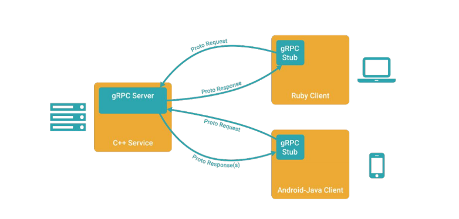

# GRPC

## Motivation for RPC systems

* Large-scale distributed systems actually composed of microservices.
* Communication predominantly structured as RPCs.

## gRPC Summary

* Multi-language, multi-platform framework.
    * Native implementation in C, Java and Go.
    * C stack wrapped by C++, C#, Node, ObjC, Python, Ruby, PHP.
    * Platforms supported: Linux, Android, iOS, MacOS, Windows.
* Transport over HTTP/2+ TLS.
    * Leverage existing network protocols and infrastructure.
    * Efficient use of TCP - 1 connection shared across concurrent framed streams.
    * Native support for secure bidirectional streaming.
* C/C++ implementation goals.
    * High throughput and scalability, low latency.
    * Minimal external dependencies.

## HTTP/2

### Using an HTTP/1.1 transport and its limitations

* Request-Response protocol
    * Each connection supports pipelining but not parallelism (in-order only).
    * Need multiple connections per client-server pair to avoid in-order stalls across multiple requests -> multiple CPU-intense TLS handshakes, higher memory footprint.
* Content may be compressed but headers are text format
* Natually supports single-direction streaming but not bidirectional

### HTTP/2 in a Nutshell

* One TCP connection for each client-server pair
* Request -> Stream
    * Streams are multiplexed using framing
* Compact binary framing layer
* Header compression
* Directly supports bidirectional streaming

### gRPC

* IDL describe service API.
* Automatically generates client stubs and abstract server classes in 10+ languages.
* Take advantage of feature set of HTTP/2.

### An Aside: Protocol Buffers

* Binary data representation.
* Structures can be extended and maintain backward compatibility.
* Code generators for many languages.
* Strongly typed.
* Not required for gRPC, but very handy.

### gRPC client/server architecture

