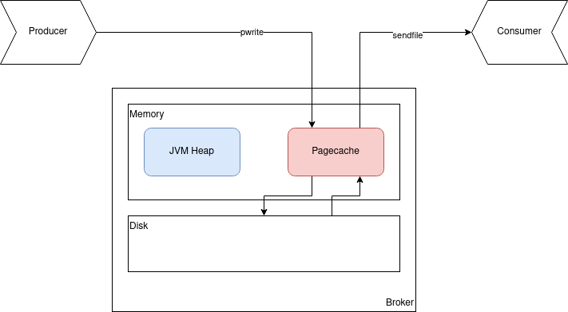

# Kafka Pagecache

Source:

- <https://cloud.tencent.com/developer/article/1488144>
- <https://lihuimintu.github.io/2021/08/11/kafka-pagecache/>
- <https://insights.thoughtworks.cn/apache-kafka/>

- Kafka relies heavily on the filesystem for storing and caching messages. All data is immediately written to a persistent log on the filesystem without necessarily flushing to disk. In effect this just means that it is transferred into the kernel’s [pagecache](https://en.wikipedia.org/wiki/Page_cache).
- Why doesn't Kafka manage cache itself instead of using the Pagecache?
  - Everything in JVM is an object, and the object storage of data will bring the so-called object overhead and waste space.
  - If the cache is managed by the JVM, it will be affected by the GC, and the excessively large heap will aslo drag down the efficiency of the GC and reduce the throughput.
  - Once the program crashes, all cached data managed by itself will be lost.
- How it works? Overview
  - When Producer sends a produce request -> the upper layer has a write operation -> OS just writes the data into the Pagecache and marks its property as Dirty.
  - When read operation occurs, it checks the Pagecache first. if a page fault occurs, the disk scheduling is performed, the required data is finally returned.

- How it works? Detail
  - Produce Request:
    - The I/O thread writes the data in the request to the Pagecache of the OS and returns immediately.
    - When the number of messages reaches a certain threshold, Kafka or OS kernel will trigger a fored flush operation.
  - Consume request:
    - Kafka sends a sendfile syscall to the OS.
    - OS first tries to obtain data from the Pagecache.
    - If data doesn't exist, it will trigger a page fault exception to read the data from the disk into the temporary buffer, and then copy the data to the network card buffer and wait for subsequent TCP transmissions (Data copy uses DMA operations to reduce copy times and context switches).
- If production rate == consumption rate -> the entire production-consumption process can be completed almost solely by reading and writing to the broker Pagecache.
- When Kafka persists messages to the partition files of each topic, it is written in an append-only sequence, which makes full of use of the fast sequential access of the disk and is highly efficient.

  

  - Kafka's file storage is stored according to the partition under the topic. Each partition has its own sequence file. The sequence of each partition isn't shared. The main division is based on the key of the message to determine which partition it falls on.
