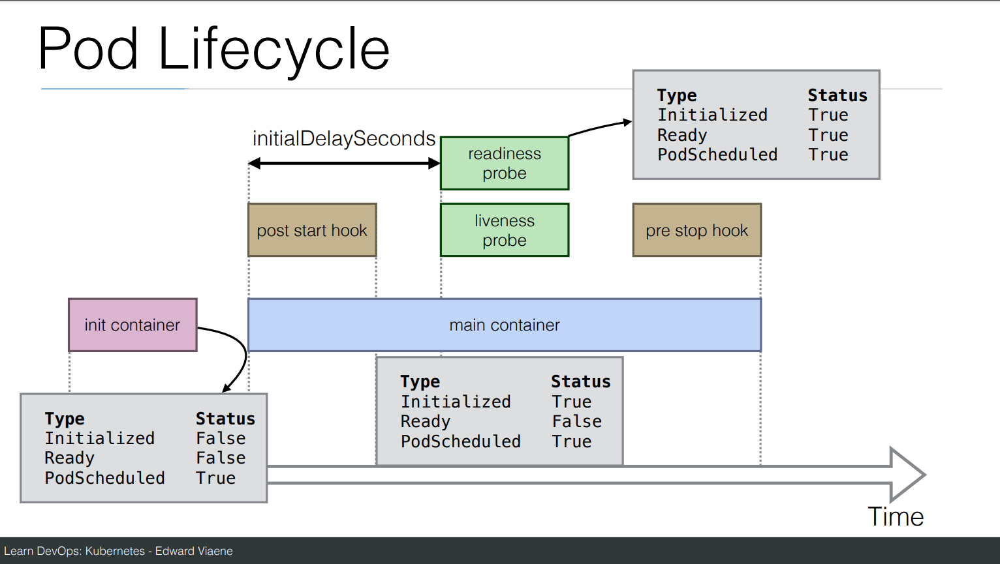
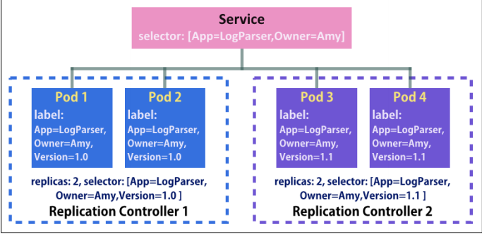
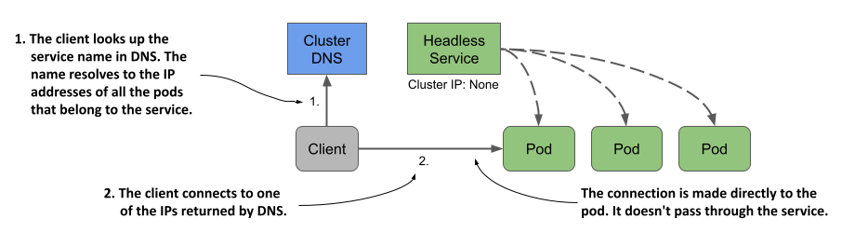
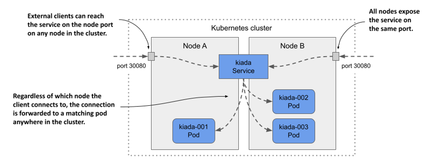
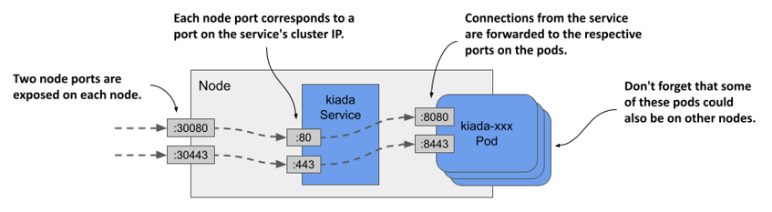
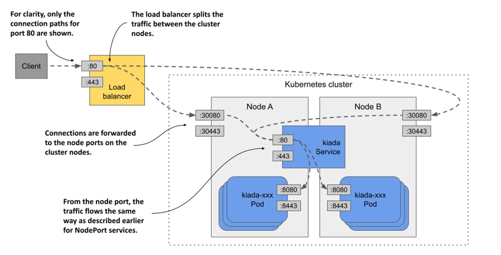
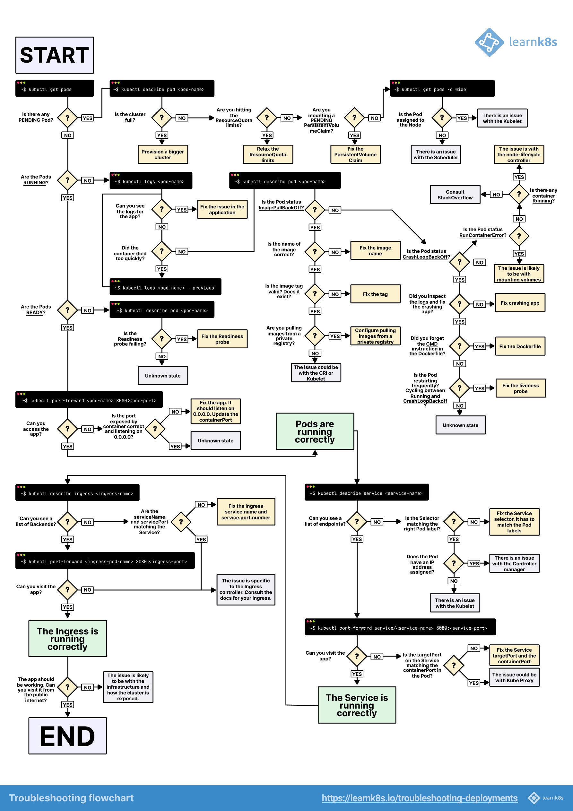

# Kubernetes

Table of Contents:

- [Kubernetes](#kubernetes)
  - [1. Introduction](#1-introduction)
  - [2. Architecture \& internals](#2-architecture--internals)
    - [2.1. Control plane](#21-control-plane)
    - [2.2. Workload plane](#22-workload-plane)
    - [2.3. Add-ons](#23-add-ons)
    - [2.4. Communications](#24-communications)
    - [2.5. How controllers cooperate](#25-how-controllers-cooperate)
    - [2.6. Kubernetes API](#26-kubernetes-api)
    - [2.7. Kubernetes Object](#27-kubernetes-object)
    - [2.8. How Kubernetes runs an application](#28-how-kubernetes-runs-an-application)
    - [2.9. Networking](#29-networking)
  - [3. Concepts](#3-concepts)
    - [3.1. Pods](#31-pods)
    - [3.2. Replication controller](#32-replication-controller)
    - [3.3. Replica Sets](#33-replica-sets)
    - [3.4. Deployment](#34-deployment)
    - [3.5. Service](#35-service)
    - [3.6. Label \& Selector](#36-label--selector)
    - [3.7. Persistent Volume](#37-persistent-volume)
    - [3.8. Secrets](#38-secrets)
    - [3.9. Namespaces](#39-namespaces)
    - [3.10. Ingress](#310-ingress)
    - [3.11. ConfigMap](#311-configmap)
    - [3.12. Liveness and Readiness](#312-liveness-and-readiness)
    - [3.13. Gateway](#313-gateway)
  - [4. Security](#4-security)
    - [4.1. Kubernetes API Server Control access](#41-kubernetes-api-server-control-access)
    - [4.2. Secure Pod and Container](#42-secure-pod-and-container)
  - [5. Troubleshooting Deployments](#5-troubleshooting-deployments)
    - [5.1. Recap](#51-recap)
    - [5.2. Troubleshooting](#52-troubleshooting)

## 1. Introduction

- Kubernetes, also known as K8s, is an open-source system for automating deployment, scaling, and management of containerized applications.
- Features:
  - Service discovery and load balancing
  - Storage orchestration
  - Automated rollouts and rollbacks
  - Automatic bin packing
  - Self-healing
  - Secret and configuration management
- Refs:
  - [100DaysOfKubernetes](https://devops.anaisurl.com/kubernetes)
  - [Kubernetes In Action 2nd Edition](https://www.manning.com/books/kubernetes-in-action-second-edition): This is a really good book for beginner. Access the MEAP [here](https://wangwei1237.github.io/Kubernetes-in-Action-Second-Edition), I take a lot of pictures from this site.
  - [LearnK8S](https://learnk8s.io)
  - [Kubernetes internal](https://github.com/shubheksha/kubernetes-internals)

## 2. Architecture & internals

- Cluster: a set of work machines - called `nodes`, that run containerized applications.
  - Workload Plane: Node hosts the Pods that are the components of the application workload.
  - Control plane: manages the work nodes and the Pods in the cluster. In the production environments, the control plane usually run across multiple hosts.


### 2.1. Control plane

- Features:
  - Authorization and authetication
  - RESTful API entry point
  - Container deployment scheduler to the Kubernetes nodes
  - Scaling and replicating the controller
  - Read and store the configuration
  - Command line interface
- `kube-api-server`: exposes the Kubernetes API.
  - The API is the front end for the Kubernetes control plane.
  - Kubernetes system components communicate only with the API server. API server is the only component that communicates with etcd.
  - Flow:

  ```bash
  kubectl -> HTTP POST request -> Authentication plugins -> Authorization plugins -> Admission control plugins -> Resource validation -> etcd
  ```

- `etcd`: Consistent and highly-available key-value store used as Kubernetes's backing store for all cluster data.
  - Explore the Kubernetes configuration and status in etcd:

  ```bash
  curl -L "http://10.0.0.1:2379/v2/keys/registry"
  ```

  - Kubernetes stores all its data in etcd under /registry.

  ```bash
  # Top-level entries stored in etcd
  etcdctl get /registry --prefix=true
  etcdctl get /registry/pods --prefix=true
  ```

- `kube-scheduler`: watches for newly created Pods with no assigned node, and selects a node for them to run on.
- `kube-controller-manager`: runs controller processes.
  - A controller is a control loop that watches the shared state of the cluster through the apiserver and makes changes attempting to move the current state towards the desired state.
  - Each controller is a separate process (logically).
  - Some types of these controller: Node controller, Job controller, Endpoints controller, Service account & token controllers.
- `cloud-controller-manager:` embeds cloud-specific control logic, links cluster into cloud provider's API, and separates out the components that interact with that cloud platform from components that only interact with cluster.


- Components of the Control plane can easily be split across multiple servers.
  - `api-server` and `etcd`: multiple instances + perform jobs in the parallel.
  - `scheduler` and `controller-manager`: only one instance active at a given time (active-standby).
- Components can be deployed on the system directly or they can run as pods.
- Useful commands:

```bash
kubectl get componentstatuses
```

### 2.2. Workload plane

- Features: Maintaining running pods and providing the Kubernetes runtime environment.
- `kubelet`:
  - The component responsible for everything running on a worker node.
  - Register the node it's running on by createing a Node resource in the API server.
  - Continuously monitor the API server for Pods that have been scheduled to the node, and start the pod's containers (via container runtime)
  - Monitor running containers and report their status, events, and resource consumption to the API server.
  - Running static pods without the API server: put the pod manifest into the Kubelet's manifest directory.
- `kube-proxy`: a network proxy, implementing part of the Kubernetes Service concept.
  - Maintain network rules on nodes. These network rules allow network communication to Pods from network sessions inside or outside of cluster.
  - Use the OS packet filtering layer if there is one and it's available (iptables...)
  - Forward traffic itself.
- `Container runtime`: [containerd](https://containerd.io/docs/), [CRI-O](https://cri-o.io/#what-is-cri-o), and any other implementation of the [Kubernets CRI](https://github.com/kubernetes/community/blob/master/contributors/devel/sig-node/container-runtime-interface.md).


### 2.3. Add-ons

- Check out [Add-ons](https://kubernetes.io/docs/concepts/cluster-administration/addons/).

### 2.4. Communications

- Node to control plane:
  - "hub-and-spoke" API pattern.
  - All API usage from nodes (or the pods they run) terminates at the API server.
  - Secure.
- Control plane to node:
  - API server to kubelet:
    - Connections: fetching logs, attaching to running pods, providing the kubelet's port-fowarding.
    - HTTPS - unsafe, API server doesn't verify kubelet's serving certificate.
  - API server to nodes, pods, and services:
    - Plain HTTP connections.
  - SSH tunnels: to protect the control plane to nodes communication paths.

### 2.5. How controllers cooperate

- The controllers, the Scheduler, and the Kubelet are watching the API server for changes to their respective resource types.
- Flow:
  - kubectl send **Create Deployment resource** request to API server Deployments endpoint.
  - Controller Manager - Deployment controller gets notification through watch API server, then sends **Create ReplicaSet** request to API server ReplicaSets endpoint.
  - ReplicaSet controller gets notification through watch API server, then sends **Create Pod** request to API server Pods endpoint.
  - Scheduler gets notification through watch API server, then assigns pod to node.
  - Kubelet gets notification through watch API server, creates containers.

### 2.6. Kubernetes API

- Both user and Kubernetes components interact with the cluster by manipulating objects through the Kubenetes APIs.


- HTTP-based RESTFul API where the state is represented by **resources** on which you perform CRUD operations.
- Each **resource** is assigned a URI that uniquely identifies.
- E.g. **deployment** resource. The collection of all deployments in the cluster is a REST resource exposed at `/api/v1/deployments`.


- Kubernetes **objects** are persistent entities in the Kubernetes system.
  - Objects are used to represent the state of your cluster
  - Object is a "record of intent" - once you create the object, the Kubernetes system will constantly work to ensure that object exists.
  - An object can therefore be exposed through more than one resources.
  - Objects are represented in structured text form (JSON/YAML).
  - Almost every Kubernetes object includes two nested object fields that govern the object's configuration: the object `spec` and the object `status`.


- Controllers manage the objects. Each controller is usually only responsible for one object type. For example, the Deployment controller manages Deployment objects.
  - The task of a controller is to read the desired object state from the the object's Spec section
  - Perform the actions required to achieve this state
  - Report back the actual state of the object by writing to its Status section


- As controllers perform their task of reconciling the actual state of an object with the desired state, as specified in the object’s spec field, they generate events to reveal what they have done. Two types of events exist: Nomarl and Warning.
  - Events are represented by Event objects.
  - Each Event object is deleted one hour after its creation to reduce the burden on etcd.

```bash
# Listing events
kubectl get ev
# -o wide: display additional information
kubectl get ev -o wide
# Filter only Warning events
kubectl get ev --field-selector type=Warning
```


### 2.7. Kubernetes Object

- Like mentioned before, Objects are persistent entities in the Kubernetes system. But how to manage objects?
- The `kubectl` command-line tool supports several different ways to create and manage Kubernetes objects.

| Management technique             | Operates on          | Recommended environment | Supported writers | Learning curve |
| -------------------------------- | -------------------- | ----------------------- | ----------------- | -------------- |
| Imperative commands              | Live objects         | Development projects    | 1+                | Lowest         |
| Imperative object configuration  | Individual files     | Production projects     | 1                 | Moderate       |
| Declarative object configuration | Directories of files | Production projects     | 1+                | Highest        |

- **Imperative commands**:
  - User operates directly on live objects in a cluster.
  - The recommended way to get started or to run a one-off task in a cluster.
  - Example:

  ```shell
  kubectl create deployment nginx --image nginx
  ```

  - Advantages compared to object configuration:
    - Commands are expressed as a single action word.
    - Commands require only a single step to make changes to the cluster.
  - Disadvantages compared to object configuration:
    - Commands do not integrate with change review processes.
    - Commands do not provide an audit trail associated with changes.
    - Commands do not provide a source of records except for what is live.
    - Commands do not provide a template for creating new objects.

- **Imperative object configuration**:
  - `kubectl` command specifies the operation (create, replace, etc.), optional flags and at least one file name.
  - Example:

  ```shell
  kubectl create -f nginx.yaml
  kubectl delete -f nginx.yaml -f redis.yaml
  ```

  - Advantages compared to imperative commands:
    - Object configuration can be stored in a source control system such as Git.
    - Object configuration can integrate with processes such as reviewing changes before push and audit trails.
    - Object configuration provides a template for creating new objects.
  - Disadvantages compared to imperative commands:
    - Object configuration requires basic understanding of the object schema.
    - Object configuration requires the additional step of writing a YAML file.
  - Advantages compared to declarative object configuration:
    - Imperative object configuration behavior is simpler and easier to understand.
    - As of Kubernetes version 1.5, imperative object configuration is more mature.
  - Disadvantages compared to declarative object configuration:
    - Imperative object configuration works best on files, not directories.
    - Updates to live objects must be reflected in configuration files, or they will be lost during the next replacement.

- **Declarative object configuration**:
  - User operates on object configuration files stored locally, however the user doesn't define the operations to be taken on the files. Create, update, and delete operations are automatically detected per-object by `kubectl`. This enables working on directories, where different operations might be needed for different objects.
  - Example:

  ```shell
  kubectl diff -R -f configs/
  kubectl apply -R -f configs/
  ```

  - Advantages compared to imperative object configuration:
    - Changes made directly to live objects are retained, even if they are not merged back into the configuration files.
    - Declarative object configuration has better support for operating on directories and automatically detecting operation types (create, patch, delete) per-object.
  - Disadvantages compared to imperative object configuration:
    - Declarative object configuration is harder to debug and understand results when they are unexpected.
    - Partial updates using diffs create complex merge and patch operations.
  - There are two types:
    - [Declarative Management of Kubernetes Objects using configuration files](https://kubernetes.io/docs/tasks/manage-kubernetes-objects/declarative-config/).
    - [Declarative Management of Kubernetes Objects Using Kustomize](https://kubernetes.io/docs/tasks/manage-kubernetes-objects/kustomization/).

### 2.8. How Kubernetes runs an application

- Define application: Everything in Kubernetes is represented by an object. These objects are usually defined in one or more manifest files in either YAML or JSON format.
- Actions:
  - Submit the application manifest to Kubernetes API. API Server writes the objects defined in the manifest to etd.
  - Controller notices the newly created objects and creates several new objects - one for each application instance.
  - Scheduler assigns a node to each instance.
  - Kubelet notices that an instance is assigned to the Kubelet's node. It runs the application instance via the Container runtime.
  - Kube-proxy notices that the application instances are ready to accept connections from clients and configures a LB for them.
  - Kublets and the Controllers monitor the system and keep the applications running.


### 2.9. Networking


- Each pods gets its own unique IP address and can communicate with all other pods through a flat, NAT-less network.
- The network is set up by the system administrator or by a Container Network Interface (CNI) plugin, not by Kubernetes itself.
- For example, CNI Flannel:
  - Read more [here](https://chunqi.li/2015/10/10/Flannel-for-Docker-Overlay-Network/)
  - Network communicate - multihost.
  - Flannel also uses etcd to configure the settings and store the status.

  ```bash
  curl -L "http://10.0.0.1:2379/v2/keys/coreos.com/network/config"
  ```


## 3. Concepts

### 3.1. Pods

- The **Pod** is a group of 1 or more containers and the smallest deployable unit
  in Kubernetes. Pods are always co-located and co-scheduled and run in a
  shared context. Each pod is isolated by the following Linux namespaces:
  - PID namespace
  - Network namespace
  - Interprocess Commnunication (IPC) namespace
  - Unix Time Sharing (UTS) namespace
- **Pod State**:
  - Pods have a status field (`kubectl get pods`).
  - Valid statuses:
    - **running**: pods has been bound to a node + all containers have been created +\_ at least one container is still running/starting/restarting.
    - **pending**: pods has been accepted but is not running.
    - **succeeded**: all containers within this pod have been terminated successfully and will not be restarted.
    - **failed**: all containers within this pod have been Terminated + at least one container returned a failure code.
    - **unknown**: network error might have been occurred.
  - Check using `kubectl describe pod <podname>`.


- **Pod conditions**:


- **Pod Lifecycle**:



### 3.2. Replication controller

- A term for API objects in Kubernetes that refers to pod replicas.
- To be able to control a set of pod's behaviors.
- Ensures that the pods, in a user-specified number, are running all the time. If some pods in the replication controller crash and terminate, the system will recreate pods with the original configurations on healthy nodes automactically, and keep a certain amount of processes continously running.
- This concept is outdated. Kubernetes official documentation recommends: A **Deployment** that configures a ReplicaSet is now the recommended way to set up replication.

### 3.3. Replica Sets

- **Replica Set** is the next-generation Replication Controller. The only between them right now is the selector support.
- It supports a new selector that can do selection based on **filtering** according a **set of values**, whereas a RC only supports equality-based selector requirements.
  - e.g "environment" either "dev" or "qa".
  - not only based on equality, like the Replication Controller
    - e.g. "environment" == "dev"
- This **Replica Set**, rather than the Replication Controller, is used by the Deployment object.

### 3.4. Deployment

- A deployment declaration allows you to do app **deployments** and **updates**.
- Deployments are intented to replace Replication Controllers.
- When using the deployment object, define the **state** of your application.
  - Kubernetes will then make sure the clusters matches your **desired** state.
- With a deployment object:
  - **Create** a deployment
  - **Update** a deployment
  - Do **rolling updates**: `rolling-update` command works with Replication Controllers, but won't work with Replica Set. This is because RS are meant to be used as the backend for Deployments.
  - **Roll back** to a previous version
  - **Pause/Resume** a deployment
- Example:

```yaml
apiVersion: extensions/v1beta1
kind: Deployment
metadata:
  name: helloworld-deployment
spec:
  replicas: 3
  template:
  metadata:
  labels:
  app: helloworld
  spec:
  containers:
    - name: k8s-demo
  image: wardviaene/k8s-demo
  ports:
    - containerPort: 3000
```

### 3.5. Service

- **Pods** are very **dynamic**, they come and go on the Kubernetes cluster.
  - When using a **Replication Controller**, pods are **terminated** and created during scaling operations.
  - When using **Deployments**, when **updating** the image version, pods are **terminated** and new pods take the place of older posts.
- That's why Pods should never be accessed directly, but always through a **Service**.
- It is an abstraction which defines a logical set of Pods and a policy by which to access them - sometimes called a micro-service. A service is the **logical service** between the "mortal" pods and other **services** or **end-users**.
- Use `kubectl expose` command.
- The set of Pods targeted by a **Service** is (usually) determined by Label Selector.
  - **ClusterIP**: Exposes the service on a cluster-internal IP. A virtual IP address only reachable from within the cluster (_default_).
  - **NodePort**: Exposes the service on each Node's IP at a static port. A porta that is the same on each node that is also reachable externally.
  - **LoadBalancer**: Exposes the service externally using a cloud provider's load balancer. A LoadBalancer created by the cloud provider that route external traffic to every node on the NodePort (ELB on AWS for example)
  - **ExternalName**: Maps the service to the contents of the externalName. This only works when **DNS add-on** is enabled.



- Example:

```yaml
apiVersion: v1
kind: Service
metadata:
  name: helloworld-service
spec:
  ports:
    - port: 31001 # By default service can only run between ports 30000-32767 -> change by adding the --service-node-port-range= argument to the kube-apiserver
      nodePort: 31001
      targetPort: nodejs-port
  protocol: TCP
  selector:
  app: helloworld
  type: NodePort
```

- Headless Service:
  - Sometimes you don't need load-balancing and a single Service IP. In this case, you can create what are termed _headless service_, by explicitly specifying `"None"` for the cluster IP address (`.spec.clusterIP`).
  - For headless Services, a cluster IP is not allocated. kube-proxy does not handle these Services, and there is no load balancing or proxying done by the platform for them. The cluster DNS returns not just a single `A` record pointing to the service's cluster IP, but multiple `A` records, one for each pod that's part of the service. Clients can there fore query the DNS to get the IPs of all the pods in the service.
  - A headless Service allows a client to connect to whichever Pod it prefers, directly.

  

- Expose services externally:
  - ClusterIP services are only accessible within the cluster.
  - If you need to make a service available to the outside world, you can do one of the following:
    - ~Assign an additional IP to a node and set it as one of the service's `externalIP`~.
    - Set the service's type to `NodePort` and access the service through the node's port(s).
      - Kubernetes makes the service avaiable on a network port on all cluster nodes. Because the port is open on the nodes, it's called a node port.
      - Expose pods through a NodePort service:

      
      - Expose multiple ports through with a NodePort service:

      

    - Ask Kubernetes to provision a LoadBalancer by setting the type to `LoadBalancer`.
      - The LoadBalancer stands in front of the nodes and handles the connections coming from the clients. It routes each connection to the service by forwarding it to the node port on one of the nodes.
      - The `LoadBalancer` service type is an extenstion of the `NodePort` type, which makes the service accessible through these node ports.
      - Expose a LoadBalancer service.

      

    - Expose the service through an Ingress object.

### 3.6. Label & Selector

- Labels are a set of key/value pairs, which are attached to object metadata.
  - Labels are like **tags** in AWS or other cloud providers, used to tag resources.
- Use **labels** to select, organize and group **objects**, for instance your pod, following an organizational structure:
  - Key: environment - Value: dev/staging/qa/prod
  - Key: department - Value: engineering/marketing

```yaml
metadata:
  name: nodehelloworld.example.com
  labels:
    environment: staging
```

- Unlike name and UIDs, labels don't provide identify a set of objects. Via a **label selector**, the client/user can identify a set of objects. The label selector is the core grouping primitive in Kubernetes.
- 2 types of selector: equality-based and set-based.
- You can also use labels to tag **nodes** -> use **label selectors** to let pods only run on specific nodes.
  - **Tag** the node.
  - Add a **nodeSelector** to your pod configuration.

```bash
kubectl label nodes node1 hardware=high-spec
```

```yaml
apiVersion: v1
kind: Pod
metadata:
  name: nodehelloworld.example.com
  labels:
    app: helloworld
spec:
  containers:
    - name: k8s-demo
      image: wardviaene/k8s-demo
      ports:
        - containerPort: 3000
  nodeSelector:
  hardware: high-spec
```

### 3.7. Persistent Volume

- Volume lives with a pod across container restarts.
- It supports the following different types of network disks:
  - emptyDir
  - hostPath
  - nfs
  - iscsi
  - flocker
  - glusterfs
  - rbd
  - gitRepo
  - awsElasticBlockStore
  - gcePersistentDisk
  - secret
  - downwardAPI
- A **PersistentVolume** object represents a storage volume available in the clsuter that can be used to persist application data.
- A pod transitively references a persistent volume and its underlying storage by referring to a **PersistentVolumeClaim** object that references the **PersistentVolume** object, which then references the underlying storage. This allows the ownership of the persistent volume to be decoupled from the lifecyle of the pod.
  - A **PersistentVolumeClaim** represents a user's claim on the persistent volume.

  

- Benefits of using persistent volumes and claims:
  - The infrastructure-specific details are now decoupled from the application represents by the pod.
- Example:
  - Create PersistentVolume:

  ```yaml
  apiVersion: v1
  kind: PersistentVolume
  metadata:
    name: mongodb-pv # The name of persistent volume
  spec:
    capacity: # The storage capacity of this volume
      storage: 1Gi
    accessModes: # Whether a single node or many nodes can access this volume in read/write or read-only mode.
      - ReadWriteOnce
      - ReadOnlyMany
    gcePersistentDisk: #This persistent volume uses the GCE Persistent Disk
      pdName: mongodb
      fsType: ext4
    # hostPath: # Local directory on the host node
    #   path: /tmp/mongodb
  ```

  ```bash
  kubectl get pv
  ```

  - Create PersistentVolumeClaim:

  ```yaml
  apiVersion: v1
  kind: PersistentVolumeClaim
  metadata:
    name: mongodb-pvc # This name of this claim
  spec:
    resources:
      requests: # The volume must provide at least 1GiB of storage space
        storage: 1Gi
    accessModes: # The volume must support mounting by a single node for both reading and writing
      - ReadWriteOnce
    storageClassName: "" # Empty to disable dynamic provisioning
  ```

  ```bash
  kubectl get pvc
  ```

  - Use a persistent volume in a pod

  ```yaml
  apiVersion: v1
  kind: Pod
  metadata:
    name: mongodb
  spec:
    volumes:
      - name: mongodb-data # The internal name of the volume
        persistentVolumeClaim: # The volume points to a PersistentVolumeClaim named mongodb-pvc
          claimName: mongodb-pvc
    containers:
      - image: mongo
        name: mongodb
        volumeMounts: # The volume is mounted
          - name: mongodb-data
            mountPath: /data/db
  ```

- The lifecycle of manually provisioned persistent volumes and claims:


- Dynamic provisioning of persistent volumes: instead of provisioning persistent volumes in advance (and manually), the cluster admin deploys a persistent volume provisioner to automate the just-in-time provisioning process.
  - A **StorageClass** object represents a class of storage that can be dynamically provisioned.


```bash
kubectl get sc
```

```yaml
apiVersion: storage.k8s.io/v1
kind: StorageClass
metadata:
  annotations:
    storageclass.kubernetes.io/is-default-class: "true" # This marks the storage class as default
  name: standard # The name of storage class
# ...
provisioner: rancher.io/local-path # The name of provisioner that gets called to provision persistent volumes of this class
reclaimPolicy: Delete # The reclaim policy for persistent volumes of this class
volumeBindingMode: WaitForFirstConsumer # How volumes of this class are provisioned and bound
```

### 3.8. Secrets

- Secrets provides a way in Kubernetes to distribute **sensitive data** to the pods.
- There are still other ways container can get its secrets: using an external vault services.
- Secrets can be used:
  - As environment variables.
  - As a file in a pod (via volumes).
  - External image to pull secrets.
- Generate secrets:
  - Using files.

  ```bash
  echo -n "root" > ./username.txt
  echo -n "password" > ./password.txt
  kubectl create secret generic db-user-pass --from-file=./username.txt —from-file=./password.txt secret "db-user-pass" created
  # SSH key
  kubectl create secret generic ssl-certificate --from-file=ssh-privatekey=~/.ssh/id_rsa --ssl-cert-=ssl-cert=mysslcert.crt
  ```

  - Using yaml definitions.

  ```yaml
  apiVersion: v1
  kind: Secret
  metadata:
    name: db-secret
  type: Opaque
  data:
    password: cm9vdA== # echo -n 'root' | base64
    username: cGFzc3dvcmQ= # echo -n "password" | base64
  ```

  ```bash
  kubectl create -f secrets-db-secret.yml
  ```

- Kubernetes Secrets are, by default, stored unencrypted in the API server's underlying data store (etcd). Anyone with API access can retrieve or modify a Secret, and so can anyone with access to etcd. Additionally, anyone who is authorized to create a Pod in a namespace can use that access to read any Secret in that namespace; this includes indirect access such as the ability to create a Deployment.
  - [Enable Encryption at Rest](https://kubernetes.io/docs/tasks/administer-cluster/encrypt-data/) for Secrest.
    - Generate encryption keys: Create strong encryption keys using a secure method. Algorithms like AES-GCM are recommended for both confidentiality and integrity.

    ```shell
    # Linux
    # Generate a 32-byte random key and base64 encode it.
    # Keep the encryption key confidential, including while you generate it and ideally even after you are no longer actively using it.
    head -c 32 /dev/urandom | base64
    ```

    - Create encryption configuration file: Configure the Kubernetes API server by creating encryption configuration file. This file specifies the resources to encrypt (like `secrets`), the encryption providres (e.g., `aescbc`), and they keys used for encryption.

    ```yaml
    ---
    apiVersion: apiserver.config.k8s.io/v1
    kind: EncryptionConfiguration
    resources:
    - resources:
        - secrets
        - configmaps
        - pandas.awesome.bears.example
        providers:
        - aescbc:
            keys:
                - name: key1
                # See the following text for more details about the secret value
                secret: <BASE 64 ENCODED SECRET>
        - identity: {} # this fallback allows reading unencrypted secrets;
                        # for example, during initial migration
    ```

    - Use the new encryption configuration file: You will need to mount the new encryption config file to the kube-apiserver static pod.

  - [Enable or configure RBAC rules](https://kubernetes.io/docs/reference/access-authn-authz/authorization/) with least-privilege access to Secrets.
  - Restrict Secret access to specific containers.
  - [Consider using external Secret store providers](https://secrets-store-csi-driver.sigs.k8s.io/concepts.html#provider-for-the-secrets-store-csi-driver).

### 3.9. Namespaces

- The name of a resource is a unique identifier with a namespace in the Kubernetes cluster. Using a Kubernetes namepsace could isolate namespaces for different environments in the same cluster.


- Pods, services, replication controllers (replica sets) are contained in a certain namespace. Some resources, such as nodes and PVs, do not belong to any namespace.


- Some useful commands:

```bash
# Listing namespaces
kubectl get namespaces
# Listing objects in a specific namespace
kubectl get po --namespace kube-system
# Listing objects across all namespaces
kubectl get cm --all-namespaces
# Creating a namespace
kubectl create namespace ns-test1
# Creating a namespace from a manifest file
cat <<EOF > ns-test2.yaml
apiVersion: v1
kind: Namespace
metadata:
  name: ns-test2
EOF
kubectl apply -f ns-test2.yaml
```

- Understanding the (lack of) isolation between namespaces:
  - When two pods created in different namespaces are scheduled to the same cluster node, they both run in the same OS kernel -> an application that break out of its container or consumes too much of the node's resources can ffect the operation of the other application.

  
  - Kubernetes doesn't provide network isolation between applications running in pods in different namespaces (by default) -> Can use the NetworkPolicy object to configure which applications in which namespaces can connect to which applications in other namespaces.
  - Should not use namespaces to split a single physical cluster into production, staging, and development environments.

### 3.10. Ingress

- Typically, services and pods have IPs only routable by the cluster network.

```
  internet
    |
----------
[ Services ]
```

- An Ingress is a collection of rules that allow **inbound connections** to reach the cluster services.

```
  internet
    |
[ Ingress ]
---|---|---
[ Services ]
```

- It's an alternative to the exernal **LoadBalancer** and **NodePort**:
  - Ingress allows you to **easily expose services** that need to be accessible from **outside** to the **cluster**.
- With ingress you can run your own **Ingress Controller** (basically a load balancer) within the Kubernetes cluster. There are a default ingress controller avaiable, or you can write your own ingress controller.
- For example, Nginx Ingress Controller.


- It can be configured to give services externally-reachable URLs, load balance traffic, terminate SSL... User request ingress by POSTing the Ingress resource to the API server.
- Read [more](https://medium.com/@cashisclay/kubernetes-ingress-82aa960f658e).
- Example:

```yaml
apiVersion: extensions/v1beta1
kind: Ingress
metadata:
  name: helloworld-rules
spec:
  rules:
    - host: helloworld-v1.example.com
      http:
        paths:
          - path: /
            backend:
              serviceName: helloworld-v1
              servicePort: 80
    - host: helloworld-v2.example.com
      http:
        paths:
          - path: /
            backend:
              serviceName: helloworld-v2
              servicePort: 80
```

- ClusterIP, NodePort, LoadBalancer or Ingress? The full article [here](https://medium.com/google-cloud/kubernetes-nodeport-vs-loadbalancer-vs-ingress-when-should-i-use-what-922f010849e0).

| Type                      | Uses                                                                                                                                         |
| ------------------------- | -------------------------------------------------------------------------------------------------------------------------------------------- |
| ClusterIP - kubectl proxy | Debug your services, or connecting to them direclty from laptop for some reason. Allowing internal traffic, display internal dashboard, etc. |
| NodePort                  | Many downsides: can only one service/port, only use ports in range 30000-32767, deal with Node/VM IP changes...                              |
| LoadBalancer              | No filtering, no routing, etc. Can use Need a LoadBalancer per exposed service -> can get expensive                                          |
| Ingress                   | There are many types of Ingress controllers. Use L7 protocol.                                                                                |

### 3.11. ConfigMap

- Configuration parameters that are not secret -> put in **ConfigMap**.
- The **ConfigMap** key-value pairs can then be read by the app using:
  - **Environment** variables.
  - **Container commandline arguments** in the Pod configuration.
  - Using **volumes**.
- To generate configmap using files:

```bash
cat <<EOF > app.properties
driver=jdbc
database=postgres
lookandfeel=1
otherparams=xyz
param.with.hierarchy=xyz
EOF

kubectl create configmap app-config —from-file=app.properties
```

```yaml
apiVersion: v1
kind: Pod
metadata:
  name: nodehelloworld.example.com
  labels:
    app: helloworld
spec:
  containers:
    - name: k8s-demo
      image: wardviaene/k8s-demo
      ports:
        - containerPort: 3000
      volumeMounts:
        - name: config-volume
          mountPath: /etc/config # /etc/config/driver /etc/config/param/with/hierachy
  volumes:
    - name: config-volume
      configMap:
        name: app-config
```

### 3.12. Liveness and Readiness

- The kubelet uses liveness probes to know when to restart a container - answer the true-or-false question: "Is this container alive?"
  - If you don't specify a liveness probe, kublet will decide whether to restart the container based on the status of the container's PID 1 process.
- The kubelet uses readiness to know when a container is ready to start accepting traffic. A Pod is considered ready when all of its containers are ready. One use of this signal is to control which Pods are used as backends for Services. When a Pod is not ready, it is removed from Service load balancers.
  - If you don't specify a readiness probe, OpenShift will assume that the container is ready to receive traffic as soon as PID 1 has started. This is never what you want.
- The kubelet uses startup probes to know when a container application has started. If such a probe is configured, it disables liveness and readiness checks until it succeeds, making sure those probes don't interfere with the application startup. This can be used to adopt liveness checks on slow stasrting containers, avoiding them getting killed by the kubelet before they are up and running.
- Check [RedHat's blog](https://developers.redhat.com/blog/2020/11/10/you-probably-need-liveness-and-readiness-probes#example_2__a_jobs_server__no_rest_api_)

### 3.13. Gateway

- The [Gateway API](https://gateway-api.sigs.k8s.io/) is an official Kubernetes project, representing the next generation of APIs for ingress, load balancing and potentially even service mesh interactions. It provides a unified specification for configuring network traffic routing, aiming to be expressive, extensible and aligned with the different roles involved in managing Kubernetes infrastructure and applications.
- The limitations of Ingress:
  - Kubernetes Ingress defines rules for exposing HTTP and HTTPS services running within the cluster to external clients. It typically relies on an Ingress controller, a separate piece of software running in the cluster that watches Ingress resources and configures an underlying load balancer or proxy accordingly. While simple path and host-based routing work well with Ingress, its core specification is limited (header-based routing, traffic splitting for canary releases, ...).
  - The single Ingress resource often blurs the lines of responsibility between infrastructure operators and application developers, potentially leading to configuration conflicts or overly broad permissions.
- Resource model:
  - The primary resources are GatewayClass (cluster-scoped), Gateway, and various Route types (HTTPRoute, TCPRoute or GRPCRoute).
    - GatewayClass manages Gateways of this class.
    - Gateway requests a specific traffic entrypoint, like a load balancer IP address, based on a GatewayClass.
    - Route resources contain the specific rules for how traffic arriving at a Gateway listener should be mapped to backend Kubernetes services.
  - This layered approach allows platform team to manage the underlying infrastructure (GatewayClass, Gateway) and set policies. In contrast, application teams can independently manage the routing logic specific to their services (Route resources) within the established boundaries.

## 4. Security

### 4.1. Kubernetes API Server Control access

- API server can be configured with one or more authentication plugins (and the same is true for authorization plugins).


- An authentication plugin returns the username and group(s) of the authenticated user.
- Kubernetes distinguishes between 2 kinds of clients connecting to the API server.
  - Actual human (users): be managed by an external system.
  - Pods: mechanism called _service account_ - created and stored in **ServiceAcount** resources.
- Built-in groups:
  - _system:unauthenticated_: unauthenticated user.
  - _system:authenticated_: user was authenticated successfully -> assign
  - _system:serviceaccounts_: all ServiceAccounts in the system.
  - _system:serviceaccounts:\<namespace\>_: includes all ServiceAccounts in a specific namespace.
- ServiceAccounts:
  - Every Pod is associated with a ServiceAccount, which represents the identity of the app running in the pod.
  - Token file: `/var/run/secrets/kubernetes.io/serviceaccount/token`.
  - ServiceAccount's username: _system:serviceaccount:\<namespace\>:\<service account name\>_
  - A default ServiceAccount is automatically created for each namespace. A pod can only use a ServiceAccount from the same namespace, if not assign use default ServiceAccount.

  ```bash
  kubectl get sa
  kubectl create sa foo
  # Inspecting a ServiceAccount
  kubectl describe sa foo
  # Inspecting the custom ServiceAccount's Secret - get from the above command
  kubectl describe secret foo-token-asd7s
  ```

  - Use ServiceAccount to enforce mountable Secrets or to provide image pull Secrets through the ServiceAccount.

- Authorization plugin - Role-based access control:
  - Use user roles as the key factor in determining whether the user may perform the action or not. A subject is associated with one or more roles and each role is allowed to perform certain verbs on certain resources.
  - RBAC authorization rules are configured through 4 resources, which can be grouped into 2 groups:
    - **Role** and **ClusterRoles**, which specify which verbs can be performed on which resources.
    - **RoleBinding** and **ClusterRoleBinding**, which bind the above roles to specific users, groups, or ServiceAccounts.
  - Roles grant permissions, whereas RoleBindings bind Roles to subjects.
  - RoleBindings and Roles are namespaced; ClusterRoles and ClusterRoleBindings aren't.

  
  - Create **Role**.

  ```yaml
  apiVersion: rbac.authorization.k8s.io/v1
  kind: Role
  metadata:
    namespace: foo
    name: service-reader
  rules:
    - apiGroups: [""] # "" indicates the core API group
      resources: ["services"]
      verbs: ["get", "list"]
  ```

  ```bash
  kubectl create -f service-reader.yaml -n foo # foo namespace
  kubectl create role service-reader --verb=get --verb=list --resource=services -n bar # bar namespace
  ```

  - Bind a **Role** to a **ServiceAccount**.

  ```bash
  kubectl create rolebinding test --role=service-reader --serviceaccount=foo:deafult -n foo
  ```

  ```
  ServiceAccount:default --> RoleBinding: test --> Role: service-reader --get,list-> Services
  ```

  - A **ClusterRole** is a cluster-level resource for allowing access to non-namespaced resources or non-resource URLs or used as a common role to be bound inside individual namespace.

  ```bash
  kubectl create clusterrole pv-reader --verb=get,list --resource=persistentvolumes
  ```

  - A **ClusterRole** and **ClusterRoleBinding** must be used to grant access to cluster-level resources.

  ```bash
  kubectl create clusterrolebinding pv=test --clusterrole=pv-reader --serviceaccount=foo:default
  # List all ClusterRoleBindings and ClusterRoles
  kubectl get clusterrolebindings
  kubectl get clusterroles
  ```

### 4.2. Secure Pod and Container

- Each pod has its own network namespace, but certain pods (usually system pods) might need to operate in the host's default namespaces, allowing them to see and manipulate node-level resources and devices -> use `hostNetwrok` property in the pod spec.

```yaml
apiVersion: v1
kind: Pod
metadata:
  name: pod-with-host-network
spec:
  hostNetwork: true
  containers:
    - name: main
      image: alpine
      command: ["/bin/sleep", "9999999"]
```

```bash
kubectl exec pod-with-host-network ifconfig
```

- Binding to a host port without using the host's network namespace.
  - **NodePort** vs **hostPort**: **hostPort** a connection to the node's port is forwarded directly to the pod running on that node, whereas with a Nodeport service, a connection to the node's port is forwarded to a randomly selected pod.

  

  
  - Only one instance of the pod can be scheduled to each node.

- Container's security context.

```yaml
apiVersion: v1
kind: Pod
metadata:
  name: pod-run-security-context
spec:
  containers:
    - name: main
      image: alpine
      command: ["/bin/sleep", "999999"]
      securityContext:
        runAsNonRoot: true # run as non Root
        runAsUser: 405 # Run guestUser
        privileged: true # privileged mode - use protected system devices or other kernel features
        capabilities: # more fine-grained permission system through kernel capabilities
          add:
            - SYS_TIME
          drop:
            - CHOWN # not allow this container to change file ownership
        readOnlyRootFileSystem: true # prevent processes from writing to the container's filesystem
```

- Security-related features in pods:
  - **PodSecurityPolicy** is a cluster-level resource, which defines what security-related features users can or can't use in their pods.
  - **PodSecurityPolicy** resource defines things:
    - Whether a pod can use the host's IPC, PID, or Network namespaces.
    - Which host ports a pod can bind to.
    - What user IDs a container can run as.
    - Whether a pod with privileged containers can be created.
    - Which kernel capabilities are allowed/added/dropped.
    - What SELinux labels a container can use.
    - Whether a container can use a writable root filesystem or not.
    - Which filesystem groups the container can run as.
    - Which volume types a pod can use.

    ```yaml
    apiVersion: extensions/v1betav1
    kind: PodSecurityPolicy
    spec:
      allowCapabilities:
        - SYS_TIME
      defaultAddCapabilities:
        - CHOWN
      # ...
    ```

- Isolate the pod network:
  - How the network between pods can be secured by limiting which pods can talk to which pods -> depends on which container networking plugin is used in the cluster -> If plugin supports it, configure network isolation with **NetworkPolicy** resources.

  - Deny all:

  ```yaml
  apiVersion: networking.k8s.io/v1
  kind: NetworkPolicy
  metadata:
    name: default-deny
  spec:
    podSelector: # empty pod selector matches all pods in the same namespace
  ```

  - Allow only some pods in the namespace to connect to a server pod.

  ```yaml
  apiVersion: networking.k8s.io/v1
  kind: NetworkPolicy
  metadata:
    name: db-policy
  spec:
    podSelector:
      matchLabels:
        app: database # secure access to pods with app=database label
    ingress:
      - from:
          - podSelector: # It allows incoming connections only from pods with app=webserver label
              matchLabels:
                app: webserver
        ports:
          - port: 5432
  ```

  - Isolate the network between Kubernetes namespace.
  - Isolate using CIDR notation.

## 5. Troubleshooting Deployments

Source:

- <https://learnk8s.io/troubleshooting-deployments>
- <https://komodor.com/learn/kubernetes-troubleshooting-the-complete-guide/>

**TL;DR**:



### 5.1. Recap

- For who run directly to this section. If you already knew those fundamentals, skip to 5.2.
- Components:
  - A **Deployment** — which is a recipe for creating copies of your application.
  - A **Service** — an internal load balancer that routes the traffic to Pods.
  - An **Ingress** — a description of how the traffic should flow from outside the cluster to your Service.


- Connecting Deployment and Service:
  - The Service selector should match at least one Pod's label
  - The Service's `targetPort` should match the `containerPort` of the Pod
  - The Service `port` can by any number. Multiple Services can use the same port because they have different IP addresses assigned.

  

  ```yaml
  apiVersion: apps/v1
  kind: Deployment
  metadata:
    name: my-deployment
    labels:
      track: canary <--
  spec:
    selector:
      matchLabels:
        any-name: my-app
    template:
      metadata:
        labels:
          any-name: my-app # <---- match Pod's label, used by the Deployment to track the Pods
      spec:
        containers:
          - name: cont1
            image: ghcr.io/learnk8s/app:1.0.0
            ports:
              - containerPort: 8080 # <---- match target port
  ---
  apiVersion: v1
  kind: Service
  metadata:
    name: my-service
  spec:
    ports:
      - port: 80
        targetPort: 8080 # <---- match container port
    selector:
      any-name: my-app # <---- match label
  ```

  - `matchLabels` selector always has to match the Pod's labels and it's used by the Deployment to track the Pods.
  - You can use the `port-forward` command in kubectl to connect to the Service and test the connection.
    - If you can connect -> OK
    - If you can't, you most likely misplaced a label or the port doesn't match.

  ```shell
  $ kubectl port-forward service/<service name> 3000:80
  Forwarding from 127.0.0.1:3000 -> 8080
  Forwarding from [::1]:3000 -> 8080
  ```

- Connecting Service and Ingress:
  - The Ingress has to know how to retrieve the Service to then connect the Pods and route traffic.
  - The Ingress retrieves the right Service by name and port exposed.
  - The `service.port` of the Ingress should match the `port` of the Service
  - The `service.name` of the Ingress should match the `name` of the Service

  

  ```yaml
  apiVersion: v1
  kind: Service
  metadata:
    name: my-service # match name of the Service
  spec:
    ports:
      - port: 80 # match port of the Service
        targetPort: 8080
    selector:
      any-name: my-app
  ---
  apiVersion: networking.k8s.io/v1
  kind: Ingress
  metadata:
    name: my-ingress
  spec:
    rules:
      - http:
          paths:
            - backend:
                service:
                  name: my-service # match name of the Service
                  port:
                    number: 80 # match port of the Service
              path: /
              pathType: Prefix
  ```

  - To test that the Ingress works, you can use the same strategy as before with `kubectl port-forward`, but instead of connecting to a Service, you should connect to the Ingress controller.

  ```shell
  # Get Pod name
  $ kubectl get pods --all-namespaces
  NAMESPACE   NAME                              READY STATUS
  kube-system coredns-5644d7b6d9-jn7cq          1/1   Running
  kube-system etcd-minikube                     1/1   Running
  kube-system kube-apiserver-minikube           1/1   Running
  kube-system kube-controller-manager-minikube  1/1   Running
  kube-system kube-proxy-zvf2h                  1/1   Running
  kube-system kube-scheduler-minikube           1/1   Running
  kube-system nginx-ingress-controller-6fc5bcc  1/1   Running

  #  Identify and describe the Ingress pod
  $ kubectl describe pod nginx-ingress-controller-6fc5bcc --namespac kube-system | grep Ports
  Ports:         80/TCP, 443/TCP, 18080/TCP
  #  Connect to the Pod
  $ kubectl port-forward nginx-ingress-controller-6fc5bcc 3000:80 --namespace kube-system
  Forwarding from 127.0.0.1:3000 -> 80
  Forwarding from [::1]:3000 -> 80
  ```

### 5.2. Troubleshooting

- Troubleshoot Pods

  ```shell
  $  kubectl get pods
  NAME                    READY STATUS            RESTARTS  AGE
  app1                    0/1   ImagePullBackOff  0         47h
  app2                    0/1   Error             0         47h
  app3-76f9fcd46b-xbv4k   1/1   Running           1         47h
  ```

  - Useful commands:
    - `kubectl logs <pod name>` is helpful to retrieve the logs of the containers of the Pod.
    - `kubectl describe pod <pod name>` is useful to retrieve a list of events associated with the Pod.
    - `kubectl get pod <pod name>` is useful to extract the YAML definition of the Pod as stored in Kubernetes.
    - `kubectl exec -ti <pod name>` -- bash is useful to run an interactive command within one of the containers of the Pod.
  - Common errors:
    - Startup errors include:
      - _ImagePullBackoff_:
        - The image name is invalid.
        - You specified a non-existing tag for the image
        - The image that you're trying to retrieve belongs to a private registry, and Kubernetes doesn't have credentials to access it.
      - _ImageInspectError_:
      - _ErrImagePull_:
      - _ErrImageNeverPull_:
      - _RegistryUnavailable_:
      - _InvalidImageName_:
    - Runtime errors include:
      - _CrashLoopBackOff_:
        - There's an error in the application that prevents from starting.
        - You misconfigured the container.
        - The Liveness probe failed too many times.

        ```shell
        $ kubectl logs <pod-name> --previous
        ```

      - _RunContainerError_:
        - Mount a not-existent volume such as ConfigMap or Secrets
        - Mount a read-only volume as read-write

        ```shell
        $ kubectl describe pod <pod-name>
        ```

      - _KillContainerError_
      - _VerifyNonRootError_
      - _RunInitContainerError_
      - _CreatePodSandboxError_
      - _ConfigPodSandboxError_
      - _KillPodSandboxError_
      - _SetupNetworkError_
      - _TeardownNetworkError_
      - _Pods in a Pending state_:
        - The cluster doesn't have enough resources such as CPU and memory to run the Pod.
        - The current Namespace has a ResourceQuota object and creating the Pod will make the Namespace go over the quota.
        - The Pod is bound to a Pending PersistentVolumeClaim.

        ```shell
        $ kubectl describe pod <pod name>
        $ kubectl get events --sort-by=.metadata.creationTimestamp
        ```

      - _Pods in a not Ready state_:
        - The Readiness probe is failing -> the Pod isn't attached to the Service, and no traffic is forwarded to that instance.

        ```shell
        $ kubectl describe pod <pod-name>
        ```

- Troubleshooting Services:
  - If Pods are Running and Ready, but you're still unable to receive a response from your app, you should check if the Service is configured correctly.
  - Services are designed to route the traffic to Pods based on their labels.

  ```shell
  # Check how many Pods are targeted by the Service
  # Check Endpoint
  $ kubectl describe service my-service
  Name:                     my-service
  Namespace:                default
  Selector:                 app=my-app
  IP:                       10.100.194.137
  Port:                     <unset>  80/TCP
  TargetPort:               8080/TCP
  Endpoints:                172.17.0.5:8080
  ```

  - If Endpoints is empty, there are 2 explanations:
    - You don't have any Pod running with the correct label (hint: you should check if you are in the right namespace).
    - You have a typo in the `selector` labels of the Service.
  - Test:

  ````shell
  $ kubectl port-forward service/<service-name> 3000:80
  ```

  ````

- Troubleshooting Ingress:
  - Pods - OK, Service - OK -> Check Ingress.

  ```shell
  $ kubectl describe ingress my-ingress
  Name:             my-ingress
  Namespace:        default
  Rules:
    Host        Path  Backends
    ----        ----  --------
    *
                /   my-service:80 (<error: endpoints "my-service" not found>)

  ```

  - If the Backend column is empty, there must be an error in the configuration. If not, but still can't access the application, the issue is likely to be:
    - How you exposed your Ingress to the public internet.
    - How you exposed your cluster to the public internet.
  - Isolate infrastructure issues from Ingress by connecting to the Ingress Pod directly.

  ```shell
  $ kubectl get pods --all-namespaces
  NAMESPACE   NAME                              READY STATUS
  kube-system coredns-5644d7b6d9-jn7cq          1/1   Running
  kube-system etcd-minikube                     1/1   Running
  kube-system kube-apiserver-minikube           1/1   Running
  kube-system kube-controller-manager-minikube  1/1   Running
  kube-system kube-proxy-zvf2h                  1/1   Running
  kube-system kube-scheduler-minikube           1/1   Running
  kube-system nginx-ingress-controller-6fc5bcc  1/1   Running

  $ kubectl describe pod nginx-ingress-controller-6fc5bcc --namespace kube-system | grep Ports
      Ports:         80/TCP, 443/TCP, 8443/TCP
      Host Ports:    80/TCP, 443/TCP, 0/TCP

  $ kubectl port-forward nginx-ingress-controller-6fc5bcc 3000:80 --namespace kube-system
  Forwarding from 127.0.0.1:3000 -> 80
  Forwarding from [::1]:3000 -> 80
  ```

  - Does it work now?
    - If it does -> the issue is in the infrastructure.
    - It it doesn't -> the problem is in the Ingress controller.

---

## Additional Resources

### Best Practices

- [Kubernetes Anti-patterns](./best-practices/anti-patterns.md) - Common mistakes to avoid

### Security

- [Everyone Run as Root](./security/everyone-run-as-root.md) - Why containers shouldn't run as root
- [Manage Secrets](./security/manage-secrets.md) - GitOps secrets management

### Troubleshooting

- [Exit Codes](./troubleshooting/exit-code.md) - Container exit codes explained

### Tools

- [Operators](./tools/operators.md) - Operational knowledge in software
- [Helm vs Operator](./tools/helm-vs-operator.md) - When to use which
- [Example Commands](./tools/example-commands.sh) - Useful kubectl commands

### Package Management

- [Helm](./helm/) - Package manager examples
- [Kustomize](./kustomize/) - Native configuration management

### Templates

- [Templates](./templates/) - YAML examples for common resources

### Articles & References

- [articles.md](./articles.md) - Curated external articles
- [refs/](./refs/) - PDFs and slide decks
