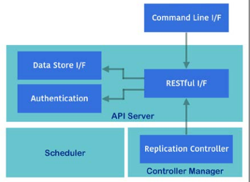
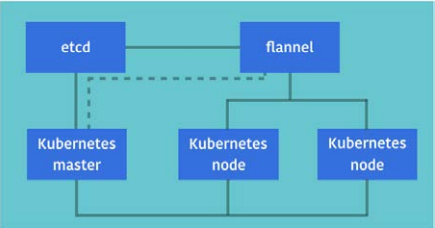

# Kubernetes overview

## 1. Introduction

Kubernetes is constructed using several components:
- *Kubernetes master*
    + Authorization and authetication
    + RESTful API entry point
    + Container deployment scheduler to the Kubernetes nodes
    + Scaling and replicating the controller
    + Read and store the configuration
    + Command line interface



    + kube-apiserver: the hub between Kubernetes components such as kubectl,
      scheduler, replication controller (replica sets), etd datastore,
      kubelet & kube-proxy.
    + kube-scheduler: choose which container runs by which nodes
    + kube-controller-manager: peforms cluster operations.

- *Kubernetes nodes*
    + It is controlled by Kubernetes master to run the container application
      using Docker or rkt.
    + kubelet: the main process on Kubernetes node that communicates with
      master to handle Periodically access the API controller, perform
      container operations & run the HTTP Server to provide simple APIs.
    + kube-proxy: handles network proxy & load balancer for each container. It
      performs to change the Linux iptables rules to control TCP & UDP packets
      accross the containers.

- *etcd*:
    + distributed key-value datastore.
    + Main datastore.
    + Explore the Kubernetes configuration and status in etcd:

    ```
    # curl -L "http://10.0.0.1:2379/v2/keys/registry"
    ```

- *overlay network (flannel)*:
    + Network communicate - multihost.
    + Flannel also uses etcd to configure the settings and store the status.

    ```
    # curl -L "http://10.0.0.1:2379/v2/keys/coreos.com/network/config"
    ```



- *Kubernetes master* connect to *etd* via HTTP/HTTPS to store data and connect to
  *flannel* to access the container application.
- *Kubernetes nodes* connect to the *Kubernetes master* via HTTP/HTTPS to get a
  command and report the status.
- *Kubernetes nodes* use an overlay network (*flannel*) to make a connection of
  their container applications.
