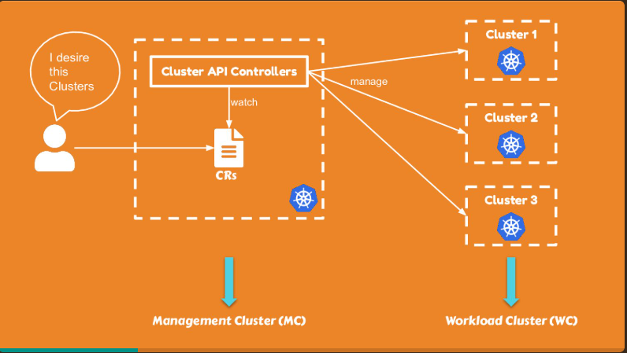

# Kubernetes Cluster API

Source:

- <https://cluster-api.sigs.k8s.io/>
- <https://speakerdeck.com/erkanerol/kubernetes-cluster-api>
- <https://nohup.no/posts/cluster-api-on-openstack/>

## 1. Introduction

Cluster API (CAPI) is a Kubernetes sub-project focused on providing **declarative APIs** and tooling to simplify provisioning, upgrading, and operating multiple Kubernetes clusters.

- Manage multiple Kubernetes clusters in a declarative and centralized way.
- Across cloud and on-prem providers.
- Scalable, on-demand and self-healing in nature.
- kubadm solves only a subset of the problem.

Basically, user passes a declarative config - cluster spec to CAPI then the Controllers manage, watch and provision the resource.



What do we need to create a k8s cluster?

1. we need nfra resources (machines, network, storage) -> _Infrastructure provider_, there are a bunch of supported providers.
2. we need to convert machines to k8s nodes -> _Bootstrap provider_, kubedm, talos, eks.
3. we need a control-plane to join our nodes -> _ControlPlane provider_, a component responsible for the provisioning and for the management of the control plane of your Kubernetes cluster, like e.g. the KubeadmControlPlane provider.

- self-provisioned: a Kubernetes control plane consisting of pods or machines wholly managed by a single ClusterAPI deployment, e.g. kubeadm uses static pods for running components.
- pod-based deployments require an external hosting cluster. The control plane components are deployed using standard _Deployment_ and _StatefulSet_ objects and the API is exposed using a _Service_.
- external or managed control planes are offered and controlled by some system other then ClusterAPI, such as GKE, AKS, EKS, ...


```text
Cluster
├── infrastructureRef → OpenStackCluster
│   (API endpoint, external network, DNS, subnets)
│
├── controlPlaneRef → KubeadmControlPlane
│   ├── machineTemplate.infrastructureRef → OpenStackMachineTemplate
│   │   (flavor, image, rootVolume, security groups)
│   └── creates → Machine → OpenStackMachine
│
└── MachineDeployment (workers)
    ├── infrastructureRef → OpenStackMachineTemplate
    ├── bootstrap.configRef → KubeadmConfigTemplate
    └── creates → MachineSet → Machine → OpenStackMachine
```
