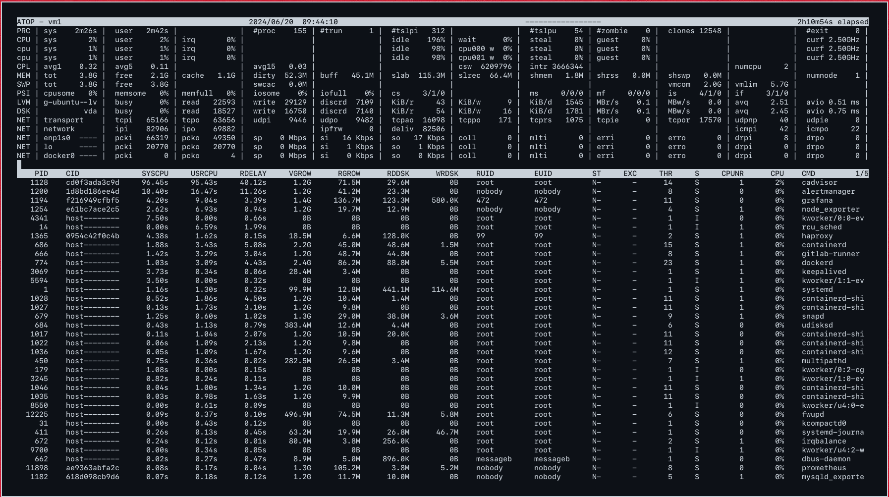

# Atop

Source:

- <https://www.redhat.com/sysadmin/analyzing-linux-server-performance-atop>
- <http://freesoftwaremagazine.com/articles/atop_when_you_need_know_exactly_whats_happening_systemresource_level/>
- <https://www.digitalocean.com/community/tutorials/atop-command-in-linux>
- <https://www.atoptool.nl/index.php>

Table of contents:

- [Atop](#atop)
  - [1. Installation](#1-installation)
  - [2. First look](#2-first-look)
    - [2.1. System level (top section)](#21-system-level-top-section)
    - [2.2. Process level (bottom section)](#22-process-level-bottom-section)
  - [3. Background running](#3-background-running)
  - [4. Useful commands and shortcut](#4-useful-commands-and-shortcut)
  - [5. For advanced users](#5-for-advanced-users)
    - [5.1. Thread information](#51-thread-information)
    - [5.2. Disk activity information](#52-disk-activity-information)
    - [5.3. Memory leaks](#53-memory-leaks)

`top` is great, we're all familiar with it. `htop` is even better, (and with eye-catching look). But sometimes these tools aren't enough, they only give the 10,000 foot overview of resource. They don't allow you to see what part of which program or process is eating up too much RAM or which part is creating race conditions on lock files. And the most important drawback is the lack of historical data. But [`atop`](https://www.atoptool.nl/index.php) can. A powerful monitor program that allows you to see system-level counters concerning utilization of CPU and memory/swap, as well as see disk I/O and network utilization counters at the system level -- in real time or _historically_. It also allows you to store raw counters in a file for long-term analysis on system levels and process levels, as well as seeing resource consumption for each thread within a process of a multi-processor program.

## 1. Installation

Installation is as simple as opening your package manager and selecting it for installation.

```shell
# RedHat CentOS
yum install atop
# Ubuntu Debian
apt install atop
```

## 2. First look

```shell
atop
```

Once atop is launched, by default it shows system activity for CPU, memory, swap, disks, and network in 10-second intervals. In addition, for each process and thread, you can analyze CPU utilization, memory consumption, disk I/O, priority, username, state, and even exit codes:



The first thing that you'll notice is that there is a lot of information on that one screen. The second thing you should notice is that the window is resizeable. This feature allows you to see what's in each column instead of it being cut off, with no way to know what's there. Enlarging the screen during some operations will add additional columns with even more information in them.

The screen is divided into two broad sections:

### 2.1. System level (top section)

In the top section, each line is a resource type (first column):

- PRC (process level totals)
- CPU, CPL (CPU load information)
- MEM, SWP (swap occupation and overcommit info)
- PAG (paging frequency)
- LVM/MDD/DSK (logical volume/multiple device/disk utilization)
- NET.

If you have more than one CPU or core, you will have one main row called CPU (in capitals) and then one extra row per core called cpu (small letters).

### 2.2. Process level (bottom section)

The process level section will show something similar to what you are used to with the top program. Note that the output is also nicely paginated (^F to go forward, ^B to go back).

You can control the output of the atop command from your keyboard. Remember that you can always make the screen wider to show more details.

- `m` for memory related output;
- `d` for disk-related output;
- `n` for network related output;
- `v` for various process characteristics;
- `c` for the command line of the process.

## 3. Background running

Atop runs as a daemon (systemd service). If you don't want it running, simply kill it. Atop also creates log files in the standard log file location for your distro.

```shell
systemctl status atop
● atop.service - Atop advanced performance monitor
     Loaded: loaded (/lib/systemd/system/atop.service; enabled; vendor preset: enabled)
     Active: active (running) since Thu 2024-06-20 09:44:07 UTC; 8min ago
       Docs: man:atop(1)
    Process: 12406 ExecStartPre=/bin/sh -c test -n "$LOGINTERVAL" -a "$LOGINTERVAL" -eq "$LOGINTERVAL" (code=exited, status=0/SUCCESS)
    Process: 12407 ExecStartPre=/bin/sh -c test -n "$LOGGENERATIONS" -a "$LOGGENERATIONS" -eq "$LOGGENERATIONS" (code=exited, status=0/SUCCESS)
    Process: 12409 ExecStartPost=/usr/bin/find ${LOGPATH} -name atop_* -mtime +${LOGGENERATIONS} -exec rm -v {} ; (code=exited, status=0/SUCCESS)
   Main PID: 12408 (atop)
      Tasks: 1 (limit: 4557)
     Memory: 7.6M
        CPU: 28ms
     CGroup: /system.slice/atop.service
             └─12408 /usr/bin/atop -R -w /var/log/atop/atop_20240620 600

Jun 20 09:44:07 vm1 systemd[1]: Starting Atop advanced performance monitor...
Jun 20 09:44:07 vm1 systemd[1]: Started Atop advanced performance monitor.
```

Default config stores at `/etc/default/atop`:

```shell
# /etc/default/atop
# see man atoprc for more possibilities to configure atop execution

LOGOPTS="-R"
LOGINTERVAL=600
LOGGENERATIONS=28
LOGPATH=/var/log/atop
```

You can modify this file to change atop behavior. The log files are compressed and must be read by atop. To view a log file, type:

```shell
atop -r /var/log/atop/atop_20240620
```

Then use `t` to go forward in 10 minute intervals and `T` to go back. You can analyze specific times by pressing `b` then entering the time.

## 4. Useful commands and shortcut

First thing first, read the man pages:

```shell
man atop
```

Useful `atop` launch commands include:

| Command | Description                                           |
| ------- | ----------------------------------------------------- |
| atop -1 | Launch with average-per-second total values.          |
| atop -a | Launch with active processes only.                    |
| atop -c | Launch with command-line per process.                 |
| atop -d | Launch with disk info.                                |
| atop -m | Launch with memory info.                              |
| atop -n | Launch with network info.                             |
| atop -s | Launch with scheduling info.                          |
| atop -v | Launch with various info (e.g., PPID, user, or time). |
| atop -y | Launch with individual threads.                       |

Once `atop` is running, press the following shortcut keys to sort processes:

| Shortcut key | Description                                     |
| ------------ | ----------------------------------------------- |
| a            | Sort in order of most active resources.         |
| c            | Revert to sorting by CPU consumption (default). |
| d            | Sort in order of disk activity.                 |
| m            | Sort in order of memory usage.                  |
| n            | Sort in order of network activity.              |

## 5. For advanced users

### 5.1. Thread information

Developers writing multi-core, multi-thread programs can press the `s` key while their program is running to show specific scheduling information about the main thread of each process. For example, scheduling policy, nice value, priority, real time priority and CPU number (current or last used) and state.

Furthermore it shows how many threads within this process are in the state 'running' (busy on CPU or waiting in the run queue), 'interruptible sleeping' or 'non-interruptible sleeping'. The total number of threads can be determined by accumulating these three values (columns TRUN, TSLPI and TSLPU).

### 5.2. Disk activity information

Trying to debug a program where your disk writes aren't getting written to disk is very frustrating. You may have a function calling another function, calling another function and can't figure out why nothing is getting written to disk. Atop to the rescue. Press the `d` key. The lines with label LVM (logical volumes) and DSK (underlying physical disks) shows the disk-activity on system-level.

On process-level the disk activity is shown as the amount of data transferred by reads (column RDDSK) and writes (column WRDSK). Usually the written data is stored in the in-memory page cache before it is physically written to disk. When the data is written to the page cache but destroyed before physically written to disk, that amount is reported as canceled (column WCANCL).

Make the window larger and columns are added for the system level statistics, like the number of Kb transferred per read and write request, the total throughput per second for reading and writing, and the average number of requests in the request-queue of the disk driver.

Now you can easily see exactly what is happening (if anything) at the system-level disk resource. You can see that something cancelled your write request before it got written to disk. Unfortunately, It won't tell you which line in your program is causing this.
​​​​

### 5.3. Memory leaks

When developing a program, memory leaks are extremely hard to find. Many programs have had memory leaks through many versions, with developers scratching their heads looking for them. Atop lets you watch memory dynamically, logging all data by time and threads, allowing you to easily spot memory leaks.
