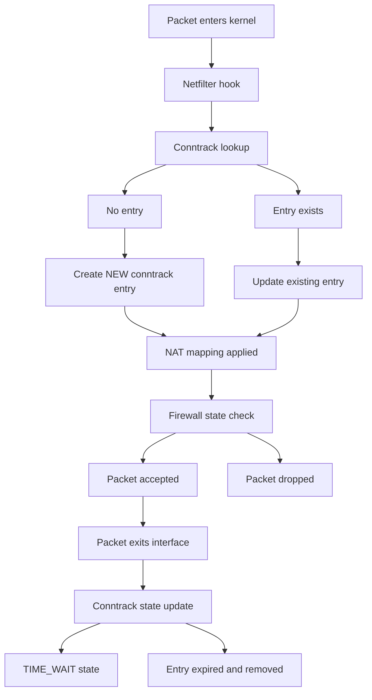

# Conntrack

Source:

- <https://blog.cloudflare.com/conntrack-tales-one-thousand-and-one-flows/>
- <https://baconyao.notion.site/11-A-Brief-Introduction-to-Conntrack-29d8a3a7d9d4809ca671e61e37ff300c>
- <https://baconyao.notion.site/12-Deep-Dive-How-Linux-Conntrack-Determines-Performance-and-Security-in-Docker-Containers-2d78a3a7d9d480a58442c6f06c1ce838>
- <https://thermalcircle.de/doku.php?id=blog:linux:connection_tracking_1_modules_and_hooks>

## 1. What is conntrack?

Conntrack, short for connection tracking, is a core feature of the Linux kernel's netfilter subsystem.

It records and manages the state of every network connection and data flow, enabling the kernel to understand whether a packet belongs to a new, established, or related connection. This mechanism is fundamental for implementing stateful firewalls and Network Address Translation (NAT) , forming the backbone of many higher-level networking systems such as container networking and Kubernetes Services.

> 

```bash
$ sudo conntrack -L
unknown  2 588 src=192.168.1.104 dst=224.0.0.251 [UNREPLIED] src=224.0.0.251 dst=192.168.1.104 mark=0 use=1
icmp     1 18 src=192.168.1.1 dst=192.168.1.22 type=8 code=0 id=54570 src=192.168.1.22 dst=192.168.1.1 type=0 code=0 id=54570 mark=0 use=1
tcp      6 431997 ESTABLISHED src=192.168.1.22 dst=140.82.112.26 sport=35286 dport=443 src=140.82.112.26 dst=192.168.1.22 sport=443 dport=35286 [ASSURED] mark=0 use=1
udp      17 116 src=192.168.1.22 dst=208.103.161.33 sport=48634 dport=443 src=208.103.161.33 dst=192.168.1.22 sport=443 dport=48634 [ASSURED] mark=0 use=1
udp      17 22 src=192.168.1.104 dst=224.0.0.251 sport=5353 dport=5353 [UNREPLIED] src=224.0.0.251 dst=192.168.1.104 sport=5353 dport=5353 mark=0 use=1
tcp      6 96 TIME_WAIT src=192.168.1.22 dst=162.159.137.54 sport=35918 dport=443 src=162.159.137.54 dst=192.168.1.22 sport=443 dport=35918 [ASSURED] mark=0 use=1
tcp      6 431991 ESTABLISHED src=192.168.1.22 dst=34.49.167.43 sport=58484 dport=443 src=34.49.167.43 dst=192.168.1.22 sport=443 dport=58484 [ASSURED] mark=0 use=1
tcp      6 431999 ESTABLISHED src=192.168.1.22 dst=149.154.170.200 sport=59492 dport=443 src=149.154.170.200 dst=192.168.1.22 sport=443 dport=59492 [ASSURED] mark=0 use=1
udp      17 13 src=192.168.1.22 dst=1.1.1.1 sport=44159 dport=53 src=1.1.1.1 dst=192.168.1.22 sport=53 dport=44159 mark=0 use=1
```

> [!NOTE]
> how large this state tracking table can be? This setting is  under `/proc/sys/net/nf_conntrack_max`

**Why do we need conntrack?

If we rely only on `iptables` rules, each packet is evaluated independently - `iptables` has no memory of past packets. This means the kernel cannot determine whether a packet is part of an existing connection or simply a new incoming request. As a result, it becomes difficult to distinguish between new packets and response packets.

With the help of conntrack, the kernel can identify packets that belong to an `ESTABLISHED` connection. It can recognize `NEW` connections. And it can also track packets that are `RELATED` to existing connections (for example, responses or auxiliary connections).

```shell
# Allow Packets from Established or Related Connections
$ iptables -A INPUT -m conntrack --ctstate ESTABLISHED,RELATED -j ACCEPT
```

## 2. cstate & cstatus

ctstate is the packet state label exposed by the conntrack module in iptables/nftables.

Get from [iptables man page](https://ipset.netfilter.org/iptables-extensions.man.html).

| State | Description | Typical scenario | Common usage |
| ---| ---|---|---|
| NEW | The packet has started a new connection or otherwise associated with a connection which has not seen packets in both directions.| TCP SYN, first UDP packet | Control which ports can be initiated from outside|
| ESTABLISHED | The packet is associated with a connection which has seen packets in both directions.| TCP handshake completed, UDP responses received | Allow response packets |
| RELATED | The packet is starting a new connection, but is associated with an existing connection, such as an FTP data transfer or an ICMP error|FTP data channel, ICMP error|Allow FTP, ICMP, ALG, and other derived connections|
| UNTRACKED | The packet is not tracked at all, which happens if you explicitly untrack it by using -j CT --notrack in the raw table. |Explicitly set with `-j NOTRACK`|Special case (e.g., high performance bypass)|
|INVALID|The packet cannot be associated with any known connection and is not a new connection| Invalid TCP flags, unexpected replies|Should be dropped|
| SNAT | A virtual state, matching if the original source address differs from the reply destination. |||
| DNAT | A virtual state, matching if the original destination differs from the reply source. |||

cstatus

| Status | Description|
| ---|---|
| NONE | None of the below|
| EXPECTED | Expected connection (i.e. a conntrack helper set i up)|
| SEEN_REPLY | Conntrack has seen packets in both directions |
| ASSURED | Conntrack entry should never be early-expired |
| CONFIRMED | Connection is confirmed: originating packet has left box|

## 3. How conntrack works?



## 4. Common issues

### 4.1. Conntrack table full

