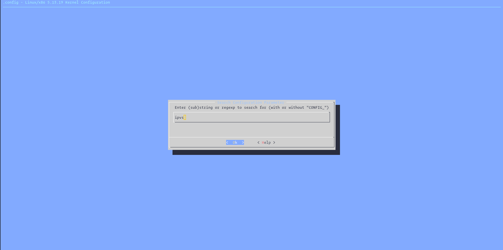
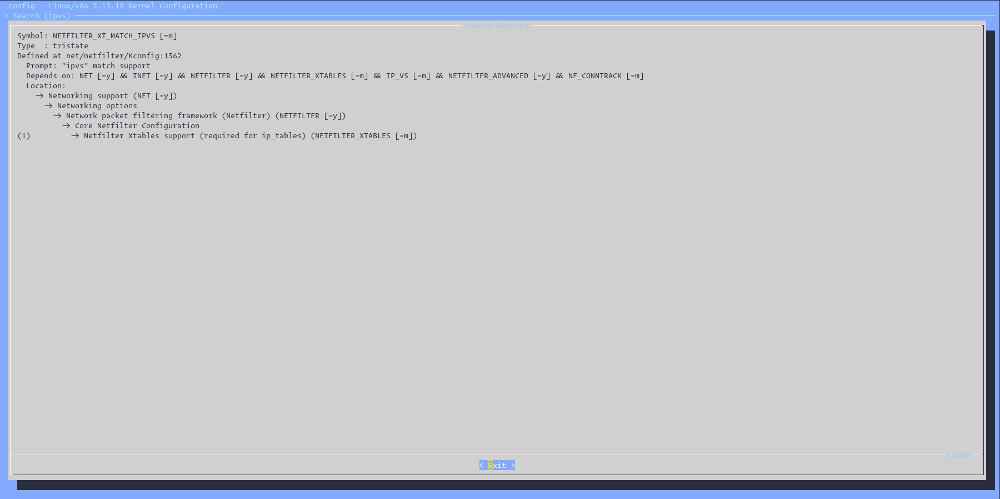
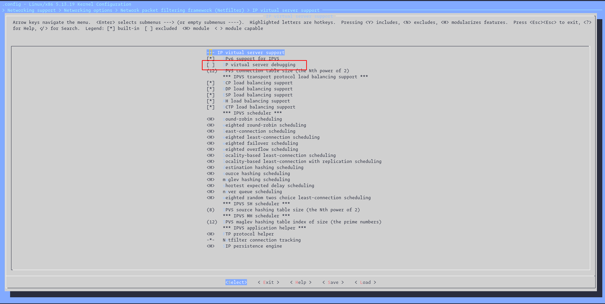
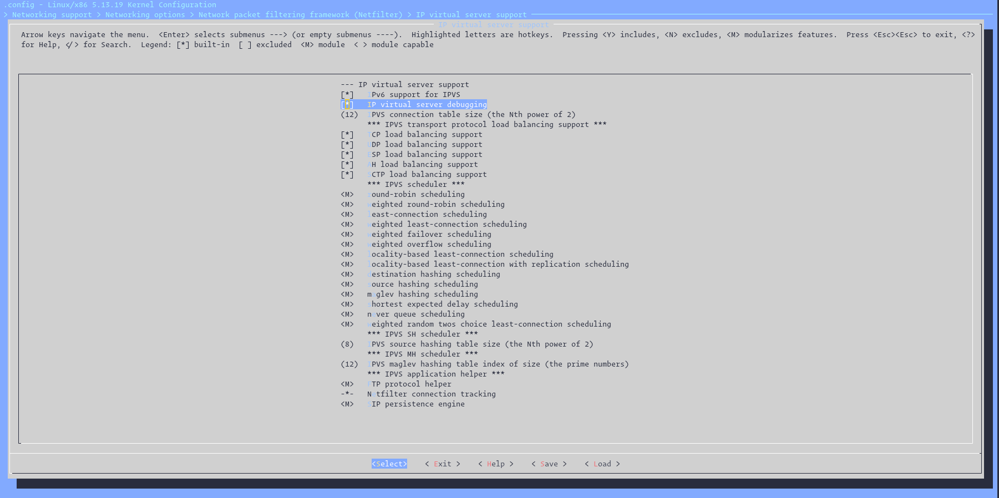

# Configure IPVS debug level

- By default, IPVS only logs transmission error messages (default), sometimes we want to know more than this.
- To check your current debug level:

```bash
cat /proc/sys/net/ipv4/vs/debug_level
```

- According to [kernel documentation](https://www.kernel.org/doc/html/latest/networking/ipvs-sysctl.html), this option only available when IPVS is compiled with CONFIG_IP_VS_DEBUG enabled.

```
debug_level - INTEGER
    0 - transmission error messages (default)

    1 - non-fatal error messages

    2 - configuration

    3 - destination trash

    4 - drop entry

    5 - service lookup

    6 - scheduling

    7 - connection new/expire, lookup and synchronization

    8 - state transition

    9 - binding destination, template checks and applications

    10 - IPVS packet transmission

    11 - IPVS packet handling (ip_vs_in/ip_vs_out)

    12 or more - packet traversal

Only available when IPVS is compiled with CONFIG_IP_VS_DEBUG enabled.

Higher debugging levels include the messages for lower debugging levels, so setting debug level 2, includes level 0, 1 and 2 messages. Thus, logging becomes more and more verbose the higher the level.
```

- Therefore, we have to do further steps to make it work.
- Check CONFIG_IP_VS_DEBUG enabled.

```bash
grep "CONFIG_IP_VS_DEBUG" /usr/src/linux-headers-5.13.0-40-generic/.config
# CONFIG_IP_VS_DEBUG is not set
```

- If it isn't enabled, follow [kernel configuration](../kernel-configuration.md) to enable it.
- Run `make menuconfig`. Enter `</>` to search with keyword **ipvs**.




- Follow the instruction, the ipvs is there.



- Enter `y` to enable it.



- Save the config, and validate.

```bash
grep "CONFIG_IP_VS_DEBUG" /usr/src/linux-headers-5.13.0-40-generic/.config                                                                                         took 5m40s
CONFIG_IP_VS_DEBUG=y
```

- Now, we can configure debug level.

```bash
sudo sysctl -w net.ipv4.vs.debug_level=1
```
