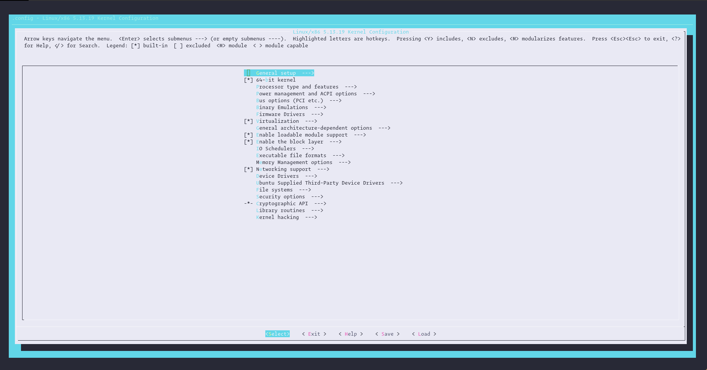
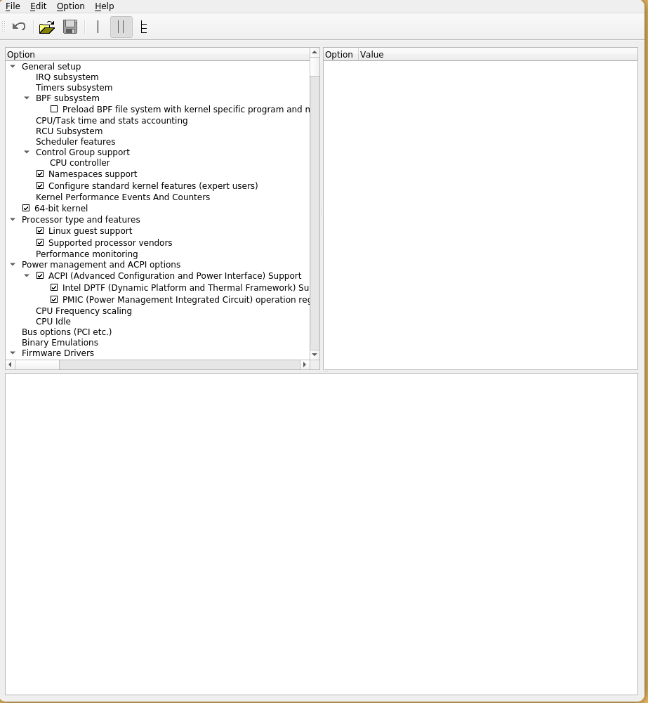

# Kernel configuration

Source: <https://tldp.org/HOWTO/SCSI-2.4-HOWTO/kconfig.html>

The Linux kernel configuration is usually found in the kernel source in the file: `/usr/src/linux-headers-<version>/.config`. It is not recommeneded to edit this file directly but to use on of these configuration options:

- **make config** - starts a character based questions and answer session
- **make menuconfig** - starts a terminal-oriented configuration tool (using `ncurses`)
- **make xconfig** - starts a X based configuration tool

The descriptions of these selections that is displayed by the associated help button can be found in the flat ASCII file: `/usr/src/linux-headers-<version>/Documentation/Configure.help`
Ultimately these configuration tools edit the `.config` file. An option will either indicate some driver is built into the kernel ("=y") or will be built as a module ("=m") or is not selected. The unselected state can either be indicated by a line starting with "#" (e.g. "# CONFIG_SCSI is not set") or by the absence of the relevant line from the `.config` file.

- Configuration on the Command line:
  - To configure the kernel, change to `/usr/src/linux-headers-<version>/` and enter the command **make config**. Choose the features you want supported by the kernel. Usually, There are two or three options: **y**, **n**, or **m**. **m** means that this device will not be compiled directly into the kernel, but loaded as a module. Drivers needed for booting the system must be integrated into the kernel with **y**. Press `Enter` to confirm the default settings read from the file .config. Press any other key to view a brief help text about the respective option.
- Configuration in text mode with **make menuconfig**:

  - Go to the directory `/usr/src/linux-headers-<version>/` as root, in my case, the path is `/usr/src/linux-headers-5.13.0-39-generic/`.

  ```bash
  root@ubuntu /usr/src/linux-headers-5.13.0-39-generic #
  ```

  - Install the required packages

  ```bash
  root@ubuntu /usr/src/linux-headers-5.13.0-39-generic # sudo apt install libncurses5-dev libncursesw5-dev bison flex -y
  ```

  - Run, then a terminal-oriented menu will show up:

  ```bash
  root@ubuntu /usr/src/linux-headers-5.13.0-39-generic # make menuconfig
  ```

  

- Configuration in the X window system

  - If you installed and configured the X Window System (package xf86) and Tcl/Tk (tcl and tk), you can use the command **make xconfig** to access a graphical user interface for the configuration. If you are not logged in to the X Window System as root, enter the command xhost + to give root access to the display. The default settings will be loaded from the file `.config`. As the configuration with **make xconfig** is not as well maintained as the other configuration possibilities, run the command **make oldconfig** after using this configuration method.
  - Install QT5:

  ```bash
  root@ubuntu /usr/src/linux-headers-5.13.0-39-generic # sudo apt install qt5-default
  ```

  
