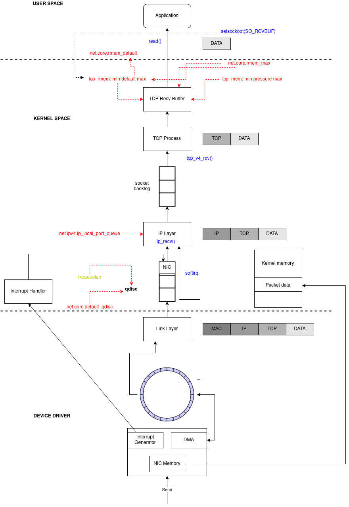
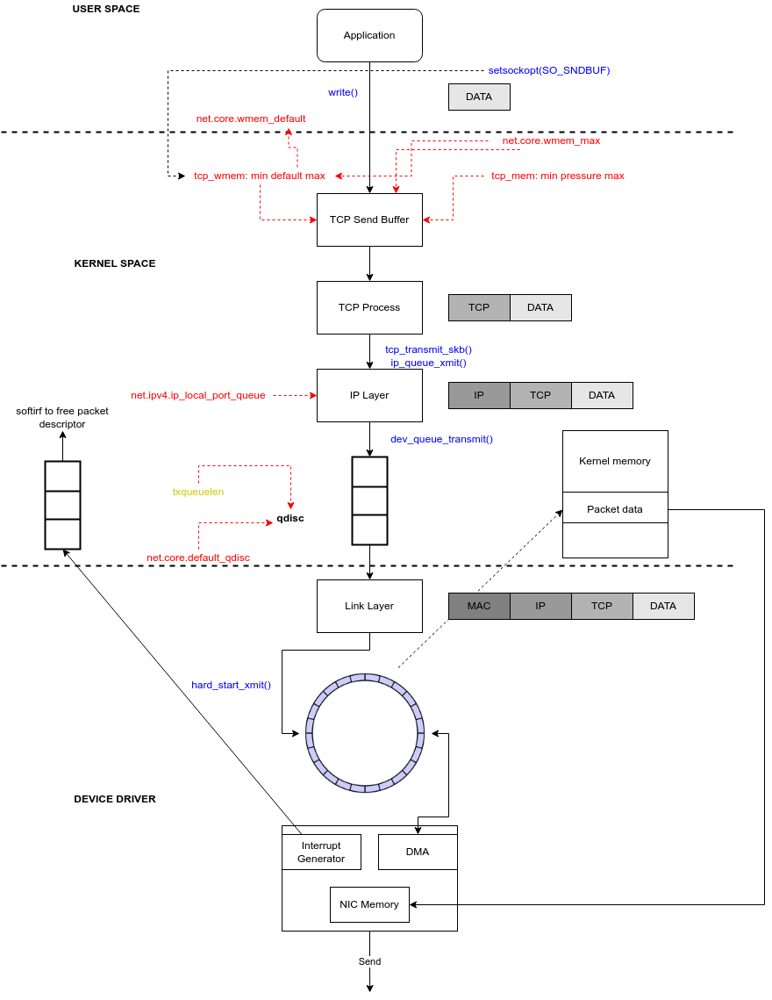
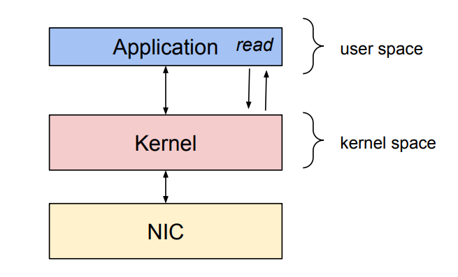
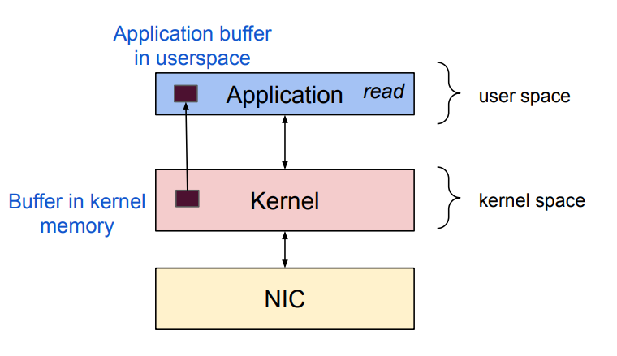

# Linux Network Performance

Source:

- <https://github.com/leandromoreira/linux-network-performance-parameters/>
- <https://access.redhat.com/sites/default/files/attachments/20150325_network_performance_tuning.pdf>
- <https://www.coverfire.com/articles/queueing-in-the-linux-network-stack/>
- <https://blog.cloudflare.com/how-to-achieve-low-latency/>
- <https://blog.cloudflare.com/how-to-receive-a-million-packets/>
- <https://beej.us/guide/bgnet/html/>
- ,<https://blog.csdn.net/armlinuxww/article/details/111930788>>

Table of Contents:

- [Linux Network Performance](#linux-network-performance)
  - [1. Linux Networking stack](#1-linux-networking-stack)
    - [1.1. Linux network packet reception](#11-linux-network-packet-reception)
    - [1.2. Linux kernel network transmission](#12-linux-kernel-network-transmission)
  - [2. Network Performance tuning](#2-network-performance-tuning)
    - [2.1. The NIC Ring Buffer](#21-the-nic-ring-buffer)
    - [2.2. Interrupt Coalescence (IC) - rx-usecs, tx-usecs, rx-frames, tx-frames (hardware IRQ)](#22-interrupt-coalescence-ic---rx-usecs-tx-usecs-rx-frames-tx-frames-hardware-irq)
    - [2.3. IRQ Affinity](#23-irq-affinity)
    - [2.4. Share the load of packet processing among CPUs](#24-share-the-load-of-packet-processing-among-cpus)
      - [2.4.1. Receive-side scaling (RSS)](#241-receive-side-scaling-rss)
      - [2.4.2. Receive Packet Steering (RPS)](#242-receive-packet-steering-rps)
      - [2.4.3. Receive Flow Steering (RFS)](#243-receive-flow-steering-rfs)
      - [2.4.4. Accelerated Receive Flow Steering (aRFS)](#244-accelerated-receive-flow-steering-arfs)
    - [2.5. Interrupt Coalescing (soft IRQ)](#25-interrupt-coalescing-soft-irq)
    - [2.6. Ingress QDisc](#26-ingress-qdisc)
    - [2.7. Egress Disc - txqueuelen and default\_qdisc](#27-egress-disc---txqueuelen-and-default_qdisc)
    - [2.8. TCP Read and Write Buffers/Queues](#28-tcp-read-and-write-buffersqueues)
    - [2.9. TCP FSM and congestion algorithm](#29-tcp-fsm-and-congestion-algorithm)
    - [2.10. NUMA](#210-numa)
    - [2.11. Further more - Packet processing](#211-further-more---packet-processing)
      - [2.11.1. AF\_PACKET v4](#2111-af_packet-v4)
      - [2.11.2. PACKET\_MMAP](#2112-packet_mmap)
      - [2.11.3. PF\_RING](#2113-pf_ring)
      - [2.11.4. Kernel bypass: Data Plane Development Kit (DPDK)](#2114-kernel-bypass-data-plane-development-kit-dpdk)
      - [2.11.5. Programmable packet processing: eXpress Data Path (XDP)](#2115-programmable-packet-processing-express-data-path-xdp)

## 1. Linux Networking stack

Source:

- <https://blog.packagecloud.io/illustrated-guide-monitoring-tuning-linux-networking-stack-receiving-data/>
- <https://blog.packagecloud.io/monitoring-tuning-linux-networking-stack-receiving-data/>
- <https://blog.packagecloud.io/monitoring-tuning-linux-networking-stack-sending-data/>
- <https://juejin.cn/post/7106345054368694280>
- <https://openwrt.org/docs/guide-developer/networking/praxis>
- <http://arthurchiao.art/blog/tcp-listen-a-tale-of-two-queues/>
- <https://blog.51cto.com/u_15169172/2710604>

- The complete network data flow:


- It's a getting started. Before perform any tuning, let make sure that we understand how computers running Linux receive packets.
- You check the summary of *PackageCloud's article* here. This is a very detailed explaination.

  <details>
  <summary>Click to expand</summary>
  - In network devices, it is common for the NIC to raise an **IRQ** to signal that a packet has arrived and is ready to be processed.
    - An IRQ (Interrupt Request) is a hardware signal sent to the processor instructing it to suspend its current activity and handle some external event, such as a keyboard input or a mouse movement.
    - In Linux, IRQ mappings are stored in **/proc/interrupts**.
    - When an IRQ handler is executed by the Linux kernel, it runs at a very, very high priority and often blocks additional IRQs from being generated. As such, IRQ handlers in device drivers must execute as quickly as possible and defer all long running work to execute outside of this context. This is why the **softIRQ** system exists.
    - **softIRQ** system is a system that kernel uses to process work outside of the device driver IRQ context. In the case of network devices, the softIRQQ system is responsible for processing incoming packets

  - Initial setup (from step 1-4):

    

    - softIRQ kernel threads are created (1 per CPU).
    - The ksoftirqd threads begin executing their processing loops.
    - `softnet_data` structures are created (1 per CPU), hold references to important data for processing network data. `poll_list` is created (1 per CPU).
    - `net_dev_init` then registers the `NET_RX_SOFTIRQ` softirq with the softirq system by calling `open_softirq` - this registration is called `net_rx_action`,

  - Alright, Linux just init and setup networking stack to wait for data arrival:

    

    - Data is received by the NIC (Network Interface Card) from the network.
    - The NIC uses DMA (Direct Memory Access) to write the network data to RAM (in ring buffer).
      - Some NICs are "multiqueue" NICs, meaning that they can DMA incoming packets to one of many ring buffers in RAM.
    - The NIC raises an IRQ.
    - The device driver's registered IRQ handler is executed.
    - The IRQ is cleared on the NIC, so that it can generate IRQs for net packet arrivals.
    - NAPI softIRQ poll loop is started with a call to `napi_schedule`.

  - Check initial setup diagram (setup 5-8):
    - The call to `napi_schedule` in the driver adds the driver's NAPI poll structure to the `poll_list` for the current CPU.
    - The softirq pending a bit is set so that the `ksoftirqd` process on this CPU knows that there are packets to process.
    - `run_ksoftirqd` function (which is being run in a loop by the `ksoftirq` kernel thread) executes.
    - `__do_softirq` is called which checks the pending bitfield, sees that a softIRQ is pending, and calls the handler registerd for the pending softIRQ: `net_rx_action` (softIRQ kernel thread executes this, not the driver IRQ handler).
  - Now, data processing begins:
    - `net_rx_action` loop starts by checking the NAPI poll list for  NAPI structures.
    - The `budget` and elapsed time are checked to ensure that the softIRQ will not monopolize CPU time.
    - The registered `poll` function is called.
    - The driver's `poll` functio harvests packets from the ring buffer in RAM.
    - Packets are handed over to `napi_gro_receive` (GRO - Generic Receive Offloading).
      - GRO is a widely used SW-based offloading technique to reduce per-packet processing overheads.
      - By reassembling small packets into larger ones, GRO enables applications to process fewer large packets directly, thus reducing the number of packets to be processed.
    - Packets are either held for GRO and the call chain ends here or packets are passed on to `netif_receive_skb` to proceed up toward the protocol stacks.
  - Network data processing continues from `netif_receive_skb`, but the path of the data depends on whether or not Receive Packet Steering (RPS) is enabled or not.

    

    - If RPS is disabled:
      - 1. `netif_receive_skb` passed the data onto `__netif_receive_core`.
      - 6. `__netif_receive_core` delivers the data to any taps.
      - 7. `__netif_receive_core` delivers data to registed protocol layer handlers.
    - If RPS is enabled:
      - 1. `netif_receive_skb` passes the data on to `enqueue_to_backlog`.
      - 2. Packets are placed on a per-CPU input queue for processing.
      - 3. The remote CPU’s NAPI structure is added to that CPU’s poll_list and an IPI is queued which will trigger the softIRQ kernel thread on the remote CPU to wake-up if it is not running already.
      - 4. When the `ksoftirqd` kernel thread on the remote CPU runs, it follows the same pattern describe in the previous section, but this time, the registered poll function is `process_backlog` which harvests packets from the current CPU’s input queue.
      - 5. Packets are passed on toward `__net_receive_skb_core`.
      - 6. `__netif_receive_core` delivers data to any taps (like PCAP).
      - 7. `__netif_receive_core` delivers data to registered protocol layer handlers.

  - Protocol stacks, netfilter, BPF, and finally the userland socket.
    - Packets are received by the IPv4 protocol layer with `ip_rcv`.
    - Netfilter and a routing optimization are performed.
    - Data destined for the current system is delivered to higher-level protocol layers, like UDP.
    - Packets are received by the UDP protocol layer with `udp_rcv` and are queued to the receive buffer of a userland socket by `udp_queue_rcv_skb` and `sock_queue_rcv`. Prior to queuing to the receive buffer, BPF are processed.

  </details>

- Linux queue:


### 1.1. Linux network packet reception




1. Packet arrives at the NIC
2. NIC verifies `MAC` (if not on promiscuous mode) and `FCS` and decide to drop or to continue
3. NIC does [DMA (Direct Memory Access) packets at RAM](https://en.wikipedia.org/wiki/Direct_memory_access), in a region previously prepared (mapped) by the driver.
4. NIC enqueues references to the packets at receive ring buffer queue `rx` until `rx-usecs` timeout or `rx-frames`. Let's talk about the RX ring buffer:
   - It is a [circular buffer](https://en.wikipedia.org/wiki/Circular_buffer) where an overflow simply overwrites existing data.
   - It is used to store incoming packets until they can be processed by the device driver. The device driver drains the RX ring, typically via SoftIRQs (we will talk about it then), which puts the incoming packets into a kernel data structure called an `sk_buff` or `skb` (Socket Kernel Buffers - [SKBs](http://vger.kernel.org/~davem/skb.html)) to begin its journey through the kernel and up to the application which owns the relevant socket.
   - Fixed size, FIFO and located at RAM (of course).
5. NIC raises a `HardIRQ` - Hard Interrupt.
   - The Hard IRQ can be expensive in terms of CPU usage, especially when holding kernel locks.
   - Hard interrupts can be seen in `/proc/interrupts`.

    ```shell
    # For example, the columns represent the number of incoming interrupts as a counter value
    egrep “CPU0|eth3” /proc/interrupts
        CPU0 CPU1 CPU2 CPU3 CPU4 CPU5
    110:    0    0    0    0    0    0   IR-PCI-MSI-edge   eth3-rx-0
    111:    0    0    0    0    0    0   IR-PCI-MSI-edge   eth3-rx-1
    112:    0    0    0    0    0    0   IR-PCI-MSI-edge   eth3-rx-2
    113:    2    0    0    0    0    0   IR-PCI-MSI-edge   eth3-rx-3
    114:    0    0    0    0    0    0   IR-PCI-MSI-edge   eth3-tx
    ```

6. CPU runs the `IRQ handler` that runs the driver's code.
7. Driver will `schedule a [NAPI](https://en.wikipedia.org/wiki/New_API)`, clear the hard IRQ and return
8. Driver raise a `SoftIRQ (NET_RX_SOFTIRQ)`.
   - It is a kernel routines which are scheduled to run at a time when other tasks will not be interrupted.
   - Purpose: drain the network adapter receive Rx ring buffer.
   - Check command:

    ```shell
    ps aux | grep ksoftirq
                                                                      # ksotirqd/<cpu-number>
    root          13  0.0  0.0      0     0 ?        S    Dec13   0:00 [ksoftirqd/0]
    root          22  0.0  0.0      0     0 ?        S    Dec13   0:00 [ksoftirqd/1]
    root          28  0.0  0.0      0     0 ?        S    Dec13   0:00 [ksoftirqd/2]
    root          34  0.0  0.0      0     0 ?        S    Dec13   0:00 [ksoftirqd/3]
    root          40  0.0  0.0      0     0 ?        S    Dec13   0:00 [ksoftirqd/4]
    root          46  0.0  0.0      0     0 ?        S    Dec13   0:00 [ksoftirqd/5]
    ```

   - Monitor command:

    ```shell
    watch -n1 grep RX /proc/softirqs
    watch -n1 grep TX /proc/softirqs
    ```

9. NAPI polls data from the rx ring buffer until `netdev_budget_usecs` timeout or `netdev_budget` and `dev_weight` packets.
   - If the SoftIRQs do not run for long enough, the rate of incoming data could exceed the kernel's capability to drain the buffer last enough. As a result, the NIC buffers will overflow and traffic will be lost. Occasionaly, it is necessary to increase the time that SoftIRQs are allowed to run on the CPU. This is known as the `netdev_budget`.
     - Check command, the default value is 300, it means the SoftIRQ process to drain 300 messages from the NIC before getting off the CPU.

      ```shell
      sysctl net.core.netdev_budget
      net.core.netdev_budget = 300
      ```

   - `netdev_budget_usecs`: The maximum number of microseconds in 1 NAPI polling cycle. Polling will exit when either `netdev_budget_usecs` have elapsed during the poll cycle or the number of packets processed reaches `netdev_budget`.
     - Check command:

      ```shell
      sysctl net.core.netdev_budget_usecs

      net.core.netdev_budget_usecs = 8000
      ```

   - `dev_weight`: the maximum number of packets that kernel can handle on a NAPI interrupt, it's a PER-CPU variable. For drivers that support LRO or GRO_HW, a hardware aggregated packet is counted as one packet in this.

    ```shell
    sysctl net.core.dev_weight

    net.core.dev_weight = 64
    ```

10. Linux also allocates memory to `sk_buff`.
11. Linux fills the metadata: protocol, interface, setmatchheader, removes ethernet
12. Linux passes the skb to the kernel stack (`netif_receive_skb`)
13. It sets the network header, clone `skb` to taps (i.e. tcpdump) and pass it to tc ingress
14. Packets are handled to a qdisc sized `netdev_max_backlog` with its algorithm defined by `default_qdisc`
    - `netdev_max_backlog`: a queue whitin the Linux kernel where traffic is stored after reception from the NIC, but before processing by the protocols stacks (IP, TCP, etc). There is one backlog queue per CPU core. A given core's queue can grow automatically, containing a number of packets up to the maximum specified by the `netdev_max_backlog` settings.
    - In other words, this is the maximum number of packets, queued on the INPUT side (the ingress dsic), when the interface receives packets faster than kernel can process them.
    - Check command, the default value is 1000.

    ```shell
    sysctl net.core.netdev_max_backlog

    net.core.netdev_max_backlog = 1000
    ```

15. It calls `ip_rcv` and packets are handled to IP
16. It calls netfilter (`PREROUTING`)
17. It looks at the routing table, if forwarding or local
18. If it's local it calls netfilter (`LOCAL_IN`)
19. It calls the L4 protocol (for instance `tcp_v4_rcv`)
20. It finds the right socket
21. It goes to the tcp finite state machine
22. Enqueue the packet to the receive buffer and sized as `tcp_rmem` rules
    - If `tcp_moderate_rcvbuf is enabled kernel will auto-tune the receive buffer
    - `tcp_rmem`: Contains 3 values that represent the minimum, default and maximum size of the TCP socket receive buffer.
    - `net.core.rmem_max`: the upper limit of the TCP receive buffer size.
    - `SO_RECVBUF` sets the fixed size of the TCP receive buffer, it will override `tcp_rmem`, and the kernel will no longer dynamically adjust the buffer. The maximum value set by `SO_RECVBUF` cannot exceed `net.core.rmem_max`. Normally, we will not use it.
23. Kernel will signalize that there is data available to apps (epoll or any polling system)
24. Application wakes up and reads the data

### 1.2. Linux kernel network transmission




1. Application sends message (`sendmsg` or other)
2. TCP send message allocates skb_buff
3. It enqueues skb to the socket write buffer of `tcp_wmem` size
   - `tcp_wmem`: Contains 3 values that represent the minimum, default and maximum size of the TCP socket send buffer.
   - Check command:

    ```shell
    sysctl net.ipv4.tcp_wmem
    net.ipv4.tcp_wmem = 4096        16384   262144
    ```

    - The size of the TCP send buffer will be dynamically adjusted between min and max by the kernel. The initial size is default.
    - `net.core.wmem_max`: the upper limit of the TCP send buffer size.
    - `SO_SNDBUF` sets the fixed size of the send buffer, it will override `tcp_wmem`, and the kernel will no longer dynamically adjust the buffer. The maximum value set by SO_SNDBUF cannot exceed `net.core.wmem_max`. Normally, we will not use it.

4. Builds the TCP header (src and dst port, checksum)
5. Calls L3 handler (in this case `ipv4` on `tcp_write_xmit` and `tcp_transmit_skb`)
6. L3 (`ip_queue_xmit`) does its work: build ip header and call netfilter (`LOCAL_OUT`)
7. Calls output route action
8. Calls netfilter (`POST_ROUTING`)
9. Fragment the packet (`ip_output`)
10. Calls L2 send function (`dev_queue_xmit`)
11. Feeds the output (QDisc) queue of `txqueuelen` length with its algorithm `default_qdisc`
    - `txqueuelen`: Transmit Queue Length, is a TCP/IP stack network interface value that sets the number of packets allowed per kernel transmit queue of a network interface device.
      - By default, value is 1000 (depend on network interface driver): `ifconfig <interface> | grep txqueuelen`
    - `default_qdisc`: the default queuing discipline to use for network devices. This allows overriding the default of pfifo_fast with an alternative. Since the default queuing discipline is created without additional parameters so is best suited to queuing disciplines that work well without configuration like stochastic fair queue (sfq), CoDel (codel) or fair queue CoDel (fq_codel). For full details for each QDisc in `man tc <qdisc-name>` (for example, `man tc fq_codel`).
12. The driver code enqueue the packets at the `ring buffer tx`
13. The driver will do a `soft IRQ (NET_TX_SOFTIRQ)` after `tx-usecs` timeout or `tx-frames`
14. Re-enable hard IRQ to NIC
15. Driver will map all the packets (to be sent) to some DMA'ed region
16. NIC fetches the packets (via DMA) from RAM to transmit
17. After the transmission NIC will raise a `hard IRQ` to signal its completion
18. The driver will handle this IRQ (turn it off)
19. And schedule (`soft IRQ`) the NAPI poll system
20. NAPI will handle the receive packets signaling and free the RAM

## 2. Network Performance tuning

Tuning a NIC for optimum throughput and latency is a complex process with many factors to consider. There is no generic configuration that can be broadly applied to every system.

There are factors should be considered for network performance tuning. Note that, the interface card name may be different in your device, change the appropriate value.

Ok, let's follow through the Packet reception (and transmission) and do some tuning.

**NOTE**:

Before we continue, let's discuss about `/proc/net/softnet_stat` & `/proc/net/sockstat` as these files will be used a lot then.

```shell
cat /proc/net/softnet_stat

0000272d 00000000 00000000 00000000 00000000 00000000 00000000 00000000 00000000 00000000 00000000 00000000 00000000
000034d9 00000000 00000000 00000000 00000000 00000000 00000000 00000000 00000000 00000000 00000000 00000000 00000001
00002c83 00000000 00000000 00000000 00000000 00000000 00000000 00000000 00000000 00000000 00000000 00000000 00000002
0000313d 00000000 00000000 00000000 00000000 00000000 00000000 00000000 00000000 00000000 00000000 00000000 00000003
00003015 00000000 00000001 00000000 00000000 00000000 00000000 00000000 00000000 00000000 00000000 00000000 00000004
000362d2 00000000 000000d2 00000000 00000000 00000000 00000000 00000000 00000000 00000000 00000000 00000000 00000005
```

- Each line of the softnet_stat file represents a CPU core starting from CPU0.
- The statistics in each column are provided in hexadecimal
- 1st column is the number of frames received by the interrupt handler.
- 2nd column is the number of frames dropped due to `netdev_max_backlog` being exceeded.
- 3rd column is the number of times ksoftirqd ran out of `netdev_budget` or CPU time when there was still work to be done.
- The other columns may vary depending on the Linux version.

```shell
cat /proc/net/sockstat

sockets: used 937
TCP: inuse 21 orphan 0 tw 0 alloc 22 mem 5
UDP: inuse 9 mem 5
UDPLITE: inuse 0
RAW: inuse 0
FRAG: inuse 0 memory 0
```

- Check `mem` field. It is calculated simply by summing `sk_buff->truesize` for all sockets.
- More detail [here](https://unix.stackexchange.com/questions/419518/how-to-tell-how-much-memory-tcp-buffers-are-actually-using)

### 2.1. The NIC Ring Buffer


- Firstly, check out step (4) - NIC Ring buffer. It's a circular buffer, fixed size, FIFO, located at RAM. Buffer to smoothly accept bursts of connections without dropping them, you might need to increase these queues when you see drops or overrun, aka there are more packets coming than the kernel is able to consume them, the side effect might be increased latency.
- Ring buffer's size is commonly set to a smaller size then the maximum. Often, increasing the receive buffer size is alone enough to prevent packet drops, as it can allow the kernel slightly more time to drain the buffer.
  - Check command:

  ```shell
  ethtool -g eth3
  Ring parameters for eth3:
  Pre-set maximums:
  RX: 8192
  RX Mini: 0
  RX Jumbo: 0
  TX: 8192
  Current hardware settings:
  RX: 1024
  RX Mini: 0
  RX Jumbo: 0
  TX: 512
  # eth3's inteface has the space for 8KB but only using 1KB
  ```

  - Change command:

  ```shell
  # Increase both the Rx and Tx buffers to the maximum
  ethtool -G eth3 rx 8192 tx 8192
  ```

  - Persist the value:
    - RHEL/CentOS: Use `/sbin/ifup-local`, follow [here](https://access.redhat.com/solutions/8694) for detail.
    - Ubuntu: follow [here](https://unix.stackexchange.com/questions/542546/what-is-the-systemd-native-way-to-manage-nic-ring-buffer-sizes-before-bonded-int)

  - How to monitor:

  ```shell
  ethtool -S eth3 | grep -e "err" -e "drop" -e "over" -e "miss" -e "timeout" -e "reset" -e "restar" -e "collis" -e "over" | grep -v "\: 0"
  ```

### 2.2. Interrupt Coalescence (IC) - rx-usecs, tx-usecs, rx-frames, tx-frames (hardware IRQ)

- Move on to step (5), hard interrupt - HardIRQ. NIC enqueue references to the packets at receive ring buffer queue rx until rx-usecs timeout or rx-frames, then raises a HardIRQ. This is called *Interrupt coalescence*:
  - The amount of traffic that a network will receive (number of frames) `rx/tx-frames`, or time that passes after receiving traffic (timeout) `rx/tx-usecs`.
    - Interrupting too soon: poor system performance (the kernel stops a running task to handle the hardIRQ)
    - Interrupting too late: traffic isn't taken off the NIC soon enough -> more traffic -> overwrite -> traffic loss!

- Updating *Interrupt coalescence* can reduce CPU usage, hardIRQ, might be increase throughput at cost of latency
- Tuning:
  - Check command:
    - Adaptive mode enables the card to auto-moderate the IC. The driver will inspect traffic patterns and kernel receive patterns, and  estimate coalescing settings on-the-fly which aim to prevent packet loss -> useful if many small packets are received.
    - Higher interrupt coalescence favors bandwidth over latency: VOIP application (latency-sensitive) may require less coalescence than a file transfer (throughput-sensitive)

  ```shell
  ethtool -c eth3

  Coalesce parameters for eth3:
  Adaptive RX: on TX: off # Adaptive mdoe
  stats-block-usecs: 0
  sample-interval: 0
  pkt-rate-low: 400000
  pkt-rate-high: 450000
  rx-usecs: 16
  rx-frames: 44
  rx-usecs-irq: 0
  rx-frames-irq: 0
  ```

  - Change command:
    - Allow at least some packets to buffer in the NIC, and at least some time to pass, before interrupting the kernel. The values depend on system capabilities and traffic received.

  ```shell
  # Turn adaptive mode off
  # Interrupt the kernel immediately upon reception of any traffic
  ethtool -C eth3 adaptive-rx off rx-usecs 0 rx-frames 0
  ```

  - How to monitor:

### 2.3. IRQ Affinity

- IRQs have an associated "affinity property", `snmp_affinity`, which defines the CPU cores that are allowed to execute the Interrupt Service Routines (ISRs) for that IRQ. This property can be used to improve application performance by assigning both interrupt affinity and the application's thread affinity to one or more specific CPU cores. This allows cache line sharing between the specified interrupt and application threads.
- By default, it is controlled by [`irqbalancer`](https://github.com/Irqbalance/irqbalance) daemon.

```shell
systemctl status irqbalance.service
```

- But it can also be manually balanced if desired to determine if `irqbalance` is not balancing IRQs in a optimum manner and therefore causing packet loss. There may be some very specific cases where manually balancing interrupts permanently can be beneficial. Before does this kind of tuning, make sure you stop `irqbalance`:

```shell
systemctl stop irqbalance.service
```

- The interrupt affinity value a particular IRQ number is stored in the associated `/proc/irq/<IRQ_NUMBER>/snmp_affinity` file, which can be viewed and modified by the root user. The value stored in this file is a hexadecimal bit-mask representing all CPU cores in the system.
- To set the interrupt affinity for the Ethernet driver on a server with 4 cores (for example):

```shell
# Determine the IRQ number associated with the Ethernet driver
grep eth0 /proc/interrupts

32:   0     140      45       850264      PCI-MSI-edge      eth0

# IRQ 32
# Check the current value
# The default value is 'f', meaning that the IRQ can be serviced
# on any of the CPUs
cat /proc/irq/32/smp_affinity

f

# CPU0 is the only CPU used
echo 1 > /proc/irq/32/snmp_affinity
cat /proc/irq/32/snmp_affinity

1

# Commas can be used to delimit snmp_affinity values for discrete 32-bit groups
# This is required on systems with more than 32 cores
# For example, IRQ  40 is serviced on all cores of a 64-core system
cat /proc/irq/40/smp_affinity

ffffffff,ffffffff

# To service IRQ 40 on only the upper 32 cores
echo 0xffffffff,00000000 > /proc/irq/40/smp_affinity
cat /proc/irq/40/smp_affinity

ffffffff,00000000
```

- [Script](https://gist.github.com/xdel/9c50ccedea9e0c9d0000d550b07ee242) to set IRQ affinity on Intel NICs, handles system with > 32 cores.
- As I said, IRQ affinity can improve performance but only in a very specific configuration with a pre-defined workload. It is [a double edged sword](https://stackoverflow.com/questions/48659720/is-it-a-good-practice-to-set-interrupt-affinity-and-io-handling-thread-affinity).

### 2.4. Share the load of packet processing among CPUs

Source:

- <http://balodeamit.blogspot.com/2013/10/receive-side-scaling-and-receive-packet.html>
- <https://garycplin.blogspot.com/2017/06/linux-network-scaling-receives-packets.html>
- <https://github.com/torvalds/linux/blob/master/Documentation/networking/scaling.rst>

Once upon a time, everything was so simple. The network card was slow and had only one queue. When packets arrives, the network card copies packets through DMA and sends an interrupt, and the Linux kernel harvests those packets and completes interrupt processing. As the network cards became faster, the interrupt based model may cause IRQ storm due to the massive incoming packets. This will consume the most of CPU power and freeze the system. To solve this problem, [NAPI](https://wiki.linuxfoundation.org/networking/napi) (interrupt and polling) was proposed. When the kernel receives an interrupt from the network card, it starts to poll the device and harvest packets in the queues as fast as possible. NAPI works nicely with the 1Gbps network card which is common nowadays. However, it comes to 10Gbps, 20Gbps, or even 40Gbps network cards, NAPI may not be sufficient. Those cards would demand mush faster CPU if we still use one CPU and one queue to receive packets. Fortunately, multi-core CPUs are popular now, so why not process packets in parallel?

Note that, I will use `trasmit/receive queue` term. Actually it is [ring buffer](https://stackoverflow.com/questions/47450231/what-is-the-relationship-of-dma-ring-buffer-and-tx-rx-ring-for-a-network-card), there are the same. Just note here to clarify.

#### 2.4.1. Receive-side scaling (RSS)

- When packet arrives at NIC, they are added to receive queue. Receive queue is assigned an IRQ number during device drive initialization and one of the available CPU processor is allocated to that receive queue. This processor is responsible for servicing IRQs interrupt service routing (ISR). Generally the data processing is also done by same processor which does ISR.
  - If there is large amount of network traffic -> only single core is taking all responsibility of processing data. ISR routines are small so if they are being executed on single core does not make large difference in performance, but data processing and moving data up in TCP/IP stack takes time (other cores are idle).
    - *These pictures are from [balodeamit blog](http://balodeamit.blogspot.com/2013/10/receive-side-scaling-and-receive-packet.html)*
    - IRQ 53 is used for "eth1-TxRx-0" mono queue.
    - Check `smp_affinity` -> queue was configured to send interrupts to CPU8.

    .png)

  - RSS comes to rescue! RSS allow to configure network card to distributes across multiple send and receive queues (ring buffers). These queues are individually mapped to each CPU processor. When interrupts are generated for each queue, they are sent to mapped processor -> Network traffic is processed by multiple processors.
    - 4 receive queues and 4 send queues for eth1 interface, 56-59 IRQ are assigned to those queues. Now packet processing load is being distributed among 4 CPUs achieving higher throughput and low latency.

    .png)

- RSS provides the benefits of parallel receive processing in multiprocessing environment.
- This is NIC technology. It supprots multiple queues and integrates a hashing function (distributes packets to different queues by Source and Destination IP and if applicable by TCP/UDP source and destination ports) in the NIC. The NIC computes a hash value for each incoming packet. Based on hash values, NIC assigns packets of the same data flow to a single queue and evenly distributes traffic flows across queues.
- Check with `ethool -L` command.
- According [Linux kernel documentation](https://github.com/torvalds/linux/blob/v4.11/Documentation/networking/scaling.txt#L80), `RSS should be enabled when latency is a concern or whenever receive interrupt processing froms a bottleneck... For low latency networking, the optimal setting is to allocate as many queues as there are CPUs in the system (or the NIC maximum, if lower)`.


- // WIP - Commands!

#### 2.4.2. Receive Packet Steering (RPS)

- RPS is logically a software implementation of RSS. Being in software, it is necesarily called later in the datapath. Whereas RSS selects the queue and hence CPU that will run the hardware interrupt handler, RPS selects the CPU to perform protocol processing above the interrupt handler.
- When the driver receives a packet, it wraps the packet in a socket buffer `sk_buff` which contains a `u32` hash value for the packet (based on source IP, source port, dest IP, dest port). Since every packet of the same TCP/UDP connection (flow) shares the same hash, it's reasonable to process them with the same CPU. After that, it will reach either `netif_rx_internal()` or `netif_receive_skb_internal()`, and then `get_rps_cpu()` will be invoked to map the hash to an entry in `rps_map`, i.e. the CPU id. After getting the CPU id, `enqueue_to_backlog()` puts the sk_buff to the specific CPU queue for the further processing. The queues for each CPU are allocated in the per-cpu variable, [`softnet_data`](https://github.com/torvalds/linux/blob/v4.11/include/linux/netdevice.h#L2788).


- The benefit of using RPS is same as RSS: share the load of packet processing among the CPUs.
  - It may be unnecessary if RSS is availble.
  - If there are more CPUs than the queues, RPS could still be useful.
- RPS requires a kernel compiled with the `CONFIG_RPS` kconfig symbol (on by default for SMP). Even when compiled, RPS remains disabled until explicitly configured. The list of CPUs to which RPS may forward traffic can be configured for each receive queue using sysfs file entry:

```shell
/sys/class/net/<dev>/queues/rx-<n>/rps_cpus

# This file implements a bitmap of CPUs
# 0 (default): disabled
```

- Suggested configuration:
  - Single queue device: `rps_cpus` - the CPUs in the same memory domain of the interrupting CPU. If NUMA locality is not an issue, `rps_cpus` - all CPUs in the system. At high interrupt rate, it might be wise to exclude the interrupting CPU from the map since that already performs much work.
  - Multi-queue system: if RSS is configured -> RPS is redundant and unnecessary. If there are fewer hardware queues than CPUs, then RPS might be beneficial if the `rps_cpus` for each queue are the ones that share the same memory domain as the interrupting CPU for that  queue.

#### 2.4.3. Receive Flow Steering (RFS)

- Although RPS distributes packets based on flows, it doesn't take the userspace applications into consideration.
  - The application may run on CPU A, kernel puts the packets in the queue of CPU B.
  - CPU A can only use its own cache, the cached packets in CPU B become useless.
- RFS extends RPS further for the applications.
- RFS is only available if the kconfig symbol `CONFIG_RPS` is enabled.
- Instead of the per-queue hash-to-CPU map, RFS maintains a global flow-to-CPU table, `rps_sock_flow_table`. The size of this table can be adjusted:

```shell
sysctl -w net.core.rps_sock_flow_entries 32768
```

- Although the socket flow table improves the application locality, it also raise a problem. When the scheduler migrates the application to a new CPU, the remaining packets in the old CPU queue become outstanding, and the application may get the out of order packets. To solve the problem, RFS uses the per-queue `rps_dev_flow_table` to track outstanding packets.
  - The size of the per-queue flow table `rps_dev_flow_table` can configured through sysfs interface: `/sys/class/net/<dev>/queues/rx-<n>/rps_flow_cnt.`

- The next steps is way too complicated, if you want to know it, check [this](https://garycplin.blogspot.com/2017/06/linux-network-scaling-receives-packets.html) out.


- Suggested configuration:
  - The suggested flow count depends on the expected number of active connections at any given time, which may be significantly less than the number of the connections -> `32768` for `rps_sock_flow_entries`.
  - Single queue device: `rps_flow_cnt` = `rps_sock_flow_entries`.
  - Multi-queue device: `rps_flow_cnt` (each queue) = `rps_sock_flow_entries / N` (N is the number of queues).

#### 2.4.4. Accelerated Receive Flow Steering (aRFS)

- Accelerated RFS is to RFS what RSS is to RPS: a hardware-accelerated load balancing mechanism that uses soft state to steer flows based on where the application thead consuming the packets of each flow is running.
- aRFS should perform better than RFS since packets are sent directly to a CPU local to the thread consuming the data.
- aRFS is only available if the following conditions are met:
  - aRFS must be supported by the network interface card (export the `ndo_rx_flow_steer` netdevice function)
  - `ntuple` filtering must be enabled.
  - The kernel is compiled with `CONFIG_RFS_ACCEL`.
- The map of CPU to queues is automatically deduced from the IRQ affinities configured for each receive queue by the driver, so no additional configuration should be necessary.


- Suggested configuration:
  - Enabled whenever one wants to use RFS and the NIC supports hardware acceleration  .

### 2.5. Interrupt Coalescing (soft IRQ)

- `net.core.netdev_budget_usecs`:
  - Tuning:
    - Change command:

    ```shell
    sysctl -w net.core.netdev_budget_usecs <value>
    ```

    - Persist the value, check [this](https://access.redhat.com/discussions/2944681)

- `net.core.netdev_budget`:
  - Tuning:
    - Change command:

    ```shell
    sysctl -w net.core.netdev_budget <value>
    ```

    - Persist the value, check [this](https://access.redhat.com/discussions/2944681)
    - How to monitor:
      - If any of columns beside the 1st column are increasing, need to change budgets. Small increments are normal and do not  require tuning.

    ```shell
    cat /proc/net/softnet_stat
    ```

- `net.core.dev_weight`:
  - Tuning:
    - Change command:

    ```shell
    sysctl -w net.core.dev_weight <value>
    ```

    - Persist the value, check [this](https://access.redhat.com/discussions/2944681)
    - How to monitor:

    ```shell
    cat /proc/net/softnet_stat
    ```

### 2.6. Ingress QDisc

- In step (14), I has mentioned `netdev_max_backlog`, it's about Per-CPU backlog queue. The `netif_receive_skb()` kernel function (step (12)) will find the corresponding CPU for a packet, and enqueue packets in that CPU's queue. If the queue for that processor is full and already at maximum size, packets will be dropped. The default size of queue - `netdev_max_backlog` value is 1000, this may not be enough for multiple interfaces operating at 1Gbps, or even a single interface at 10Gbps.
- Tuning:
  - Change command:
    - Double the value -> check `/proc/net/softnet_stat`
    - If the rate is reduced -> Double the value
    - Repeat until the optimum size is established and drops do not increment

    ```shell
    sysctl -w net.core.netdev_max_backlog <value>
    ```

  - Persist the value, check [this](https://access.redhat.com/discussions/2944681)
  - How to monitor: determine whether the backlog needs increasing.
    - 2nd column is a counter that is incremented when the netdev backlog queue overflows.

  ```shell
  cat /proc/net/softnet_stat
  ```

### 2.7. Egress Disc - txqueuelen and default_qdisc

- In the step (11) (transimission), there is `txqueuelen`, a queue/buffer to face conection bufrst and also to apply [traffic control (tc)](http://tldp.org/HOWTO/Traffic-Control-HOWTO/intro.html).
- Tuning:
  - Change command:

  ```shell
  ifconfig <interface> txqueuelen value
  ```

  - How to monitor:

  ```shell
  ip -s link
  # Check RX/TX dropped?
  ```

- You can change `default_qdisc` as well, cause each application has diffrent load and need to traffic control and it is used also to fight against [bufferfloat](https://www.bufferbloat.net/projects/codel/wiki/).The can check [this article - Queue Disciplines section](https://www.coverfire.com/articles/queueing-in-the-linux-network-stack/).
- Tuning:
  - Change command:

  ```shell
  sysctl -w net.core.default_qdisc <value>
  ```

  - Persist the value, check [this](https://access.redhat.com/discussions/2944681)
  - How to monitor:

  ```shell
  tc -s qdisc ls dev <interface>
  # Example
  qdisc fq_codel 0: root refcnt 2 limit 10240p flows 1024 quantum 1514 target 5ms interval 100ms memory_limit 32Mb ecn drop_batch 64
    Sent 33867757 bytes 231578 pkt (dropped 0, overlimits 0 requeues 6) # Dropped, overlimits, requeues!!!
    backlog 0b 0p requeues 6
      maxpacket 5411 drop_overlimit 0 new_flow_count 1491 ecn_mark 0
      new_flows_len 0 old_flows_len 0
  ```

### 2.8. TCP Read and Write Buffers/Queues

- Define what is [memory pressure](https://wwwx.cs.unc.edu/~sparkst/howto/network_tuning.php) is specified at `tcp_mem` and `tcp_moderate_rcvbuf`.
- We can adjust the mix-max size of buffer to improve performance:
  - Change command:

  ```shell
  sysctl -w net.ipv4.tcp_rmem="min default max"
  sysctl -w net.ipv4.tcp_wmem="min default max"
  ```

  - Persist the value, check [this](https://access.redhat.com/discussions/2944681)
  - How to monitor: check `/proc/net/sockstat`.

### 2.9. TCP FSM and congestion algorithm

> Accept and SYN queues are governed by net.core.somaxconn and net.ipv4.tcp_max_syn_backlog. [Nowadays net.core.somaxconn caps both queue sizes](https://blog.cloudflare.com/syn-packet-handling-in-the-wild/#queuesizelimits).

- `net.core.somaxconn`: provides an upper limit on the value of the backlog parameter passed to the `listen() function` , known in userspace is as `SOMAXCONN`. If you change this value, you should also change your application to a compatible value. You can check [Envoy's performance tuning note](../til/envoy/performance.md).
- `net.ipv4.tcp_fin_timeout`: specifies the number of seconds to wait for a final FIN packet before the socket is forcibly closed.
- `net.ipv4.tcp_available_congestion_control`: shows the available congestion control choices that are registered.
- `net.ipv4.tcp_congestion_control`: sets the congestion control algorithm to be used for new connections.
- `net.ipv4.tcp_max_syn_backlog`: sets the maximum number of queued connection requests which have still not received an acknowledgment from the connecting client; if this number is exceeded, the kernel will begin dropping requests.
- `net.ipv4.tcp_syncookies`: enables/disables syn cookie, useful for protecting against syn flood attacks.
- `net.ipv4.tcp_slow_start_after_idle`: enables/disables tcp slow start.


- You may want to check [Broadband tweaks note](./broadband-tweaks.md).

### 2.10. NUMA

- This term is beyond network performance aspect.
- Non-uniform memory access (NUMA) is a kind of memory architecture that allows a processor faster access to contents of memory than other traditional techniques. In other words, a processor can access local memory much faster than non-local memory. This is because in a NUMA setup, each processor is assigned a specific local memory exclusively for its own use. This elimates sharing of non-local memory, reducing delays (fewer memory locks) when multiple requests come in for access to the same memory location -> Increase nework performance (cause CPUs have to access ring buffer (memory) to process data packet)


- NUMA architecture splits a subset of CPU, memory, and devices into different "nodes", in effect creating multiple small computers with a fast interconnect and common operating system. NUMA systems need to be tuned differently to non-NUMA system. For NUMA, the aim is to group all interrupts from the devices  in a single node onto the CPU cores belonging to that node.
- Although this appears as though it would be useful for reducing latency, NUMA systems have been known to interact badly with real time applications, as they can cause unexpected event latencies.
- Determine NUMA nodes:

```shell
ls -ld /sys/devices/system/node/node*

drwxr-xr-x. 3 root root 0 Aug 15 19:44 /sys/devices/system/node/node0
drwxr-xr-x. 3 root root 0 Aug 15 19:44 /sys/devices/system/node/node1
```

- Determine NUMA locality:

```shell
cat /sys/devices/system/node/node0/cpulist

0-5

cat /sys/devices/system/node/node1/cpulist
# empty
```

- It makes sense to tune IRQ affinity for all CPUs, make sure that you sudo systop `irqbalance` service and manually setting the CPU affinity:

```shell
systemctl stop irqbalance
```

- Determine device locality:
  - Check the whether a PCIe network interface belongs to a specific NUMA node. The command will display the NUMA node number, interrupts for the device should be directed to the NUMA node that the PCIe device belongs to

  ```shell
  # cat /sys/class/net/<interface>/device/numa_node
  cat /sys/class/net/eth3/device/numa_node

  1
  # -1 - the hardware platform is not actually NUMA and the kernel is just emulating
  # or 'faking' NUMA, or a device is on a bus which does not have any NUMA locality,
  # such as a PCI package
  ```

- The Linux kernel has supported NUMA since version 2.5 - RedHat, Debian-based offer NUMA support for process optimization with the two software packages `numactl` and `numad`.
  - `numad` is a daemon which can assist with process and memory management on system with NUMA architecture. Numad achieves this by monitoring system topology and resource usage, then attempting to locate processes for efficent NUMA locality and efficiency, where a process hash a sufficiently large memory size and CPU load.

  ```shell
  systemctl enable numad
  systemctl start numad
  ```

  - `numadctl`: control NUMA policy for processes or shared memory.

### 2.11. Further more - Packet processing

This section is an advance one. It introduces some advance module/framework to achieve high performance.

#### 2.11.1. AF_PACKET v4

Source:

- <https://developer.ibm.com/articles/j-zerocopy/>
- <https://lwn.net/Articles/737947/d>

- New fast packet interfaces in Linux:
  - `AF_PACKET v4`
  - No system calls in data path
  - Copy-mode by default
  - True [zero-copy](https://en.wikipedia.org/wiki/Zero-copy) mode with `PACKET_ZEROCOPY`, DMA packet buffers mapped to user space.
    - To better understand the solution to a problem, we first need to understand the problem itself.
    - This sample is taken from [IBM article](https://developer.ibm.com/articles/j-zerocopy/).
    - Scenario: Read from a file and transfer the data to another program over the network.

    ```java
    File.read(fileDesc, buf, len);
    Socket.send(socket, buf, len);
    ```

    - The copy operation requires 4 context switches between user mode and kernel mode, and the data is copied 4 times before the operation is complete.

    

    

    - Zero copy improves performance by elimninating these redundant data copies.
    - You'll notice that the 2nd and 3rd copies are not actually required (The application does nothing other than cache the data and transfer it back to the socket buffer) -> The data could be transfered directly from the read buffer to the socket buffer -> Use method `transferTo()`, assume that this method transfers data from the file channel to the given writable byte channel. Internally, it depends on the OS's support for zero copy (in Linux, UNIX, this sis `sendfile()` system call).

    ```c
    #include <sys/socket.h>
    ssize_t sendfile(int out_fd, int in_fd, off_t *offset, size_t count);
    ```

    ```java
    public void transferTo(long position, long count, WritableByteChannel target);

    // Copy data from a disk file to a socket
    transferTo(position, count, writableChannel);
    ```

    

    

    - Gather operations: In Linux kernels 2.4 and later, the socket buffer descriptor was modified to acommondata this requirement. This approach not only reduces multiple context switches but also eliminates the duplicated data copies that require CPU involvement.
      - No data is copied into the socket buffer. Instead, only descriptors with information about the location and length of the data are appended to the socket buffer. The DMA engine passes data directly from the kernel buffer to the protocol engine, thus elimianting the remaining final CPU copy.

    

  - HW descriptors only mapped to kernel
- In order to improve Rx and Tx performance this implementation make uses `PACKET_MMAP`.

#### 2.11.2. PACKET_MMAP

Source:

- <https://docs.kernel.org/networking/packet_mmap.html>

- `PACKET_MMAP` is a Linux API for fast packet sniffing.
- It provides a mmapped ring buffer, shared between user space and kernel, that's ued to send and receive packets. This helps reducing system calls and the copies needed between user space and kernel.

#### 2.11.3. PF_RING

Source:

- <https://www.ntop.org/products/packet-capture/pf_ring/>

- [PF_RING](https://github.com/ntop/PF_RING) is a Linux kernel module and user-space framework that allows you to process packets at high-rates while providing you a consistent API for packet processing applications.
- `PF_RING` is polling packets from NICs by means of Linux NAPI. This means that NAPI copies packets from the NIC to the `PF_RING` circular buffer, and then the userland application reads packets from ring. In this scenario, there are 2 pollers, both the application and NAPI and thjis results in CPU cucles used for this polling -> Advantage: `PF_RING` can distribute incoming packets to multiple rings simultaneously.

- // WIP


#### 2.11.4. Kernel bypass: Data Plane Development Kit (DPDK)

Source:

- <https://blog.cloudflare.com/kernel-bypass/>
- <https://www.cse.iitb.ac.in/~mythili/os/anno_slides/network_stack_kernel_bypass_slides.pdf>

- The kernel is insufficient:
  - To understand the issue, check this [slide](https://www.cse.iitb.ac.in/~mythili/os/anno_slides/network_stack_kernel_bypass_slides.pdf).
  - Performance overheads in kernel stack:
    - Context switch between kernel and userspace

    

    - Packet copy between kernel and userspace

    

    - Dynamic allocation of `sk_buff`
    - Per packet interrupt
    - Shared data structures

    

  - Solution: Why just bypass the kernel?

  

  - There are many kernel bypass techniques:
    - User-space packet processing:
      - Data Plane Development Kit (DPDK)
      - Netmap
      - ...
    - User-space network stack
      - mTCP
      - ...
  - But I only talk about the DPDK, as it's the most popular.

- // WIP

#### 2.11.5. Programmable packet processing: eXpress Data Path (XDP)

Source:

- <https://www.iovisor.org/technology/xdp>
- <https://blogs.igalia.com/dpino/2019/01/10/the-express-data-path/>
- <https://pantheon.tech/what-is-af_xdp/>
- <https://github.com/iovisor/bpf-docs/blob/master/Express_Data_Path.pdf>
- <https://github.com/xdp-project/xdp-paper/blob/master/xdp-the-express-data-path.pdf>
- <http://vger.kernel.org/lpc_net2018_talks/lpc18_paper_af_xdp_perf-v2.pdf>
- <https://arthurchiao.art/blog/firewalling-with-bpf-xdp/>

- XDP (eXpress Data Path):
  - An eBPF implementation for early packet interception. It's programmable, high performance, specialized application, packet processor in Linux networking data path.
    - eBPF is the user-defined, sandboxed bytecode executed by the kernel. For more check [out](./ebpf/README.md).
  - Bare metal packet processing at lowest point in the SW network stack.
    - Before allocating SKBs
    - Inside device drivers RX function
    - Operate directly on RX packet-pages

  

  - Use cases:
    - Pre-stack processing like filtering to do DOS mitigation
    - Forwarding and load balancing
    - Batching techniques such as in Generic Receive Offload (GRO)
    - Flow sampling, monitoring
    - ULP processing
  - Properties:
    - XDP is designed for high performance
    - ...and programmability: New functionality can be implemented on the fly without needing kernel modification
    - XDP is NOT kernel bypass:
      - It's an integrated fast path in kernel stack.
      - If the traditional kernel network stack is a freeway, kernel bypass is a proposal to build an infrastructure of high speed trains and XDP is a proposal for adding carpool lanes to the freeway - Tom Herbert and Alexei Starovoitov.
    - XDP does NOT replace the TCP/IP stack.
    - XDP does NOT require any specialized hardware, but there are a few hardware requirements:
      - Multi-queue NICs
      - Common protocol-generic offloads:
        - TX/RX checksum offload
        - Receive Side Scaling (RSS)
        - Transport Segmentation Offload (TSO)
      - LRO, aRFS, flow hash from device are "nice to have"s
- Compare to DPDK:
  - XDP is a young project, but very promising.
  - Advantages of XDP over DPDK:
    - Allow option of busy polling or interrupt driven networking
    - No need to allocate huge pages
    - No special hardware requirements
    - Dedicated CPUs are not required, user has many options on how to structure the work between CPUs
    - No need to inject packets into the kernel from a 3rd party userspace application
    - No need to define a new security model for accessing networking HW
    - No 3rd party code/licenseing required.
- XDP packet processor:

  

  - In kernel
  - Component that processes RX packets
  - Process RX "packet pages" directly out of driver
    - Functional interface
    - No early allocation of skbuff's, no SW queues
  - Assign one CPU to each RX queue
    - No locking RX queue
    - CPU can be dedicated to busy poll to use interrupt model
  - BPF programs performs procesing
    - Parse packets
    - Perform table lookups, creates/manages stateful filters
    - Manipulate packet
    - Return action:
  - Basic actions:
    - Forward:
      - Possibly after packet modification
      - TX queue is exclusive to same CPU so no lock needed
    - Drop:
      - Just return error from the function
      - Driver recycles pages
    - Normal receive:
      - Allocate skbuff and receive into stack
      - Steer packet to another CPU for processing
      - Allow "raw" interfaces to userspace like `AF_PACKET`, netmap
    - GRO:
      - Coalesce packets of same connection
      - Perform receive of large packets
- `AF_XDP`:
  - A new type of socket, presented into the [Linux 4.18](https://www.kernel.org/doc/html/v4.18/networking/af_xdp.html) which does not completely bypass the kernel, but utilizes its functionality and enables to create something alike DPDK or the `AF_PACKET`.

  

  - `AF_XDP` moves frames directly to the userspace, without the need to go through the whole kernel network stack. They arrive in the shortest possible time, `AF_XDP` does not bypass the kernel but creates in-kernel fast path.
- // WIP
