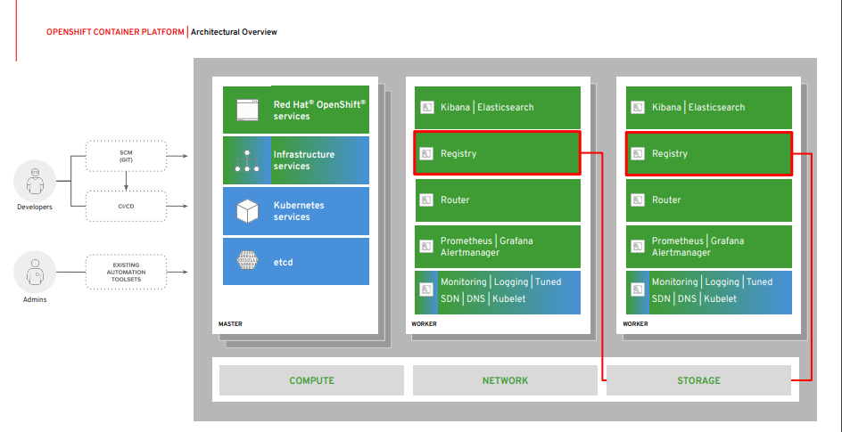
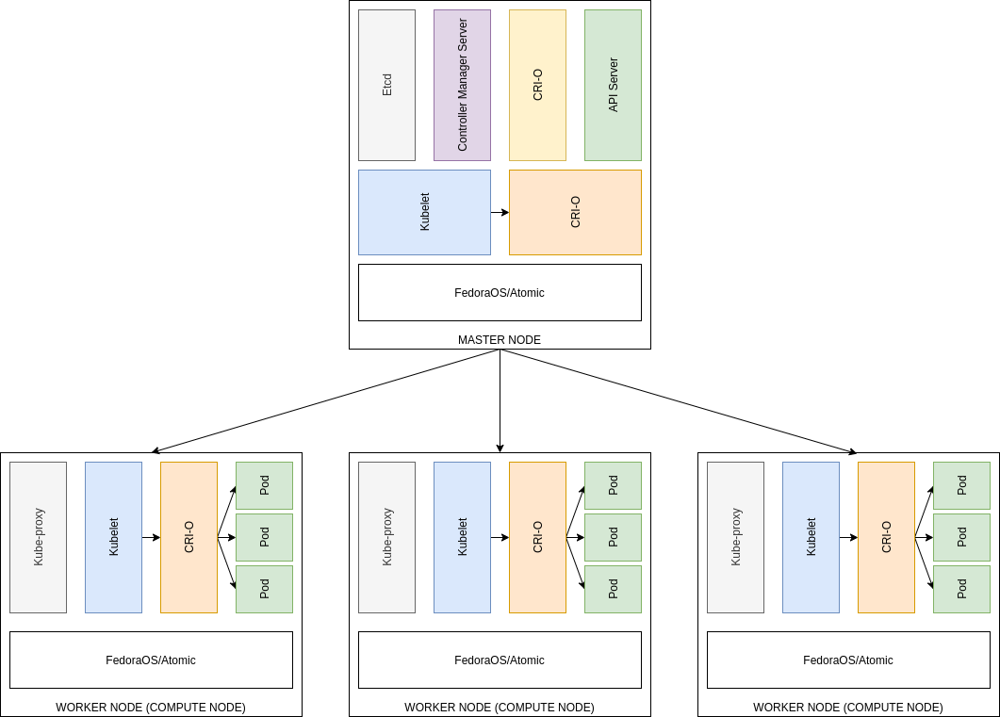
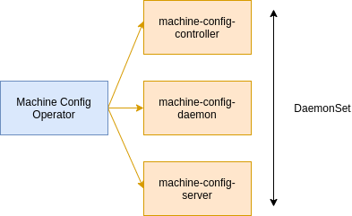

# Overview

- [Overview](#overview)
  - [1. What is OKD?](#1-what-is-okd)
  - [2. Features](#2-features)
  - [3. Lifecycle](#3-lifecycle)
  - [4. Architecture](#4-architecture)
  - [5. Control plane](#5-control-plane)

## 1. What is OKD?

OKD is a **distribution of Kubernetes** optimized for continuous application development & multi-tenant deployment. OKD adds **developer & operations-centric** tools on top of Kubernetes to enable rapid application development, easy deployment & scaling, & long-term lifecycle maintenance for small & large teams. OKD is the upstream Kubernetes distribution embedded in Red Hat OpenShift.

```
Kubernetes <-----> Linux Kernel
OKD        <-----> Fedora
OpenShift  <-----> RHOS
```

## 2. Features

- Hybrid cloud deployments.
- Custom operating system - Fedora CoreOS (FCOS):

  - CoreOS + [Red Hat Atomic Host](https://access.redhat.com/documentation/en-us/red_hat_enterprise_linux_atomic_host/7/html/installation_and_configuration_guide/introduction_to_atomic_host)
  - Includes: Ignition (firstboot system configuratin) + CRI-O (Kubernetes native container runtime) + Kubelet (Kuberenetes node agent)

- Simplified installation & update process.
- Operators, Operator Lifecycle Manager & the OperatorHub.
- Include improvements in software defined networking (SDN), authentication, log aggregation, monitoring, & routing.

## 3. Lifecycle

The following figure illustrates the basic OKD lifecycle:

- Creating an OKD cluster
- Managing the cluster
- Developing & deploying applications
- Scaling up applications

## 4. Architecture



## 5. Control plane

- Control plane which is composed of **master machines**.
- Control plane manage workloads on the **worker machines**.
- Manage upgrade by the actions of the **operators** - Cluster Version Operator, Machine Config Operator...
- Machine roles, for details each component please check [the documentation](https://docs.okd.io/latest/architecture/control-plane.html).



- Kubelet & CRI-O must run directly on the host as **systemd** service because they need to be running before you can run other containers.
- Operators are the perferred method of packaging, deploying & managing services on the control plane.

  - Cluster Version Operator: manage the other Operators.
  - Platform Operators: manage a particular area of cluster functionality, such as cluster wide application logging, management of the Kubernetes control plane or the machine provisioning system.

  

  - Operators managed by Operator Lifecycle Management: are available for use in applications.
