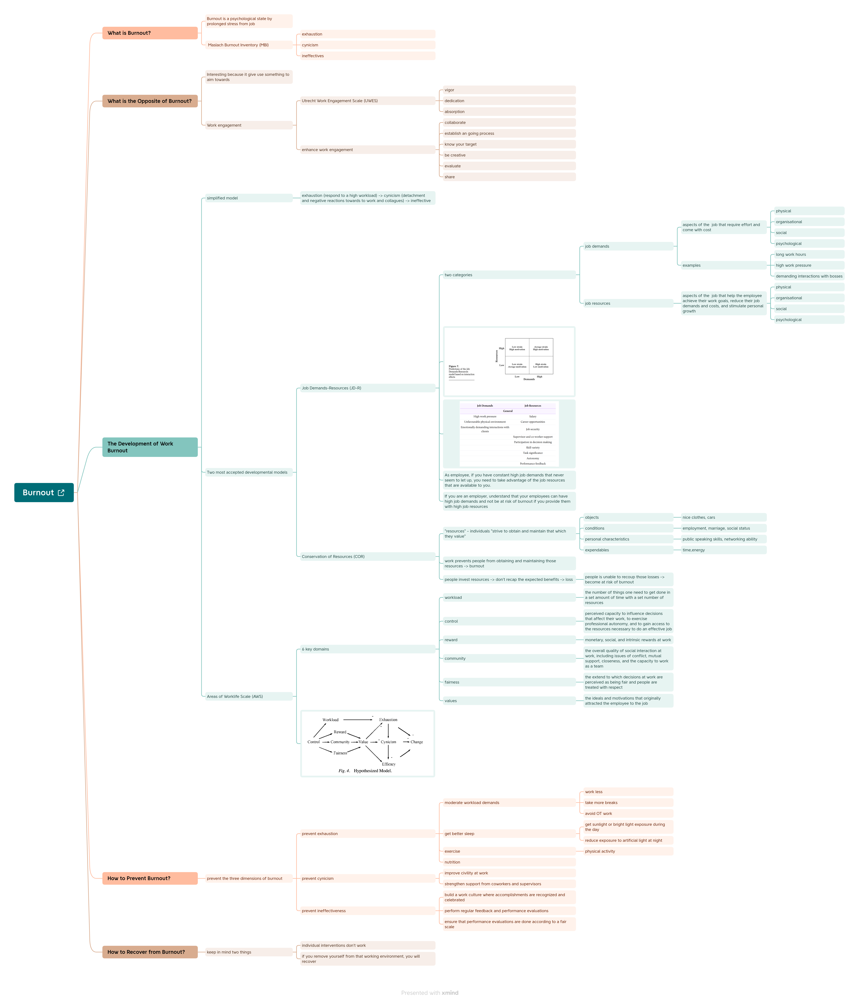

# Burnout

Source:

- <https://commoncog.com/g/burnout/>
- <https://news.ycombinator.com/item?id=32160212>

Table of contents:

- [Burnout](#burnout)
  - [0. Lời dẫn](#0-lời-dẫn)
  - [1. Burnout là gì?](#1-burnout-là-gì)

## 0. Lời dẫn

Các bài viết về Burnout (hay dịch nôm na là Kiệt sức) bằng tiếng Việt cũng có nhưng tôi muốn được tự mình tìm hiểu về vấn đề này, do vậy, guideline này ra đời. Guideline này được lược dịch từ nguồn [Commoncog](https://commoncog.com/g/burnout).

Tại sao tôi lại ngồi tìm hiểu burnout? Đơn giản là tôi muốn hiểu một cách tường tận về burnout, các dấu hiệu nhận biết, cách hồi phục,... có thể sẽ giúp ích cho chính bản thân và những người khác. Vấn đề sức khỏe tinh thần ở Việt Nam đang không được đánh giá đúng.

Bắt đầu thôi!

## 1. Burnout là gì?

Burnout là một trạng thái tâm lý gây ra bởi căng thẳng kéo dài từ công việc.

Có ba đặc điểm của burnout:

- Kiệt sức quá mức (Overwhelming exhaustion)
- Cảm giác hoài nghi (Feelings of cynicism)
- Cảm giác không hiệu quả (A sense of ineffectiveness).

Từ ba đặc điểm này - kiệt sức, hoài nghi, kém hiệu quả, các nhà nghiên cứu đã đưa ra một thang đo mức độ burnout, được biết đến với tên gọi [Maslach Burnout Inventory](https://www.ncbi.nlm.nih.gov/pmc/articles/PMC4911781/) (MBI). Thang đo này được công nhận rộng rãi dựa trên nghiên cứu tâm lý toàn diện.

Thang đo MBI rất quan trọng trong việc hiểu burnout là gì.

Lấy ví dụ, Mary ghét sếp của mình, cô thể hiện ra bằng những cuộc cãi vã liên tiếp với sếp. Điều này làm Mary cảm thấy exhausted (cũng dịch là kiệt sức, do vậy, tôi nghĩ nên để nguyên từ tiếng Anh) trong nhiều ngày liền. Dù vậy, cô ấy vẫn hoàn thành tốt công việc của mình.

> Dịch đến đây thì lười quá, vứt cái ảnh vào vậy

