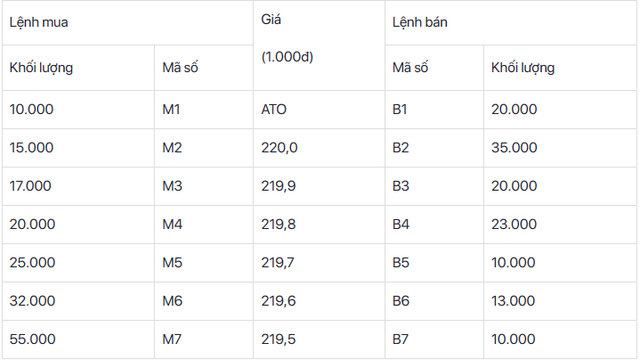
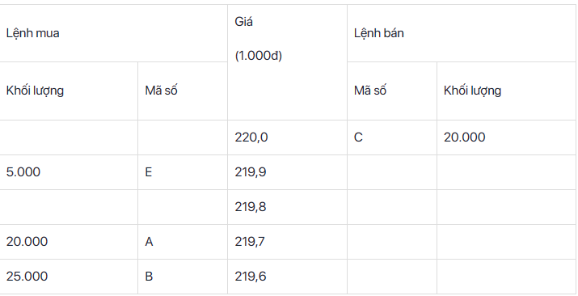

# Sổ tay chứng khoán

- [Sổ tay chứng khoán](#sổ-tay-chứng-khoán)
  - [1. Thị trường chứng khoán](#1-thị-trường-chứng-khoán)
    - [1.1. Tổng quan](#11-tổng-quan)
    - [1.2. Giờ giao dịch chứng khoán](#12-giờ-giao-dịch-chứng-khoán)
    - [1.3. Khớp lệnh](#13-khớp-lệnh)
    - [1.3. Các loại lệnh đặt trong thị trường chứng khoán](#13-các-loại-lệnh-đặt-trong-thị-trường-chứng-khoán)
  - [2. Các loại/sản phẩm chứng khoán](#2-các-loạisản-phẩm-chứng-khoán)
    - [2.1. Chứng khoán cơ sở](#21-chứng-khoán-cơ-sở)
      - [2.1.1. Cổ phiếu](#211-cổ-phiếu)
      - [2.1.2. Trái phiếu](#212-trái-phiếu)
    - [2.2. Chứng khoán phái sinh](#22-chứng-khoán-phái-sinh)
      - [2.2.1. Hợp đồng tương lai chỉ số VN30](#221-hợp-đồng-tương-lai-chỉ-số-vn30)
      - [2.2.2. Chứng quyền có bảo đảm](#222-chứng-quyền-có-bảo-đảm)
    - [2.3. Chứng chỉ quỹ ETFs](#23-chứng-chỉ-quỹ-etfs)
  - [3. Cách độc bảng giá chứng khoán](#3-cách-độc-bảng-giá-chứng-khoán)

## 1. Thị trường chứng khoán

- Nguồn:
  - <https://www.vietcap.com.vn/tin-tuc/kien-thuc-co-ban-ve-chung-khoan-nha-dau-tu-nhat-dinh-phai-biet>
  - <https://stockinsight.hsc.com.vn/gio-giao-dich-chung-khoan/>

### 1.1. Tổng quan

- Thị trường chứng khoán: một thị trường mà ở đó người ta mua bán, chuyển nhượng, trao đổi chứng khoán nhằm mục đích kiếm lời.
- Chức năng thị trường chứng khoán:
  - Huy động vốn đầu tư cho nền kinh tế
  - Cung cấp môi trường đầu tư cho các chứng khoán
  - Tạo tính thanh khoản cho các chứng khoán
  - Đánh giá hoạt động của doanh nghiệp
  - Tạo môi trường giúp Chính phủ thực hiện các chính sách kinh tế vĩ mô
- Thị trường sơ cấp:
  - Nơi cổ phiếu được phát hành lần đầu bởi công ty nhằm thu hút đầu tư. Người mua trên thị trường này thường là các tổ chức hoặc quỹ đầu tư có quy mô lớn.
  - Cổ phiếu lần đầu ra mắt công chúng (IPO)
  - Chào bán thêm cổ phiếu ra công chúng (FPO)
- Thị trường thứ cấp:
  - Nơi cổ phiếu được mua bán lại sau khi đã được phát hành trên thị trường sơ cấp. Đây là nơi mà những nhà đầu tư nhỏ lẻ có thể tham gia với số vốn ít, việc giao dịch dễ dàng hơn.
- Cơ cấu các chủ thể tham gia trên Thị trường chứng khoán Việt Nam (TTCKVN):

  

  - Bộ Tài chính: Cơ quan tài chính của Chính phủ Việt Nam - có trách nhiệm quản lý, giám sát thị trường chứng khoán, ngân sách Nhà nước, quản lý thuế, giá cả,...
  - Ủy ban chứng khoán Nhà nước: Trực thuộc bộ tài chính - có trách nhiệm quản lý, giám sát thị trường chứng khoán.
  - Trung tâm lưu ký chứng khoán (Vietnam Securities Depository - VSD): có chức năng đăng ký, lưu ký, bù trừ, thanh toán chứng khoán, cung cấp mã chứng khoán, quản lý tỷ lệ sở hữu của nhà đầu tư nước ngoài...
  - HSX (Sở giao dịch chứng khoán Tp Hồ Chí Minh): Quản lý sàn giao dịch chứng khoán Hồ Chí Minh - HOSE.
  - HNX (Sở giao dịch chứng khoán Hà Nội): Quản lý sàn giao dịch chứng khoán hà Nội - HNX và UPCOM.
  - Các công ty chứng khoán: các tổ chức tham gia kinh doanh trên thị trường chứng khoán ví dụ như SSI, VNDirect, VPS... Công việc chủ yếu của họ là tư vấn phát hành chứng khoán, môi giới chứng khoán, kết nối đến các nhà đầu tư, cung cấp các công cụ cho nhà đầu tư, trực tiếp tham gia đầu tư chứng khoán,...
  - Tổ chức phát hành: Các công ty, tập đoàn muốn huy động vốn thông qua thị trường chứng khoán bằng cách phát hành cổ phiếu, trái phiếu,...
  - Nhà đầu tư: Những người trực tiếp mua và bán chứng khoán trên thị trường chứng khoán bao gồm các nhà đầu tư cá nhân, nhà đầu tư nước ngoài, nhà đầu tư có tổ chức và các quỹ đầu tư
- Mã chứng khoán trên TTCK Việt Nam đang được quy chuẩn gồm 3 ký tự bao gồm chữ cái và/hoặc số và được cấp bởi Trung tâm lưu ký VSD. Mã chứng khoán của mỗi công ty niêm yết là duy nhất và không trùng lặp với những mã chứng khoán được niêm yết trước đó (trừ trường hợp mã chứng khoán đó đã được hủy trên 10 năm).
  - VIC = Vingroup
  - HPG: Công ty cổ phần Tập đoàn Hòa Phát.
- Chỉ số VNINDEX đại diện cho biến động của thị trường chứng khoán Việt Nam.
  - Chỉ số được tổng hợp và tính toán dựa trên sự biến động giá trị vốn hóa hàng ngày của tất cả các công ty đang niêm yết trên sàn chứng khoán HOSE.
  - Ví dụ: Chỉ số VNINDEX ngày 1/9/2021 đang là 1,334,65 điểm. So với mức giá trị gốc 100 điểm ngày 28/07/2000, chỉ số đã tăng 13.35 lần trong 21 năm hoạt động.
  - Quan sát biến động chỉ số VNINDEX giúp nhà đầu tư nắm bắt xu hướng của thị trường chung, cung cầu hay diễn biến tâm lý chung của các nhà đầu tư trên thị trường.
  - VNINDEX giúp nhà đầu tư thấy được giai đoạn phát triển hay suy giảm của nền kinh tế thể hiện qua xu hướng trưởng/suy giảm của chỉ số này.

### 1.2. Giờ giao dịch chứng khoán

- Khung giờ giao dịch chứng khoán là giờ hành chính theo lịch nhà nước quy định. Thời gian giao dịch chứng khoán Việt Nam là từ thứ 2 đến thứ 6 hàng tuần, nghỉ vào các ngày cuối tuần, và nghỉ vào các ngày lễ như Tết dương lịch hay Tết âm lịch.


- Nguyên tăc khớp lệnh theo giờ giao dịch: Lệnh mua và bán sẽ được khớp theo nguyên tắc ưu tiên về giá và thời gian, cụ thể:


### 1.3. Khớp lệnh

- Nguồn:
  - <https://stockinsight.hsc.com.vn/khop-lenh-duoc-thuc-hien-nhu-the-nao/>
- Ở trên, chúng ta đã nói đến _khớp lệnh_, vậy khớp lệnh là gì?

  - Khớp lệnh trong thị trường chứng khoán là việc thực hiện xong thoả thuận giữa bên mua và bên bán trên bảng giao dịch điện tử trực tuyến. Lệnh của các nhà đầu tư được ghép với nhau để giao dịch theo mức giá phù hợp với nguyên tắc ưu tiên khớp lệnh của thị trường.
  - Có 2 loại khớp lệnh:

    - Khớp lệnh định kỳ:

      - Phương thức giao dịch được thực hiện trên cơ sở so khớp các lệnh mua và lệnh bán chứng khoán tại một thời điểm xác định, để tìm ra mức giá mà tại đó khối lượng giao dịch là lớn nhất.
      - Thường được các sở giao dịch chứng khoán sử dụng để xác định giá mở cửa và đóng cửa.
      - Ví dụ:

        - Giả sử tại phiên khớp lệnh định kỳ xác định giá mở cửa của một mã chứng khoán có các lệnh mua và bán ở các mức giá như sau:

        

        - Theo nguyên tắc người đi mua muốn mua ở giá thấp, còn người bán muốn bán được giá cao, ta có bảng lũy kế mua và lũy kế bán ở các mức giá như sau:
          - Tại mức giá 220.000đ, tổng lũy kế mua là 15.000 + 10.000 (khối lượng đặt mua ATO) = 25.000
          - Tại mức giá 219.900đ, tổng lũy kế mua là 17.000 + 15.000 + 10.000 = 42.000
          - Tại mức giá 219.8000đ, tổng lũy kế mua là 20.000 + 17.000 + 15.000 + 10.000 = 62.000
          - Tại mức giá 219.500đ, tổng lũy kế bán là 10.000 + 20.000 (khối lượng đặt bán ATO) = 30.000
          - Tại mức giá 219.600đ, tổng lũy kế bán là 13.000 + 10.000 + 20.000 = 43.000
          - Tại mức giá 219.700đ, tổng lũy kế bán là 10.000 + 13.000 + 10.000 + 20.000 = 53.000
        - Như vậy, tại mức giá 219.800đ cho khối lượng cổ phiếu được giao dịch là nhiều nhất (62.000 cổ phiếu). Các lệnh mua M1, M2, M3, M4 được thực hiện trọn ven. Các lệnh bán B1, B7, B6, B5 được thực hiện trọn vẹn, và lệnh B4 còn lại 14.000 chưa được thực hiện (đã thực hiện 9.000).

        

    - Khớp lệnh liên tụcA:

      - Phương thức giao dịch được thực hiện trên cơ sở so khớp các lệnh mua và lệnh bán chứng khoán ngay khi lệnh được nhập vào hệ thống giao dịch.
      - Ví dụ:
        - Giả sử tại phiên khớp lệnh liên tục của một mã chứng khoán, hiện có các lệnh mua và bán ở các mức giá như sau:

      

      - Xuất hiện 1 lệnh mua 15.000 cổ phiếu với giá 219.900đ, lệnh đó sẽ lập tức được khớp 10.000 cổ phiếu với lệnh bán D, còn dư mua 5.000 ở giá 219.900đ. Khi đó các lệnh còn lại trên thị trường như sau:

      

      - Xuất hiện 1 lệnh bán MP (lệnh thị trường) 10.000 cổ phiếu. Lệnh sẽ được khớp 5.000 giá 219.900đ với lệnh mua E; 5.000 còn lại của lệnh thị trường chưa được khớp sẽ được chuyển thành lệnh giới hạn bán tại mức giá thấp hơn một đơn vị yết giá so với giá giao dịch cuối cùng trước đó. Khi đó các lệnh còn lại trên thị trường như sau:

      

### 1.3. Các loại lệnh đặt trong thị trường chứng khoán

- Nguồn:

  - <https://stockinsight.hsc.com.vn/gio-giao-dich-va-cac-lenh-dat-trong-chung-khoan-co-so/>
  - <https://zalopay.vn/cac-loai-lenh-trong-chung-khoan-2526>
  - <https://www.dnse.com.vn/hoc/cach-dat-lenh-mua-ban-chung-khoan>

- _Lệnh giới hạn (LO - Limit Order)_:
  - Lệnh mua hoặc lệnh bán chứng khoán tại một mức giá xác định hoặc tốt hơn.
  - Nếu đặt lệnh LO trước phiên giao dịch hoặc trong giờ nghỉ trưa, lệnh sẽ ở trạng thái chờ. Khi phiên giao dịch bắt đầu, hệ thống sẽ thông báo lệnh có hiệu lực.
  - Lệnh có hiệu lực kể từ khi được nhập vào hệ thống giao dịch cho đến hết ngày giao dịch hoặc cho đến khi lệnh bị hủy bỏ.
  - Sàn giao dịch: HOSE, HNX
  - Ví dụ: cổ phiếu A đang ở mức 20,000đ, bạn đặt lệnh mua với giá 19,000đ. Nếu có người bán cổ phiếu này với giá nhỏ hơn hoặc bằng 19,000đ, lệnh của bạn sẽ được khớp. Ngược lại, nếu giá vẫn ở mức 20,000dd hoặc cao hơn thì sẽ không có giao dịch nào cả.
- _Lệnh ATO (At The Open)_:
  - Lệnh giao dịch tại mức giá khớp lệnh xác định giá mở cửa
  - Lệnh ATO được ưu tiên trước lệnh giới hạn trong khi so khớp lệnh.
  - Thời gian nhập lệnh lên hệ thống là trước hoặc trong phiên khớp lệnh định kỳ xác định giá mở cửa.
  - Chỉ được thực hiện trong khoảng thời gian từ 9h đến 9h15. Sau thời gian này, nếu lệnh giao dịch ATO không được thực hiện hoặc lệnh chưa khớp hết sẽ bị hệ thống hủy.
  - Sàn giao dịch: HOSE
- _Lệnh ATC (At The Close)_:
  - Lệnh giao dịch tại mức giá khớp lệnh xác định giá đóng cửa.
  - Lệnh có hiệu lực trong khoảng thời gian từ 14h30 - 14h45. Sau đó, nếu lệnh không khớp hoặc không được thực hiệ thì sẽ bị hệ thống hủy bỏ.
  - Sàn giao dịch: HOSE, HNX
- _Lệnh MP (Market Price)_:
  - Lệnh mua chứng khoán tại mức giá bán thấp nhất hoặc bán chứng khoán tại mức giá cao nhất đang có trên thị trường.
  - Lệnh mà bên mua hoặc bán chậm nhất giao dịch với bất cứ giá nào.
  - Trong trường hợp lệnh MP chưa khớp hết khối lượng, nó được xem là lệnh dùng để mua ở mức giá cao hơn và bán ở mức giá thấp hơn tiếp theo đang có trên thị trường. Nếu theo nguyên tắc này mà lệnh MP vẫn không khớp hết khối lượng, thì lệnh MP sẽ chuyển thành lệnh LO.
  - Lệnh MP chỉ được nhập vào hệ thống trong phiên khớp lệnh liên tục.
  - Lệnh giao dịch MP sẽ bị hủy nếu trong thời gian nhập lệnh không có lệnh LO đối xứng.
  - Sàn giao dịch: HOSE
  - Ví dụ: bạn đặt lệnh MP để mua 3000 cổ phiếu A. Tại thời điểm đặt lệnh sẽ có những mức giá tương ứng với khối lượng được các bên rao bán như sau:
    - 80,000 - khối lượng 500 cp
    - 80,100 - khổi lượng 2000 cp
    - 80,200 - khối lượng 3000 cp
  - Nếu bạn đặt mua 3000 cổ phiếu A, thì 500 cp đầu tiên sẽ khớp lệnh với giá 80,000/1cp, 2000cp tiếp theo sẽ khớp lệnh với giá 80,100/1cp; 500cp còn lại sẽ khớp lệnh với giá 80,200d/1cp.
- _Lệnh thị trường sàn HNX_:
  - _Lệnh thị trường giới hạn (MTL - Market To Limit)_: Lệnh nếu chưa được thực hiện toàn bộ thì phần còn lại sẽ chuyển thành lệnh LO.
    - Ví dụ: bạn đặt mua 500 cổ phiếu nhưng chỉ mua được 300 cổ, với lệnh MTL, 200 cổ còn lại sẽ được chuyển sang lệnh LO.
  - _Lệnh thị trường khớp toàn bộ hoặc hủy (MOK - Fill or Kill order)_: nếu không thực hiện được toàn bộ thì bị huỷ ngay sau khi nhập.
    - Ví dụ: bạn đặt mua 500 cổ phiếu nhưng chỉ có 300 cổ thoả mãn giao dịch, 200 cổ phiếu không thể khớp lệnh. Nếu với lệnh MAK, bạn vẫn mua được 300 cổ phiếu thì với MOK, lệnh mua 500 cổ phiếu này sẽ bị huỷ bỏ do không thể khớp lệnh toàn bộ.
  - _Lệnh thị trường khớp và hủy (MAK - Fill and Kill order)_: tức có thể thực hiện toàn bộ hoặc một phần, phần còn lại sẽ bị huỷ ngay sau khi khớp lệnh.
    - Ví dụ: bạn đặt mua 500 cổ phiếu XYZ giá 20 000đ nhưng chỉ khớp được 300 cổ. 200 cổ phiếu còn lại không thể mua được do không có người bán với giá tương ứng. Vậy lệnh mua 200 cổ phiếu này lại sẽ bị huỷ, cổ phiếu được trả về tài khoản.
- _Lệnh khớp lệnh sau giờ PLO (Post Limit Order)_:
  - Lệnh PLO dùng để giao dịch chứng khoán sau khi phiên ATC kết thúc tại mức giá đóng cửa của phiên
  - Chỉ được nhập vào hệ thống trong khoảng thời gian từ 14h45 đến 15h.
  - Lệnh PLO sẽ được khớp ngay nếu có sẵn lệnh đối ứng.
  - Lệnh giao dịch PLO không được thực hiện hoặc chưa khớp hết khối lượng sẽ bị hủy.
  - Sàn giao dịch: HNX
- _Lệnh điều kiện (lệnh chờ)_:
  - Loại lệnh kèm theo điều kiện, vì vậy khi nhà đầu tư đặt lệnh nó sẽ ở trạng thái chờ và chỉ được đẩy vào sàn khi đã đáp ứng được các điều kiện đã đặt.
  - _Lệnh điều kiện với thời gian (TCO)_: nhà đầu tư có thể đặt lệnh trước phiên giao dịch từ một đến nhiều ngày với số lượng và mức giá xác định. Lệnh này có hiệu lực tối đa trong 30 ngày.
  - _Lệnh tranh mua hoặc tranh bán (PRO)_: lệnh nhà đầu tư sẵn sàng mua ở các giá ATO/trần/ATC và sẵn sàng bán ở các giá ATO/sàn/ATC.
  - _Lệnh dừng (ST)_: lệnh để nhà đầu tư xác định trước giá cắt lỗ hoặc chốt lãi trong tương lai.
  - _Lệnh xu hướng (TS)_: nhà đầu tư sẽ chọn mã chứng khoán và khối lượng muốn giao dịch, cộng thêm khoảng dừng theo giá trị tuyệt đối (nghìn đồng) hoặc giá trị tương đối (%).
  - Ví dụ: bạn đang sở hữu mã cổ phiếu XYZ với giá 20.000đ. Bạn muốn giảm thiểu rủi ro nên đặt lệnh điều kiện bán cổ khi giá thị trường xuống chỉ còn 17.000đ. Hệ thống sẽ tự áp dụng lệnh điều kiện bạn đã đặt và thực hiện bán cổ phiếu XYZ khi giá cổ phiếu giảm còn 17.000đ.

## 2. Các loại/sản phẩm chứng khoán

- Chứng khoán là gì? Phân tích, "Chứng" = chứng minh, chứng cứ; "Khoán" = bằng cứ (bằng chứng) để lấy đồ.
- Vậy chứng khoán là một bằng chứng xác nhận sự sở hữu hợp pháp của người sở hữu đó với tài sản hoặc phần vốn của công ty hay tổ chức đã phát hành. Và được ghi nhớ của cả hai bên bởi một hợp đồng lưu ký hoặc chứng chỉ, bút toán ghi sổ hoặc dữ liệu điện tử.
- Hay hiểu đơn giản, chứng khoán là **hàng hóa** trên thị trường chứng khoán.
- Sản phẩm đầu tư chứng khoán được phân chia ra làm 3 loại:


- Tổng hợp:


### 2.1. Chứng khoán cơ sở

- Chứng khoán cơ sở được hiểu rộng là một cổ phiếu, trái phiếu, chỉ số,... mà các tài sản này là tham chiếu cho sự hình thành của các công cụ phái sinh như hợp đồng tương lai, ETFs hay hợp đồng quyền chọn.
- Ở thị trường Việt Nam, chứng khoán cở sở có 2 loại:

#### 2.1.1. Cổ phiếu

- Một loại chứng khoán được biết đến như một giấy chứng nhận số tiền mà nhà đầu tư đã đóng cho doanh nghiệp phát hành, nhằm mục đích xác nhận quyền sở hữu một hay một số cổ phần của công ty.
- Có 2 loại cổ phiếu:
  - _Cổ phiếu thường_ (Cổ phiếu phổ thông): dùng để xác định quyền sở hữu của các cổ đông.
  - _Cổ phiếu ưu đãi_: cổ phiếu mà người nắm giữ có thể nhận ưu đãi về cổ tức được xác định bằng một số tiền nhất định in trên cổ phiếu hoặc tính theo tỷ lệ phần trăm cố định theo mệnh giá cổ phiếu.
- Chỉ số cổ phiếu:
  - Chỉ số cổ phiếu thống kê, đo lường sự biến động của một số danh mục cổ phiếu. Dựa vào chỉ số này mà nhà đầu tư đánh giá mức độ tiềm năng, định giá cổ phiếu trong tương lai, khả năng sinh lời của cổ phiếu.
  - Các chỉ số cơ bản:
    - Chỉ số P/E – Price to Earning: Là chỉ số đánh giá mối quan hệ giữa giá thị trường của cổ phiếu với thu nhập trên một cổ phiếu. Nếu chỉ số P/E thấp chứng tỏ cổ phiếu đang bị định giá thấp, có lợi cho nhà đầu tư.
    - Chỉ số EPS – Earning per Share: Thu nhập trên mỗi cổ phần hay lợi nhuận sau thuế trên mỗi cổ phần sẽ nhận được sau khi công ty đã chia hết tiền lãi cho cổ đông. EPS cao chứng tỏ công ty đang có tốc độ phát triển tốt, ổn định.
    - Chỉ số P/B – Price to Book Value Ratio: Tỷ lệ giá trên số sách. Chỉ số này dùng để so sánh giá trị thực tế của một cổ phiếu so với giá trị ghi sổ của cổ phiếu đó. Chỉ số P/B càng thấp chứng tỏ nhà đầu tư đang trả ít hơn so với giá trị sổ sách ghi nhận.
    - Chỉ số DPR – Tỷ lệ chi trả cổ tức: Thể hiện mức chi trả cổ tức cho các cổ đông so với mức mà công ty kiếm được. Số tiền không được trả cho các cổ đông được công ty giữ lại để tái đầu tư tăng trưởng, trả nợ hoặc thêm vào lợi nhuận giữ lại. Chỉ số DPR cao cho thấy công ty đang phát triển và tạo ra lợi nhuận tốt.
- Giá cổ phiếu là mức giá của cổ phiếu tại một thời điểm nhất định, có nghĩa là số tiền mà nhà đầu tư cần bỏ ra để sở hữu cổ phiếu đang giao dịch trên thị trườnG. Chỉ số giá biến động hằng ngày và chịu ảnh hưởng của nhiều yếu tố khác nhau: Thị trường và kinh tế, quy luật cung cầu, kết quả hoạt động kinh doanh của doanh nghiệp, tâm lý nhà đầu tư.
- Các loại giá cổ phiếu:

  - Giá tham chiếu là mức giá cơ sở để tính giới hạn giá cổ phiếu giao động trong phiên giao dịch, dựa vào đây để xác định giá sàn và giá dịch của ngày giao dịch hiện tại. Trong đó, giá tham chiếu ở các sàn giao dịch sẽ khác nhau:
    - Tại sàn HOSE và HNX: Giá tại thời điểm đóng cửa của ngày giao dịch liền kề trước đó.
    - Tại sàn Upcom: Mức bình quân gia quyền của giá giao dịch thực hiện theo phương pháp khớp lệnh cuối cùng của ngày giao dịch trước đó.
  - Giá sàn là mức giá thấp nhất hay mức giá kịch sàn mà nhà đầu tư có thể đặt lệnh mua/bán trong ngày giao dịch.

  ```ụnknown
  Giá sàn = Giá tham chiếu x (100% + Biên độ dao động)
  ```

  - Giá trần là mức giá cao nhất hay mức giá kịch trần mà nhà đầu tư có thể đặt lệnh mua/bán trong ngày giao dịch.

  ```unknown
  Giá trần = Giá tham chiếu x (100% – Biên độ dao động)
  ```

  - Biên độ dao động:

  

#### 2.1.2. Trái phiếu

- Nguồn: <https://stockinsight.hsc.com.vn/trai-phieu-la-gi/>
- Trái phiếu là một chứng nhận nghĩa vụ nợ của nhà phát hành (người vay tiền) bắt buộc phải trả cho người nắm giữ trái phiếu (người cho vay) với một khoản tiền cụ thể.
  - Có thời gian xác định cụ thể, với một lợi tức theo quy định.
  - Nhà phát hành phải hoàn trả khoản vay ban đầu khi nó đáo hạn.
  - Nhà phát hành trái phiếu có thể là doanh nghiệp, một tổ chức chính quyền hay Kho bạc nhà nước.
- Giá trái phiếu:
  - Định mức giá trị của mỗi trái phiếu khi được chào bán ra thị trường.
  - Một số khái niệm:
    - Giá đi ngang: giá trái phiếu = giá phát hành của trái phiếu đó và được chào bán ra thị trường.
    - Giá chiết khấu: Mệnh giá của trái phiếu > giá phát hành. Các nhà đầu tư trái phiếu có thể mua trái phiếu với giá thấp hơn mệnh giá của nó.
    - Giá gia tăng: Giá bán phát hành thị trường > mệnh giá trái phiếu.
- Thời hạn của trái phiếu: thời gian số năm trái phiếu được lưu hành trên thị trường. Hết thời hạn -> thanh toán gốc lẫn lãi.
- Lợi tức trái phiếu: giá trị lãi suất được ghi trên trái phiếu không bao gồm mệnh giá của trái phiếu.

```unknown
Lợi tức của trái phiếu = Số giá trị thanh toán thưởng hàng năm / Giá trị của trái phiếu.
```

- Tiền lãi:


- Phân loại:

  - Phân loại theo lợi tức trái phiếu:

    - Trái phiếu có lãi suất cố định: Lợi tức của trái phiếu được xác định theo một tỷ lệ phần trăm (%) cố định tính theo mệnh giá.
    - Trái phiếu có lãi suất biến đổi (lãi suất thả nổi): Lợi tức của trái phiếu được trả trong các kỳ có sự khác nhau và được điều chỉnh theo một lãi suất tham chiếu.
    - Trái phiếu có lãi suất bằng không là loại trái phiếu mà người mua không nhận được lãi, nhưng được mua với giá thấp hơn mệnh giá và được hoàn trả bằng mệnh giá khi trái phiếu đó đáo hạn.

  - Phân loại theo người phát hành.
  - Phân loại theo hình thức trái phiếu.
  - Phân loại theo tính chất trái phiếu.
  - Phân loại theo mức độ thanh toán của trái phiếu

### 2.2. Chứng khoán phái sinh

- Giá trị dựa trên tài sản cơ sở hoặc một nhóm tài sản cơ sở (chỉ số chung). Chứng khoán phái sinh bản chất là hợp đồng giữa 2 hoặc nhiều người tham gia được suy ra từ sự biến động giá của tài sản cơ sở.
- Ở Việt Nam phát triển 2 sản phẩm:

#### 2.2.1. Hợp đồng tương lai chỉ số VN30

- Tham chiếu dựa vào tài sản cơ sở là chỉ số VN30 với 4 kỳ hạn.

#### 2.2.2. Chứng quyền có bảo đảm

- Nguồn:
  - <https://hsc.com.vn/chung-quyen-co-bao-dam/kien-thuc-ve-chung-quyen.html>
  - <https://www.ssi.com.vn/khach-hang-ca-nhan/kien-thuc-chung-quyen-co-bao-dam>
- Chứng quyền có bảo đảm (Covered warrant – CW) là một loại chứng khoán có tài sản đảm bảo do công ty chứng khoán phát hành và có đặc điểm tương tự như một hợp đồng quyền chọn. Nhà đầu tư giữ chứng quyền được quyền mua (đối với chứng quyền mua) chứng khoán cơ sở tại một mức giá đã được xác định trước (giá thực hiện) tại một thời điểm đã được ấn định trước (ngày đáo hạn) (trường hợp thanh toán bằng chứng khoán cơ sở), hoặc nhận khoản tiền thanh toán là chênh lệch giữa giá thực hiện và giá thanh toán tại ngày đáo hạn (trường hợp thanh toán bằng tiền).
- Theo lý thuyết, Giá của một chứng quyền khi chưa đáo hạn bao gồm hai phần: giá trị nội tại và giá trị thời gian, trong đó:

- Giá trị nội tại của một chứng quyền: chính là khoản chênh lệch giữa giá của chứng khoán cơ sở và giá thực hiện của chứng quyền. Khi chứng quyền đang lưu hành, chứng quyền luôn tồn tại một trong ba trạng thái sau:

| Trạng thái    | Chứng quyền mua          | Chứng quyền bán           |
| ------------- | ------------------------ | ------------------------- |
| Có lãi – ITM  | Giá CKCS > Giá thực hiện | Giá CKCS < Giá thực hiện  |
| Lỗ – OTM      | Giá CKCS < Giá thực hiện | Giá CKCS > Giá thực hiện  |
| Hòa vốn – ATM | Giá CKCS = Giá thực hiện | Giá CKCS = Giá thực hiện~ |

- Giá trị thời gian của CW là chênh lệch giữa giá của chứng quyền trên thị trường và giá trị nội tại của chứng quyền đó. Một chứng quyền ở trạng thái lỗ (OTM) sẽ không có giá trị nội tại mà chỉ có giá trị thời gian. Giá trị thời gian của CW sẽ giảm theo thời gian và bằng 0 vào ngày đáo hạn của CW.
- Ví dụ minh họa:

  - Ngày 01/04/2019, một nhà đầu tư mua chứng quyền CVNM1901 (Chứng quyền mua cổ phiếu VNM phát hành đợt 1 của năm phát hành 2019) với các tham số như sau:
    - Thời gian còn lại: 5 tháng
    - Giá VNM tại ngày 01/4/2019: S = 200,000 đ
    - Giá mua chứng quyền: 20,870 đ
    - Giá thực hiện: 220,000 đ
    - Ngày đáo hạn: 1/11/19
  - Trường hợp 1: Nhà đầu tư giữ Chứng quyền đến đáo hạn:

    - Vào ngày đáo hạn (1/11/2019), khoản lãi/lỗ đối với nhà đầu tư phụ thuộc vào giá VNM. Cụ thể:

    | Giá VNM tại ngày đáo hạn | Trạng thái chứng quyền | Khoản tiền thanh toán cho chứng quyền | khoản lời/lỗ              | %Lợi nhuận/lỗ               |
    | ------------------------ | ---------------------- | ------------------------------------- | ------------------------- | --------------------------- |
    | 200,000                  | OTM                    | Không thanh toán                      | Lỗ 20,870 đ               | Lỗ 100%                     |
    | 220,000                  | ATM                    | Không thanh toán                      | Lỗ 20,870 đ               | Lỗ 100%                     |
    | 250,000                  | ITM                    | 250,000 – 220,000 = 30,000 đ          | 30,000 – 20,870 = 9,130 đ | Lời 9,130 / 20,870 = 43.75% |

    

  - Trường hợp 2: Nhà đầu tư bán Chứng quyền trước khi đáo hạn:

    - Sau 2 tháng, vào 01/6/2019, nhà đầu tư bán lại Chứng quyền trên thị trường.

    | Giá VNM tại ngày đáo hạn | Trạng thái chứng quyền | Giá chứng quyền | khoản lời/lỗ                  | Hệ số đòn bẩy khi mua CQ so với mua CKCS |
    | ------------------------ | ---------------------- | --------------- | ----------------------------- | ---------------------------------------- |
    | 200,000                  | OTM                    | 13,960 đ        | Lỗ 13,960 – 20,870 = 6,910 đ  | N/A                                      |
    | 220,000                  | ATM                    | 24,180 đ        | Lời 24,180 – 20,870 = 3,310 đ | 15.86% / 10% = 1.586 lần                 |
    | 250,000                  | ITM                    | 44,610 đ        | 113.75% / 25% = 4.55 lần      | 113.75% / 25% = 4.55 lần                 |

### 2.3. Chứng chỉ quỹ ETFs

- Tập hợp một rổ chứng khoán được niêm yết trên sàn, thông thường là sẽ tham chiếu theo chỉ số cơ sở là các chỉ số chung, chỉ số nhóm ngành hay đơn giản là một rổ chỉ số được tạo ra dựa trên chiến lược của nhà tạo lập.
- Ở Việt Nam, ETFs được chia làm 2 loại:
  – ETFs ngoại là những ETFs có công ty quản lý quỹ, nhà tạo lập là các tổ chức nước ngoài: Vaneck, FTSE…
  – ETFs nội là những ETFs có công ty quản lý quỹ, nhà tạo lập là các tổ chức trong nước: VFM, SSIAM…

## 3. Cách độc bảng giá chứng khoán
