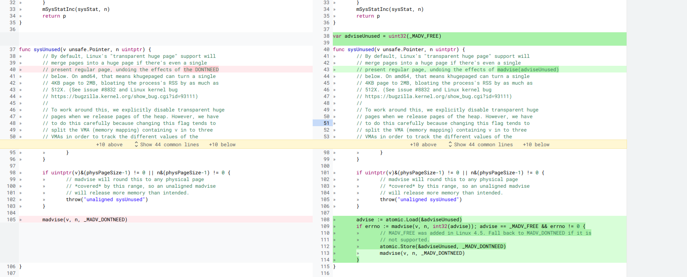

# Prometheus or Golang applicaions memory leak troubleshooting

- [Prometheus or Golang applicaions memory leak troubleshooting](#prometheus-or-golang-applicaions-memory-leak-troubleshooting)
  - [1. Environment, version & issue](#1-environment-version--issue)
    - [1.1. Environment](#11-environment)
    - [1.2. Issue](#12-issue)
  - [2. Troubleshooting](#2-troubleshooting)
    - [2.1. Golang version](#21-golang-version)
    - [2.2. Does it affect Prometheus memory usage?](#22-does-it-affect-prometheus-memory-usage)
  - [3. Choose the right metric for Prometheus memory monitoring](#3-choose-the-right-metric-for-prometheus-memory-monitoring)

## 1. Environment, version & issue

### 1.1. Environment

- Prometheus v2.1x.
- Golang >= 1.12.
- Cadvisor v0.35.0
- Containerize.
- Linux kernel 3.10.xxx

### 1.2. Issue

- The memory leak might happen when Prometheus server receives a huge query. We expect its memory to come up then down.
- Prometheus server memory usage is increasing without ever coming down. This might look like a leak or some bug in memory allocation. Even worse it looks like the container is just about to run OOM.
- Prometheus keeps sending alerts.
- Which metric is used? `container_memory_usage_bytes` and `container_memory_working_set_bytes`.

## 2. Troubleshooting

### 2.1. Golang version

- Started from version 1.12, Golang runtime now uses `MADV_FREE` to release unused memory, check [the release note](https://golang.org/doc/go1.12#runtime):

```
MADV_DONTNEED -> MADV_FREE (if available)
```

- Go deeper, Golang runtime uses [madvise](https://man7.org/linux/man-pages/man2/madvise.2.html) system call - `give advice about use of memory`. There are many advice values, but we are only care about these two:

  - `MADV_DONTNEED`: Do not expect access in the near future. (For the time being, the application is finished with the given range, so the kernel can free resources associated with it).
  - `MADV_FREE` (**since kernel 4.5**): The application no longer requires the pages in the range specified by addr and len. The kernel can thus free these pages, but the freeing could be delayed until memory pressure occurs.

- `MADVISE_FREE` was added in Linux 4.5. Fall back to `MADV_DONTNEED` if it is not supported. Check the [patch](https://go-review.googlesource.com/c/go/+/135395).



- The kernel won't free resources associated with the given range until memory pressure occurs. Memory pressure means that other processes or the kernel itself do not have enough memory in the unused pool.
- `Go runtime is reluctant to give memory pages back`.

### 2.2. Does it affect Prometheus memory usage?

- Go runtime is reluctant to give memory pages back so Prometheus memory usage won't be down if there are still enough resources in pool. It makes sense. But the used Linux kernel is just 3.10, it shouldn't act like that. Go runtime should fall back to use `MADV_DONTNEED`.
- Prometheus server is containerized so might it have a different behavior? _No, there's no kernel inside a container. Containers are processes, they also make system calls to the kernel_. The behavior should be the same.


- To make sure, I use [strace](https://man7.org/linux/man-pages/man1/strace.1.html) to trace system calls in the host. (No images here due to company privacy policies)

```bash
# Check kernel
$ uname -a
Linux hlc6fctl-2 3.10.0-957.5.1.el7.x86_64 #1 SMP Fri Feb 1 14:54:57 UTC 2019 x86_64 x86_64 x86_64 GNU/Linux
# Get prometheus pid first
$ ps aux | grep prometheus
# Strace
$ strace -p <pid> -e trace=madvise
# strace -p <pid> 2>&1 | grep madvise
```

- The result... Somehow it still uses `MADV_FREE` even the linux kernel is 3.10 :confused:

```bash
$ strace -p 22433 2>&1 | grep madvise
madvise(0xcb708d0000, 8192, MADV_FREE)  = 0
madvise(0xcb70860000, 8192, MADV_FREE)  = 0
madvise(0xcb703ce000, 8192, MADV_FREE)  = 0
madvise(0xcb7037c000, 8192, MADV_FREE)  = 0
madvise(0xcb52fca000, 8192, MADV_FREE)  = 0
madvise(0xcb52fba000, 8192, MADV_FREE)  = 0
madvise(0xcb52f7c000, 8192, MADV_FREE)  = 0
madvise(0xcb52eea000, 8192, MADV_FREE)  = 0
madvise(0xcb52ee8000, 8192, MADV_FREE)  = 0
madvise(0xcb52ee2000, 8192, MADV_FREE)  = 0
madvise(0xcb52e88000, 8192, MADV_FREE)  = 0
madvise(0xcb52d00000, 8192, MADV_FREE)  = 0
madvise(0xcb52cf0000, 8192, MADV_FREE)  = 0
madvise(0xcb52c24000, 8192, MADV_FREE)  = 0
madvise(0xcb52b4c000, 8192, MADV_FREE)  = 0
madvise(0xcb52b4a000, 8192, MADV_FREE)  = 0
madvise(0xcb52b26000, 8192, MADV_FREE)  = 0
madvise(0xcb52b22000, 8192, MADV_FREE)  = 0
madvise(0xcb52a9a000, 8192, MADV_FREE)  = 0
madvise(0xcb52a36000, 8192, MADV_FREE)  = 0
madvise(0xcb529e4000, 8192, MADV_FREE)  = 0
madvise(0xcb5289e000, 8192, MADV_FREE)  = 0
madvise(0xcb5289c000, 8192, MADV_FREE)  = 0
madvise(0xcb52896000, 8192, MADV_FREE)  = 0
madvise(0xcb52836000, 8192, MADV_FREE)  = 0
madvise(0xcb52810000, 8192, MADV_FREE)  = 0
madvise(0xcb527ee000, 8192, MADV_FREE)  = 0
madvise(0xcb527ec000, 8192, MADV_FREE)  = 0
```


- I get stuck right there, but at least it explains everything - why Prometheus memory usage doesn't go down.

## 3. Choose the right metric for Prometheus memory monitoring

- `container_memory_usage_bytes`: _NOPE_ - From the [cgroup doc](https://www.kernel.org/doc/Documentation/cgroup-v1/memory.txt):

```
For efficiency, as other kernel components, memory cgroup uses some optimization to avoid unnecessary cacheline false sharing. usage_in_bytes is affected by the method and doesn’t show ‘exact’ value of memory (and swap) usage, it’s a fuzz value for efficient access. (Of course, when necessary, it’s synchronized.) If you want to know more exact memory usage, you should use RSS+CACHE(+SWAP) value in memory.stat(see 5.2).
```

- `container_memory_working_set_bytes`: _BETTER BUT NOT ENOUGH_ - It takes the fuzzy, still include cache/buffer.

```go
workingSet := ret.Memory.Usage
  if v, ok := s.MemoryStats.Stats["total_inactive_file"]; ok {
    if workingSet < v {
      workingSet = 0
    } else {
      workingSet -= v
    }
  }
  ret.Memory.WorkingSet = workingSet
```

- `go_memstats_alloc_bytes` and others (`go_memstats_.*_inuse_byte`): _GOOD_ - Get the actual allocations, it helps filter out the memory that is "cached". Note that `container_memory_.*_bytes` can have totally different update intervals to `go_memstats_.*_bytes` .
