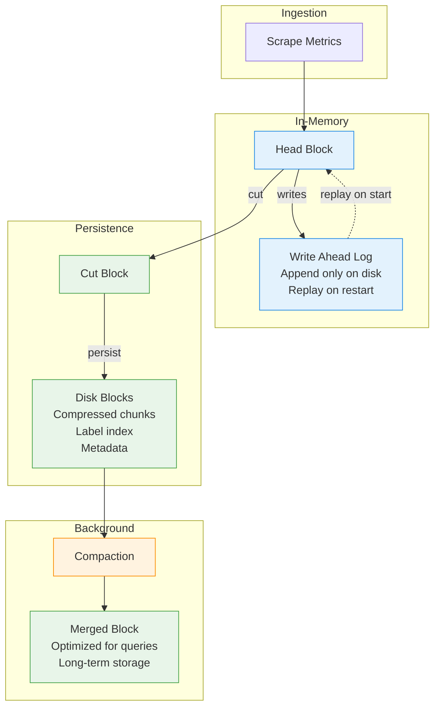

# TSDB

Source:

- <https://youtu.be/LOZQFT8Dcq0>
- <https://ganeshvernekar.com/blog/prometheus-tsdb-the-head-block/>
- <https://web.archive.org/web/20220205173824/https://fabxc.org/tsdb/>
- <https://www.usenix.org/conference/srecon22apac/presentation/vernekar>
- <https://flaneur2020.github.io/posts/2020-07-18-prometheus-tsdb/>
- <https://zhenghe-md.github.io/blog/2020/02/27/The-Evolution-of-Prometheus-Storage-Layer/>
- <https://www.groundcover.com/learn/observability/prometheus-tsdb>

- Inside the TSDB, new samples first land in an in-memory head block. For every scrape, Prometheus appends the samples to the relevant time series in this head block and records them in a write-ahead log (WAL) on disk (perform `fsync`).
  - The WAL lets Prometheus replay recent data after a crash, so you do not lose the latest scrapes.
  - WAL files are rotated and checkpointed over time so recovery stays fast and disk usage does not grow unchecked.
- Once enough data accumulates or a configured time window passes, Prometheus cuts a new block on disk that contains compressed chunks of samples, a label index, and metadata about the block time range.
  - Prometheus stores data in time-based blocks on disk (by default `2h` block). very block lives in its own directory and contains three main things: compressed chunks of samples, an index file, and metadata that describes the time range and basic statistics.
  - As time passes, new blocks are created for fresh data while older blocks are merged or removed according to your retention settings.
  - Inside a block, each time series is split into chunks, which hold consecutive samples for that series. Prometheus uses delta-style compression for timestamps and values so it can pack many samples into a small space.
  - Prometheus relies heavily on labels, so TSDB uses an inverted index to map label pairs like `status="500"` to the series that match them.  When you run a PromQL query with label filters, Prometheus looks up matching series through this index instead of scanning all data. It's good for compact and predictable label sets, but over granular or unbounded labels (high cardinality) could cause a blowup in series count and memory usage.
- Background compaction then merges smaller blocks into larger ones to keep both storage usage and query performance under control.
