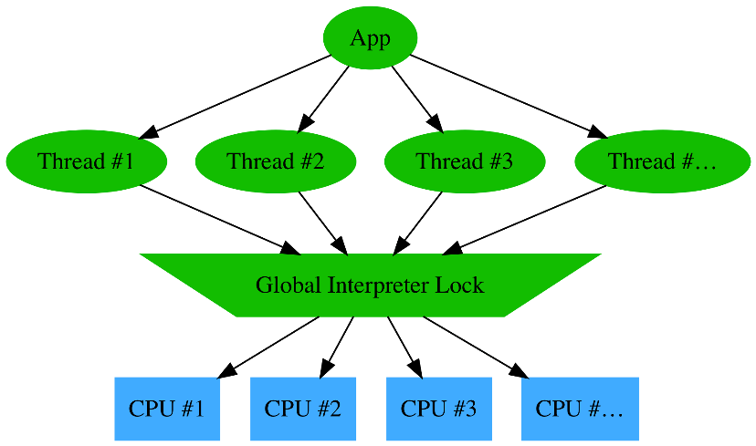
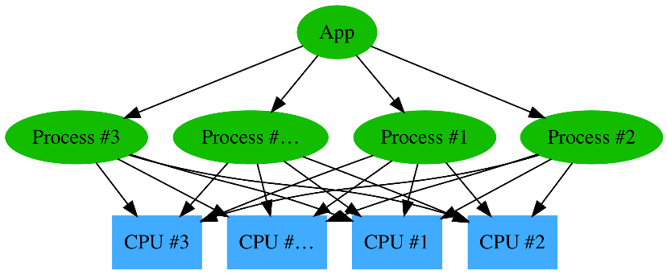

# Scaling Python

> **NOTE**: This is just my summary when read the book, **is not** the copy of the book. You can find this book [here](https://scaling-python.com/)

## Chapter 1: Scaling?

### 1.1 Across CPU

### 1.2. Distributed Systems

* Advantages:
  * Horizontal scalability
  * Fault tolerance
* Drawbacks:
  * Multithreading, concurrency & parallelism come into play and complicate the workflow (e.g locking usage).
  * What can fail will fail, such as random node in the middle of an operation or a laggy network, so tolerance for failure must be built-in.
* Approach to writing distributed system is to make them purely functional, i.e. without any shared state -> **Stateless**

### 1.3 Service-Oriented Architecture

* An architecture style where a software design is made up of several independent components communicating over a network.
* Being **stateless**.
* How to split your application into different services: Object-oriented approach (each *noun* is a serivce), Functional approach (each *verb* is a service).
* Some services need to scale independently -> split, if they are latency sensitive -> work together closely.

## Chapter 2: CPU Scaling

### 2.1 Using Threads

* GIL limits the performance of CPython when executing multiple threads.
* Threads are useful when doing parallel computing or input/output on slow network or files: those tasks can run in parallel without blocking the main thread.

### 2.2 Using Processes

### 2.3 Using Futures

* `concurrent.futures` module -> schedule asynchronous task.
* `concurrent.futures` -> provides an easier to use abstraction layer on top of the `threading` and `multiprocessing` modules.
* Future object owns the promise of the work to be completed.

### 2.4 Adavanced futures usage
