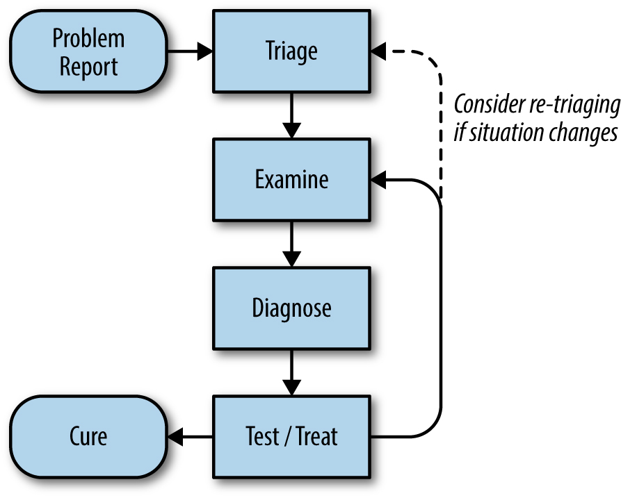

# Troubleshooting - Xử lý sự cố

Source: <https://sre.google/sre-book/effective-troubleshooting/>

> Troubleshooting, dịch là "xử lý sự cố". Trong bài viết này, tôi vẫn sẽ giữ nguyên là "Troubleshooting".

Troubleshooting là một kỹ năng tối quan trọng đối với bất cứ ai vận hành một hệ thống phân tán - đặc biệt là SREs. Đây không phải là một kỹ năng gì đó quá cao siêu, dành cho số ít; chúng ta đơn giản chỉ cần học đúng cách.

Về căn bản, để có thể Troubleshooting liên quan đến một hệ thống, bạn cần có hai yếu tố:

- Sự hiểu biết về cách thức troubleshooting một cách tổng quát (không yêu cầu bất kỳ kiến thúc hệ thống cụ thể nào).
- Kiến thức vững chắc về hệ thống đó.

Hai yếu tố này phải luôn đi cùng nhau để đạt được hiệu quả tốt nhất. Bạn có thể tiếp cận vấn đề bằng cách chỉ sử dụng các quy trình troubleshooting tổng quát, nhưng cách tiếp cận này thường kém hiệu quả do thiếu đi sự hiểu biết về hệ thống. Ngược lại, nếu bạn là một người biết cách hệ thống hoạt động, nhưng lại không biết các quy trình troubleshooting căn bản, quá trình troubleshooting sẽ bị giới hạn trong tầm hiểu biết của bạn, khó có thể mở rộng.

> Đại loại vậy, dịch nghe thô quá

Đầu tiên, hãy cùng rà lại một lượt lý thuyết troubleshooting.

## 1. Lý thuyết

Bạn đã bao giờ nghe đến Phương pháp giả thuyết - suy luận (hypothetico-deductive method) [^1]? Bạn sẽ theo một quy trình khoa học nhằm hình thành các giả thuyết khác nhau về một chủ đề, chọn một trong các giả thuyết này để kiểm tra, đưa ra dự đoán dựa trên giả thuyết đã chọn, kiểm tra tính đúng đắn của giả thuyết thông qua thực nghiệm và quan sát, sau đó kết luận xem giả thuyết có được xác nhận hay không.

Troubleshooting cũng tương tự như vậy: đưa ra một tập các quan sát và cơ sở lý thuyết về hệ thống, tiếp tục đưa ra giả thuyết về các nguyên nhân tiềm ẩn dẫn đến lỗi và cố gắng kiểm tra giả thuyết đó; lặp lại quá trình đó cho đến lúc giải quyết được vấn đề.

[^1]: <https://en.wikipedia.org/wiki/Hypothetico-deductive_model>
