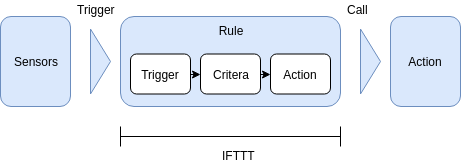
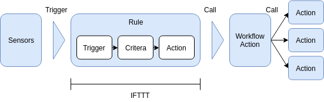
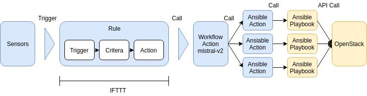

# StackStorm

- [StackStorm](#stackstorm)
  - [1. What is StackStorm?](#1-what-is-stackstorm)
  - [2. How it works?](#2-how-it-works)
  - [3. Automation basics](#3-automation-basics)
    - [3.1. Actions](#31-actions)
    - [3.2. Sensors and Triggers](#32-sensors-and-triggers)
    - [3.3. Rules](#33-rules)
    - [3.4. Workflows](#34-workflows)
    - [3.5. Packs](#35-packs)
    - [3.6. Webhooks](#36-webhooks)
    - [3.7. Datastore](#37-datastore)
    - [3.8. ChatOps](#38-chatops)

## 1. What is StackStorm?

StackStorm is a platform for integration and automation across services and tools.

StackStorm helps automate common operational patterns:

- **Facilitated Troubleshooting**: triggering on system failures captured by Nagios, Sensu, New Relic and other monitoring, running a series of diagnostic checks on physical nodes, OpenStack or Amazon instances, and application components, and posting results to a shared communication context, like Slack or JIRA..
- **Automated remediation**: identifying and verifying hardware failure on OpenStack compute node, properly evacuating instances and emailing VM about potential downtime, but if anything goes wrong - freezing the workflow and calling PagerDuty to wake up a human..
- **Continuos deployment**: build and test with Jenkins, provision a new AWS cluster, turn on some traffic with the load balancer, and roll-forth or roll-back based on NewRelic app performance data..

## 2. How it works?

StackStorm is a service with modular architecture. It is comprised of loosely coupled microservice components that communicate over a message bus, and scales horizontally to deliver automation at scale. StackStorm has a full REST API, CLI client, and web UI for admins and users to operate it locally or remotely, as well as Python client bindings for developer convenience.


StackStorm plugs into the environment via the extensible set of adapters containing sensors and actions.

- **Sensors** are Python plugins for inbound integration that watch for events from external systems and fire a StackStorm trigger when an event happens.

- **Triggers** are StackStorm representations of external events. There are generic triggers (e.g., timers, webhooks) and integration triggers (e.g., Sensu alert, JIRA issue updated). A new trigger type can be defined by writing a sensor plugin.

- **Actions** are StackStorm outbound integrations. There are generic actions (SSH, HTTP request), integrations (OpenStack, Docker, Puppet), or custom actions. Actions are either Python plugins, or any scripts, consumed into StackStorm by adding a few lines of metadata. Actions can be invoked directly by user via CLI, API, or the web UI, or used and called as part of automations - rules and workflows.

- **Rules** map triggers to actions (or to workflows), applying matching criterias and map trigger payload data to action inputs.

- **Workflows** stitch actions together into "uber-actions", defining the order, transition conditions, and passing context data from one action to the next. Most automations are multi-step (eg: more than one action). Workflows, just like "atomic" actions, are available in the action library, and can be invoked manually or triggered by rules.

- **Packs** are the units of content deployment. They simplify the management and sharing of StackStorm pluggable content by grouping integrations (triggers and actions) and automations (rules and workflows). A growing number of packs is available on the StackStorm Exchange. Users can create their own packs, share them on GitHub, or submit them to the StackStorm Exchange organization.

- **Audit trail** is the historical list of action executions, manual or automated, and is recorded and stored with full details of triggering context and execution results. It is also captured in audit logs for integrating with external logging and analytical tools: LogStash, Splunk, statsd, or syslog.

## 3. Automation basics

> StackStorm - IFTTT for DevOps (IF THIS THEN THAT)

Quick views:







### 3.1. Actions

- Perform arbitrary automation or remendiation tasks in your environment.

- Actions can be executed when a Rule with matching criteria is triggered. Multiple actions can be strung together into a Workflow.

- **An action runner** is the execution environment for user-implemented actions.

- An action is composed of two parts:
  - A YAML metadata file which describes the action, and its inputs.
  - A script file which implements the action logic.

- **Built-in Parameters**: args, cmd, cwd, env, dir.

- Parameters of runners can be overridden but not all attributes for runner parameters can be overridden.

- \*\*Environment Variables Available to Actions:
  - ST2_ACTION_PACK_NAME: name of the pack which the currently executed action belongs to.
  - ST2_ACTION\_\_EXECUTION_ID: execution id of the action being currently executed.
  - ST2_ACTION_API_URL: full url to the public API endpoint.
  - ST2_ACTION_AUTH_TOKEN: auth token which is available to the action until it completes. When the action completes, the token gets revoked.

- Convert Existing scripts into Actions:
  - Make sure the script conforms to conventions.
  - Create a metadata file.
  - Update argument parsing in the script.
- Writing Custom Python Actions - Example.

```yaml
---
name: "echo_action"
runner_type: "python-script"
description: "Print message to standard output."
enabled: true
entry_point: "my_echo_action.py"
parameters:
  message:
    type: "string"
    description: "Message to print."
    required: true
    position: 0
```

```python
# my_echo_action.py
import sys

from st2common.runners.base_action import Action

class MyEchoAction(Action):
    def run(self, message):
        print(message)

        if message == 'working':
            return (True, message)
        return (False, message)
```

- Pre-defined actions: `core` pack (`core.local, core.remote, core.http`)

### 3.2. Sensors and Triggers

- Sensors are a way to integrate external systems and events with StackStorm (periodically poll some external system/passively wait for inbound events). Sensors are written in Python, and must follow the StackStorm-defined sensor interface requirements.

```yaml
# metadata file
---
class_name: "SampleSensor"
entry_point: "sample_sensor.py"
description: "Sample sensor that emits triggers."
trigger_types:
  - name: "event"
    description: "An example trigger."
    payload_schema:
      type: "object"
      properties:
        executed_at:
          type: "string"
          format: "date-time"
          default: "2014-07-30 05:04:24.578325"
```

```python
from st2reactor.sensor.base import PollingSensor
from st2reactor.sensor.base import Sensor


class SampleSensor(Sensor):
    # ....

class SamplePollingSensor(PollingSensor):
    # ....
```

- Triggers are StackStorm constructs that identify the incoming events to StackStorm. A trigger is a tuple of type (string) and optional parameters (object). Rules are written to work with triggers. Sensors typically register triggers thouygh this is not strictly required.

- Each sensor runs as a separate process.

- Sensor service provides different services to the sensor via public methods.

- Common operations:
  - `dispatch(trigger, payload, trace_tag)`: Allows the sensor to inject trigger into the system.
  - `get_logger(name)`: Allows the sensor instance to retrieve the logger instance which is specific to that sensor.

- Datastore management operations:
  - `list_values(local=True, prefix=None)`: Allows to list the values in the datastore.
  - `get_value(name, local=True, decrypt=False)`: Allows to retrive a single value from the datastore.
  - `set_value(name, value, ttl=None), local=True, encrypt=False)`: Allows to store (set\_) a value in the datastore.
  - `delete_value(name, local=True)`: Allows to delete an existing value from the datastore.

### 3.3. Rules

- StackStorm uses rules and workflows to capture operational patterns as automation. Rules map triggers to actions (or workflows), apply matching criteria and map trigger payloads to action inputs.
- Rule Structure:

```yaml
---
name: "rule_name" # required
pack: "examples" # optional
description: "Rule description." # optional
enabled: true # required

trigger: # required
  type: "trigger_type_ref"

criteria: # optional
  trigger.payload_parameter_name1:
    type: "regex"
    pattern: "^value$"
  trigger.payload_parameter_name2:
    type: "iequals"
    pattern: "watchevent"

action: # required
  ref: "action_ref"
  parameters: # optional
    foo: "bar"
    baz: "{{ trigger.payload_parameter_1 }}"
```

- Trigger in a rule specifics which incoming events should be inspected for potential match against this rule.
- Criteria are the rule(s) needed to be matched against (logical `AND`). You can achieve logical `OR` behavior by creating multiple independent rules (one per criteria expression).
- Action: subsequent action/workflow to be executed on succesful match of a trigger and an optional set of criteria.
- The rules engine is able to interpolate variables by leveraging _Jinja templating syntax_.
- Rule Location: `/opt/stackstorm/packs/<pack-name>/rules`
- Test with `st2-rule-tester`.
- Timers allow running a particular action repeatedly based on a defined time interval, or at one particular date and time.
  - `core.st2.IntervalTimer`.
  - `core.st2.DateTimer`.
  - `core.st2.CronTimer`.

### 3.4. Workflows

- A workflow strings atomic actions into a higher level automation, and orchestrates their executions by calling the right action, at the right time, with the right input. It keeps state, passes data between actions, and provides reliability and transparency to the execution.

- Workflow runners:
  - `ActionChain`: StackStorm's internal no-frills workflow runner. **Use ActionChain when you want speed and simplicity**.
  - `Mistral`: a dedicated workflow service, originated in OpenStack, intergrated and bundled with StackStorm. **Use Mistral when need power and resilience**.
  - `Orquesta`: a new workflow engine, designed specifically for StackStorm (public beta). **Use Orquesta to test-drive the future of workflows**.

### 3.5. Packs

- A Pack is the unit of deployment for integrations and automations that extend StackStorm.
- A pack can contain Actions, Workflows, Rules, Sensors, and Aliases
- \*Integration packs- - packs extend StackStorm to integrate it with external systems. Integration packs can be shared and reused by anyone who uses the service that pack is built for.
- \*Automation packs- - packs capture automation patterns - they contain workflows, rules, and actions for a specific automation process. Automation packs are often very site-specific and have a little use outside of a particular team or company.

### 3.6. Webhooks

- Webhooks allow you to integrate external systems with StackStorm using HTTP webhooks. Unlike sensors which use a "pull" approach, webhook use a "push" approach. They push triggers directly to the StackStorm API using HTTP POST requests.

### 3.7. Datastore

- The goal of the datastore service is to allow users to store common paramters and their values within StackStorm for reuse in the definition of sensors, actions and rules. The datastore service stores the data as a key-value pair.
- From the sensor and action plugins, since they are implemented in Python, the key-value pairs are accessed from the StackStorm Python client. For rule definitions in YAML/JSON, the key-value pairs are referenced with a specific string substitution syntax and the references are resolved on rule evaluation.
- TTL -> expire.

### 3.8. ChatOps

- ChatOps is a new operational paradigm - work that is already happening in the background today is brought into a common chatroom. By doing this, you are unifying the communication about what work should get done with the actual history of the work being done.


- StackStorm's goal with ChatOps is to take common patterns and make them consumable by teams of all makeups.
- Features:
  - History and Audit.
  - Workflow.
  - Bring user's favorite tools.
- Action aliases are simplified and more human readable representation of actions in StackStorm.

```yaml
---
name: "remote_shell_cmd"
pack: "examples"
action_ref: "core.remote"
description: "Execute a command on a remote host via SSH."
formats:
  - "run {{cmd}} on {{hosts}}"
```

- Notifications require an action that is registered with StackStorm and a notification rule to go with it. Notifications are implemented as triggers, rules and actions.
