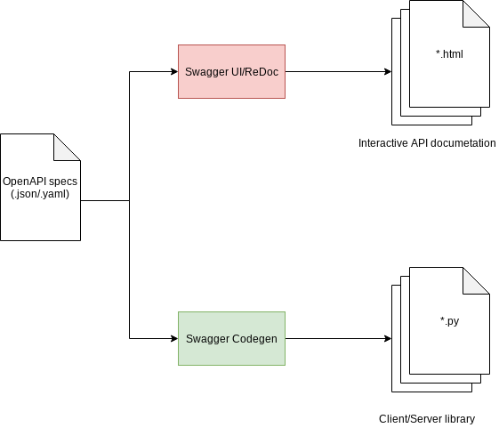
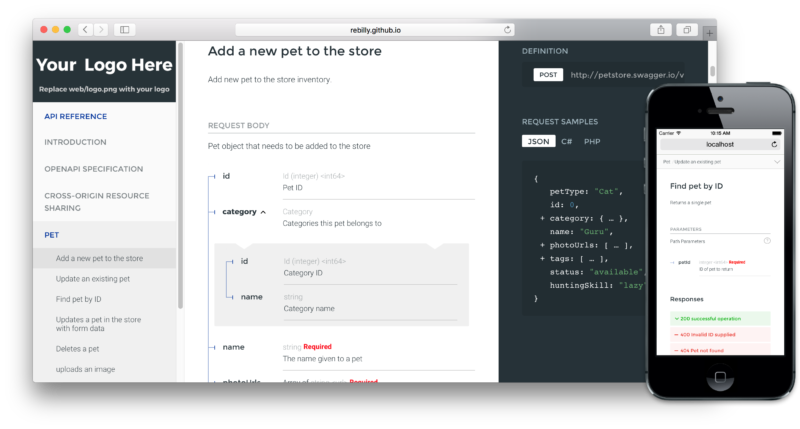

# Swagger Guideline

- [Swagger Guideline](#swagger-guideline)
  - [1. Swagger in a nutshell](#1-swagger-in-a-nutshell)
  - [2. OpenAPI Specification](#2-openapi-specification)
  - [3. Swagger framework tools and benefits](#3-swagger-framework-tools-and-benefits)
  - [4. Swagger + Django](#4-swagger--django)
    - [4.1. Installation and quick start](#41-installation-and-quick-start)
    - [4.2. Customize Swagger spec](#42-customize-swagger-spec)
      - [4.2.1 Using `swagger_auto_schema` decorator directly](#421-using-swaggerautoschema-decorator-directly)
      - [4.2.2. Using the wrapper decorator of `swagger_auto_schema`](#422-using-the-wrapper-decorator-of-swaggerautoschema)

Make sure that you already knew what API is. This guideline assumes intermediate level knowledge of API and RESTful.

Through API, developers access a network of shared pieces of code and useful experiences. However, to access them they need clear documentation. Unfortunately, there was no standard for documenting them. [Swagger](https://swagger.io/) emerged as an approach to building APIs and soon became the most popular framework for this purpose.

## 1. Swagger in a nutshell

Swagger is a simple yet powerful representation of your RESTful API.

With the largest ecosystem of API tooling on the planet, thousands of developers are supporting Swagger in almost every modern programming language and deployment environment.

With a Swagger-enabled API, you get interactive documentation, client SDK generation and discoverability. We created Swagger to help fulfill the promise of APIs.

Swagger helps companies like Apigee, Getty Images, Intuit, LivingSocial, McKesson, Microsoft, Morningstar, and PayPal build the best possible services with RESTful APIs. Now in version 2.0, Swagger is more enabling than ever. And it's 100% open source software.

## 2. OpenAPI Specification

You may hear about the term of OpenAPI along with Swagger, so what it really is. The OpenAPI Specification was donated to the Linux Foundation under the OpenAPI Initiative in 2015. The specification creates a RESTful interface for easily developing and consuming an API by effectively mapping all the resources and operations associated with it.

There are [two remaining version of OpenAPI](https://github.com/OAI/OpenAPI-Specification/tree/master/versions): 2.0 and 3.0. In this guideline, I only demonstrade the 2.0.

Please take a quick look at [OpenAPI 2.0 Specification](https://swagger.io/specification/v2/). You don't have to remember all of it, it is quite a lot. Just know where to find definitions.

## 3. Swagger framework tools and benefits

Swagger is a set of open-source tools built around the OpenAPI Specification that can help you design, build, document and consume REST APIs. The major Swagger tools include:

- Swagger Editor – browser-based editor where you can write OpenAPI specs.
- Swagger UI – renders OpenAPI specs as interactive API documentation.
- Swagger Codegen – generates server stubs and client libraries from an OpenAPI spec.

IMO, we only take care of Swagger Codegen and Swagger UI only, repeat features:

- Design-first users: use Swagger Codegen to **generate a server stub** for your API. The only thing left is to implement the server logic – and your API is ready to go live!
- Use Swagger Codegen to **generate client libraries** for your API in over 40 languages.
- Use Swagger UI to **generate interactive API documentation** that lets your users try out the API calls directly in the browser.



## 4. Swagger + Django

[drf-yasg](http://drf-yasg.readthedocs.io/en/stable/) (Django REST framework - yet another swagger generator) is my chosen one. drf-yasg generates a swagger OpenAPI schema for your API containing all the views which are DRF API Views. It also provides many hooks to customise the generation of this schema. drf-yasg also contains the [RedocUI](https://github.com/Redocly/redoc).

Hold on a second, seems like RedocUI and SwaggerUI do the same job - render interactive API documentation. Why do I mention RedocUI over SwaggerUI? Simply Redoce is one in responsive three-panel design, it looks nicer than SwaggerUI. I am a simple man, I like three-panel design! :tada:

- Swagger UI


- ReDoc UI



### 4.1. Installation and quick start

This section is well-documented. Please follow the [official documentation](https://drf-yasg.readthedocs.io/en/stable/readme.html#usage). You should be fine :smile:

### 4.2. Customize Swagger spec

#### 4.2.1 Using `swagger_auto_schema` decorator directly

Follow [this article](https://medium.com/@arjunsinghy96/customised-api-documentation-for-django-rest-framework-projects-using-drf-yasg-d6db9ba5cff3) with modifications.

Most of the customization which I saw was through `swagger_auto_schema` decorator provided in utils module of drf-yasg.

Decorate your function based API views or methods in class based API views to modify the OpenAPI schema which is generated. The usage is documented at [here](https://drf-yasg.readthedocs.io/en/latest/custom_spec.html#the-swagger-auto-schema-decorator).

Still confuse? Let me show an example:

```python
class MagicApiView(APIView):

    @swagger_auto_schema(
            auto_schema= CustomSwaggerAutoSchema,
            query_serializer=RequestBodySerializer,
            responses={
                '200': OKResponseSerializer,
                '400': "Bad Request"
            },
            security=[],
            operation_id='Magic Endpoint',
            operation_description='This endpoint does some magic'
        )
    def get(self, request):
      return Response('Magic')
```

#### 4.2.2. Using the wrapper decorator of `swagger_auto_schema`

You may notice that adding `swagger_auto_schema` increases the line of code a lot. To make the source more readable, we can leverage [Django method_decorator](https://docs.djangoproject.com/en/3.0/topics/class-based-views/intro/#decorating-the-class).

- Create a module named `api_doc.py` (or whatever you want):

```python
from django.utils.decorators import method_decorator
from drf_yasg.utils import swagger_auto_schema

class DefaultMethod(object):
    """
    Declare swagger_auto_schema for default Viewset method
    """
    magic = method_decorator(
        name='magic',
        decorator=swagger_auto_schema(
            operation_id="Magic Endpoint",
            operation_description='This endpoint really does some magic, no joke',
        )
    )

    yamagic = method_decorator(
        name='yamagic',
        decorator=swagger_auto_schema(
            operation_id="Yet Another Magic Endpoint",
            operation_description='This endpoint really does some magic, no joke',
        )
    )

class CustomMethod(object):
    """
    Declare request, reponse swagger for custom Viewset method
    """
    magic = swagger_auto_schema(
        operation_id="Magic Endpoint",
        operation_description='Still magic endpoint but in custom class',
        request_body=MagicSerializer,
        responses={
            "201": openapi.Response(
                description="Created",
                examples={
                    'application/json': {
                        "message": "string",
                        "tinkle": "string",
                    }
                }
            )
        }
    )
```

- In `views.py`, import the created module:

```python
from api_doc import DefaultMethod as swagger_default_method
from api_doc import CustomMethod as swagger_custom_method

@swagger_default_method.magic
@swagger_default_method.yamagic
class DefaultViewSet(object):
    @swagger_custom_method.magic
    def magic(self, request, pk):
        # Create your own magic here.
```
