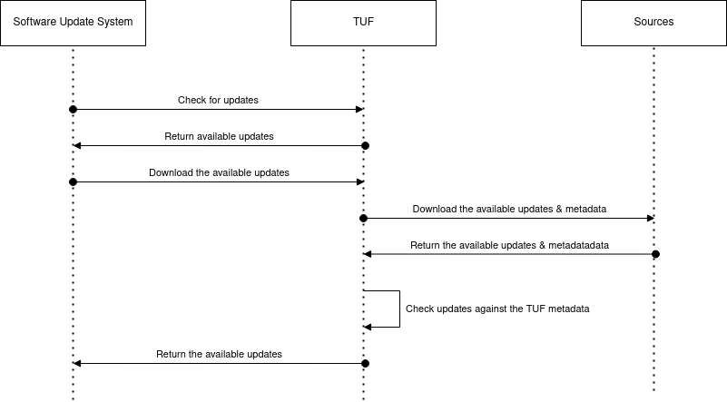

The Update Framework - TUF

<https://theupdateframework.com/>

- [1. Overview](#1-overview)
- [2. Roles and metdata](#2-roles-and-metdata)

## 1. Overview

- TUF helps developers maintain the security of _software update systems_, providing protection even against attackers that compromise the repository or signing keys.
- Software update systems is an application (or part of an application) running on a client system that obtains and installs software. Three major classes of software update systems are:
  - Application updaters which are used by applications to update themselves. For example, Firefox updates itself through its own application updater.
  - Library package managers such as those offered by many programming languages for installing additional libraries. These are systems such as Python's pip/easy_install + PyPI, Perl's CPAN, Ruby's RubyGems, and PHP's Composer.
  - System package managers used by operating systems to update and install all of the software on a client system. Debian's APT, Red Hat's YUM, and openSUSE's YaST are examples of these.
- The update procedure followed by a software update system can be regarded as straightforward:

  - Knowing when an update exists. (**TUF**)
  - Downloading the update. (**TUF**)
  - Applying the changes introduced by the update.

- TUF adds extra **metadata files** in repository which contain additional information: which keys are trusted, the cryptographic hashes of files, signatures on the metadata, metadata version numbers, and the date after which the metadata should be considered expired.

## 2. Roles and metdata

- TUF uses roles to define the set of actions a party can perform.
- Top roles sign metadata, which TUF uses to create verifiable records about the state of a repository or application at a specified time. The signed metadata files always include an expiration date.
- Implementers of TUF may use any data foramt for metadata files.
- There are 4 required top-level roles, each with their own metadata file.
  - Root
  - Targets
  - Snapshot
  - Timestamp

| Name                       | Signed by                | Description                                                                                                                                                                                                                                                                                                                                                              |
| -------------------------- | ------------------------ | ------------------------------------------------------------------------------------------------------------------------------------------------------------------------------------------------------------------------------------------------------------------------------------------------------------------------------------------------------------------------ |
| Root Metadata              | Root role                | Specifies the other top-level roles. When specifying these roles, the trusted keys for each are listed, along with the minimum number (signature threshold) of those keys required to sign the role's metadata.                                                                                                                                                          |
| Delegated Targets Metadata | A delegated targets role | A metadata file provided by a Delegated Targets role will follow exactly the same format as one provided by the top-level Targets role.                                                                                                                                                                                                                                  |
| Snapshot Metadata          | Snapshot role            | The snapshot.json metadata file lists version numbers of all metadata files other than timestamp.json. This file ensures that clients will see a consistent view of all files on the repository.                                                                                                                                                                         |
| Timestamp Metadata         | Timestamp role.          | The timestamp.json metadata file lists the hashes and size of the snapshot.json file. This is the first and potentially only file that needs to be downloaded when clients search for updates. It is frequently re-signed, and has a short expiration date, thus allowing clients to quickly detect if they are being prevented from obtaining the most recent metadata. |
