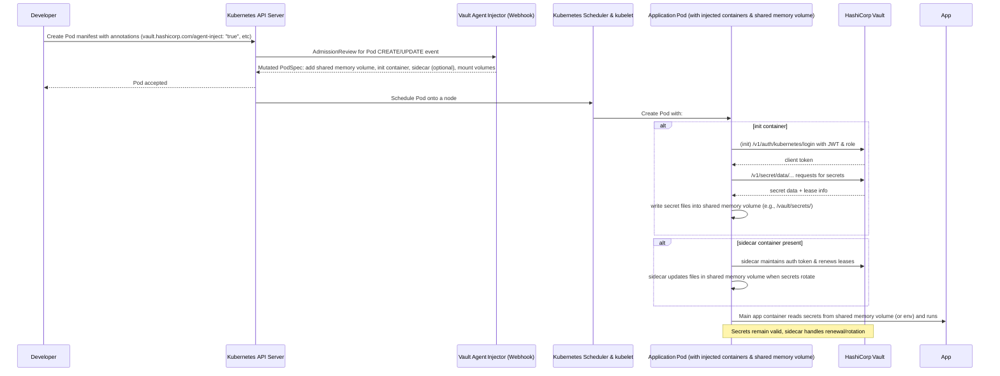

# Vault Agent Injector

The Vault Agent Injector alters pod specifications to include Vault Agent containers that render Vault secrets to a shared memory volume using Vault Agent Templates. By rendering secrets to a shared memory volume, containers within the pod can consume Vault secrets without being Vault aware.

The injector is a [Kubernetes Mutation Webhook Controller](https://kubernetes.io/docs/reference/access-authn-authz/admission-controllers/).

- The Vault Agent Injector works by intercepting pod `CREATE ` and `UPDATE` events in Kubernetes.
- The controller parses the event and looks for the metadata annotation `vault.hashicorp.com/agent-inject: true`. If found, the controller will alter the pod specification based on other annotations present.
- The primary method of authentication with Vault when using the Vault Agent Injector is the service account attached to the pod. For Kubernetes authentication, the service account must be bound to a Vault role and a policy granting access to the secrets desired.
- There are two methods of configuring the Vault Agent containers to render secrets:
  - the `vault.hashicorp.com/agent-inject-secret` annotation, or

  ```yaml
  vault.hashicorp.com/agent-inject-secret-<unique-name>: /path/to/secret
  # Example
  vault.hashicorp.com/agent-inject-secret-foo: database/roles/app
  vault.hashicorp.com/agent-inject-secret-bar: consul/creds/app
  vault.hashicorp.com/role: "app"
  ```

  - How the secret is rendered to the file is also configurable.

  ```yaml
  vault.hashicorp.com/agent-inject-template-<unique-name>: |
  <
      TEMPLATE
      HERE
  >
  # Example
  vault.hashicorp.com/agent-inject-secret-foo: "database/creds/db-app"
  vault.hashicorp.com/agent-inject-template-foo: |
  {{- with secret "database/creds/db-app" -}}
  postgres://{{ .Data.username }}:{{ .Data.password }}@postgres:5432/mydb?sslmode=disable
  {{- end }}
  vault.hashicorp.com/role: "app"
  ```

  - a configuration map containing Vault Agent configuration files:
    - The Vault Agent Injector supports mounting ConfigMaps by specifying the name using the vault.hashicorp.com/agent-configmap annotation. The configuration files will be mounted to /vault/configs.
    - The configuration map must contain either one or both of the following files: `config.hcl` or `config-init.hcl`.

    ```yaml
    ---
    apiVersion: v1
    kind: ServiceAccount
    metadata:
    name: app-example
    ---
    apiVersion: apps/v1
    kind: Deployment
    metadata:
    name: app-example-deployment
    spec:
    replicas: 1
    selector:
        matchLabels:
        app: app-example
    template:
        metadata:
        labels:
            app: app-example
        annotations:
            vault.hashicorp.com/agent-inject: "true"
            vault.hashicorp.com/agent-configmap: "my-configmap"
            vault.hashicorp.com/tls-secret: "vault-tls-client"
        spec:
        containers:
            - name: app
            image: "app:1.0.0"
        serviceAccountName: app-example
    ---
    apiVersion: v1
    kind: ConfigMap
    metadata:
    name: my-configmap
    data:
    config.hcl: |
        "auto_auth" = {
        "method" = {
            "config" = {
            "role" = "db-app"
            }
            "type" = "kubernetes"
        }

        "sink" = {
            "config" = {
            "path" = "/home/vault/.token"
            }

            "type" = "file"
        }
        }

        "exit_after_auth" = false
        "pid_file" = "/home/vault/.pid"

        "template" = {
        "contents" = "{{- with secret \"database/creds/db-app\" -}}postgres://{{ .Data.username }}:{{ .Data.password }}@postgres:5432/mydb?sslmode=disable{{- end }}"
        "destination" = "/vault/secrets/db-creds"
        }

        "vault" = {
        "address" = "https://vault.demo.svc.cluster.local:8200"
        "ca_cert" = "/vault/tls/ca.crt"
        "client_cert" = "/vault/tls/client.crt"
        "client_key" = "/vault/tls/client.key"
        }
    config-init.hcl: |
        "auto_auth" = {
        "method" = {
            "config" = {
            "role" = "db-app"
            }
            "type" = "kubernetes"
        }

        "sink" = {
            "config" = {
            "path" = "/home/vault/.token"
            }

            "type" = "file"
        }
        }

        "exit_after_auth" = true
        "pid_file" = "/home/vault/.pid"

        "template" = {
        "contents" = "{{- with secret \"database/creds/db-app\" -}}postgres://{{ .Data.username }}:{{ .Data.password }}@postgres:5432/mydb?sslmode=disable{{- end }}"
        "destination" = "/vault/secrets/db-creds"
        }

        "vault" = {
        "address" = "https://vault.demo.svc.cluster.local:8200"
        "ca_cert" = "/vault/tls/ca.crt"
        "client_cert" = "/vault/tls/client.crt"
        "client_key" = "/vault/tls/client.key"
        }
    ```


