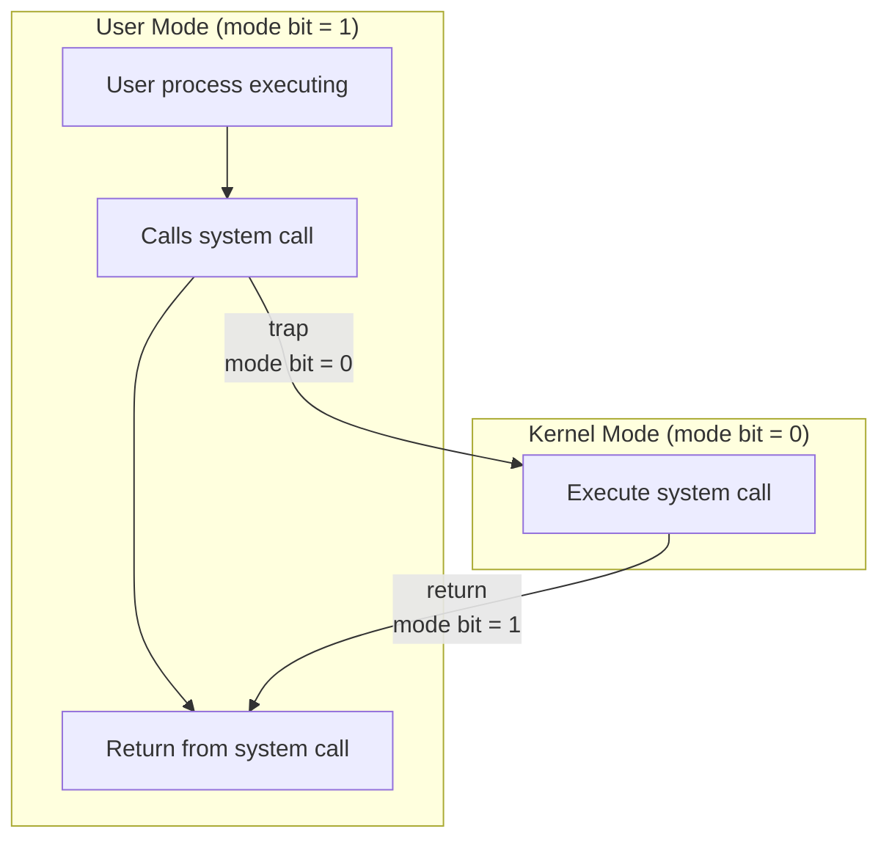
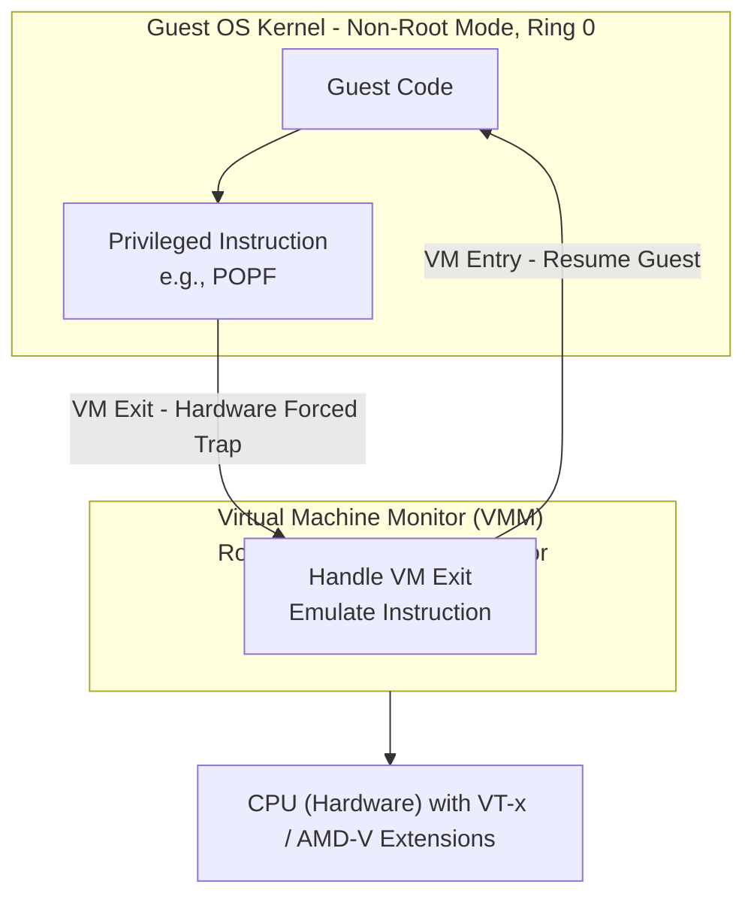
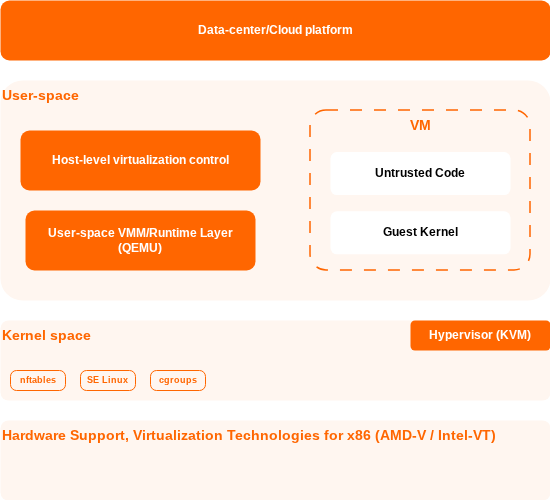

# Linux Virtualization Stack

Table of contents:

- [Linux Virtualization Stack](#linux-virtualization-stack)
  - [1. Introduction](#1-introduction)
  - [2. Virtualization fundamentals](#2-virtualization-fundamentals)
    - [2.1. The Virtual machine monitor (Hypervisor)](#21-the-virtual-machine-monitor-hypervisor)
      - [2.1.1. The three properties of an Effective VMM\*\*](#211-the-three-properties-of-an-effective-vmm)
      - [2.1.2. Type 1 and Type 2 Hypervisor](#212-type-1-and-type-2-hypervisor)
    - [2.2. x86 virtualization](#22-x86-virtualization)
    - [2.3. CPU virtualization: The core challenge](#23-cpu-virtualization-the-core-challenge)
      - [2.3.1. The hardware mechanism behind "Trap-and-Emulate"](#231-the-hardware-mechanism-behind-trap-and-emulate)
      - [2.3.2. The classic "Trap-and-Emulate" model](#232-the-classic-trap-and-emulate-model)
    - [2.4. Software-based virtualization: Full virtualization and Paravirtualization](#24-software-based-virtualization-full-virtualization-and-paravirtualization)
      - [2.4.1. Full virtualization](#241-full-virtualization)
      - [2.4.2. Paravirtualization](#242-paravirtualization)
    - [2.5. Hardware-assisted virtualization](#25-hardware-assisted-virtualization)
  - [3. The Linux Virtualization Architecture (Big Picture)](#3-the-linux-virtualization-architecture-big-picture)
    - [3.1 Layered Model](#31-layered-model)
    - [3.2 Core Components Overview](#32-core-components-overview)
- [Core Stack (Bottom → Up)](#core-stack-bottom--up)
  - [4. Hypervisor Layer (Kernel-Level Execution)](#4-hypervisor-layer-kernel-level-execution)
    - [Focus:](#focus)
    - [Key Points:](#key-points)
  - [5. User-Space VMM / Runtime Layer](#5-user-space-vmm--runtime-layer)
    - [Examples:](#examples)
    - [Key Points:](#key-points-1)
  - [6. Host-Level Virtualization Control](#6-host-level-virtualization-control)
    - [Example:](#example)
    - [Key Points:](#key-points-2)
- [Control Plane (Above the Host)](#control-plane-above-the-host)
  - [7. Datacenter Virtualization Management](#7-datacenter-virtualization-management)
    - [Example:](#example-1)
    - [Key Points:](#key-points-3)
  - [8. Cloud Orchestration Platforms](#8-cloud-orchestration-platforms)
    - [Example:](#example-2)
    - [Key Points:](#key-points-4)
- [Parallel \& Emerging Approaches](#parallel--emerging-approaches)
  - [9. MicroVM / Lightweight Virtualization](#9-microvm--lightweight-virtualization)
    - [Examples:](#examples-1)
    - [Key Points:](#key-points-5)
    - [Positioning:](#positioning)
  - [10. Containers (Contrast, Not Part of VM Stack)](#10-containers-contrast-not-part-of-vm-stack)
    - [Examples:](#examples-2)
    - [Key Points:](#key-points-6)
    - [Important Contrast:](#important-contrast)
- [Integration \& Flow](#integration--flow)
  - [11. How Everything Works Together](#11-how-everything-works-together)
    - [Typical Execution Flow:](#typical-execution-flow)
    - [Key Insight:](#key-insight)
  - [12. Advanced Topics (Optional but High Value)](#12-advanced-topics-optional-but-high-value)
  - [13. Conclusion](#13-conclusion)

## 1. Introduction

The modern era of distributed computing, encompassing everything from hyperscale public cloud infrastructure to localized edge computing deployments, relies entirely on the foundational technology of virtualization. By mathematically and logically abstracting physical hardware resources into isolated, programmable units, virtualization directly addresses the historical inefficiencies of single-tenant server architectures, where physical machines frequently operated at a mere fraction of their computational capacity. The ability to multiplex compute, memory, storage, and networking resources across disparate workloads enables massive economies of scale, strict multi-tenant isolation, and highly dynamic resource allocation.

> [!NOTE]
> **Virtualization is Core Enabler (IaaS layer)**
>
> - Cloud providers like AWS, Azure, and GCP present **virtual machines** (EC2, Virtual machines, Compute engine) instead of raw servers.
> - A **hypervisor** multiplexes each physical server into many isolated **virtual machines**, one per tenant or workload.
> - This allows providers to:
>   - Safely run workloads from mutually untrusted customers on the same hardware.
>   - Improve utilization by packing many VMs onto a single physical host.
>   - Implement "pay-as-you-go" pricing at the VM level.

The evolution of virtualization is a multi-decade trajectory that originated with mainframe systems. The paradigm began with the IBM CP-40 and CP-67 architectures in the late 1960s, introducing the conceptual framework of virtual machines and virtual memory hardware to the IBM System/360 Model 67. However, as the computing industry transitioned toward commodity x86 architectures in the 1980s and 1990s, virtualization became a formidable technical challenge due to the lack of native hardware support for virtualization in the x86 instruction set. The early 2000s saw the industry rely on complex, software-heavy emulation techniques or heavily modified paravirtualized guest kernels, championed by hypervisors like Xen (released in 2003) and early VMware iterations. A pivotal paradigm shift occurred in 2005 and 2006 when Intel and AMD introduced hardware-assisted virtualization extensions, fundamentally changing the trajectory of the ecosystem by enabling the processor itself to handle virtualization boundaries.

Following the integration of the Kernel-based Virtual Machine (KVM) module into the mainline Linux kernel in 2007, Linux rapidly became the de facto standard for open-source virtualization. As cloud computing architectures matured, the ecosystem observed an aggressive push toward lighter, faster deployment models. This resulted in the widespread adoption of operating system-level containerization technologies—tracing back to OpenVZ in 2005 and LXC in 2008—which bypassed the hypervisor layer entirely by sharing the host operating system (OS) kernel, thereby prioritizing operational agility and extreme deployment density over strict cryptographic isolation. Most recently, the emergence of microVMs has bridged the dichotomy between traditional, heavyweight virtual machines and lightweight containers, offering the stringent hardware-enforced isolation of full virtualization alongside the sub-second boot times typically associated with containerized workloads.

The scope of this research report is to provide an exhaustive, structural analysis of the Linux-based virtualization ecosystem. This document systematically traverses the entire technological stack: from the fundamental hardware extensions etched into silicon, ascending through the kernel-level hypervisors, navigating the user-space virtual machine monitors (VMMs), examining host-level control daemons, and culminating in the highly abstracted datacenter and cloud orchestration platforms that govern modern infrastructure.

## 2. Virtualization fundamentals

Source:

- <https://en.wikipedia.org/wiki/X86_virtualization>
- <https://www.geeksforgeeks.org/operating-systems/virtualization-vmware-full-virtualization/>
- <https://www.geeksforgeeks.org/operating-systems/difference-between-full-virtualization-and-paravirtualization>
- <https://en.wikipedia.org/wiki/Hardware-assisted_virtualization>
- <https://www.slideshare.net/slideshow/virtualization-1-virtual-machine-hypervisor-virtual-machine-monitor/285954190>

### 2.1. The Virtual machine monitor (Hypervisor)

The **Virtual machine monitor (VMM)**, or **Hypervisor** (_we will use two terms interchangeably_) is a specialized software layer that sits between the physical hardware and one or more guest OS.

- Its primary job is to create, run, and manage virtual machines.
- It acts as a "traffic cop", abstracting the underlying hardware and presenting a virtualized hardware platform to each VM.
- This **decouples** the software (guest OS + applications) from the physical hardware.

#### 2.1.1. The three properties of an Effective VMM\*\*

For a VMM to be considered effective, it must satisfy three essential properties as originally defined by [Popek and Goldberd (1974)](https://en.wikipedia.org/wiki/Popek_and_Goldberg_virtualization_requirements):

- **Fidelity**: A program running under the VMM should execute identically to how it would on native hardware, barring minor timing differences. The guest OS should be unaware it is virtualized.
- **Performance**: The VMM should introduce minimal overhead. A statistically dominant subset of the guest's instructions must be executed directly on the host processor at native speed.
- **Safety (Isolation)**: The VMM must retain complete control of all system resources. Guest VMs are strictly isolated from one another; a crash or security breach in one VM cannot affect the hypervisor or other VMs.

#### 2.1.2. Type 1 and Type 2 Hypervisor

- **Type 1 (Bare-metal hypervisor)**:
  - Architecture: install directly onto the physical hardware without a conventional host operating system layer mediating their access (examples include VMware ESXi and the original Xen architecture). They independently manage system resources and schedule guest virtual machines
  - Performance: generally offers higher performance, lower overhead, and better security as it does not compete for resources with a general-purpose host OS.
  - Primary use case: The standard for enterprise data centers and cloud computing infrastructure (e.g., AWS, Azure).
  - Examples: VMware ESXi, Microsoft Hyper-V, Xen.
- **Type 2 (Hosted hypervisor)**:
  - Architecture: runs as a regular software application on top of a conventional host OS. It relies on the host OS to manage hardware interactions.
  - Performance: incurs more overhead because hardware access is mediated by the host OS kernel, creating an extra layer of translation.
  - Primary use case: ideal for desktop environments, such as developers running multiple OSes for testing or individuals needing cross-platform application access.
  - Examples: Oracle VirtualBox, VMware Workstation/Fusion.


### 2.2. x86 virtualization

- **Ring 0 (Kernel mode)** represents the highest privilege level, strictly reserved for the OS kernel, allowing it to configure the memory management unit (MMU), govern physical memory allocation, and directly manipulate input/output (I/O) peripherals.
- Conversely, user-space applications execute in **Ring 3 (User mode)**, confined to their own virtual address spaces and required to invoke system calls to request privileged services from the kernel.


### 2.3. CPU virtualization: The core challenge

The fundamental problem is with the CPU. Contemporary processors are constructed with the aim of being dominated by a special OS. Some of the most important instructions, the ones that directly access the hardware, can only be run in a special mode of the OS - Ring 0.

So, **what happens when you try to run a guest OS inside a VM?**

- The hypervisor must run in Ring 0 to control the real hardware.
- The guest OS thinks it’s in Ring 0, but it’s actually trapped inside a VM.
- When the guest OS tries to execute a privileged instruction, it would normally take control of the entire CPU, crashing the physical server and all other VMs on it.
- You can' have two masters of the same machine.

The first solution is "Trap-and-Emulate" model, but let's deep dive in the hardware mechanism.

#### 2.3.1. The hardware mechanism behind "Trap-and-Emulate"

- Interrupts & Exceptions (CPU "forces" entry):
  - Asynchronous interrupts: timer, NIC, disk, etc.
  - Synchronous exceptions: page fault, divide-by-zero, invalid opcode.
  - CPU saves state, switches to kernel mode, and jumps to a handler.
- System calls (Program "requests" entry):
  - A user program requests an OS service (`read`, `open`, `fork`).
  - It executes a **trap instruction** (e.g., `syscall`, `int 0x80`).
  - This is a **controlled** transition to the kernel.



A user program executes a trap instruction, causing the CPU to switch to kernel mode and jump to the OS system call handler. After servicing the request, control returns to user mode.

#### 2.3.2. The classic "Trap-and-Emulate" model

The classic solution is to **deprivilege** the guest OS. The hypervisor uses the CPU's protection mechanism to its advantage.

1. The hypervisor runs in true Ring 0, with full hardware control.
2. It forces the guest OS kernel to run in a less privileged ring.
3. When the guest OS attempts a **privileged instruction**, it is no longer in Ring 0, so the CPU hardware triggers a **trap (an exception)** to the hypervisor.
4. The hypervisor catches the trap, inspects the failed instruction, **emulates** the operation on behalf of the guest against its virtual state, and then returns control to the guest.

This solution has some assumptions:

- Any instruction that is **sensitive** (i.e., can read or modify the state of the machine, like interrupt flags) must also be **privileged**.
- This ensures that when a guest OS tries to execute such an instruction while a deprivilege ring, it will trap to the hypervisor, which can then safely emulate it.

Legacy x86 architecture violates this requirement. It had a class of instructions that were **sensitive but unprivileged** (The text book example: `POPF` Pop Flags - loads the EFLAGS register from the stack).

- These instructions behave differently depending on the CPU privilege level.
- Crucially, when executed in a deprivileged mode (e.g., Ring 3), they would **fail silently** instead of causing a trap. The hypervisor would never be notified.

### 2.4. Software-based virtualization: Full virtualization and Paravirtualization

As we already understand the challenge, let see how the engineer deal with it using software-based strategies.

This architectural limitation gave rise to two primary software-based virtualization strategies.

#### 2.4.1. Full virtualization


- Full virtualization allows a guest OS to run **without any modification**. The hypervisor presents a complete virtual copy of the hardware, making the guest OS believe it owns a real physical machine.
- The hypervisor uses a technique called **binary translation**. It continuously **intercept and scans** the guest OS code during execution. Whenever it detects a privileged instruction, it replaces (**translate**) it with a safe alternative before allowing it to run. The translated, "safe" block of code is stored in a **translation cache**. The hypervisor then executes this new block. On subsequent executions of the same guest code, the hypervisor uses the fast, cached version, avoiding the translation overhead.
- Pros:
  - Full transparency: it allowed running a completely **unmodified** guest OS.
  - Board compatibility: both Windows and Linux.
- Cons:
  - Performance overhead.
  - Complexity: the hypervisor must maintain a complex binary translator capable of understanding and correctly rewriting parts of another OS's kernel.
- Examples: Early versions of VMware ESX and Microsoft Virtual Server relied on this approach.

#### 2.4.2. Paravirtualization


- Paravirtualization takes a more cooperative approach. Instead of hiding the fact that the OS is virtualized, it makes the guest OS aware of it.
- The guest OS kernel is modified to replace privileged instructions with direct calls to the hypervisor, known as **hypercalls**. Rather than forcing the hypervisor to intercept instructions, the guest OS politely requests help when needed.
  - Analogy: A hypercall is to a hypervisor what a system call is to an OS kernel.
  - Process: When the modified guest OS needs to perform a privileged operation (like changing CPU flags or updating page tables), it does not attempt to execute the sensitive hardware instruction directly.
  - Instead, it makes an explicit, direct function call - a **hypercall** - to the hypervisor, requesting that the operation be performed on its behalf.
  - This completely avoids the problems of silent failures or the overhead of trapping and emulating instructions. It's clean, well-defined API between the guest and the hypervisor.
- Pros:
  - High performance: by replacing traps and dynamic translation with simple function calls, Paravirtualization significantly reduces virtualization overhead. It is often near-native speeds for CPU-bound tasks.
  - Simplicity: the hypervisor can be much simpler, as it no longer needs a complex binary translator or has to manage intricate trap-and-emulate logic.
- Cons:
  - Required guest OS modification.
  - Not transparent: the guest is fundamentally different from one running on bare mental. This breaks the goal of perfect fidelity.
  - Poor compatibility with proprietary OS: historically, it was impossible to use this approach for closoed-source systems like Microsoft Windows.

While both approaches worked, they were complex, inefficient, and difficult to scale. The industry needed a cleaner solution.

### 2.5. Hardware-assisted virtualization

The technological landscape was permanently altered by the introduction of hardware-assisted virtualization, manifested specifically in:

- Intel's VT-x
- AMD's AMD-V

These hardware extensions effectively eliminated the necessity for dynamic binary translation by **introducing an entirely new execution privilege layer beneath the traditional Ring 0 structure**.

Imagine the CPU is a large, secure office building, and the Hypervisor (virtualization software) is the building manager.

- Without hardware assistance: The manager has to personally walk into every room, inspect every document an employee (Virtual Machine) tries to file, and often rewrite them to make sure they don't break building rules. It works, but it's slow, and the manager is constantly overworked.
- With hardware assistance: The architect (Intel/AMD) redesigns the building with the special, secure filing rooms. Employees can file their own documents directly, but the room is designed to stop them from damaging the building or seeing other rooms' files. The manager is still in charge, but only needs to step in if something truly unusual happens.

Technically, hardware-assisted introduces new processor modes, creating a stronger separation between the hypervisor and the guest.

- **Root mode (for the hypervisor)**: A new, highly privileged mode where the hypervisor runs. It has complete and unrestricted control over the physical hardware. This is conceptually "above" the traditional Ring 0.
- **Non-root mode (for the guest)**: The entire guest OS (kernel and applications) runs in this new, less privileged mode. Within non-root mode, the guest still uses its own Ring 0 and Ring 3, but is contained.
- **VM Exit (The automatic trap)**: The CPU hardware is now designed to automatically detect when a guest OS in non-root mode attempts to execute a sensitive instruction (like `POPF`). Instead of silently failing, the CPU triggers a VM Exit: it atomically saves the guest's state and transitions control to the hypervisor in Root mode.
- The hypervisor can then inspect the cause of the trap, emulate the instruction on the guest's behalf, and the resume the guest via a **VM Entry**.



Pros: The best of both worlds.

- Full fidelity & compatibility.
- High performance.
- The industry standard.

---

## 3. The Linux Virtualization Architecture (Big Picture)

Source:

- <https://docs.netapp.com/us-en/netapp-solutions-virtualization/kvm/kvm-overview.html>

The Linux virtualization stack is best understood not as a single monolithic application, but as a highly sophisticated, multi-layered architecture. Within this paradigm, distinctly specialized software components interact hierarchically to transform a standard, general-purpose Linux server into a highly optimized, hardware-accelerated hypervisor environment.



The Linux virtualization stack is best understood not as a single monolithic application, but as a highly sophisticated, multi-layered architecture. Within this paradigm, distinctly specialized software components interact hierarchically to transform a standard, general-purpose Linux server into a highly optimized, hardware-accelerated hypervisor environment.

- At the foundation, the physical hardware supplies the raw computational horsepower, memory modules, and critical virtualization instruction sets.
- Hypervisor layer integrates into the OS kernel (KVM module), functioning as the ultimate arbiter of CPU and memory access.
- The runtime layer operates in user space, tasked with emulating physical hardware peripherals and orchestrating the execution loop of the guest virtual machine processes.
- The management layer (host-level virtualization control and data-center/cloud platform) provides external, standardized interfaces for administrative control, abstracting the extreme complexity of the lower layers of facilitate automation and lifecycle management.

## 4. Hypervisor Layer (Kernel-Level Execution)

Source:

- <https://bitgrounds.tech/posts/kvm-qemu-libvirt-virtualization/>

Kernel-based Virtual Machine (KVM) is a Linux kernel module, which has been part of the mainline kernel since version 2.6.20 which was released on Feb 5th, 2007. Before this point, the [prevailing open-source virtualization platform was Xen](https://en.wikipedia.org/wiki/Timeline_of_virtualization_technologies). The Xen architecture required a highly specialized, paravirtualized guest kernel to achieve acceptable performance, and its design philosophy necessitated a separate, highly privileged administrative OS known as the "Dom0" management domain to control hardware and orchestrate unprivileged guest domains. This architecture was inherently complex and required maintaining substantial out-of-tree kernel patches.

### Focus:

- KVM
- (Optional mention: Xen for comparison)

### Key Points:

- Turns Linux into a hypervisor
- Handles CPU + memory virtualization
- Uses hardware extensions

---

## 5. User-Space VMM / Runtime Layer

### Examples:

- QEMU
- crosvm
- Cloud Hypervisor

### Key Points:

- Device emulation (disk, NIC via virtio)
- Runs VM processes
- Works with KVM for performance

---

## 6. Host-Level Virtualization Control

### Example:

- libvirt

### Key Points:

- Standard API for VM lifecycle
- Abstracts QEMU/KVM complexity
- Tools: `virsh`, `virt-manager`

---

# Control Plane (Above the Host)

## 7. Datacenter Virtualization Management

### Example:

- oVirt

### Key Points:

- Multi-host management
- Scheduling, HA, clustering
- Built on top of libvirt

---

## 8. Cloud Orchestration Platforms

### Example:

- OpenStack

### Key Points:

- Full IaaS platform
- Services:
  - Nova (compute)
  - Neutron (network)
  - Cinder (storage)

- Internally:
  - OpenStack → libvirt → QEMU → KVM

---

# Parallel & Emerging Approaches

## 9. MicroVM / Lightweight Virtualization

### Examples:

- Firecracker
- Kata Containers

### Key Points:

- Minimal device model
- Fast startup (ms–seconds)
- Strong isolation with low overhead

### Positioning:

- Between containers and traditional VMs

---

## 10. Containers (Contrast, Not Part of VM Stack)

### Examples:

- Docker
- containerd
- Podman

### Key Points:

- No hypervisor
- Share host kernel
- Lightweight but weaker isolation

### Important Contrast:

| Aspect    | VM (KVM) | Container     |
| --------- | -------- | ------------- |
| Isolation | Strong   | Process-level |
| Kernel    | Separate | Shared        |
| Startup   | Slower   | Fast          |

---

# Integration & Flow

## 11. How Everything Works Together

### Typical Execution Flow:

```id="flow"
OpenStack / oVirt
        ↓
     libvirt
        ↓
      QEMU
        ↓
       KVM
        ↓
    Hardware
```

### Key Insight:

- Control plane vs data plane separation

---

## 12. Advanced Topics (Optional but High Value)

- virtio (paravirtualized I/O)
- Live migration
- NUMA & CPU pinning
- GPU passthrough (VFIO)
- Security (sVirt, SELinux)

---

## 13. Conclusion

- Recap layered architecture:
  - KVM → execution
  - QEMU → runtime
  - libvirt → control
  - OpenStack → cloud orchestration

- Trend:
  - Rise of microVMs
  - Convergence with containers
