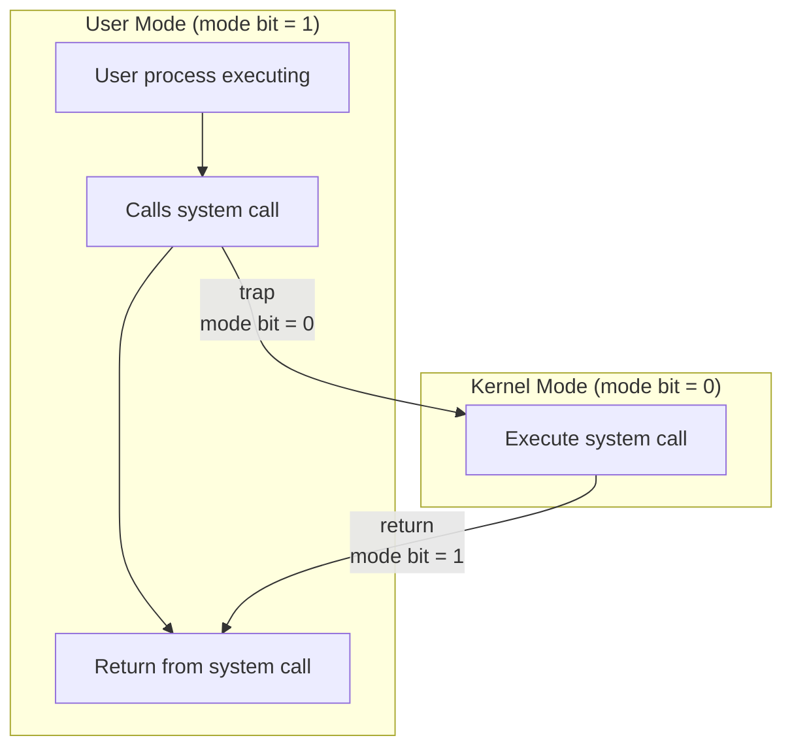
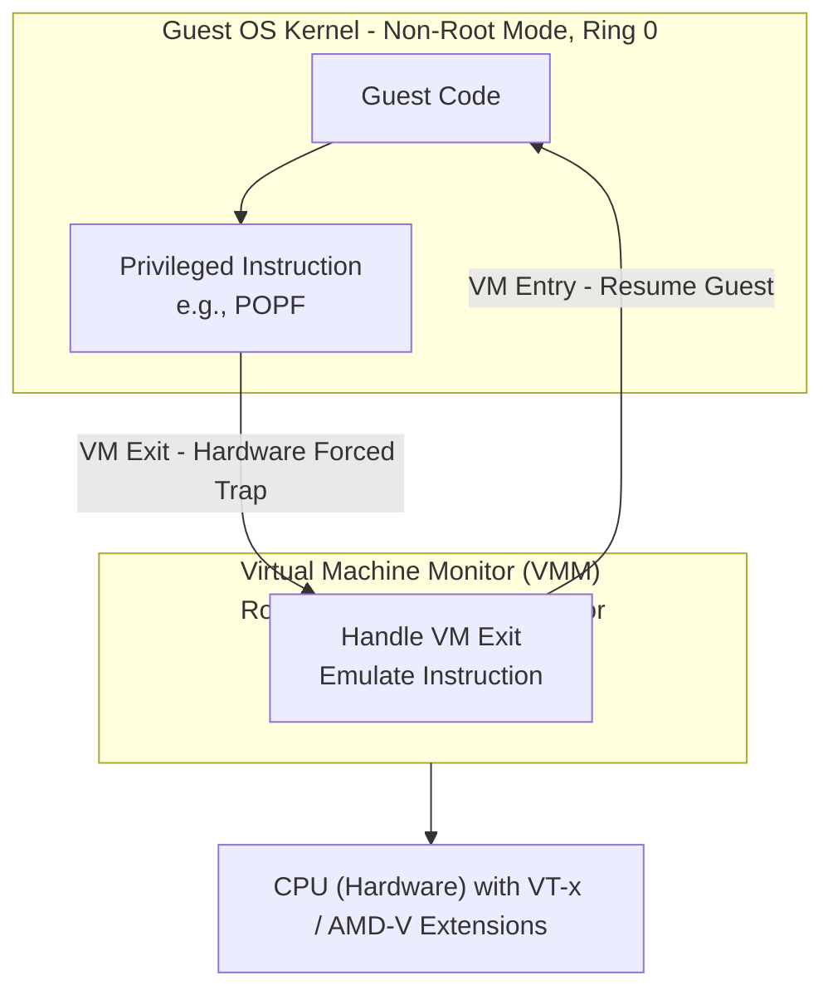
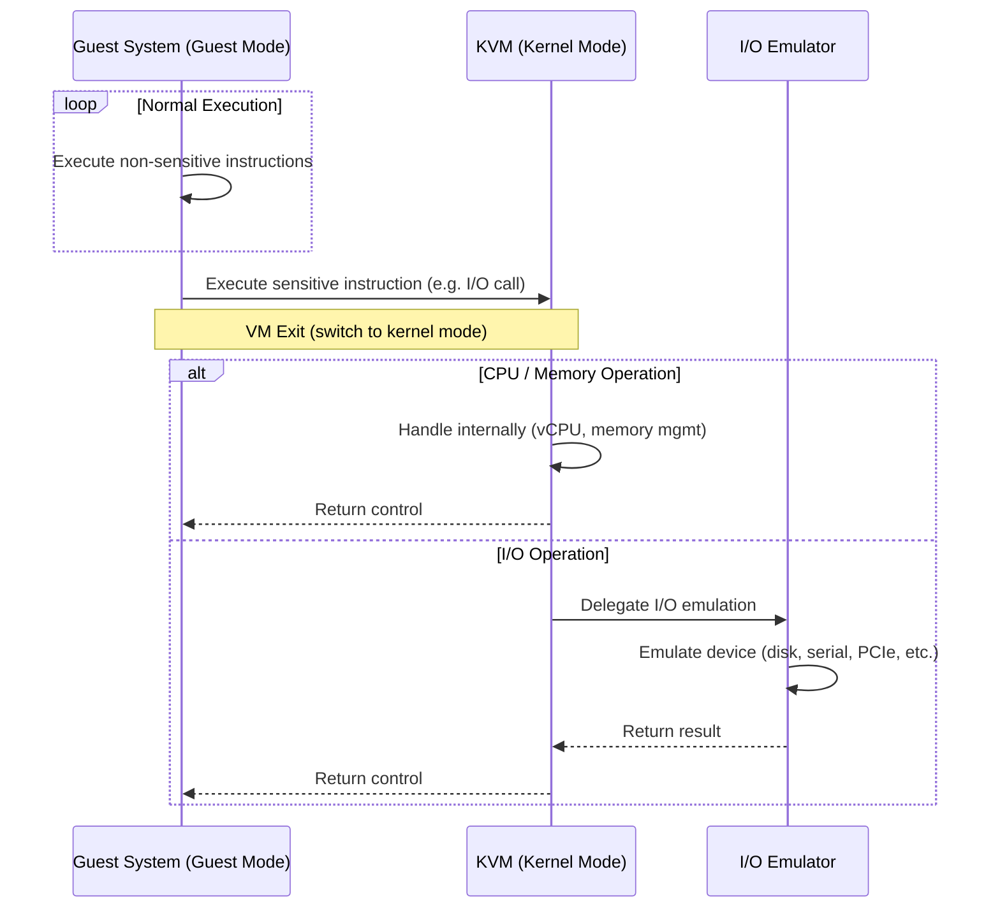
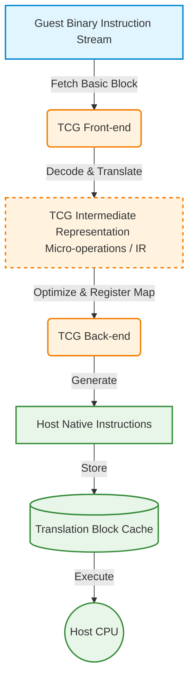
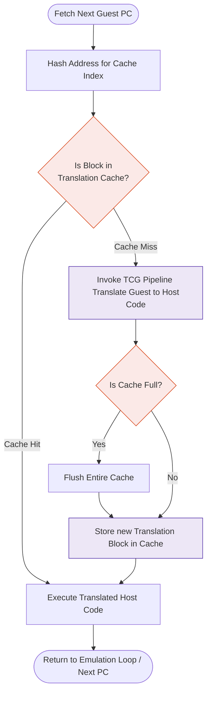
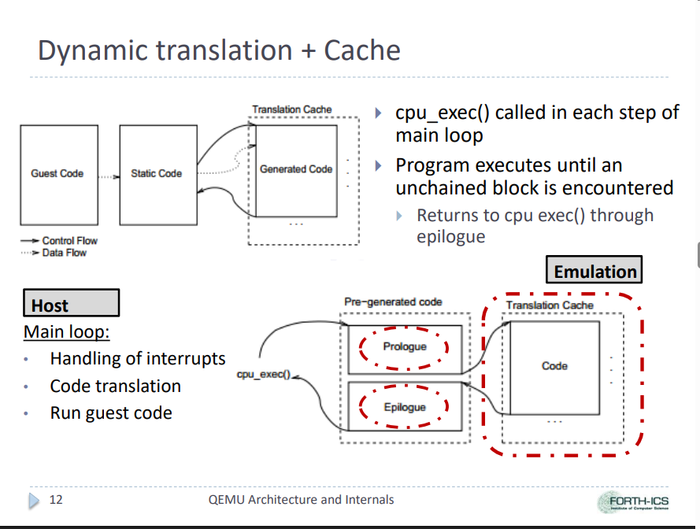

# Linux Virtualization Stack

Table of contents:

- [Linux Virtualization Stack](#linux-virtualization-stack)
  - [1. Introduction](#1-introduction)
  - [2. Virtualization fundamentals](#2-virtualization-fundamentals)
    - [2.1. The Virtual machine monitor (Hypervisor)](#21-the-virtual-machine-monitor-hypervisor)
      - [2.1.1. The three properties of an Effective VMM](#211-the-three-properties-of-an-effective-vmm)
      - [2.1.2. Type 1 and Type 2 Hypervisor](#212-type-1-and-type-2-hypervisor)
    - [2.2. x86 virtualization](#22-x86-virtualization)
    - [2.3. CPU virtualization: The core challenge](#23-cpu-virtualization-the-core-challenge)
      - [2.3.1. The hardware mechanism behind "Trap-and-Emulate"](#231-the-hardware-mechanism-behind-trap-and-emulate)
      - [2.3.2. The classic "Trap-and-Emulate" model](#232-the-classic-trap-and-emulate-model)
    - [2.4. Software-based virtualization: Full virtualization and Paravirtualization](#24-software-based-virtualization-full-virtualization-and-paravirtualization)
      - [2.4.1. Full virtualization](#241-full-virtualization)
      - [2.4.2. Paravirtualization](#242-paravirtualization)
    - [2.5. Hardware-assisted virtualization](#25-hardware-assisted-virtualization)
  - [3. The Linux Virtualization Architecture (Big Picture)](#3-the-linux-virtualization-architecture-big-picture)
  - [4. Hypervisor Layer (Kernel-Level Execution)](#4-hypervisor-layer-kernel-level-execution)
  - [5. User-Space VMM / Runtime Layer](#5-user-space-vmm--runtime-layer)
    - [5.1. QEMU](#51-qemu)
      - [5.1.1. QEMU emulation internals](#511-qemu-emulation-internals)
      - [5.1.2. System emulation - TCG](#512-system-emulation---tcg)
      - [5.1.3. KVM accelerator](#513-kvm-accelerator)
      - [5.1.4. TCG vs. KVM accelerators](#514-tcg-vs-kvm-accelerators)
      - [5.1.5. User emulation](#515-user-emulation)
    - [5.2. Firecracker](#52-firecracker)
      - [5.2.1. The problem Firecracker solves](#521-the-problem-firecracker-solves)
      - [5.2.2. How Firecracker works](#522-how-firecracker-works)
      - [5.2.3. Hands-on guide](#523-hands-on-guide)
    - [5.3. Cloud hypervisor](#53-cloud-hypervisor)
  - [6. Host-Level Virtualization Control](#6-host-level-virtualization-control)
    - [Example:](#example)
    - [Key Points:](#key-points)
  - [7. Datacenter Virtualization Management](#7-datacenter-virtualization-management)
    - [Example:](#example-1)
    - [Key Points:](#key-points-1)
  - [8. Cloud Orchestration Platforms](#8-cloud-orchestration-platforms)
    - [Example:](#example-2)
    - [Key Points:](#key-points-2)
  - [9. MicroVM / Lightweight Virtualization](#9-microvm--lightweight-virtualization)
    - [Examples:](#examples)
    - [Key Points:](#key-points-3)
    - [Positioning:](#positioning)
  - [10. Containers (Contrast, Not Part of VM Stack)](#10-containers-contrast-not-part-of-vm-stack)
    - [Examples:](#examples-1)
    - [Key Points:](#key-points-4)
    - [Important Contrast:](#important-contrast)
  - [11. How Everything Works Together](#11-how-everything-works-together)
    - [Typical Execution Flow:](#typical-execution-flow)
    - [Key Insight:](#key-insight)
  - [12. Advanced Topics (Optional but High Value)](#12-advanced-topics-optional-but-high-value)
  - [13. Conclusion](#13-conclusion)

## 1. Introduction

The modern era of distributed computing, encompassing everything from hyperscale public cloud infrastructure to localized edge computing deployments, relies entirely on the foundational technology of virtualization. By mathematically and logically abstracting physical hardware resources into isolated, programmable units, virtualization directly addresses the historical inefficiencies of single-tenant server architectures, where physical machines frequently operated at a mere fraction of their computational capacity. The ability to multiplex compute, memory, storage, and networking resources across disparate workloads enables massive economies of scale, strict multi-tenant isolation, and highly dynamic resource allocation.

> [!NOTE]
> **Virtualization is Core Enabler (IaaS layer)**
>
> - Cloud providers like AWS, Azure, and GCP present **virtual machines** (EC2, Virtual machines, Compute engine) instead of raw servers.
> - A **hypervisor** multiplexes each physical server into many isolated **virtual machines**, one per tenant or workload.
> - This allows providers to:
>   - Safely run workloads from mutually untrusted customers on the same hardware.
>   - Improve utilization by packing many VMs onto a single physical host.
>   - Implement "pay-as-you-go" pricing at the VM level.

The evolution of virtualization is a multi-decade trajectory that originated with mainframe systems. The paradigm began with the IBM CP-40 and CP-67 architectures in the late 1960s, introducing the conceptual framework of virtual machines and virtual memory hardware to the IBM System/360 Model 67. However, as the computing industry transitioned toward commodity x86 architectures in the 1980s and 1990s, virtualization became a formidable technical challenge due to the lack of native hardware support for virtualization in the x86 instruction set. The early 2000s saw the industry rely on complex, software-heavy emulation techniques or heavily modified paravirtualized guest kernels, championed by hypervisors like Xen (released in 2003) and early VMware iterations. A pivotal paradigm shift occurred in 2005 and 2006 when Intel and AMD introduced hardware-assisted virtualization extensions, fundamentally changing the trajectory of the ecosystem by enabling the processor itself to handle virtualization boundaries.

Following the integration of the Kernel-based Virtual Machine (KVM) module into the mainline Linux kernel in 2007, Linux rapidly became the de facto standard for open-source virtualization. As cloud computing architectures matured, the ecosystem observed an aggressive push toward lighter, faster deployment models. This resulted in the widespread adoption of operating system-level containerization technologies—tracing back to OpenVZ in 2005 and LXC in 2008—which bypassed the hypervisor layer entirely by sharing the host operating system (OS) kernel, thereby prioritizing operational agility and extreme deployment density over strict cryptographic isolation. Most recently, the emergence of microVMs has bridged the dichotomy between traditional, heavyweight virtual machines and lightweight containers, offering the stringent hardware-enforced isolation of full virtualization alongside the sub-second boot times typically associated with containerized workloads.

The scope of this research report is to provide an exhaustive, structural analysis of the Linux-based virtualization ecosystem. This document systematically traverses the entire technological stack: from the fundamental hardware extensions etched into silicon, ascending through the kernel-level hypervisors, navigating the user-space virtual machine monitors (VMMs), examining host-level control daemons, and culminating in the highly abstracted datacenter and cloud orchestration platforms that govern modern infrastructure.

## 2. Virtualization fundamentals

Source:

- <https://en.wikipedia.org/wiki/Hypervisor>
- <https://en.wikipedia.org/wiki/X86_virtualization>
- <https://www.geeksforgeeks.org/operating-systems/virtualization-vmware-full-virtualization/>
- <https://www.geeksforgeeks.org/operating-systems/difference-between-full-virtualization-and-paravirtualization>
- <https://en.wikipedia.org/wiki/Hardware-assisted_virtualization>
- <https://www.slideshare.net/slideshow/virtualization-1-virtual-machine-hypervisor-virtual-machine-monitor/285954190>

### 2.1. The Virtual machine monitor (Hypervisor)

The **Virtual machine monitor (VMM)**, or **Hypervisor** is a specialized software layer that sits between the physical hardware and one or more guest OS.

- Its primary job is to create, run, and manage virtual machines.
- It acts as a "traffic cop", abstracting the underlying hardware and presenting a virtualized hardware platform to each VM.
- This **decouples** the software (guest OS + applications) from the physical hardware.

> [!IMPORTANT]
> Some literature, especially in microkernel contexts, makes a distinction between _hypervisor_ and _virtual machine monitor (VMM)_. There, both components form the overall virtualization stack of a certain system. _Hypervisor_ refers to kernel-space functionality and VMM to user-space functionality.
> Applying this terminology to Linux, KVM is a hypervisor and QEMU or Cloud Hypervisor are VMMs utilizing KVM as hypervisor.
> In the context of this guide, the term VMM (hypervisor) refers specifically to the kernel-space component. User-space VMMs will be introduced later.

#### 2.1.1. The three properties of an Effective VMM

For a VMM to be considered effective, it must satisfy three essential properties as originally defined by [Popek and Goldberd (1974)](https://en.wikipedia.org/wiki/Popek_and_Goldberg_virtualization_requirements):

- **Fidelity**: A program running under the VMM should execute identically to how it would on native hardware, barring minor timing differences. The guest OS should be unaware it is virtualized.
- **Performance**: The VMM should introduce minimal overhead. A statistically dominant subset of the guest's instructions must be executed directly on the host processor at native speed.
- **Safety (Isolation)**: The VMM must retain complete control of all system resources. Guest VMs are strictly isolated from one another; a crash or security breach in one VM cannot affect the hypervisor or other VMs.

#### 2.1.2. Type 1 and Type 2 Hypervisor

- **Type 1 (Bare-metal hypervisor)**:
  - Architecture: install directly onto the physical hardware without a conventional host operating system layer mediating their access (examples include VMware ESXi and the original Xen architecture). They independently manage system resources and schedule guest virtual machines
  - Performance: generally offers higher performance, lower overhead, and better security as it does not compete for resources with a general-purpose host OS.
  - Primary use case: The standard for enterprise data centers and cloud computing infrastructure (e.g., AWS, Azure).
  - Examples: VMware ESXi, Microsoft Hyper-V, Xen.
- **Type 2 (Hosted hypervisor)**:
  - Architecture: runs as a regular software application on top of a conventional host OS. It relies on the host OS to manage hardware interactions.
  - Performance: incurs more overhead because hardware access is mediated by the host OS kernel, creating an extra layer of translation.
  - Primary use case: ideal for desktop environments, such as developers running multiple OSes for testing or individuals needing cross-platform application access.
  - Examples: Oracle VirtualBox, VMware Workstation/Fusion.


### 2.2. x86 virtualization

- **Ring 0 (Kernel mode)** represents the highest privilege level, strictly reserved for the OS kernel, allowing it to configure the memory management unit (MMU), govern physical memory allocation, and directly manipulate input/output (I/O) peripherals.
- Conversely, user-space applications execute in **Ring 3 (User mode)**, confined to their own virtual address spaces and required to invoke system calls to request privileged services from the kernel.


### 2.3. CPU virtualization: The core challenge

The fundamental problem is with the CPU. Contemporary processors are constructed with the aim of being dominated by a special OS. Some of the most important instructions, the ones that directly access the hardware, can only be run in a special mode of the OS - Ring 0.

So, **what happens when you try to run a guest OS inside a VM?**

- The hypervisor must run in Ring 0 to control the real hardware.
- The guest OS thinks it’s in Ring 0, but it’s actually trapped inside a VM.
- When the guest OS tries to execute a privileged instruction, it would normally take control of the entire CPU, crashing the physical server and all other VMs on it.
- You can' have two masters of the same machine.

The first solution is "Trap-and-Emulate" model, but let's deep dive in the hardware mechanism.

#### 2.3.1. The hardware mechanism behind "Trap-and-Emulate"

- Interrupts & Exceptions (CPU "forces" entry):
  - Asynchronous interrupts: timer, NIC, disk, etc.
  - Synchronous exceptions: page fault, divide-by-zero, invalid opcode.
  - CPU saves state, switches to kernel mode, and jumps to a handler.
- System calls (Program "requests" entry):
  - A user program requests an OS service (`read`, `open`, `fork`).
  - It executes a **trap instruction** (e.g., `syscall`, `int 0x80`).
  - This is a **controlled** transition to the kernel.



A user program executes a trap instruction, causing the CPU to switch to kernel mode and jump to the OS system call handler. After servicing the request, control returns to user mode.

#### 2.3.2. The classic "Trap-and-Emulate" model

The classic solution is to **deprivilege** the guest OS. The hypervisor uses the CPU's protection mechanism to its advantage.

1. The hypervisor runs in true Ring 0, with full hardware control.
2. It forces the guest OS kernel to run in a less privileged ring.
3. When the guest OS attempts a **privileged instruction**, it is no longer in Ring 0, so the CPU hardware triggers a **trap (an exception)** to the hypervisor.
4. The hypervisor catches the trap, inspects the failed instruction, **emulates** the operation on behalf of the guest against its virtual state, and then returns control to the guest.

This solution has some assumptions:

- Any instruction that is **sensitive** (i.e., can read or modify the state of the machine, like interrupt flags) must also be **privileged**.
- This ensures that when a guest OS tries to execute such an instruction while a deprivilege ring, it will trap to the hypervisor, which can then safely emulate it.

Legacy x86 architecture violates this requirement. It had a class of instructions that were **sensitive but unprivileged** (The text book example: `POPF` Pop Flags - loads the EFLAGS register from the stack).

- These instructions behave differently depending on the CPU privilege level.
- Crucially, when executed in a deprivileged mode (e.g., Ring 3), they would **fail silently** instead of causing a trap. The hypervisor would never be notified.

### 2.4. Software-based virtualization: Full virtualization and Paravirtualization

As we already understand the challenge, let see how the engineer deal with it using software-based strategies.

This architectural limitation gave rise to two primary software-based virtualization strategies.

#### 2.4.1. Full virtualization


- Full virtualization allows a guest OS to run **without any modification**. The hypervisor presents a complete virtual copy of the hardware, making the guest OS believe it owns a real physical machine.
- The hypervisor uses a technique called **binary translation**. It continuously **intercept and scans** the guest OS code during execution. Whenever it detects a privileged instruction, it replaces (**translate**) it with a safe alternative before allowing it to run. The translated, "safe" block of code is stored in a **translation cache**. The hypervisor then executes this new block. On subsequent executions of the same guest code, the hypervisor uses the fast, cached version, avoiding the translation overhead.
- Pros:
  - Full transparency: it allowed running a completely **unmodified** guest OS.
  - Board compatibility: both Windows and Linux.
- Cons:
  - Performance overhead.
  - Complexity: the hypervisor must maintain a complex binary translator capable of understanding and correctly rewriting parts of another OS's kernel.
- Examples: Early versions of VMware ESX and Microsoft Virtual Server relied on this approach.

#### 2.4.2. Paravirtualization


- Paravirtualization takes a more cooperative approach. Instead of hiding the fact that the OS is virtualized, it makes the guest OS aware of it.
- The guest OS kernel is modified to replace privileged instructions with direct calls to the hypervisor, known as **hypercalls**. Rather than forcing the hypervisor to intercept instructions, the guest OS politely requests help when needed.
  - Analogy: A hypercall is to a hypervisor what a system call is to an OS kernel.
  - Process: When the modified guest OS needs to perform a privileged operation (like changing CPU flags or updating page tables), it does not attempt to execute the sensitive hardware instruction directly.
  - Instead, it makes an explicit, direct function call - a **hypercall** - to the hypervisor, requesting that the operation be performed on its behalf.
  - This completely avoids the problems of silent failures or the overhead of trapping and emulating instructions. It's clean, well-defined API between the guest and the hypervisor.
- Pros:
  - High performance: by replacing traps and dynamic translation with simple function calls, Paravirtualization significantly reduces virtualization overhead. It is often near-native speeds for CPU-bound tasks.
  - Simplicity: the hypervisor can be much simpler, as it no longer needs a complex binary translator or has to manage intricate trap-and-emulate logic.
- Cons:
  - Required guest OS modification.
  - Not transparent: the guest is fundamentally different from one running on bare mental. This breaks the goal of perfect fidelity.
  - Poor compatibility with proprietary OS: historically, it was impossible to use this approach for closoed-source systems like Microsoft Windows.

While both approaches worked, they were complex, inefficient, and difficult to scale. The industry needed a cleaner solution.

### 2.5. Hardware-assisted virtualization

The technological landscape was permanently altered by the introduction of hardware-assisted virtualization, manifested specifically in:

- Intel's VT-x
- AMD's AMD-V

These hardware extensions effectively eliminated the necessity for dynamic binary translation by **introducing an entirely new execution privilege layer beneath the traditional Ring 0 structure**.

Imagine the CPU is a large, secure office building, and the Hypervisor (virtualization software) is the building manager.

- Without hardware assistance: The manager has to personally walk into every room, inspect every document an employee (Virtual Machine) tries to file, and often rewrite them to make sure they don't break building rules. It works, but it's slow, and the manager is constantly overworked.
- With hardware assistance: The architect (Intel/AMD) redesigns the building with the special, secure filing rooms. Employees can file their own documents directly, but the room is designed to stop them from damaging the building or seeing other rooms' files. The manager is still in charge, but only needs to step in if something truly unusual happens.

Technically, hardware-assisted introduces new processor modes, creating a stronger separation between the hypervisor and the guest.

- **Root mode (for the hypervisor)**: A new, highly privileged mode where the hypervisor runs. It has complete and unrestricted control over the physical hardware. This is conceptually "above" the traditional Ring 0.
- **Non-root mode (for the guest)**: The entire guest OS (kernel and applications) runs in this new, less privileged mode. Within non-root mode, the guest still uses its own Ring 0 and Ring 3, but is contained.
- **VM Exit (The automatic trap)**: The CPU hardware is now designed to automatically detect when a guest OS in non-root mode attempts to execute a sensitive instruction (like `POPF`). Instead of silently failing, the CPU triggers a VM Exit: it atomically saves the guest's state and transitions control to the hypervisor in Root mode.
- The hypervisor can then inspect the cause of the trap, emulate the instruction on the guest's behalf, and the resume the guest via a **VM Entry**.



Pros: The best of both worlds.

- Full fidelity & compatibility.
- High performance.
- The industry standard.

---

## 3. The Linux Virtualization Architecture (Big Picture)

Source:

- <https://docs.netapp.com/us-en/netapp-solutions-virtualization/kvm/kvm-overview.html>

The Linux virtualization stack is best understood not as a single monolithic application, but as a highly sophisticated, multi-layered architecture. Within this paradigm, distinctly specialized software components interact hierarchically to transform a standard, general-purpose Linux server into a highly optimized, hardware-accelerated hypervisor environment.


The Linux virtualization stack is best understood not as a single monolithic application, but as a highly sophisticated, multi-layered architecture. Within this paradigm, distinctly specialized software components interact hierarchically to transform a standard, general-purpose Linux server into a highly optimized, hardware-accelerated hypervisor environment.

- At the foundation, the physical hardware supplies the raw computational horsepower, memory modules, and critical virtualization instruction sets.
- Hypervisor layer integrates into the OS kernel (KVM module), functioning as the ultimate arbiter of CPU and memory access.
- The runtime layer operates in user space, tasked with emulating physical hardware peripherals and orchestrating the execution loop of the guest virtual machine processes.
- The management layer (host-level virtualization control and data-center/cloud platform) provides external, standardized interfaces for administrative control, abstracting the extreme complexity of the lower layers of facilitate automation and lifecycle management.

## 4. Hypervisor Layer (Kernel-Level Execution)

Source:

- <https://bitgrounds.tech/posts/kvm-qemu-libvirt-virtualization/>
- <https://en.wikipedia.org/wiki/Kernel-based_Virtual_Machine>
- <https://docs.kernel.org/virt/kvm/>

Kernel-based Virtual Machine (KVM) is a Linux kernel module, which has been part of the mainline kernel since version 2.6.20 which was released on Feb 5th, 2007.

Before this point, the [prevailing open-source virtualization platform was Xen](https://en.wikipedia.org/wiki/Timeline_of_virtualization_technologies). The Xen architecture required a highly specialized, paravirtualized guest kernel to achieve acceptable performance, and its design philosophy necessitated a separate, highly privileged administrative OS known as the "Dom0" management domain to control hardware and orchestrate unprivileged guest domains. This architecture was inherently complex and required maintaining substantial out-of-tree kernel patches.

Instead of attempting to engineer a massive, monolithic hypervisor from scratch, the architects of KVM recognized a profound reality: the standard Linux kernel already performed the exact functions required of a modern hypervisor. The Linux kernel was already highly optimized to schedule competing processes across multiple CPU cores, manage complex physical memory allocations, and handle a vast array of hardware device drivers. Therefore, KVM was simply developed as a loadable kernel module (`kvm.ko`) that extends Linux's inherent native capabilities

```sh
# Check what's loaded right now
lsmod | grep kvm
kvm_intel             458752  0
kvm                  1363968  1 kvm_intel
```

By loading the KVM module, the host Linux kernel effectively transforms into a Type 1 hypervisor. Under the KVM paradigm, every VM is treated by the Linux kernel's Completely Fair Scheduler (CFS) as a standard, schedulable process, and every virtual CPU (vCPU) within that VM is treated as a standard, schedulable execution thread. This minimalist design allows KVM to effortlessly inherit decades of extensive Linux kernel optimizations regarding CPU scheduling, Non-Uniform Memory Access (NUMA) awareness, transparent huge pages, and power management.

As mentioned before, a normal Linux process has two modes of execution: kernel and user. KVM adds a third mode: guest mode (which has its own kernel and user modes, but these do not interest the hypervisor at all).'


The division of labor among the different modes is:

- Guest mode: execute non-I/O guest code.
- Kernel mode: switch into guest mode, and handles any exists from guest mode due to I/O or special instructions.
- User mode: perform I/O on behalf of the guest.



The responsibilities of the KVM module are strictly confined to the absolute lowest-level hardware interactions:

1. Initializing and managing the hardware virtualization extensions (Intel VT-x or AMD-V).
2. Handling the complex context switches between host execution mode and guest execution mode, commonly referred to as VM Entries and VM Exits.
3. Mapping guest physical memory directly to host physical memory utilizing hardware-assisted paging mechanisms


To facilitate communication with higher-level software, KVM exposes a character device file at `/dev/kvm`.

```sh
ls -l /dev/kvm
crw-rw---- 1 root kvm 10, 232 Sep 28 10:30 /dev/kvm
```

User-space applications interact with KVM by sending standard `ioctl()`system calls to this specific device file. KVM itself emulates very little hardware, instead deferring to a higher level client application such - what we call **User-Space VMM / Runtime Layer**.

---

## 5. User-Space VMM / Runtime Layer

While KVM handles the raw, high-speed execution of CPU instructions and memory accesses, a functional virtual machine requires far more than just a processor and RAM. It requires a virtualized motherboard, storage controllers, network adapters, serial consoles, and input devices. The critical task of provisioning this emulated hardware, alongside the management of the virtual machine process execution loop itself, occurs entirely within the **User-space Virtual Machine Monitor (VMM)**.

### 5.1. QEMU

The homepage of the official website of the QEMU project describes it as:

> A generic and open source machine emulator and virtualizer. It translates code written for one **Instruction Set Architecture (ISA)** - such as ARM, RISC-V, or MIPS - into the native instructions of your host system's processor.

Let's talk about the difference between _emulation_ and _virtualization_. The two terms are sometimes used interchangeably, as they achieve a similar result. Namely, the execution of a guest system on a host system. However, the way in which end-result is achieved is different between the two processes:

- **Emulation**:
  - Everything of Guest ISA are realized by software.
    - Register, Memory, I/O
  - Host ISA can be differ from Guest ISA.
  - Guest operations are translated into operations to the emulated devices -> Slow.

```text
        ┌──────────────────────────────┐
        │          EMULATION           │
        └──────────────────────────────┘
                         │
                         ▼
        Guest Instructions (Foreign ISA)
                         │
                         ▼
            [ Interpreter / Translator ]
                         │
                         ▼
        Host-Compatible Instructions
                         │
                         ▼
                    Host CPU

Key idea: Translation layer in between
→ Slower, but hardware-agnostic
```

- **Virtualization**:
  - Share the underlying hardware as disjoin set for each VM instance.
  - Host ISA is the same as Guest ISA.
  - Guest operations can be directly dispatched to hardware -> Fast.

```text
        ┌──────────────────────────────┐
        │        VIRTUALIZATION        │
        └──────────────────────────────┘
                         │
                         ▼
        Guest Instructions (Same ISA)
                         │
                         ▼
               [ Hypervisor Layer ]
                         │
                         ▼
                    Host CPU

Key idea: Direct execution via hardware support
→ Faster, but requires compatible CPU features
```

Let's go back to QEMU, QEMU can be used in several different ways:

- **System emulation**: it provides a virtual model of an entire machine (CPU, memory and emulated devices) to run a guest OS. In this mode the CPU may be fully emulated, or it may work with a hypervisor such as KVM, Xen or Hypervisor.Framework to allow the guest to run directly on the host CPU.
  - If use KVM as accelerator, QEMU turns to **virtualizer**.
  - Allows emulation of a full system, including processor and assorted peripherals.
  - _QEMU as a "System VM"_.
- **User mode emulation**: it can lauch processes compiled for one CPU on another CPU. In this mode the CPU is alway emulated.
  - _QEMU as a "Process VM"_.

#### 5.1.1. QEMU emulation internals

Source:

- <https://www.csd.uoc.gr/~hy428/vm-labs/qemu-internals-slides-apr26_2023.pdf>
- <https://www.slideshare.net/slideshow/qemu-introduction/54765349>

QEMU adopts an abstraction layer between the translation - **Tiny Code Generator (TCG)**, an intermediate representation (IR) code.


- After version 0.9.1, QEMU uses TCG as replacement of DynGen and GCC.
- Rather than statically translating an entire binary upfront or interpreting it instruction-by-instruction, QEMU uses **Dynamic Binary Translation**. It translates code sequences at run-time as they are discovered.
- The TCG separates the emulation process into a front-end and a back-end, allowing QEMU to be highly modular and CPU-independent.
  - To achieve the execution speeds necessary for viable system emulation, TCG does not translate code on an instruction-by-instruction basis. Instead, it processes code in basic blocks, referred to in the QEMU architecture as **Translation Blocks (TBs)**. A Translation Block consists of a sequential execution path of instructions that terminates in a branch, jump, or exception-generating instruction
  - Front-End Translation: QEMU converts the guest (target) instructions into a series of micro-operations. These micro-operations are RISC-style, CPU-independent instructions.
  - Back-End Code Generation: The TCG back-end takes these intermediate micro-operations, optimizes them (including mapping guest registers to host registers), and compiles them down to the native instructions of the host architecture.



Since executing code doesn't change often, why don't we stop translating the code previously translated? Yeah, QEMU heavily relies on caching. It operates similarly to a Just-In-Time (JIT) compiler: it translates a block exactly once and saves it for future use - **Translation Cache**.

- Fast Retrieval: Cached blocks are indexed using their target physical address or guest virtual address for highly efficient lookups.
- Cache Management: The translation cache has a variable size (defaulting to 32 MB). To manage memory bounds, once the cache runs out of space, the entire cache is simply purged and repopulated dynamically as the guest continues to execute.



Even with caching, returning control to the emulator after every single block introduces significant delays. One of the most critical performance optimizations in QEMU is **block chaining**.

- The Emulation Loop Overhead: Usually, when a translated block finishes executing, it must return control to the main CPU emulation loop (e.g., cpu_exec()). This requires passing through an "epilogue" that restores the normal state, and entering the next block requires a "prologue." This constant context-switching adds severe overhead.
  - The execution of every translation block is surrounded by the execution of special code blocks.
    - prologue: initializes the processor for generated host code execution and jumps to the code block.
    - epilogue: restores normal state and returns to the main loop.
  - Returning to the main loop after each block adds significant overhead .. which adds up quickly.



- Chaining Blocks Together: To avoid this, QEMU dynamically patches translated blocks. When a block finishes and the next execution target is known and already translated, QEMU patches the original block to jump directly into the newly discovered block, bypassing the main loop entirely.
- Handling Interrupts: Because chained blocks skip the main loop, QEMU handles asynchronous hardware interrupts by unlinking (unchaining) the currently executing block. This forces the control flow to fall back out to the main emulator loop to handle the interrupt.

```mermaid
graph TD
    classDef loop fill:#eeeeee,stroke:#616161,stroke-width:2px;
    classDef tb fill:#e8f5e9,stroke:#2e7d32,stroke-width:2px;
    classDef patch fill:#fff9c4,stroke:#fbc02d,stroke-width:2px;

    subgraph "Scenario A: Execution Without Chaining (High Overhead)"
        L1((Main QEMU Loop <br> cpu_exec)):::loop -->|Prologue & Context Switch| TB1[Translation Block 1]:::tb
        TB1 -->|Epilogue & Context Switch| L1
        L1 -->|Prologue & Context Switch| TB2[Translation Block 2]:::tb
        TB2 -->|Epilogue & Context Switch| L1
    end

    subgraph "Scenario B: Execution With Block Chaining (High Performance)"
        L2((Main QEMU Loop <br> cpu_exec)):::loop -->|Prologue & Context Switch| TB3[Translation Block 1]:::tb
        TB3 -->|Patch: Direct Jump| TB4[Translation Block 2]:::patch
        TB4 -->|Patch: Direct Jump| TB5[Translation Block 3]:::patch

        TB5 -.->|Hardware Interrupt <br> or Memory Fault| Unchain[Unchain / Exit]
        Unchain -->|Epilogue| L2
    end
```



#### 5.1.2. System emulation - TCG

QEMU’s system emulation provides a virtual model of a machine (CPU, memory and emulated devices) to run a guest OS. It supports a number of hypervisors (known as accelerators) as well as a _JIT known as the Tiny Code Generator (TCG)_ capable of emulating many CPUs.

**Supported accelerators**

| Accelerators                          | Host OS                            | Host Architecture                                |
| ------------------------------------- | ---------------------------------- | ------------------------------------------------ |
| KVM                                   | Linux                              | Arm, MIPS, PPC, RISC-V, s390x, x86               |
| Xen                                   | Linux (as dom0)                    | Arm, x86                                         |
| MSHV                                  | Linux (as dom0)                    | x86                                              |
| Hypervisor Framework (hvf)            | MacOS                              | x86, Arm                                         |
| Windows Hypervisor Platform (whpx)    | Windows                            | Arm, x86                                         |
| NetBSD Virtual Machine Monitor (nvmm) | NetBSD                             | x86                                              |
| Tiny Code Generator (tcg)             | Linux, other POSIX, Windows, MacOS | Arm, x86, Loongarch64, MIPS, PPC, s390x, Sparc64 |

Let's start with the default accelerator - Tiny Code Generator

```sh
qemu-system-x86_64 \
  -machine accel=tcg \
  -cpu max \
  -m 512 \
  -cdrom alpine-virt-3.23.4-x86_64.iso \
  -boot d \
  -nographic

# Wait a few minutes ...
Welcome to Alpine!

The Alpine Wiki contains a large amount of how-to guides and general
information about administrating Alpine systems.
See <https://wiki.alpinelinux.org/>.

You can setup the system with the command: setup-alpine

You may change this message by editing /etc/motd.
# !!!! The different kernel version !!!!
localhost:~# uname -r
6.18.22-0-virt
localhost:~# cat /etc/os-release
NAME="Alpine Linux"
ID=alpine
VERSION_ID=3.23.4
PRETTY_NAME="Alpine Linux v3.23"
HOME_URL="https://alpinelinux.org/"
BUG_REPORT_URL="https://gitlab.alpinelinux.org/alpine/aports/-/issues"
# !!!! CPU Model is QEMU TCG !!!!
localhost:~# strings /proc/cpuinfo | grep -i qemu
model name      : QEMU TCG CPU version 2.5+
```

```sh
qemu-system-x86_64 \
  -machine accel=tcg \
  -cpu qemu64 \
  -m 256 \
  -cdrom TinyCorePure64-17.0.iso \
  -boot d
```

#### 5.1.3. KVM accelerator

Ok, now let's switch to KVM - turn qemu to virtualizer (yeah, it's really confusing at this point).


```sh
qemu-system-x86_64 \
  -machine accel=kvm \
  -cpu host \
  -m 512 \
  -cdrom alpine-virt-3.23.4-x86_64.iso \
  -boot d \
  -nographic

Welcome to Alpine Linux 3.23
Kernel 6.18.22-0-virt on x86_64 (/dev/ttyS0)

localhost login: root
Welcome to Alpine!

The Alpine Wiki contains a large amount of how-to guides and general
information about administrating Alpine systems.
See <https://wiki.alpinelinux.org/>.

You can setup the system with the command: setup-alpine

You may change this message by editing /etc/motd.

localhost:~# strings /proc/cpuinfo | grep -i qemu
localhost:~# strings /proc/cpuinfo
processor       : 0
vendor_id       : GenuineIntel
cpu family      : 6
model           : 60
model name      : Intel(R) Core(TM) i5-4200M CPU @ 2.50GHz
stepping        : 3
microcode       : 0x28
cpu MHz         : 2494.228
cache size      : 16384 KB
physical id     : 0
siblings        : 1
core id         : 0
cpu cores       : 1
apicid          : 0
initial apicid  : 0
fpu             : yes
fpu_exception   : yes
cpuid level     : 13
wp              : yes
flags           : fpu vme de pse tsc msr pae mce cx8 apic sep mtrr pge mca cmov pat pse36 clflush mmx fxsr sse sse2 ss ss
vmx flags       : vnmi preemption_timer invvpid ept_x_only ept_ad ept_1gb flexpriority tsc_offset vtpr mtf vapic ept vpil
bugs            : cpu_meltdown spectre_v1 spectre_v2 spec_store_bypass l1tf mds swapgs srbds bhi ibpb_no_ret spectre_v2_s
bogomips        : 4988.45
clflush size    : 64
cache_alignment : 64
address sizes   : 39 bits physical, 48 bits virtual
power management:
localhost:~#
```

You can see the model is hardware-model, we have switch from software emulation (TCG) to hardware accelerator. When you run a virtual machine with QEMU and KVM enabled, QEMU provides the device emulation and machine abstraction, while KVM handles CPU and memory virtualization using hardware extensions. The result is a fully functional virtual machine with near-native CPU performance and complete hardware device support.

- KVM knows how to run CPU instructions blazingly fast, but it knows absolutely nothing about disks, keyboards, or screens.
  - CPU Virtualization: KVM uses hardware virtualization extensions (Intel VT-x or AMD-V) to let the virtual machine run its instructions directly on the physical host CPU.
  - Memory Isolation: KVM handles the hardware-level translation of virtual memory to physical memory (via Extended Page Tables/EPT). It ensures the VM cannot access the host machine's memory or the memory of other VMs.
  - Context Switching: It handles the low-level transitions between the host operating system and the guest operating system (known as VMEntry and VMExit).
  - Virtual Interrupt Handling: KVM contains a virtual interrupt controller (like the in-kernel APIC) to deliver hardware interrupts to the virtual CPU at near-native speeds.
- QEMU:
  - Device Emulation: QEMU fakes all the hardware peripherals. When your virtual machine thinks it is writing to a SATA hard drive, reading a USB drive, sending packets out of an Intel network card, or drawing to a VGA monitor, QEMU is the software pretending to be those physical devices.
  - Machine Emulation: QEMU provides the foundational motherboard architecture, including the BIOS/UEFI, ACPI tables, and the PCI bus.
  - Disk Image Management: QEMU handles the virtual disk files (like .qcow2 or .raw images) and translates the VM's disk read/write requests into actual file operations on the host machine's storage.
  - VM Lifecycle Management: QEMU is the actual Linux process that starts up. It allocates the memory for the VM, sets up the virtual CPUs, and creates the thread structure.
  - CPU Emulation (Fallback): If KVM is unavailable (e.g., you don't have hardware virtualization), QEMU uses its Tiny Code Generator (TCG) to translate CPU instructions in software. When KVM is enabled, QEMU happily turns this task over to KVM.

**How they work together**

They communicate using a special device file in Linux: `/dev/kvm`.

1. QEMU starts up and says, "I need to build a virtual machine with 4 CPUs and 4GB of RAM."
2. QEMU talks to KVM (via `ioctl` system calls to `/dev/kvm`) and asks KVM to carve out the memory and initialize 4 virtual CPUs on the hardware.
3. KVM executes the guest OS directly on the host processor.
4. When the guest OS needs to do something outside the CPU—like write a file to the hard drive or draw a pixel on the screen—the physical CPU triggers a "VMExit" and traps the action.
5. KVM pauses the virtual CPU and hands the request back to QEMU.
6. QEMU handles the I/O request (e.g., writing the data to the .qcow2 file).
7. QEMU tells KVM the job is done, and KVM resumes running the virtual CPU.


The typical stack looks like this: physical host CPU with Intel VT-x or AMD-V, Linux kernel with the KVM module loaded, QEMU running in user space as the VMM, guest operating system running inside the VM. KVM enforces the hardware boundary between the guest and the host kernel. QEMU manages everything the guest sees as its hardware.

This combination is what most production hypervisors use under the hood. libvirt, Proxmox, and OpenStack all manage QEMU/KVM virtual machines at scale. We will talk about these later.

#### 5.1.4. TCG vs. KVM accelerators

To truly appreciate the performance leap KVM provides, there is nothing quite like a side-by-side benchmark: QEMU’s software-based Tiny Code Generator (TCG) against the hardware-accelerated raw power of KVM.

> Prerequisite: You must run this on a Linux host with KVM enabled. Check if /dev/kvm exists.

1. Download the Alpine Linux ISO.

```sh
wget https://dl-cdn.alpinelinux.org/alpine/v3.23/releases/x86_64/alpine-virt-3.23.4-x86_64.iso
```

2. Run the TCG benchmark

Force QEMU to use TCG, QEMU will manually translate every single x86_64 instruction in software.

```sh
qemu-system-x86_64 \
  -accel tcg \
  -m 512 \
  -cdrom alpine-virt-3.23.4-x86_64.iso \
  -nic none \
  -nographic

# You may need to wait for like 10 seconds.
Welcome to Alpine Linux 3.23
Kernel 6.18.22-0-virt on x86_64 (/dev/ttyS0)

localhost login: root
Welcome to Alpine!

The Alpine Wiki contains a large amount of how-to guides and general
information about administrating Alpine systems.
See <https://wiki.alpinelinux.org/>.

You can setup the system with the command: setup-alpine

You may change this message by editing /etc/motd.

localhost:~# time awk 'BEGIN { for (i=1; i<=10000000; i++) sqrt(i); print "Done"
 }'

Done
real    3m 27.66s
user    2m 55.78s
sys     0m 0.64s
```

3. Run the KVM benchmark

Now, switch to KVM (`-machine accel=kvm -cpu host`). This allows the VM to execute its instructions natively on your physical processor.

```sh
qemu-system-x86_64 \
  -machine accel=kvm \
  -cpu host \
  -m 512 \
  -cdrom alpine-virt-3.23.4-x86_64.iso \
  -nic none \
  -nographic
# significantly faster

Welcome to Alpine Linux 3.23
Kernel 6.18.22-0-virt on x86_64 (/dev/ttyS0)

localhost login: root
Welcome to Alpine!

The Alpine Wiki contains a large amount of how-to guides and general
information about administrating Alpine systems.
See <https://wiki.alpinelinux.org/>.

You can setup the system with the command: setup-alpine

You may change this message by editing /etc/motd.


localhost:~# time awk 'BEGIN { for (i=1; i<=10000000; i++) sqrt(i); print "Done"
 }'
Done
real    0m 7.05s
user    0m 6.98s
sys     0m 0.00s
```

4. You may notice the gaps between two boot times, also the 10M square roots benchmark.

#### 5.1.5. User emulation

While system-mode emulation builds an entire "fake" computer (motherboard, BIOS, virtual hard drives), user-mode emulation completely ignores the hardware.

Instead, it allows you to run a single Linux application compiled for one CPU architecture (like ARM) directly on a completely different CPU architecture (like x86_64), right alongside your normal host applications.

**How user-mode works**

To achieve this, QEMU performs two distinct tasks simultaneously:

- **Instruction Translation (via TCG)**: It uses the Tiny Code Generator we discussed earlier to translate the target architecture's CPU instructions into your host's CPU instructions on the fly.
- **System Call Translation (Thunking)**: When the foreign binary tries to talk to the Linux kernel (e.g., to read a file, allocate memory, or print to the screen), QEMU intercepts the architecture-specific system call, translates the memory pointers and register layouts into the x86_64 equivalent, passes it to your host Linux kernel, and then hands the result back to the application.

Because it relies on your host OS kernel, **user-mode emulation only works for Linux-on-Linux (or BSD-on-BSD)**. You cannot use it to run Windows .exe files on Linux.

**Hands-on example: running an ARM64 app on x86_64**

> Prerequisites: You need an ARM64 cross-compiler like `gcc-aarch64-linux-gnu` and `qemu-user-static` installed on your x86_64 host.

1. Write the 'Matrix Glitch' program

We will use a terminal block to write the C code to avoid any text editor stripping out our header brackets. This program asks the kernel for hardware info using `uname` and includes a deliberate segmentation fault if we pass an argument.

```sh
cat << 'EOF' > expose_qemu.c
#include <sys/utsname.h>
#include <stddef.h>

int main(int argc, char **argv) {
    struct utsname sys_info;
    uname(&sys_info);

    printf("Welcome to the Matrix.\n");
    printf("The OS tells me my hardware CPU is: %s\n", sys_info.machine);

    // If we pass any argument, crash the program
    if (argc > 1) {
        printf("\nInitiating deliberate crash...\n");
        int *crash = NULL;
        *crash = 42;
    }
    return 0;
}
EOF
```

2. Cross-compile for ARM64

Compile the binary statically. This bundles the C standard library directly into the executable, making it completely self-contained so we don't have to worry about missing ARM shared libraries (`.so` files) on our x86 host.

```sh
aarch64-linux-gnu-gcc -static expose_qemu.c -o expose_qemu_arm
```

3. Run normally (catching the lie)

Execute the program as if it were a normal native binary. Because of `binfmt_misc`, the kernel silently hands it to QEMU.

```sh
./expose_qemu_arm
# Output
Welcome to the Matrix.
The OS tells me my hardware CPU is: aarch64
```

The Proof: If QEMU let the binary talk directly to your host kernel, the kernel would return x86_64, which might cause the ARM binary to panic. Instead, QEMU intercepts the `uname` system call and manually injects the string aarch64 to keep the binary happy.

4. Crash it (making QEMU break character)

Now, trigger the deliberate segmentation fault by passing an argument.

```sh
./expose_qemu_arm crash
# Output
Welcome to the Matrix.
The OS tells me my hardware CPU is: aarch64

Initiating deliberate crash...
qemu: uncaught target signal 11 (Segmentation fault) - core dumped
[1]    23377 segmentation fault (core dumped)  ./expose_qemu_arm crash
```

The Proof: When an application crashes natively, the kernel simply prints `Segmentation fault`. But because this is a guest binary, the host kernel sends the crash signal to QEMU. QEMU must then translate that crash for you, explicitly printing its own name (`qemu: uncaught target signal...`) in the process.

5. Expose the translation engine directly

Finally, force QEMU to dump its real-time system call translation logs using the hidden `QEMU_STRACE` environment variable. Native binaries ignore this variable completely, so if it works, QEMU is definitely running the show.

```sh
QEMU_STRACE=1 ./expose_qemu_arm
# Output
23521 brk(NULL) = 0x000000000049a000
23521 brk(0x000000000049ab78) = 0x000000000049ab78
23521 set_tid_address(4825296,4821032,4825280,4825536,4778064,4827120) = 23521
23521 set_robust_list(4825312,24,4825312,1,0,4825360) = -1 errno=38 (Function not implemented)
23521 Unknown syscall 293
23521 uname(0x55007ff818) = 0
23521 prlimit64(0,3,0,365080607112,4827160,88) = 0
23521 readlinkat(AT_FDCWD,"/proc/self/exe",0x00000055007fe8d0,4096) = 76
23521 getrandom(4820680,8,1,4825088,4786664,0) = 8
23521 brk(0x00000000004bbb78) = 0x00000000004bbb78
23521 brk(0x00000000004bc000) = 0x00000000004bc000
23521 mprotect(0x000000000048e000,16384,PROT_READ) = 0
23521 uname(0x55007ff6f0) = 0
23521 newfstatat(1,"",0x00000055007ff568,0x1000) = 0
Welcome to the Matrix.
23521 write(1,0x49b040,23) = 23
The OS tells me my hardware CPU is: aarch64
23521 write(1,0x49b040,44) = 44
23521 exit_group(0)
```

- The memory setup: Before your program's `main()` function even runs, the bundled C standard library needs memory space. These `brk` and `mprotect` calls are QEMU asking your x86_64 host kernel to allocate safe memory boundaries for the ARM binary to use.

```sh
brk(NULL) = 0x000000000049a000
mprotect(0x000000000048e000,16384,PROT_READ) = 0
```

- The intercepted `uname` call: This is the exact moment QEMU intercepts the `uname(&sys_info)` function. It intercepts the call before it hits the host kernel, returns 0 (indicating success), and silently fills memory address `0x55007ff818` with the spoofed aarch64 string.

```sh
uname(0x55007ff818) = 0
```

- A harmless glitch: System call 293 on ARM64 is `rseq` (Restartable Sequences), an advanced optimization used by modern C libraries. QEMU user-mode emulation does not implement every obscure system call perfectly. When it encounters one it doesn't support, it logs it and continues. The standard library handles the failure gracefully.

```sh
Unknown syscall 293
```

- Translating the output: The `printf` function formats text and uses the `write()` system call to push it to the screen. QEMU translates this request perfectly: it tells the host kernel to write to File Descriptor 1 (Standard Output), reading from memory address `0x49b040`, for exactly 23 bytes.

```sh
Welcome to the Matrix.
write(1,0x49b040,23) = 23
```

- Clean Shutdown: When your C program reaches return 0;, QEMU catches it, translates it into an `exit_group` system call, and cleanly shuts down both the emulator and the guest process.

```sh
exit_group(0)
```

### 5.2. Firecracker

Source:

- <https://firecracker-microvm.github.io>
- <https://northflank.com/blog/what-is-aws-firecracker>
- <https://www.amazon.science/blog/how-awss-firecracker-virtual-machines-work>

#### 5.2.1. The problem Firecracker solves

[AWS Firecracker](https://www.usenix.org/system/files/nsdi20-paper-agache.pdf) is an open source VMM specialized for serverless workloads. It’s arguably Amazon’s most influential open source contribution.

Initially released in 2018 and built specifically to power services like AWS Lambda and AWS Fargate, Firecracker introduced the concept of the **microVM**.

> [!IMPORTANT]
> MicroVMs are lightweight virtual machines designed to provide the isolation and security of traditional VMs while approaching the speed and efficiency of containers. Essentially, a microVM strips away all extraneous virtualization features (legacy device emulation, expansive hardware support, etc.) and runs with minimal overhead.
>
> - minimal device model
> - direct Linux kernel boot
> - no BIOS/UEFI
> - no PCI bus
> - only virtio devices
> - extremely reduced attack surface
>
> Most cloud workloads do **not** need:
>
> - sound cards
> - USB
> - VGA
> - PCI hotplug
> - firmware compatibility
> - legacy hardware

Before Firecracker, cloud providers facing the challenge of running serverless functions (like AWS Lambda) had to choose between two imperfect isolation models:

- **Traditional Virtual Machines (e.g., QEMU/KVM)**: Highly secure. They provide hardware-level isolation, meaning a compromised tenant cannot easily break out and affect others on the same host. However, they are incredibly heavy. Traditional VMs carry a lot of legacy baggage (emulating BIOS, PCI buses, floppy drives, etc.), leading to high memory overhead and slow boot times (often taking seconds to start). This makes them unsuited for the rapid scaling required by serverless computing.
- **Containers (e.g., Docker, Linux namespaces/cgroups)**: Fast and lightweight. Containers share the host operating system's kernel, allowing them to start in milliseconds and pack densely onto a server. The trade-off is security. Because they share a kernel, a kernel-level vulnerability could potentially allow a malicious payload to break out of the container and access other tenants' data on the same host.

AWS needed a solution that offered the hardware-level security of a VM with the density and boot speed of a container. The answer was to build a custom VMM from scratch.

> [!NOTE]
>
> QEMU microvms target: <https://www.qemu.org/docs/master/system/i386/microvm.html>
>
> By default, microvm aims for maximum compatibility, enabling both legacy and non-legacy devices. In this example, a VM is created without passing any additional machine-specific option, using the legacy ISA serial device as console:
>
> ```sh
> qemu-system-x86_64 -M microvm \
>    -enable-kvm -cpu host -m 512m -smp 2 \
>    -kernel vmlinux -append "earlyprintk=ttyS0 console=ttyS0 root=/dev/vda" \
>    -nodefaults -no-user-config -nographic \
>    -serial stdio \
>    -drive id=test,file=test.img,format=raw,if=none \
>    -device virtio-blk-device,drive=test \
>    -netdev tap,id=tap0,script=no,downscript=no \
>    -device virtio-net-device,netdev=tap0
> ```
>
> While the example above works, you might be interested in reducing the footprint further by disabling some legacy devices. If you’re using KVM, you can disable the RTC, making the Guest rely on kvmclock exclusively. Additionally, if your host’s CPUs have the TSC_DEADLINE feature, you can also disable both the i8259 PIC and the i8254 PIT (make sure you’re also emulating a CPU with such feature in the guest).
>
> This is an example of a VM with all optional legacy features disabled:
>
> ```sh
> qemu-system-x86_64 \
>    -M microvm,x-option-roms=off,pit=off,pic=off,isa-serial=off,rtc=off \
>    -enable-kvm -cpu host -m 512m -smp 2 \
>    -kernel vmlinux -append "console=hvc0 root=/dev/vda" \
>    -nodefaults -no-user-config -nographic \
>    -chardev stdio,id=virtiocon0 \
>    -device virtio-serial-device \
>    -device virtconsole,chardev=virtiocon0 \
>    -drive id=test,file=test.img,format=raw,if=none \
>    -device virtio-blk-device,drive=test \
>    -netdev tap,id=tap0,script=no,downscript=no \
>    -device virtio-net-device,netdev=tap0
> ```

#### 5.2.2. How Firecracker works

Source: <https://github.com/firecracker-microvm/firecracker/blob/main/docs/design.md>

Firecracker aims to provide VM-level isolation guarantees and solve three challenges associated with virtualization. These are:

1. VMM and the kernel have high CPU and memory overhead for VMs.
2. VM startup takes seconds.
3. Hypervisors and VMMs can be large and complex, with a significant attack surface. They are also typically written in memory unsafe programming languages.


AWS solves the challenges by keeping Linux KVM, but swapping QEMU with a super lightweight alternative called Firecracker, written in Rust. In particular, Firecracker provides:

- Device emulation for disk, networking, and serial console (keyboard)
- REST based configuration API to configure, manage, start and stop MicroVMs. This replaces some of the functionality offered by libvirt.
- Rate limiting for network and disk. Can configure throughput and request rates. For this Firecracker implements its own solution for simplicity, rather than using cgroups
- Firecracker also provides a metadata service - MicroVM-Metadata Service (MMDS) that securely shares configuration information between the host and guest operating system.


For network and block devices, Firecracker uses `virtio` (specifically virtio-net for networking, virtio-block for storage, and virtio-vsock for socket communication). Virtio provides an open API for exposing emulated devices from hypervisors. Virtio is simple, scalable, and offers good performance through its use of paravirtualization.


On the networking side, Firecracker uses a TAP virtual network interface and encapsulates the guest OS (and the TAP device) inside their own network namespace.

For storage, AWS chooses to support block devices, rather than filesystem passthrough, as a security consideration. Filesystems are large and complex code bases, and providing only block IO to the guest protects a substantial part of the host kernel surface area.

Finally, Firecracker also has a jailer around it to provide an additional level of protection against unwanted VMM behavior (such as a bug). The jailer implements a restrictive sandbox around the guest by using a set of Linux primitives. These include chroot, pid, and network namespaces. The jailer also uses seccomp-bpf to whitelist the set of system calls that can drop to the host. This, rather than using libvirt as the jailer, also diverges from Red Hat’s architecture.


From a security perspective, all vCPU threads are considered to be running malicious code as soon as they have been started; these malicious threads need to be contained. Containment is achieved by nesting several trust zones which increment from least trusted or least safe (guest vCPU threads) to most trusted or safest (host). These trusted zones are separated by barriers that enforce aspects of Firecracker security. For example, all outbound network traffic data is copied by the Firecracker I/O thread from the emulated network interface to the backing host TAP device, and I/O rate limiting is applied at this point. These barriers are marked in the diagram below.

#### 5.2.3. Hands-on guide

Source: <https://github.com/firecracker-microvm/firecracker/blob/main/docs/getting-started.md>

To fully master Firecracker, you must understand both the user-space operations (interacting with its REST API) and the host-space operations (how KVM and the Linux kernel partition resources).

This guide provides a comprehensive, production-style walkthrough to configure, network, boot, and analyze a Firecracker microVM using the exact assets and versions from the official repository. It is taken from Firecracker getting started guide and enrich.

**Step 1: Environment Verification & Hardware Virtualization**

Firecracker relies on the Linux Kernel-based Virtual Machine (KVM) subsystem. It uses hardware execution blocks (Intel VT-x or AMD-V) to run guest code directly on the host CPU.

```sh
#!/bin/bash
set -euo pipefail

echo "==> Verifying KVM virtualization support..."
if ! lsmod | grep -q kvm; then
    echo "ERROR: KVM kernel module is not loaded. Ensure hardware virtualization is enabled in BIOS." >&2
    exit 1
fi

echo "==> Configuring permissions for /dev/kvm..."
# Check if current user has RW access to KVM character device
if [ ! -r /dev/kvm ] || [ ! -w /dev/kvm ]; then
    echo "Current user lacks permissions for /dev/kvm. Adjusting via group management..."
    if [ "$(stat -c "%G" /dev/kvm)" = "kvm" ]; then
        sudo usermod -aG kvm "${USER}"
        echo "SUCCESS: User added to 'kvm' group. Please log out and back in for changes to apply."
    else
        echo "Fallback: Granting access via Access Control Lists (ACL)..."
        sudo setfacl -m u:${USER}:rw /dev/kvm
    fi
else
    echo "KVM Permissions: OK"
fi
```

When the KVM module is active, it exposes `/dev/kvm`. Firecracker uses this file descriptor to perform setup actions via ioctl system calls. When a microVM runs, the physical CPU core transitions out of host execution mode (Root Mode) into guest execution mode (Non-Root Mode). The guest OS runs at ring 0 inside its isolated hardware execution context.

**Step 2: Asset Provisioning & Rootfs Construction**

Instead of multi-gigabyte ISO files or complex disk partition maps, Firecracker requires exactly two raw components: an uncompressed raw Linux kernel image (vmlinux) and a linear ext4 filesystem image.

Execute this script to download the exact latest binaries from the Firecracker CI pipeline, generate custom SSH keys, and provision a mountable loop device to inject credentials directly into the root filesystem:

```sh
#!/bin/bash
set -euo pipefail

ARCH="$(uname -m)"
RELEASE_URL="https://github.com/firecracker-microvm/firecracker/releases"
LATEST_TAG=$(basename "$(curl -fsSLI -o /dev/null -w "%{url_effective}" ${RELEASE_URL}/latest)")
CI_VERSION=${LATEST_TAG%.*}

echo "==> Downloading Firecracker ${LATEST_TAG} binary..."
curl -L "${RELEASE_URL}/download/${LATEST_TAG}/firecracker-${LATEST_TAG}-${ARCH}.tgz" | tar -xz
sudo cp "release-${LATEST_TAG}-${ARCH}/firecracker-${LATEST_TAG}-${ARCH}" /usr/local/bin/firecracker
sudo cp "release-${LATEST_TAG}-${ARCH}/jailer-${LATEST_TAG}-${ARCH}" /usr/local/bin/jailer
sudo chmod +x /usr/local/bin/firecracker
sudo chmod +x /usr/local/bin/jailer

echo "==> Fetching latest compatible upstream guest kernel image..."
KERNEL_KEY=$(curl -s "http://spec.ccfc.min.s3.amazonaws.com/?prefix=firecracker-ci/$CI_VERSION/$ARCH/vmlinux-&list-type=2" \
  | grep -oP "(?<=<Key>)(firecracker-ci/$CI_VERSION/$ARCH/vmlinux-[0-9]+\.[0-9]+\.[0-9]{1,3})(?=</Key>)" \
  | sort -V | tail -1)
wget -O vmlinux "https://s3.amazonaws.com/spec.ccfc.min/${KERNEL_KEY}"

echo "==> Fetching guest Ubuntu rootfs container..."
UBUNTU_KEY=$(curl -s "http://spec.ccfc.min.s3.amazonaws.com/?prefix=firecracker-ci/$CI_VERSION/$ARCH/ubuntu-&list-type=2" \
  | grep -oP "(?<=<Key>)(firecracker-ci/$CI_VERSION/$ARCH/ubuntu-[0-9]+\.[0-9]+\.squashfs)(?=</Key>)" \
  | sort -V | tail -1)
UBUNTU_VER=$(basename "$UBUNTU_KEY" .squashfs | grep -oE '[0-9]+\.[0-9]+')
wget -O "ubuntu-${UBUNTU_VER}.squashfs.upstream" "https://s3.amazonaws.com/spec.ccfc.min/${UBUNTU_KEY}"

echo "==> Unpacking filesystem and inject credentials..."
rm -rf squashfs-root
unsquashfs "ubuntu-${UBUNTU_VER}.squashfs.upstream"

# Generate non-interactive SSH Key pair
rm -f microvm_key*
ssh-keygen -f microvm_key -N "" -t rsa -b 4096
mkdir -p squashfs-root/root/.ssh
cp microvm_key.pub squashfs-root/root/.ssh/authorized_keys
chmod 700 squashfs-root/root/.ssh
chmod 600 squashfs-root/root/.ssh/authorized_keys

echo "==> Compiling optimized raw ext4 filesystem disk block..."
sudo chown -R root:root squashfs-root
truncate -s 1G rootfs.ext4
sudo mkfs.ext4 -d squashfs-root -F rootfs.ext4
sudo chown "${USER}:${USER}" rootfs.ext4

echo "==> Cleanup intermediate directories..."
sudo rm -rf squashfs-root
echo "Assets prepared successfully."
```

**Step 3: Configuring Host-Side Networking**

Firecracker does not implement a virtual network switch. It relies on a paravirtualized network layer (`virtio-net`) linked directly to a Linux TAP interface on the host machine.

Run the following configuration block to create the network tunnel, establish a network bridge space, and set up network address translation (NAT) to route the guest's outbound Internet traffic through your primary network card:

```sh
#!/bin/bash
set -euo pipefail

TAP_DEV="tap0"
TAP_IP="172.16.0.1"
GUEST_IP="172.16.0.2"
NETMASK_SHORT="/30"

echo "==> Tearing down old interface states if present..."
sudo ip link del "$TAP_DEV" 2>/dev/null || true

echo "==> Initializing virtual TAP interface..."
sudo ip tuntap add dev "$TAP_DEV" mode tap
sudo ip addr add "${TAP_IP}${NETMASK_SHORT}" dev "$TAP_DEV"
sudo ip link set dev "$TAP_DEV" up

echo "==> Provisioning Host Kernel routing matrices..."
sudo sh -c "echo 1 > /proc/sys/net/ipv4/ip_forward"

# Clear conflicting old rules and establish NAT Masquerading
HOST_INTERFACE=$(ip -j route list default | grep -oP '(?<="dev":")[^"]+')
sudo iptables -P FORWARD ACCEPT
sudo iptables -t nat -D POSTROUTING -o "$HOST_INTERFACE" -j MASQUERADE 2>/dev/null || true
sudo iptables -t nat -A POSTROUTING -o "$HOST_INTERFACE" -j MASQUERADE

echo "Host Network Matrix Initialized. Topology: Host [${TAP_IP}] <---> Guest [${GUEST_IP}]"
```

**Step 4: The REST API Interactive Bootstrap Guide**

With your assets compiled and network tunnels listening, you can configure your MicroVM. Firecracker acts as an HTTP server bound to a local Unix Domain Socket file descriptor.

To visualize how these configuration inputs assemble your execution state, use the interactive panel below to select resources, view real-time API schema updates, and track the internal VMM state transitions.

**Step 5: Manual Orchestration and Connection**

If you want to spin up the machine manually using individual API endpoints, execute the following shell script. It pipes sequential configuration parameters directly into Firecracker's listening socket file descriptor:

```sh
#!/bin/bash
set -euo pipefail

SOCKET="/tmp/firecracker.socket"
sudo rm -f "$SOCKET"

echo "==> Initializing Firecracker core listener process in background..."
sudo firecracker --api-sock "$SOCKET" > firecracker.log 2>&1 &
FIRECRACKER_PID=$!

# Ensure cleanup on terminal termination
trap 'sudo kill -9 $FIRECRACKER_PID 2>/dev/null || true' EXIT

echo "==> Waiting for socket allocation..."
while [ ! -S "$SOCKET" ]; do sleep 0.1; done

echo "==> 1. Binding Guest Compute Engine configuration..."
sudo curl -X PUT --unix-socket "$SOCKET" \
  --data '{
    "vcpu_count": 2,
    "mem_size_mib": 512
  }' "http://localhost/machine-config"

echo "==> 2. Registering Uncompressed Kernel Image payload..."
sudo curl -X PUT --unix-socket "$SOCKET" \
  --data '{
    "kernel_image_path": "vmlinux",
    "boot_args": "console=ttyS0 reboot=k panic=1 pci=off"
  }' "http://localhost/boot-source"

echo "==> 3. Mapping raw ext4 linear block root storage drive..."
sudo curl -X PUT --unix-socket "$SOCKET" \
  --data '{
    "drive_id": "rootfs",
    "path_on_host": "rootfs.ext4",
    "is_root_device": true,
    "is_read_only": false
  }' "http://localhost/drives/rootfs"

echo "==> 4. Linking paravirtualized network abstraction boundary..."
sudo curl -X PUT --unix-socket "$SOCKET" \
  --data '{
    "iface_id": "net1",
    "guest_mac": "06:00:AC:10:00:02",
    "host_dev_name": "tap0"
  }' "http://localhost/network-interfaces/net1"

echo "==> 5. Instantiating MicroVM (Triggering KVM Hardware Execution)..."
sudo curl -X PUT --unix-socket "$SOCKET" \
  --data '{
    "action_type": "InstanceStart"
  }' "http://localhost/actions"

echo "==> VM execution initiated. Establishing SSH control connection..."
sleep 1.5

# Provision network address and gateway inside guest space via automated SSH injections
sudo ssh -i microvm_key -o StrictHostKeyChecking=no root@172.16.0.2 "ip route add default via 172.16.0.1 dev eth0; echo 'nameserver 8.8.8.8' > /etc/resolv.conf"

echo "==> Connecting to interactive session. Type 'reboot' to terminate microVM securely."
sudo ssh -i microvm_key -o StrictHostKeyChecking=no root@172.16.0.2
```

When configuring and running your microVM, Firecracker performs several key memory and input/output (I/O) setup actions behind the scenes:

```text
+-----------------------------------------------------------------------+
|                             HOST MACHINE                              |
|                                                                       |
|  +---------------------------+       +-----------------------------+  |
|  |    Firecracker Process    |       |      Host Linux Kernel      |  |
|  |     (User Space, Rust)    |       |        (Kernel Space)       |  |
|  |                           |       |                             |  |
|  |  +---------------------+  |       |  +-----------------------+  |  |
|  |  | API Listener Thread |  |       |  |     KVM Subsystem     |  |  |
|  |  +---------------------+  |       |  +-----------------------+  |  |
|  |                           |       |              ^              |  |
|  |  +---------------------+  |       |              |              |  |
|  |  |     VMM Thread      |--|-------|--------------+              |  |
|  |  +---------------------+  |       |         ioctl system calls  |  |
|  |                           |       |                             |  |
|  |  +---------------------+  |       |  +-----------------------+  |  |
|  |  |    vCPU Threads     |--|-------|--|--> KVM_RUN            |  |  |
|  |  +---------------------+  |       |  +-----------------------+  |  |
|  +--|------------------------+       +-----------------------------+  |
|     |                                                                 |
|     | mmap()                                                          |
|     v                                                                 |
|  +-----------------------------------------------------------------+  |
|  |                    Host RAM (Allocated Address Space)           |  |
|  |                                                                 |  |
|  |  +-----------------------------------------------------------+  |  |
|  |  |                      GUEST MICROVM                        |  |  |
|  |  |                                                           |  |  |
|  |  |  +----------------------+       +----------------------+  |  |  |
|  |  |  |   Guest OS Kernel    |       |     Shared Memory    |  |  |  |
|  |  |  | (Direct Kernel Boot) |       |      Virtqueues      |  |  |  |
|  |  |  +----------------------+       +----------------------+  |  |  |
|  |  +-----------------------------------------------------------+  |  |
|  +-----------------------------------------------------------------+  |
+-----------------------------------------------------------------------+
```

- Memory mapping via `mmap`:
  - When the `mem_size_mib` value is parsed from your JSON configuration, Firecracker calls `mmap` to allocate that exact amount of continuous virtual memory from the host system.
  - This entire block is registered with KVM using the `KVM_SET_USER_MEMORY_REGION` system call. The guest operating system treats this mapped address space as its raw physical memory layout.
- Zero-copy storage and ring buffers: Firecracker avoids the overhead of traditional hardware storage emulation. Instead, it uses VirtIO shared-memory ring buffers (Virtqueues). When the guest operating system writes data to disk:
  - The guest kernel writes the data block into a memory page shared with the host.
  - The guest registers the write request inside the descriptor ring buffer.
  - The guest vCPU signals Firecracker by executing an I/O instruction, which triggers a hardware-level exit (VMExit).
  - The host KVM module catches the exit event and passes control to the Firecracker VMM thread using a fast Linux `eventfd` notification.
  - Firecracker reads the data directly out of host memory and writes it to the backing file (`rootfs.ext4`) on the host filesystem. This process bypasses complex emulation code layers, maximizing I/O performance.

**Step 6: Production Scaling (Using Declarative Blueprints)**

To scale workloads, bypassing individual HTTP calls avoids network overhead. Firecracker can process a single declarative configuration file during startup.

Save this file as `vm_config.json`:

```json
{
  "boot-source": {
    "kernel_image_path": "vmlinux",
    "boot_args": "console=ttyS0 reboot=k panic=1 pci=off"
  },
  "drives": [
    {
      "drive_id": "rootfs",
      "path_on_host": "rootfs.ext4",
      "is_root_device": true,
      "is_read_only": false
    }
  ],
  "network-interfaces": [
    {
      "iface_id": "net1",
      "guest_mac": "06:00:AC:10:00:02",
      "host_dev_name": "tap0"
    }
  ],
  "machine-config": {
    "vcpu_count": 2,
    "mem_size_mib": 512,
    "smt": false
  }
}
```

To execute this microVM using your configuration blueprint, simply run:

```sh
sudo rm -f /tmp/firecracker.socket
sudo firecracker --api-sock /tmp/firecracker.socket --config-file vm_config.json
```

**Step 7: The "Jailer" Architecture & Prerequisites**

Running Firecracker as a raw process on your host is great for testing, but in a production environment (like AWS Lambda), you cannot trust the guest code. If a vulnerability in the guest kernel allows an attacker to break out into the Firecracker VMM process, they would have access to your host machine.

This is where the Jailer comes in. The Jailer is a wrapper program that constructs an impenetrable fortress (a "jail") around the Firecracker process _before_ it even boots the microVM. It aggressively strips away privileges, isolates the network, and restricts file system access.

The Jailer requires a specific non-root user and group to run the Firecracker process. It drops root privileges immediately after setting up the jail.

```sh
#!/bin/bash
set -euo pipefail

echo "==> Creating dedicated system group and user for Jailer..."
sudo groupadd -r jailer 2>/dev/null || true
sudo useradd -r -g jailer -s /sbin/nologin -c "Firecracker Jailer Execution Daemon" jailer 2>/dev/null || true

# Extract identifiers for automation variables
JAILER_UID=$(id -u jailer)
JAILER_GID=$(id -g jailer)

echo "Identity Ready -> UID: ${JAILER_UID} | GID: ${JAILER_GID}"
```

**Step 8: Constructing the Jail File System Layout**

The Jailer expects a deterministic, hardcoded directory matrix under `/srv/jailer`. It utilizes the chroot (change root) system call to redefine the root directory for the Firecracker process.

Because a jailed process is blind to any files outside its assigned directory, **all microVM assets (kernels, root filesystems) must be copied into the internal jail matrix before boot**.

```sh
#!/bin/bash
set -euo pipefail

VM_ID="test-vm-01"
JAILER_UID=$(id -u jailer)
JAILER_GID=$(id -g jailer)
JAIL_ROOT="/srv/jailer/firecracker/${VM_ID}/root"

echo "==> 1. Assassinating zombie processes..."
sudo pkill -9 -f firecracker || true
sleep 1

echo "==> 2. Purging stale jail state for ${VM_ID}..."
sudo rm -rf "/srv/jailer/firecracker/${VM_ID}"

echo "Teardown complete. Environment is clean."

echo "==> 3. Building secure chroot node directory structure..."
sudo mkdir -p "${JAIL_ROOT}"

echo "==> 4. Migrating raw infrastructure assets into the jail boundary..."
sudo cp vmlinux "${JAIL_ROOT}/vmlinux"
sudo cp rootfs.ext4 "${JAIL_ROOT}/rootfs.ext4"

echo "==> 5. Enforcing restrictive DAC permissions inside the jail node..."
sudo chown -R ${JAILER_UID}:${JAILER_GID} "/srv/jailer/firecracker/${VM_ID}"
sudo chmod 750 "/srv/jailer/firecracker/${VM_ID}"

echo "Jail asset tree compiled successfully at ${JAIL_ROOT}."
```

**Step 9: Provisioning the Network Namespace Boundary**

To allow network traffic in and out of the microVM without compromising the host's security, we must create an isolated Network Namespace. We will generate a virtual ethernet (TAP) device and push it across the namespace boundary so the jailed Firecracker process can access it.

```sh
#!/bin/bash
set -euo pipefail

NETNS="fc-net"
TAP_DEV="tap0"
TAP_IP="172.16.0.1"

echo "==> 1. Creating isolated network namespace..."
sudo ip netns add $NETNS 2>/dev/null || true

echo "==> 2. Creating TAP device and pushing it across the boundary..."
sudo ip link del $TAP_DEV 2>/dev/null || true
sudo ip tuntap add dev $TAP_DEV mode tap
sudo ip link set dev $TAP_DEV netns $NETNS

echo "==> 3. Configuring TAP interface inside the namespace..."
sudo ip netns exec $NETNS ip addr add "${TAP_IP}/30" dev $TAP_DEV
sudo ip netns exec $NETNS ip link set dev $TAP_DEV up
sudo ip netns exec $NETNS ip link set dev lo up

echo "Network namespace isolated and ready."
```

**Step 10: Launching the Daemonized Jailer Container**

When launching the jailer, we now pass the `--netns` flag to explicitly bind the Firecracker process inside the network namespace we just created.

```sh
#!/bin/bash
set -euo pipefail

JAILER_UID=$(id -u jailer)
JAILER_GID=$(id -g jailer)
VM_ID="test-vm-01"

echo "==> Launching Jailer isolation boundary..."
sudo jailer --id "${VM_ID}" \
            --exec-file /usr/local/bin/firecracker \
            --uid ${JAILER_UID} \
            --gid ${JAILER_GID} \
            --netns /var/run/netns/fc-net \
            --cgroup-version 2 \
            --cgroup cpuset.cpus=1 \
            --daemonize

echo "Jailer wrapper executed successfully."

```

To verify that the process is completely isolated and running under the unprivileged identity, inspect the active process table properties:

```sh
# Check the active namespaces, user mapping, and chroot base of the daemonized worker
ps -eo user,pid,args | grep firecracker

```

**Step 11: Interacting with the Jailed REST API Engine**

Now that Firecracker is running inside the jail, your interaction layer shifts. You must navigate two major architectural constraints:

- **Socket Paths:** The UNIX domain socket is managed inside the jail file tree. The host must target `/srv/jailer/firecracker/<VM_ID>/root/run/firecracker.socket`.
- **Relative Path Resolution:** When executing PUT configurations to the API engine, do not use absolute host paths. To Firecracker, the jail is the root directory (`/`). Therefore, `/srv/jailer/firecracker/test-vm-01/root/vmlinux` must be referenced simply as `vmlinux`.

Execute this sequential script to configure the network interface and boot the microVM inside the secure perimeter:

```sh
#!/bin/bash
set -euo pipefail

VM_ID="test-vm-01"
SOCKET="/srv/jailer/firecracker/${VM_ID}/root/run/firecracker.socket"

echo "==> Waiting for API socket to bind..."
while [ ! -S "$SOCKET" ]; do sleep 0.1; done

echo "==> 1. Mapping boot kernel source..."
sudo curl -s -X PUT --unix-socket "$SOCKET" \
  -H "Content-Type: application/json" \
  -d '{
    "kernel_image_path": "vmlinux",
    "boot_args": "console=ttyS0 reboot=k panic=1 pci=off"
  }' "http://localhost/boot-source"

echo "==> 2. Mounting linear ext4 root filesystem..."
sudo curl -s -X PUT --unix-socket "$SOCKET" \
  -H "Content-Type: application/json" \
  -d '{
    "drive_id": "rootfs",
    "path_on_host": "rootfs.ext4",
    "is_root_device": true,
    "is_read_only": false
  }' "http://localhost/drives/rootfs"

echo "==> 3. Binding paravirtualized network interface..."
sudo curl -s -X PUT --unix-socket "$SOCKET" \
  -H "Content-Type: application/json" \
  -d '{
    "iface_id": "net1",
    "guest_mac": "06:00:AC:10:00:02",
    "host_dev_name": "tap0"
  }' "http://localhost/network-interfaces/net1"

echo "==> 4. Configuring compute topology..."
sudo curl -s -X PUT --unix-socket "$SOCKET" \
  -H "Content-Type: application/json" \
  -d '{
    "vcpu_count": 2,
    "mem_size_mib": 512
  }' "http://localhost/machine-config"

echo "==> 5. Igniting MicroVM..."
sudo curl -s -X PUT --unix-socket "$SOCKET" \
  -H "Content-Type: application/json" \
  -d '{
    "action_type": "InstanceStart"
  }' "http://localhost/actions"

echo "MicroVM execution triggered!"
```

Because the VM is running inside an isolated namespace, a normal `ping 172.16.0.2` from your host will fail. The host root namespace has no route to it. To talk to the VM, you must execute your SSH client inside the jail's network namespace using the ip netns exec command.

```sh
ping 172.16.0.2
# fail
sudo ip netns exec fc-net ping 172.16.0.2
# PING 172.16.0.2 (172.16.0.2) 56(84) bytes of data.
# 64 bytes from 172.16.0.2: icmp_seq=1 ttl=127 time=0.392 ms
# 64 bytes from 172.16.0.2: icmp_seq=2 ttl=127 time=0.393 ms
```

Use the SSH key you generated in the very first setup phases to log in:

```sh
sudo ip netns exec fc-net ssh -i microvm_key root@172.16.0.2
```

**Step 12: Jailer verification checklist**

- The identity boundary: verify it dropped root priviledges.

```sh
# Find the Process ID (PID)
FC_PID=$(pgrep firecracker | head -n 1)
echo "Firecracker PID: $FC_PID"

# Check the user executing the process
ps -o user,pid,comm -p $FC_PID

# Firecracker PID: 1652360
# USER         PID COMMAND
# jailer   1652360 firecracker
```

- The chroot boundary: Firecracker uses [`pivot_root`](https://man7.org/linux/man-pages/man2/pivot_root.2.html) instead of `chroot` system call.
  - When a process uses `chroot`, the Linux kernel simply places a cosmetic blindfold over it. It changes the perceived root directory, but the underlying mount namespace remains identical to the host. If a process inside a standard `chroot` gains root privileges, it can easily break out (e.g., by creating a nested `chroot` directory, using `fchdir` to step out of it, or exploiting open file descriptors) to traverse right back to the host’s physical `/` directory.
  - Firecracker’s Jailer does not rely on this blindfold. It utilizes Linux Mount Namespaces combined with the `pivot_root` system call.
  - Instead of just changing the directory string, `pivot_root` physically amputates the process from the host's mount tree. It swaps the root mount point of the namespace with the `/srv/jailer/.../root` directory, and then completely unmounts the old host filesystem.
  - From the Firecracker process's perspective, the host's hard drive does not exist. It wasn't just hidden; it was mathematically detached from the process's universe. That is why `/proc/[PID]/root resolves` to `/`.
  - Julia Evans has a very clear [zine](https://wizardzines.com/comics/pivot-root/).

```sh
sudo ls -l /proc/$FC_PID/root
# lrwxrwxrwx 1 jailer jailer 0 Jun  3 10:50 /proc/1652360/root -> /
```

- The seccomp-bpf boundaryr: we need to verify that BPF are actively restricting the system calls Firecracker is allowed to make to the host kernel.
  - 1: Strict (Only allows `read, write, exit, sigreturn` - too restrictive for a VMM)
  - 2: Filter Mode (Perfect). This proves the Jailer successfully attached the custom BPF program blocking unauthorized syscalls like execve.

```sh
grep Seccomp /proc/$FC_PID/status
# Seccomp:        2
# Seccomp_filters:        1
```

- The cgroup boundary: to ensure the microVM cannot eat all your host's CPU and RAM, verify it was placed in its own control group.

```sh
cat /proc/$FC_PID/cgroup
# 0::/firecracker/test-vm-01
```

### 5.3. Cloud Hypervisor

#### 5.3.1. What is Cloud Hypervisor

Cloud Hypervisor is a Virtual Machine Monitor that creates and manages lightweight virtual machines for cloud workloads.

Unlike traditional hypervisors designed for flexibility and legacy hardware support, Cloud Hypervisor focuses exclusively on modern operating systems running in cloud environments. The project started as Intel's contribution to the Rust VMM ecosystem, building on lessons learned from both Firecracker and crosvm.

While Firecracker prioritizes minimalism for serverless workloads and QEMU prioritizes completeness for every possible use case, Cloud Hypervisor aims for the middle ground: enough features to handle production workloads without unnecessary complexity.

Cloud Hypervisor implements modern virtualization features that cloud applications actually need:

- Paravirtualized I/O through virtio devices.
- CPU and memory hotplugging.
- Device passthrough via VFIO.
- Integration with container orchestration platforms.

#### 5.3.2. Cloud Hypervisor architecture

Cloud Hypervisor is built on the [rust-vmm](https://github.com/rust-vmm) project—a collaborative initiative by Intel, Amazon, Google, and Red Hat to create modular, reusable virtualization crates. Rather than building a VMM from scratch, Cloud Hypervisor imports specific `rust-vmm` components (like the KVM wrapper and virtio devices) and stitches them together into a cohesive VMM designed specifically for modern workloads.

| Feature            | Specification                    |
| ------------------ | -------------------------------- |
| Language           | Rust (memory-safe)               |
| Boot time          | ~200ms                           |
| Architectures      | x86-64, AArch64                  |
| Guest OS support   | Linux, Windows 10/Server 2019    |
| Hypervisor backend | KVM, Microsoft Hypervisor (MSHV) |

#### 5.3.3. Hands-on guide

Of course, you need a Linux host with KVM enabled. Do the same thing as firecracker section.

**Step 1: Download the Cloud Hypervisor binary**

```sh
wget https://github.com/cloud-hypervisor/cloud-hypervisor/releases/latest/download/cloud-hypervisor-static

# Make it executable and move it to your path
chmod +x ./cloud-hypervisor-static
sudo setcap cap_net_admin+ep ./cloud-hypervisor-static
sudo mv cloud-hypervisor-static /usr/local/bin/cloud-hypervisor
cloud-hypervisor --version

git clone https://github.com/cloud-hypervisor/cloud-hypervisor.git /tmp/cloud-hypervisor
cd /tmp/cloud-hypervisor
./scripts/create-cloud-init.sh
```

You now have a `/tmp/ubuntu-cloudinit.img` file.

**Step 2: Download a Kernel and Root filesystem**

Cloud Hypervisor uses a direct Linux kernel boot to achieve its blazing-fast start times, which means we need an uncompressed kernel (vmlinux) and a root disk image. We will grab the official Ubuntu 24.04 cloud image and a compatible uncompressed kernel.

```sh
mkdir ~/cloud-hypervisor && cd ~/cloud-hypervisor

# 1. Download the vmlinux
wget https://github.com/cloud-hypervisor/linux/releases/latest/download/vmlinux-x86_64 -O vmlinux

# 2. Download the official Ubuntu 24.04 (Noble Numbat) cloud image
wget https://cloud-images.ubuntu.com/noble/current/noble-server-cloudimg-amd64.img

# 3. Convert it to a raw disk image
qemu-img convert -p -f qcow2 -O raw noble-server-cloudimg-amd64.img noble-server-cloudimg-amd64.raw
```

You can get a specific ubuntu image from the [ubuntu cloud images page](https://cloud-images.ubuntu.com/).

**Step 3: Boot the virtual machine**

Now we assemble the pieces. We will assign 4 vCPUs, 1024 MB of RAM, and attach the Ubuntu 24.04 disk we just downloaded.

Cloud Hypervisor natively supports the `qcow2` format that Canonical uses for these cloud images. We will also define an API socket (`/tmp/ch-api.sock`) so you can manage the VM while it runs.

```sh
cloud-hypervisor \
	--kernel vmlinux \
	--disk path=noble-server-cloudimg-amd64.raw path=/tmp/ubuntu-cloudinit.img \
	--cmdline "console=hvc0 root=/dev/vda1 rw" \
	--cpus boot=4 \
	--memory size=1024M \
	--net "tap=,mac=,ip=,mask="
```

The VM boot up and be prompted for the Ubuntu username and password. With the default cloud-init image, the username is **cloud** and the password is **cloud123**.

Do whatever you want with the your new microVM.

You can shutdown the VM with:

```sh
# from inside the VM
sudo shutdown -h now

# or from the host
pkill cloud-hypervisor
```

## 6. Host-Level Virtualization Control

### Example:

- libvirt

### Key Points:

- Standard API for VM lifecycle
- Abstracts QEMU/KVM complexity
- Tools: `virsh`, `virt-manager`

---

## 7. Datacenter Virtualization Management

### Example:

- oVirt

### Key Points:

- Multi-host management
- Scheduling, HA, clustering
- Built on top of libvirt

---

## 8. Cloud Orchestration Platforms

### Example:

- OpenStack

### Key Points:

- Full IaaS platform
- Services:
  - Nova (compute)
  - Neutron (network)
  - Cinder (storage)

- Internally:
  - OpenStack → libvirt → QEMU → KVM

---

## 9. MicroVM / Lightweight Virtualization

### Examples:

- Firecracker
- Kata Containers

### Key Points:

- Minimal device model
- Fast startup (ms–seconds)
- Strong isolation with low overhead

### Positioning:

- Between containers and traditional VMs

---

## 10. Containers (Contrast, Not Part of VM Stack)

### Examples:

- Docker
- containerd
- Podman

### Key Points:

- No hypervisor
- Share host kernel
- Lightweight but weaker isolation

### Important Contrast:

| Aspect    | VM (KVM) | Container     |
| --------- | -------- | ------------- |
| Isolation | Strong   | Process-level |
| Kernel    | Separate | Shared        |
| Startup   | Slower   | Fast          |

---

## 11. How Everything Works Together

### Typical Execution Flow:

```id="flow"
OpenStack / oVirt
        ↓
     libvirt
        ↓
      QEMU
        ↓
       KVM
        ↓
    Hardware
```

### Key Insight:

- Control plane vs data plane separation

---

## 12. Advanced Topics (Optional but High Value)

- virtio (paravirtualized I/O)
- Live migration
- NUMA & CPU pinning
- GPU passthrough (VFIO)
- Security (sVirt, SELinux)

---

## 13. Conclusion

- Recap layered architecture:
  - KVM → execution
  - QEMU → runtime
  - libvirt → control
  - OpenStack → cloud orchestration

- Trend:
  - Rise of microVMs
  - Convergence with containers
