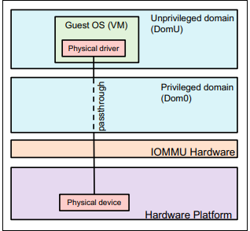
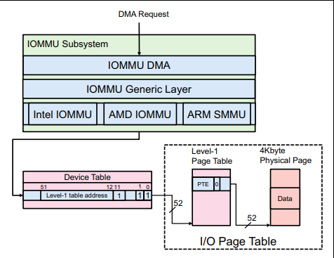
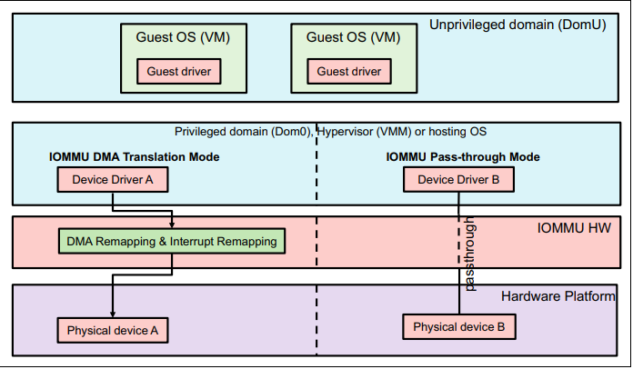
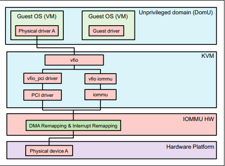
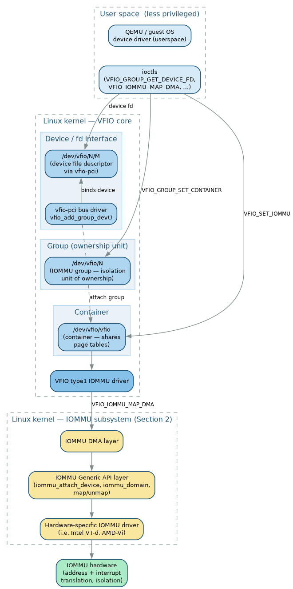

# IOMMU

Source:

- <https://lenovopress.lenovo.com/lp1467-an-introduction-to-iommu-infrastructure-in-the-linux-kernel>
- <https://developer.ibm.com/tutorials/l-pci-passthrough/>

## 1. Introduction

In a virtualization environment, the I/O operations of I/O devices of a guest OS are translated by they hypervisor (software-based I/O address translation). This behavior results in a negative performance impact. The Input-Output Memory Management Unit (IOMMU) is a hardware component that performs address translation from I/O device virtual addresses to physical addresses. This hardware-assisted I/O address translation dramatically improves the system performance within a virtual environment.

The concept of IOMMU is similar to Memory Management Unit (MMU). The difference between IOMMU and MMU is that IOMMU translates device virtual addresses to physical addresses while MMU translates CPU virtual addresses to physical addresses

### 1.1. Peripheral Component Interconnect (PCI) Device Virtualization Models

The two PCI Device Virtualization models are Emulation model and Pass-through model.

1. Emulation model (hypervisor-based device emulation)

The hypervisor needs to manipulate the interaction between the guest OS and the associated physical device. It implies that the hypervisor translates device address (from device-visible virtual address to device-visible physical, and vice versa), which requires more CPU computation power and impacts the system performance when heavy I/O occurs.

2. Emulation model (user space device emulation)

By pushing the device emulation from the hypervisor to user space has some distinct advantages -> With less code in the hypervisor (pushing the device emulation into the less privileged user space), the less chance of leaking privileges to untrusted users.

3. Pass-through model

As you can see in the two device emulation models discussed above, there's a price to pay for sharing devices. Whether device emulation is performed in the hypervisor or in user space within an independent VM, overhead exists. Maybe we can just bypass it? At the highest level, device passthrough is about providing an isolation of devices to a given guest operating system so that the device can be used exclusively by that guest

This model requires a hardware-assisted component. Intel names the hardware-assisted component “Intel Virtualization Technology for Directed I/O (VT-d)”, whereas AMD titles it “AMD I/O Memory Management Unit (IOMMU) or AMD I/O Virtualization Technology (AMD-Vi)”.

### 1.2. IOMMU Hardware

The IOMMU hardware includes two functionalities:

- DMA remapping functionality manipulates address translation for PCI devices
- Interrupt remapping functionality routes interrupts of PCI devices to the corresponding guest OSes.

## 2. IOMMU Subsystem in Linux Kernel

> [!NOTE]
> I only take note about the high-level overview, the rest of section can be found at Lenovo's paper.

The subsystem contains three layers:

- IOMMU DMA Layer: This layer receives the DMA requests from I/O devices and forwards the request to IOMMU generic layer. It is the glue layer between DMA-API and IOMMU-API.
- IOMMU Generic Layer (or IOMMU-API Layer): This layer provides generic IOMMU APIs for interaction with IOMMU DMA layer and hardware specific IOMMU layer.
- Hardware Specific IOMMU layer: This is a hardware-specific driver in order to interact with the underlying IOMMU hardware. It also configures the proper I/O page table based on the requested DMA address so that IOMMU hardware can translate DMA address correctly

## 3. Linux Kernel IOMMU: DMA Translation Mode vs. Pass-through Mode

1. IOMMU DMA Translation Mode

It means that the hosting OS (hypervisor) applies IOMMU-backed operations for DMA translation. In other words, the IOMMU driver of the hosting OS examines all DMA requests and configures the corresponding IOMMU hardware so that IOMMU hardware can translate those requests correctly.

2. IOMMU Pass-through Mode

It bypasses the DMA translation from the hypervisor’s point of view, which means DMA addresses equals to system physical addresses. This mode along with enable PCI pass-through model is widely adopted in virtualization environment.

### 3.1. What is the difference between PCI pass-through and IOMMU pass-through?

- PCI pass-through model bypasses the hypervisor’s intervention to render the guest OS to take control of the physical device directly.
- IOMMU pass-through mode bypasses the DMA translation from the hypervisor. The hypervisor does not need to process DMA requests when IOMMU pass-through mode is enabled in Linux
- PCI pass-through and IOMMU pass-through work collaboratively to enable the guest OS to have the direct control of the physical device.

### 3.2. Virtual Function I/O (VFIO) framework

Virtual Function I/O (VFIO) framework running on the hypervisor aims at providing user-space application for direct device access. QEMU, a user-space application, leverages VFIO framework to expose the direct access of the physical device to the guest OS.

VFIO (originally "Virtual Function I/O") is an IOMMU/device-agnostic kernel framework that exposes direct device access to userspace in a secure, IOMMU-protected environment. It replaces the older UIO framework, which lacks IOMMU protection and requires root for PCI config access. VFIO targets x86 (Intel VT-d, AMD-Vi), POWER (Partitionable Endpoints), and Freescale PAMU platforms. QEMU acts as a userspace "driver" on top of it to implement device passthrough.

#### 3.2.1. How VFIO connects to the IOMMU subsystem

VFIO sits at the top of the IOMMU subsystem (section 2) as the userspace-facing interface. Instead of letting a kernel driver issue DMA directly, VFIO hands the device to userspace and relies on the underlying IOMMU hardware to enforce isolation and address translation:

- The **IOMMU group** is VFIO's fundamental unit of ownership. It is "a set of devices which is isolatable from all other devices in the system." Because IOMMU isolation is not always at single-device granularity (multi-function devices, non-ACS bridges, and PCIe-to-PCI bridges can reduce it), the kernel exposes IOMMU groups as the ownership unit, and VFIO never allows a guest to own a device unless the whole group is safe to isolate.
- When page-table-based IOMMUs permit it, multiple groups are aggregated into a **container** so they share a single set of page tables, reducing TLB thrashing and duplicate translations.
- The **type1 IOMMU driver** (`VFIO_SET_IOMMU`, `VFIO_TYPE1_IOMMU`) wires VFIO to the hardware-specific IOMMU driver. It performs DMA mapping via `VFIO_IOMMU_MAP_DMA`/`UNMAP_DMA`, which program the IOMMU page tables so the device can only reach the guest's pinned, permitted memory — this is what enforces IOMMU DMA translation mode from the guest's perspective. The guest no longer needs the hypervisor to translate each request.

#### 3.2.2. Architectural hierarchy

1. **Groups** — the minimum unit of ownership and isolation, backed by an IOMMU group.
2. **Containers** — created by opening `/dev/vfio/vfio`; may hold one or more groups and provide version/extension query interfaces.
3. **Devices** — bound to a VFIO bus driver (e.g., `vfio-pci`) and accessed via file descriptors returned from `VFIO_GROUP_GET_DEVICE_FD`.

#### 3.2.3. Typical VFIO workflow

1. `modprobe vfio-pci`.
2. Unbind the device from its host driver and bind it to `vfio-pci`, creating `/dev/vfio/$GROUP`.
3. Ensure all devices in the group are unbound or bound to `vfio-pci`.
4. Open `/dev/vfio/vfio` to create a container, open `/dev/vfio/$GROUP` and attach it via `VFIO_GROUP_SET_CONTAINER`.
5. Call `VFIO_GROUP_GET_STATUS` to verify the group is viable.
6. Enable the IOMMU model with `VFIO_SET_IOMMU` (e.g., `VFIO_TYPE1_IOMMU`).
7. Map guest memory into the IOMMU with `VFIO_IOMMU_MAP_DMA` (iova, vaddr, size, flags).
8. Obtain a device file descriptor via `VFIO_GROUP_GET_DEVICE_FD` passing the device BDF (e.g., `"0000:06:0d.0"`).
9. Enumerate resources with `VFIO_DEVICE_GET_INFO`, `VFIO_DEVICE_GET_REGION_INFO`, `VFIO_DEVICE_GET_IRQ_INFO`, then map regions and register IRQs.
10. Issue `VFIO_DEVICE_RESET` to start the device.

#### 3.2.4. Key ioctls

| ioctl                                                                              | Purpose                                             |
| ---------------------------------------------------------------------------------- | --------------------------------------------------- |
| `VFIO_GET_API_VERSION` / `VFIO_CHECK_EXTENSION`                                    | Verify API compatibility / probe IOMMU support      |
| `VFIO_GROUP_GET_STATUS` / `SET_CONTAINER` / `GET_DEVICE_FD`                        | Group viability, attach to container, get device fd |
| `VFIO_SET_IOMMU` / `VFIO_IOMMU_GET_INFO`                                           | Select IOMMU model / query IOMMU capabilities       |
| `VFIO_IOMMU_MAP_DMA` / `UNMAP_DMA`                                                 | Program IOMMU DMA mappings                          |
| `VFIO_DEVICE_GET_INFO` / `GET_REGION_INFO` / `GET_IRQ_INFO` / `SET_IRQS` / `RESET` | Device enumeration and control                      |

#### 3.2.5. Security notes

DMA is the most critical surface — allowing a device read-write access to system memory is the greatest risk to system integrity. Modern IOMMUs incorporate isolation properties into an interface originally meant only for translation, so devices can now be isolated from each other and from arbitrary memory access. VFIO enforces this at group granularity: every device in a group must be unbound from its host driver (or bound to a VFIO driver) before `VFIO_GROUP_GET_STATUS` reports the group viable. SR-IOV Virtual Functions are the strongest indicator of a "well behaved" device; multi-function backdoors are mitigated with `iommu=group_mf`.

> [!NOTE]
> A newer **IOMMUFD** API is replacing the group/container model. VFIO device cdev (`/dev/vfio/devices/vfioX`) works only with IOMMUFD, and `VFIO_TYPE1v2_IOMMU` retains a backward-compatible path through `CONFIG_IOMMUFD_VFIO_CONTAINER` symlinking `/dev/vfio/vfio` to `/dev/iommu`.
